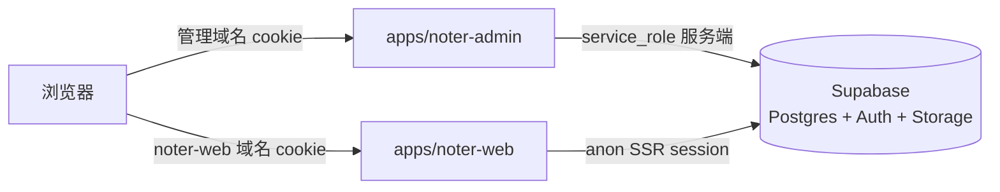
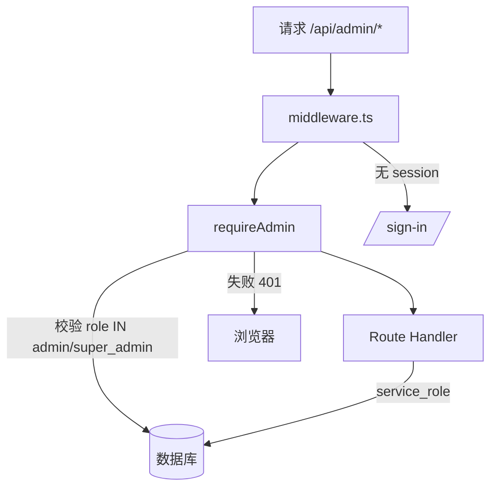
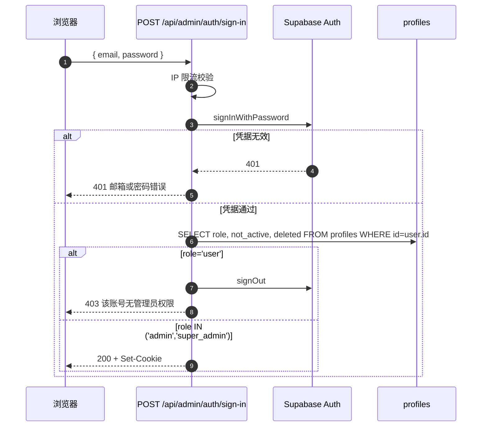
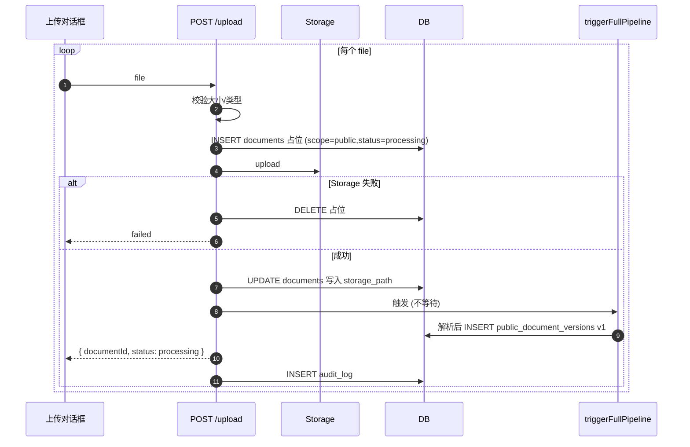
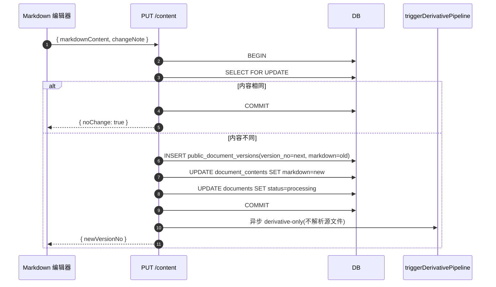

# Design Document

## Overview

Noter Admin Platform 是一个独立部署的 Next.js 应用 `apps/noter-admin`,与 noter-web 进程隔离、cookie 隔离,但共享同一个 Supabase 项目(Postgres / Auth / Storage)。所有跨用户数据访问通过管理端服务端 Route Handler 中转,服务端使用 Supabase service_role 客户端绕过 RLS;前端不持有 service_role 密钥。

设计的核心策略是**最小侵入 noter-web**:
- noter-web 的现有表结构与代码路径尽量不动
- 公共文档复用现有 documents / document_contents / document_chunks / document_summaries / document_mindmaps 表(因为公共文档要走完整 RAG pipeline,与私有文档共用派生数据)
- 通过新增字段 + 新增表 + 调整 RLS,优先让 noter-web 用户**通过现有查询自然看到**只读的"Noter 官方"文件夹与公共文档
- 如果现有查询不能自然展示系统文件夹,则只在 noter-web 文件夹树中做**最小改动**,新增一个只读的 Noter 官方入口

7 个一级路由对应模块:
| 路径 | 功能 |
|---|---|
| `/dashboard` | 6 张指标卡 + 2 张趋势图 + 2 张分布饼图 |
| `/users` | 用户列表与详情;封禁/软删/重置密码邮件/角色切换 |
| `/documents` | 普通用户私有文档列表 + 强制软删 |
| `/public-documents` | 公共文档批量上传/列表/详情/在线编辑/版本历史/回滚/软删 |
| `/public-categories` | 公共文档扁平分类 CRUD |
| `/public-tags` | 公共文档标签 CRUD |
| `/logs` | 操作审计日志查询 |
| `/settings` | 4 项最小访问控制配置 |

## Architecture

### 进程拓扑



- Admin 与 Web 不共享 cookie 作用域,通过独立域名/子域 + 独立 cookie name 隔离会话
- service_role key 仅注入 Admin 进程,不进入浏览器 bundle
- Admin 端 Route Handler 内部调用 service_role 客户端,完全绕过 RLS

### 鉴权链



- middleware.ts 处理 cookie session 刷新与登录页重定向
- requireAdmin 共享函数在每个受保护页面与 `/api/admin/*` Route Handler 内部首行调用
- 校验失败统一返回 `{ error:'unauthorized', code:'admin_auth_required' }` + 401
- 普通用户(role='user')尝试登录时由登录接口直接拒绝,不创建会话

## Components and Interfaces

### 关键内部接口

```ts
// lib/auth/requireAdmin.ts
interface AdminContext {
  userId: string
  email: string
  role: 'admin' | 'super_admin'
}

async function requireAdmin(request: Request): Promise<AdminContext>
// 失败时抛 UnauthorizedError,被 handler 包装器捕获返回 401

// lib/audit/writeAuditLog.ts
interface AuditLogInput {
  adminUserId: string
  adminEmail: string
  actionType: ActionType
  targetResourceType: TargetResourceType
  targetResourceId?: string
  targetResourceLabel?: string
  metadata?: Record<string, unknown>
  request: Request
}
async function writeAuditLog(input: AuditLogInput): Promise<void>
// 受 system_settings.audit_log_enabled 控制
// 失败仅 console.error,不抛错

// lib/pipeline/triggerFullPipeline.ts
async function triggerFullPipeline(documentId: string): Promise<void>
// 调用现有 supabase.functions.invoke('parse-document', ...)
// 完整流程:解析→分片→向量化→AI 总结→思维导图

// lib/pipeline/triggerDerivativePipeline.ts
async function triggerDerivativePipeline(documentId: string): Promise<void>
// 跳过解析,从 markdown 重跑:删 chunks → 重分片 → 重 embedding → 重 summary → 重 mindmap
```

### 与 noter-web 的对接边界

- noter-web 不引入任何 noter-admin 的代码
- 共享的 Supabase 客户端类型放在 `packages/db-types`(若已存在则复用,否则各自维护)
- 公共文档的派生数据(chunks/summary/mindmap)由 noter-admin 端写入,noter-web 端通过现有查询逻辑自然读取

## Project Structure & Components Recap

(详见上方 §Project Structure 与 §Frontend Components,此节合并保留以满足文档结构要求)


```
apps/noter-admin/
├── middleware.ts
├── lib/
│   ├── supabase/
│   │   ├── server.ts          # @supabase/ssr cookie session 客户端
│   │   └── admin.ts           # service_role 单例 (server-only)
│   ├── auth/
│   │   ├── requireAdmin.ts    # 共享鉴权函数
│   │   └── rateLimiter.ts     # IP 滑动窗口限流
│   ├── audit/
│   │   ├── writeAuditLog.ts
│   │   └── actionTypes.ts
│   ├── settings/
│   │   ├── readSetting.ts     # 带缓存的设置读取
│   │   └── defaults.ts
│   ├── pipeline/
│   │   ├── triggerFullPipeline.ts        # 上传时:解析+派生
│   │   └── triggerDerivativePipeline.ts  # 编辑/回滚时:仅派生
│   └── http/
│       ├── handler.ts         # Route Handler 包装器
│       └── response.ts
├── app/
│   ├── (auth)/sign-in/page.tsx
│   ├── (admin)/
│   │   ├── layout.tsx                     # Admin_Sidebar
│   │   ├── dashboard/page.tsx
│   │   ├── users/page.tsx
│   │   ├── users/[id]/page.tsx
│   │   ├── documents/page.tsx
│   │   ├── public-documents/page.tsx
│   │   ├── public-documents/[id]/page.tsx
│   │   ├── public-categories/page.tsx
│   │   ├── public-tags/page.tsx
│   │   ├── logs/page.tsx
│   │   └── settings/page.tsx
│   └── api/admin/
│       ├── auth/sign-in/route.ts
│       ├── dashboard/{metrics,trends,distributions}/route.ts
│       ├── users/route.ts
│       ├── users/[id]/{route,block,unblock,delete,send-password-reset,role}/route.ts
│       ├── documents/route.ts
│       ├── documents/[id]/delete/route.ts
│       ├── public-documents/route.ts
│       ├── public-documents/upload/route.ts
│       ├── public-documents/[id]/{route,metadata,content,delete}/route.ts
│       ├── public-documents/[id]/versions/route.ts
│       ├── public-documents/[id]/versions/[versionNo]/{route,rollback}/route.ts
│       ├── public-categories/route.ts
│       ├── public-categories/[id]/{route,delete}/route.ts
│       ├── public-tags/route.ts
│       ├── public-tags/[id]/{route,delete}/route.ts
│       ├── audit-logs/route.ts
│       └── system-settings/route.ts
├── components/                # shadcn/ui + 业务组件
├── stores/                    # zustand
└── types/
```

## Data Models

### 5.1 现有表新增字段

```sql
-- 1. profiles 角色扩展 + 系统账号标记
-- (假设原 role 字段无 CHECK 约束;若有则需 DROP 后重建)
ALTER TABLE public.profiles
  ADD COLUMN is_system_account boolean NOT NULL DEFAULT false;

-- super_admin 全局唯一(部分唯一索引)
CREATE UNIQUE INDEX profiles_super_admin_uniq
  ON public.profiles ((true))
  WHERE role = 'super_admin' AND deleted = 0;

-- 2. documents 加公私范围与公共分类引用
ALTER TABLE public.documents
  ADD COLUMN document_scope text NOT NULL DEFAULT 'private',
  ADD COLUMN public_category_id uuid;

ALTER TABLE public.documents
  ADD CONSTRAINT documents_scope_chk
  CHECK (document_scope IN ('private', 'public'));

-- private 文档的 category 必须为 NULL
ALTER TABLE public.documents
  ADD CONSTRAINT documents_private_no_category_chk
  CHECK (document_scope = 'public' OR public_category_id IS NULL);

-- 索引
CREATE INDEX documents_scope_deleted_created_idx
  ON public.documents (document_scope, deleted, created_at DESC);

-- 3. folders 加系统文件夹标记
ALTER TABLE public.folders
  ADD COLUMN is_system_folder boolean NOT NULL DEFAULT false;

-- 4. tags 加官方标签标记
ALTER TABLE public.tags
  ADD COLUMN is_official boolean NOT NULL DEFAULT false;

-- 公共标签内 name 唯一(忽略大小写,仅未删除)
CREATE UNIQUE INDEX tags_official_name_uniq
  ON public.tags (LOWER(name))
  WHERE is_official = true AND deleted = 0;
```

### 5.2 新建表

```sql
-- public_categories: 公共文档扁平分类
CREATE TABLE public.public_categories (
  id uuid PRIMARY KEY DEFAULT gen_random_uuid(),
  name text NOT NULL,
  description text,
  sort_order int NOT NULL DEFAULT 0,
  deleted int NOT NULL DEFAULT 0,
  created_at timestamptz NOT NULL DEFAULT now(),
  updated_at timestamptz NOT NULL DEFAULT now()
);

-- 未删除范围内 name 唯一
CREATE UNIQUE INDEX public_categories_name_uniq
  ON public.public_categories (LOWER(name))
  WHERE deleted = 0;

-- 加 documents.public_category_id 的外键(允许 NULL)
ALTER TABLE public.documents
  ADD CONSTRAINT documents_public_category_fk
  FOREIGN KEY (public_category_id)
  REFERENCES public.public_categories(id)
  ON DELETE SET NULL;

-- public_document_versions: 公共文档 markdown 版本快照
CREATE TABLE public.public_document_versions (
  id uuid PRIMARY KEY DEFAULT gen_random_uuid(),
  document_id uuid NOT NULL REFERENCES public.documents(id) ON DELETE CASCADE,
  version_no int NOT NULL CHECK (version_no >= 1),
  markdown_content text NOT NULL,
  change_note text,
  editor_user_id uuid NOT NULL REFERENCES public.profiles(id),
  created_at timestamptz NOT NULL DEFAULT now(),
  UNIQUE (document_id, version_no)
);

CREATE INDEX public_doc_versions_doc_versionno_idx
  ON public.public_document_versions (document_id, version_no DESC);

-- admin_audit_logs: 操作审计
CREATE TABLE public.admin_audit_logs (
  id uuid PRIMARY KEY DEFAULT gen_random_uuid(),
  admin_user_id uuid NOT NULL REFERENCES public.profiles(id),
  admin_email text NOT NULL,
  action_type text NOT NULL,
  target_resource_type text NOT NULL,
  target_resource_id uuid,
  target_resource_label text,
  request_ip text,
  metadata jsonb NOT NULL DEFAULT '{}'::jsonb,
  created_at timestamptz NOT NULL DEFAULT now(),
  CONSTRAINT audit_action_chk CHECK (action_type IN (
    'user.block','user.unblock','user.delete','user.send_password_reset','user.role_change',
    'public_document.upload','public_document.metadata_update','public_document.content_update',
    'public_document.rollback','public_document.delete',
    'public_category.create','public_category.update','public_category.delete',
    'public_tag.create','public_tag.update','public_tag.delete',
    'document.force_delete','system_settings.update'
  )),
  CONSTRAINT audit_target_chk CHECK (target_resource_type IN (
    'user','document','public_document','public_category','public_tag','system_settings'
  ))
);

CREATE INDEX audit_created_idx ON public.admin_audit_logs (created_at DESC);
CREATE INDEX audit_admin_created_idx ON public.admin_audit_logs (admin_user_id, created_at DESC);
CREATE INDEX audit_action_created_idx ON public.admin_audit_logs (action_type, created_at DESC);

-- system_settings: 4 项访问控制开关
CREATE TABLE public.system_settings (
  key text PRIMARY KEY,
  value jsonb NOT NULL,
  updated_at timestamptz NOT NULL DEFAULT now(),
  updated_by uuid REFERENCES public.profiles(id),
  CONSTRAINT settings_key_chk CHECK (key IN (
    'allow_user_upload',
    'allow_user_delete_own',
    'public_documents_visible',
    'audit_log_enabled'
  )),
  CONSTRAINT settings_value_chk CHECK (jsonb_typeof(value) = 'boolean')
);

INSERT INTO public.system_settings (key, value) VALUES
  ('allow_user_upload', 'true'::jsonb),
  ('allow_user_delete_own', 'true'::jsonb),
  ('public_documents_visible', 'true'::jsonb),
  ('audit_log_enabled', 'true'::jsonb)
ON CONFLICT (key) DO NOTHING;
```

### 5.3 Migration Seed:系统账号 + 系统文件夹 + 超级管理员

```sql
-- 1. 创建系统账号(占用一个 auth.users 行,但 is_system_account=true 标记)
-- 实际操作:在 Supabase Auth 中通过 admin API 创建一个 email='system@noter.local' 的账号,
--          再 UPDATE profiles SET is_system_account=true WHERE id=:systemUid;
-- 这一步通过单独的 seed 脚本完成,migration 仅插入 profiles 行

-- 2. 创建"Noter 官方"系统文件夹(挂在系统账号下)
INSERT INTO public.folders (id, user_id, name, parent_id, is_system_folder)
VALUES (
  gen_random_uuid(),
  (SELECT id FROM public.profiles WHERE is_system_account = true LIMIT 1),
  'Noter 官方',
  NULL,
  true
)
ON CONFLICT DO NOTHING;

-- 3. 设置超级管理员(通过环境变量配置邮箱,在部署 seed 中执行)
-- UPDATE public.profiles SET role='super_admin' WHERE email=$NOTER_SUPER_ADMIN_EMAIL;
```

### 5.4 RLS 调整(关键:让 noter-web 前端零改动看到公共文档)

```sql
-- documents: noter-web 现有 SELECT policy 通常是 user_id=auth.uid()
-- 我们追加一条 policy 让所有 authenticated 用户能 SELECT 公共文档
DROP POLICY IF EXISTS documents_select_public ON public.documents;
CREATE POLICY documents_select_public ON public.documents
  FOR SELECT TO authenticated
  USING (document_scope = 'public' AND deleted = 0);

-- documents 现有的 user_id=auth.uid() SELECT policy 保留不动
-- 这样 noter-web 用户能看到:自己的私有文档 + 所有公共文档

-- folders: noter-web 现有 SELECT policy 通常是 user_id=auth.uid()
-- 追加:所有 authenticated 用户能看到 is_system_folder=true 的文件夹
DROP POLICY IF EXISTS folders_select_system ON public.folders;
CREATE POLICY folders_select_system ON public.folders
  FOR SELECT TO authenticated
  USING (is_system_folder = true);

-- folders 的 UPDATE/DELETE policy 沿用 user_id=auth.uid(),系统文件夹自然不可被普通用户改

-- tags: 追加公共标签 SELECT
DROP POLICY IF EXISTS tags_select_official ON public.tags;
CREATE POLICY tags_select_official ON public.tags
  FOR SELECT TO authenticated
  USING (is_official = true AND deleted = 0);

-- public_categories: 所有 authenticated 可读
ALTER TABLE public.public_categories ENABLE ROW LEVEL SECURITY;
CREATE POLICY pc_select_all ON public.public_categories
  FOR SELECT TO authenticated USING (true);

-- public_document_versions / admin_audit_logs / system_settings: authenticated 全禁,只 service_role 可访问
ALTER TABLE public.public_document_versions ENABLE ROW LEVEL SECURITY;
ALTER TABLE public.admin_audit_logs ENABLE ROW LEVEL SECURITY;
ALTER TABLE public.system_settings ENABLE ROW LEVEL SECURITY;

-- system_settings 例外:noter-web 需要读 4 个开关,所以放开 SELECT
CREATE POLICY system_settings_select_all ON public.system_settings
  FOR SELECT TO authenticated USING (true);
```

**关键效果**:noter-web 用户登录后,既能看到自己的私有文件夹,也能看到 is_system_folder=true 的"Noter 官方"文件夹;打开它时能看到所有公共文档(document_scope='public')。系统文件夹的 UPDATE/DELETE policy 沿用 user_id=auth.uid(),普通用户因 user_id ≠ 系统账号 id,自然无法重命名或删除。**优先尽量减少对 noter-web 的改动**,如果现有文件夹树查询(`folders WHERE user_id=auth.uid()`)不能自然展示系统文件夹,则在 noter-web 文件夹树组件做最小修改,UNION 上 `WHERE is_system_folder=true` 这一条件即可,无需改动其他业务代码。

## API Endpoints

通用约定:
- 所有 `/api/admin/*` Route Handler 首行调用 `requireAdmin(request)`,失败 401
- 写操作成功后调用 `writeAuditLog`,失败仅 server log,不影响主响应
- 错误响应统一 `{ error: <code>, message?: <string> }`
- 超时:列表/详情 10s、编辑/版本 15s、批量上传 60s

### 6.1 用户管理

```ts
// GET /api/admin/users
interface UsersListQuery {
  page: number
  pageSize: 20 | 50 | 100
  email?: string
  status?: 'all' | 'normal' | 'blocked' | 'deleted'
}
interface UsersListItem {
  id: string; email: string; username: string | null
  role: 'user' | 'admin' | 'super_admin'
  notActive: number; deleted: number; createdAt: string
}
interface UsersListResp { items: UsersListItem[]; total: number }
```

查询条件:`is_system_account = false`(不展示系统账号)

```ts
// POST /api/admin/users/[id]/block | /unblock | /delete | /send-password-reset
// 权限矩阵(在 requireAdmin 之后,handler 内部检查):
//   admin 操作时:目标必须 role='user'
//   super_admin 操作时:目标可以是 'user' 或 'admin'
//   任何人:目标不可为 super_admin、is_system_account=true、自身
```

```ts
// POST /api/admin/users/[id]/role
// 仅 super_admin 可调用;只能 user ↔ admin 切换
// body: { role: 'user' | 'admin' }
```

`send-password-reset` 调用 Supabase Auth 的 `generateLink({ type: 'recovery' })` 或 `resetPasswordForEmail`(具体 SDK 形态实现时定),不在 metadata 写明文密码或 link token。

### 6.2 公共文档

```ts
// POST /api/admin/public-documents/upload (multipart, files[])
// 单批 ≤20、单文件 ≤50MB
// 每个文件流程:
//   1. INSERT documents 占位行(document_scope='public', user_id=系统账号 id,
//      folder_id=系统文件夹 id, status='processing')
//   2. 上传 Supabase Storage
//   3. 失败 → DELETE 占位 + DELETE Storage
//   4. 成功 → 触发完整 pipeline (triggerFullPipeline),不等待
//   5. pipeline 内部解析得到 markdown_content 后,自动 INSERT public_document_versions(version_no=1)
//   6. 立即返回 { documentId, status: 'processing' }
//   7. 写 audit_log: public_document.upload(metadata 中记录实际操作管理员的 id 与 email)
// 注:公共文档归属统一为系统账号/系统文件夹;实际上传管理员通过 audit_log 追踪
```

```ts
// PUT /api/admin/public-documents/[id]/content
// body: { markdownContent: string; changeNote?: string }
// 事务:
//   BEGIN;
//   SELECT documents FOR UPDATE; SELECT document_contents.markdown_content FOR UPDATE;
//   IF 内容相同 → COMMIT, 返回 { noChange: true };
//   计算 nextVer = max(version_no)+1;
//   INSERT public_document_versions(version_no=nextVer, markdown_content=oldMd, ...);
//   UPDATE document_contents SET markdown_content = newMd;
//   UPDATE documents SET status='processing';
//   COMMIT;
// 异步 triggerDerivativePipeline (不重解析),失败仅 status='failed'+log
// 写 audit_log: public_document.content_update, metadata 不含完整 markdown
```

```ts
// POST /api/admin/public-documents/[id]/versions/[versionNo]/rollback
// 事务:
//   归档当前 markdown 为新版本(version_no=nextVer);
//   将目标版本 markdown 写回 document_contents;
//   UPDATE documents SET status='processing';
// 异步 triggerDerivativePipeline
// no-op 拦截:目标 markdown 与当前完全一致 → 409
```

```ts
// PATCH /api/admin/public-documents/[id]/metadata
// body: { title?, shortDescription?, language?, publicCategoryId?, tagIds? }
// 校验 tagIds 全部 is_official=true;否则 400
// 重写 document_tags 关联;UPDATE documents 字段
// 不创建版本
```

```ts
// POST /api/admin/public-documents/[id]/delete
// UPDATE documents SET deleted=1, deleted_at=now()
// 不动 versions / tags / category
```

### 6.3 分类与标签

```ts
// public_categories CRUD: 标准 REST 接口
// 软删时 ON DELETE SET NULL 由 FK 约束自动处理 documents.public_category_id

// public_tags CRUD: tags 表 WHERE is_official=true
// 软删时事务:
//   DELETE FROM document_tags WHERE tag_id=:id
//   UPDATE tags SET deleted=1 WHERE id=:id
```

### 6.4 Dashboard

```ts
// GET /api/admin/dashboard/metrics
// 6 个聚合查询并发执行 + 6 个昨日同比
// profiles 查询附加 is_system_account=false

// GET /api/admin/dashboard/trends?days=30 (1..90)
// 用 generate_series 补 0 天

// GET /api/admin/dashboard/distributions
// 文档状态分布 + 公共标签 top 10
```

### 6.5 系统设置

```ts
// GET /api/admin/system-settings → 返回 4 项配置
// PATCH /api/admin/system-settings
// body: { key: SettingKey; value: boolean }
// 事务:UPDATE settings + INSERT audit_log
// 受 audit_log_enabled 控制是否写日志,但切换 audit_log_enabled 自身**总是**写日志(同事务)
```

### 6.6 审计日志

```ts
// GET /api/admin/audit-logs
// query: adminUserIds[] / actionTypes[] / startTime / endTime / page / pageSize
// 不提供任何写入端点
```

## Key Flows

### 7.1 管理员登录



### 7.2 公共文档上传(异步 pipeline)



### 7.3 在线 Markdown 编辑 + 派生重跑



### 7.4 版本回滚

```mermaid
sequenceDiagram
  autonumber
  participant FE as 版本历史抽屉
  participant API as POST /rollback
  participant DB
  participant Pipe as triggerDerivativePipeline

  FE->>API: 选择目标版本
  API->>DB: BEGIN
  API->>DB: SELECT FOR UPDATE; 读目标版本
  alt 目标内容与当前相同
    API->>DB: ROLLBACK
    API-->>FE: 409 rollback_no_change
  else
    API->>DB: INSERT 归档版本(markdown=current)
    API->>DB: UPDATE document_contents SET markdown=target
    API->>DB: UPDATE documents SET status=processing
    API->>DB: COMMIT
    API->>Pipe: 异步 derivative-only
    API-->>FE: 200
  end
```

## Frontend Components

### 8.1 页面与组件

| 路径 | 关键组件 |
|---|---|
| `/sign-in` | shadcn Form / Input / Button / Alert |
| `/dashboard` | MetricCard / TrendChart / DistributionChart(Recharts) |
| `/users`, `/users/[id]` | UserTable / UserActionMenu / RoleSwitchDialog |
| `/public-documents` | PublicDocsTable / UploadDialog |
| `/public-documents/[id]` | MetadataForm / MarkdownEditor / VersionDrawer |
| `/public-categories` | CategoryTable / CategoryForm |
| `/public-tags` | TagTable / TagForm |
| `/documents` | PrivateDocsTable |
| `/logs` | LogTable / LogDetailDialog |
| `/settings` | SettingItem(开关) / ConfirmDialog |

### 8.2 数据获取

- 状态管理:zustand(与 noter-web 一致),每页一个 store
- HTTP 客户端:axios + 响应拦截器(401+admin_auth_required 自动跳转 /sign-in)
- 401/网络异常统一通过 toast 提示

### 8.3 角色驱动的 UI 渲染

- 客户端从 `useAuthStore()` 读取当前用户 role
- super_admin 才看到「角色切换」按钮
- 用户列表中,目标用户 role='super_admin' 时该行隐藏所有操作按钮
- admin 登录时,目标 role='admin' 的用户行所有操作按钮也隐藏

## Error Handling

- 401 admin_auth_required → 客户端拦截器跳转 `/sign-in?reason=session_expired`
- 504 / 超时 → toast 提示「请求超时,请重试」
- pipeline 触发失败 → documents.status='failed' + server log,不影响主响应
- Storage 与 DB 不可事务化 → 采用「先 INSERT 占位 → 上传 Storage → 失败时 DELETE 双方」补偿
- 数据库唯一约束冲突 → 409;CHECK 违反 → 400

## Security

- service_role key 仅 `lib/supabase/admin.ts` 持有,通过 `'server-only'` 包 + ESLint `no-restricted-imports` 双重隔离
- 登录页 IP 限流:进程内滑动窗口(10 次/10 分钟)
- 重置密码邮件由 Supabase Auth 投递,管理端不接触明文
- 公共文档下载用临时签名 URL(1h)
- 自我保护:任何管理员不能操作自身或更高角色

## Correctness Properties

本期不强制要求形式化的属性测试,以下作为关键不变量记录,在设计阶段供 review 参考,实施阶段用普通单元/集成测试覆盖即可。

### Property 1: 普通用户无法访问后台

凭据有效但 role='user' 的账号,登录或访问 `/api/admin/*` 必返回 401/403,不创建管理端会话。

**Validates: Requirements 1.4, 2.1, 2.2**

### Property 2: 角色操作权限矩阵

封禁/软删/重置密码邮件/角色切换的接受/拒绝必符合矩阵:
- admin × user → 接受
- admin × admin → 拒绝(409)
- admin × super_admin → 拒绝(404)
- super_admin × user → 接受
- super_admin × admin → 接受
- super_admin × super_admin → 拒绝(404)
- 任何角色 × 自身 → 拒绝(409)

**Validates: Requirements 8, 9, 10, 11**

### Property 3: 公共文档版本号严格递增

同一文档的连续 N 次保存/回滚后,public_document_versions 中 version_no 序列等于 [1, 2, ..., N]。

**Validates: Requirements 17, 18**

### Property 4: 公共文档软删保留所有衍生数据

软删除公共文档后,public_document_versions 与 document_tags 关联记录与软删前完全一致。

**Validates: Requirements 19**

### Property 5: noter-web 用户能看到公共文档但不能写

通过 anon session 模拟普通用户:
- SELECT 公共文档 → 返回所有未删除公共文档
- INSERT/UPDATE/DELETE 公共文档 → 全部被 RLS 拒绝
- SELECT 系统文件夹 → 通过;UPDATE/DELETE → 拒绝

**Validates: Requirements 12**

## Testing Strategy

本期采用普通测试,不引入形式化属性测试或大型测试框架,目标是覆盖核心路径与权限矩阵。

### 测试类型

- **单元测试**:针对纯函数与小模块
  - `requireAdmin` 鉴权逻辑(各角色与状态组合)
  - `writeAuditLog` 是否受 audit_log_enabled 控制
  - `readSetting` 缓存与 fallback 行为
  - 各 zod schema 校验

- **接口集成测试**:每个 `/api/admin/*` Route Handler
  - happy path 1-2 个用例
  - error path:权限不足、目标不存在、CHECK/UNIQUE 冲突、超时各 1 个
  - 在 supabase 本地容器中跑,使用真实 RLS / 触发器 / migration
  - 用例覆盖角色权限矩阵的关键单元格(对应上述 Property 2 的 7 种场景)

- **少量 E2E**:覆盖核心流程
  - 登录 → 访问 dashboard
  - 公共文档批量上传 → 列表展示 processing → 等待变为 ready
  - 公共文档在线编辑 → 版本归档 → 列表显示新版本号 → 回滚成功

### 工具栈

- Vitest(与 noter-web 后续测试栈一致)
- @testing-library/react(组件层)
- Playwright 或 Cypress(E2E,本期可选,演示前手动验证为主)

### 测试组织

- 单元测试与组件测试就近放在 `apps/noter-admin/**/*.test.ts(x)`
- 集成测试放在 `apps/noter-admin/tests/integration/`
- E2E 放在根目录 `e2e/admin/` 或与 noter-web 共用 e2e 工具栈

