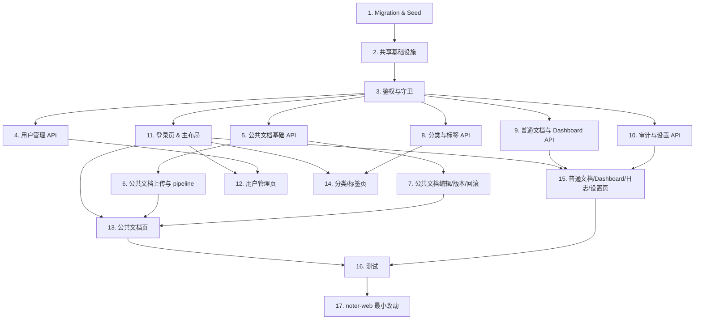

# Implementation Plan

## Overview

本计划按"基础设施 → 后端 API → 前端页面 → 测试"的顺序组织,便于增量交付。每个任务都标注对应的需求编号。共 17 大任务,可按 Wave 并行调度;依赖关系见下图。

## Task Dependency Graph



```json
{
  "waves": [
    { "wave": 1, "tasks": ["1"] },
    { "wave": 2, "tasks": ["2"] },
    { "wave": 3, "tasks": ["3"] },
    { "wave": 4, "tasks": ["4", "5", "8", "9", "10", "11"] },
    { "wave": 5, "tasks": ["6", "7", "12", "14", "15"] },
    { "wave": 6, "tasks": ["13"] },
    { "wave": 7, "tasks": ["16"] },
    { "wave": 8, "tasks": ["17"] }
  ]
}
```

## Tasks

- [x] 1. Supabase Migration 与初始 Seed
  - [x] 1.1 编写 migration:profiles 加 `is_system_account` 字段、role 兼容 'super_admin'、partial unique index 保证 super_admin 全局唯一
  - [x] 1.2 编写 migration:documents 加 `document_scope` 与 `public_category_id` 字段及 CHECK 约束、索引
  - [x] 1.3 编写 migration:folders 加 `is_system_folder` 字段
  - [x] 1.4 编写 migration:tags 加 `is_official` 字段及部分唯一索引
  - [x] 1.5 编写 migration:新建 `public_categories` 表、外键、唯一索引
  - [x] 1.6 编写 migration:新建 `public_document_versions` 表、UNIQUE(document_id, version_no)、索引
  - [x] 1.7 编写 migration:新建 `admin_audit_logs` 表、action_type 与 target_resource_type CHECK、索引
  - [x] 1.8 编写 migration:新建 `system_settings` 表、key/value CHECK、4 条 seed 记录
  - [x] 1.9 编写 migration:RLS 策略 — documents 公共文档 SELECT、folders 系统文件夹 SELECT、tags 公共标签 SELECT、public_categories 全员 SELECT、system_settings 全员 SELECT、其他新表全禁
  - [x] 1.10 编写 seed 脚本:创建系统账号 (Auth + profiles.is_system_account=true)、创建系统文件夹 (folders.is_system_folder=true)、把指定邮箱的 profile.role 设为 super_admin
  - _Requirements: 1, 2, 12, 25_

- [x] 2. 共享基础设施代码
  - [x] 2.1 `lib/supabase/server.ts`:基于 @supabase/ssr 的 cookie session 客户端
  - [x] 2.2 `lib/supabase/admin.ts`:service_role 单例工厂,server-only,包内引入 `'server-only'`
  - [x] 2.3 `lib/http/handler.ts`:Route Handler 包装器(异常捕获、超时、统一错误响应)
  - [x] 2.4 `lib/http/response.ts`:success / error / unauthorized 辅助函数
  - [x] 2.5 `lib/audit/actionTypes.ts`:导出 17 个 action_type 与 5 个 target_resource_type 常量及 TS 联合类型
  - [x] 2.6 `lib/audit/writeAuditLog.ts`:封装 audit log 写入,内部读取 audit_log_enabled 设置控制是否写入,失败仅 server log
  - [x] 2.7 `lib/settings/readSetting.ts` 与 `defaults.ts`:带进程内缓存的设置读取,缺失走默认值
  - [x] 2.8 `lib/auth/rateLimiter.ts`:登录 IP 滑动窗口限流(进程内 Map)
  - [x] 2.9 `lib/pipeline/triggerFullPipeline.ts`:封装调用现有 parse-document Edge Function
  - [x] 2.10 `lib/pipeline/triggerDerivativePipeline.ts`:跳过解析,直接重跑 chunk → vector → summary → mindmap;待与现有 supabase/functions 派生函数对齐
  - _Requirements: 1, 2, 13, 17, 18, 23, 25_

- [x] 3. 鉴权与守卫
  - [x] 3.1 `lib/auth/requireAdmin.ts`:校验 cookie session + 二次查 profiles 的 role/not_active/deleted,返回 AdminContext;失败抛 UnauthorizedError
  - [x] 3.2 `middleware.ts`:刷新 cookie session;非 sign-in 路径若无 session 则跳转 /sign-in
  - [x] 3.3 `POST /api/admin/auth/sign-in`:IP 限流 + Supabase Auth + 二次校验 role IN ('admin','super_admin');role='user' 直接拒绝
  - [x] 3.4 `POST /api/admin/auth/sign-out`:Supabase Auth 登出 + 清 cookie
  - [x] 3.5 401 响应统一为 `{ error:'unauthorized', code:'admin_auth_required' }`
  - _Requirements: 1, 2_

- [x] 4. 用户管理 API
  - [x] 4.1 `GET /api/admin/users`:分页 + 邮箱搜索 + 状态筛选,查询附加 is_system_account=false
  - [x] 4.2 `GET /api/admin/users/[id]`:返回用户详情 + 私有文档统计
  - [x] 4.3 `POST /api/admin/users/[id]/block` 与 `/unblock`:权限矩阵(admin 只操作 user,super_admin 可操作 admin),写 audit log
  - [x] 4.4 `POST /api/admin/users/[id]/delete`:同权限矩阵,profiles.deleted=1,不级联,写 audit log
  - [x] 4.5 `POST /api/admin/users/[id]/send-password-reset`:调 Supabase Auth 密码恢复,不返回明文,写 audit log(metadata 不含 token)
  - [x] 4.6 `POST /api/admin/users/[id]/role`:仅 super_admin,只允许 user↔admin,事务内行锁防并发,写 audit log
  - _Requirements: 7, 8, 9, 10, 11_

- [x] 5. 公共文档基础 API(列表/详情/元数据/软删)
  - [x] 5.1 `GET /api/admin/public-documents`:强制 document_scope='public',支持标题搜索/状态/分类/标签/已删除筛选,带 latestVersionNo
  - [x] 5.2 `GET /api/admin/public-documents/[id]`:返回基础信息 + 处理状态 + 关联分类/标签 + markdown_content + latestVersionNo + 临时签名 URL
  - [x] 5.3 `PATCH /api/admin/public-documents/[id]/metadata`:校验 tagIds 全部 is_official=true,事务重写 document_tags,不创建版本,写 audit log
  - [x] 5.4 `POST /api/admin/public-documents/[id]/delete`:documents.deleted=1,不动 versions/tags/category,写 audit log
  - _Requirements: 14, 15, 16, 19_

- [x] 6. 公共文档批量上传与 pipeline
  - [x] 6.1 `POST /api/admin/public-documents/upload`:multipart 解析,单批 ≤20、单文件 ≤50MB,扩展名白名单
  - [x] 6.2 单文件流程:INSERT documents 占位(user_id=系统账号 id, folder_id=系统文件夹 id, scope=public, status=processing) → 上传 Storage → 失败时回滚双方 → 触发 triggerFullPipeline 不等待
  - [x] 6.3 pipeline 内解析得 markdown 后,自动 INSERT public_document_versions(version_no=1)的逻辑(在 parse-document 函数末尾或在 trigger 函数 callback 中实现,具体位置实施时定)
  - [x] 6.4 接口立即返回每个文件的 { documentId, status, pipelineTriggered },写 audit log(metadata 含上传管理员 id/email 与 file_size/file_ext)
  - _Requirements: 13_

- [x] 7. 公共文档编辑、版本、回滚 API
  - [x] 7.1 `PUT /api/admin/public-documents/[id]/content`:事务归档当前 markdown 为新版本 → 更新 document_contents.markdown_content → status=processing;no-op 拦截;异步 triggerDerivativePipeline,写 audit log(不含完整 markdown)
  - [x] 7.2 `GET /api/admin/public-documents/[id]/versions`:返回版本列表,JOIN profiles 得 editor_email,按 version_no DESC
  - [x] 7.3 `GET /api/admin/public-documents/[id]/versions/[versionNo]`:返回单版本 markdown_content + 当前 markdown 用于双栏对比
  - [x] 7.4 `POST /api/admin/public-documents/[id]/versions/[versionNo]/rollback`:事务归档当前 → 写回目标 markdown → status=processing;no-op 拦截 409;异步 derivative pipeline,写 audit log
  - _Requirements: 17, 18_

- [x] 8. 公共分类与公共标签 API
  - [x] 8.1 `GET /api/admin/public-categories`:列表 + 关联文档数聚合
  - [x] 8.2 `POST /api/admin/public-categories`:新建 + name 唯一校验,写 audit log
  - [x] 8.3 `PATCH /api/admin/public-categories/[id]`:编辑,写 audit log
  - [x] 8.4 `POST /api/admin/public-categories/[id]/delete`:事务内先把关联公共文档的 public_category_id 置为 NULL,再把分类 deleted=1(因为软删除本身不会触发 ON DELETE SET NULL),写 audit log
  - [x] 8.5 `GET /api/admin/public-tags`:列表 + 关联公共文档数
  - [x] 8.6 `POST /api/admin/public-tags`:新建,is_official=true 范围内 name 唯一(捕获 23505 → 409),写 audit log
  - [x] 8.7 `PATCH /api/admin/public-tags/[id]`:编辑,name 唯一校验,写 audit log
  - [x] 8.8 `POST /api/admin/public-tags/[id]/delete`:事务删除 document_tags 关联 → 软删标签,写 audit log
  - [x] 8.9 元数据接口校验:公共标签不能关联到 private 文档
  - _Requirements: 16, 20, 21_

- [x] 9. 普通用户文档与 Dashboard API
  - [x] 9.1 `GET /api/admin/documents`:强制 document_scope='private',JOIN profiles 带 owner 信息
  - [x] 9.2 `POST /api/admin/documents/[id]/delete`:documents.deleted=1,写 audit log
  - [x] 9.3 `GET /api/admin/dashboard/metrics`:6 个聚合查询并发 + 6 个昨日同比,profiles 附加 is_system_account=false
  - [x] 9.4 `GET /api/admin/dashboard/trends?days=N`:days∈[1,90],generate_series 补 0 天
  - [x] 9.5 `GET /api/admin/dashboard/distributions`:文档状态分布 + 公共标签 top 10
  - _Requirements: 4, 5, 6, 22_

- [x] 10. 审计日志与系统设置 API
  - [x] 10.1 `GET /api/admin/audit-logs`:分页 + 筛选(操作人/操作类型/时间范围/目标资源类型),不提供写入端点
  - [x] 10.2 `GET /api/admin/system-settings`:返回 4 项配置
  - [x] 10.3 `PATCH /api/admin/system-settings`:body { key, value },事务内 UPDATE settings + INSERT audit log(切换 audit_log_enabled 自身始终写日志)
  - _Requirements: 23, 24_

- [x] 11. 登录页与主布局
  - [x] 11.1 `app/(auth)/sign-in/page.tsx`:form + Toast,接入 sign-in API,IP 限流提示
  - [x] 11.2 `app/(admin)/layout.tsx`:Admin_Sidebar 双栏布局,顶部页面标题,移动端浮层抽屉
  - [x] 11.3 Admin_Sidebar 组件:8 项导航,当前路由高亮,底部展示当前管理员邮箱+退出按钮
  - [x] 11.4 axios 客户端 + 响应拦截器(401 admin_auth_required 自动跳转 /sign-in?reason=session_expired)
  - [x] 11.5 useAuthStore (zustand):存当前管理员 email/role
  - _Requirements: 1, 2, 3_

- [x] 12. 用户管理页面
  - [x] 12.1 `app/(admin)/users/page.tsx`:UserTable + 邮箱搜索 + 状态筛选 + 分页;super_admin 行操作隐藏
  - [x] 12.2 `app/(admin)/users/[id]/page.tsx`:UserDetailHeader + UserActionMenu(封禁/解封/软删/重置密码邮件/角色切换/修改配额无)
  - [x] 12.3 RoleSwitchDialog:仅 super_admin 可见,只 user↔admin
  - [x] 12.4 ConfirmDialog:每个危险操作弹二次确认
  - [x] 12.5 操作完成后刷新数据 + Toast 反馈
  - _Requirements: 7, 8, 9, 10, 11_

- [x] 13. 公共文档页面
  - [x] 13.1 `app/(admin)/public-documents/page.tsx`:PublicDocsTable + 标题搜索 + 状态/分类/标签筛选 + 分页 + 上传按钮
  - [x] 13.2 UploadDialog:多文件选择/拖拽,单批 ≤20、单文件 ≤50MB,展示每文件进度与状态
  - [x] 13.3 `app/(admin)/public-documents/[id]/page.tsx`:基础信息 + 处理状态 + 标签 + 分类 + 当前 markdown 渲染 + 4 个操作入口(编辑元数据、在线编辑 Markdown、版本历史、软删除);回滚按钮放在 VersionDrawer 内的每条历史版本行上
  - [x] 13.4 MetadataForm:title/short_description/language/category/tags
  - [x] 13.5 MarkdownEditor:textarea + 实时预览(react-markdown 同 noter-web 配置),保存按钮,变更说明输入框
  - [x] 13.6 VersionDrawer:版本列表 + 版本详情(双栏对比)+ 回滚按钮
  - [x] 13.7 软删除按钮 + 二次确认
  - [x] 13.8 status='processing' 时前端轮询 /api/admin/public-documents/[id] 直到 ready/failed
  - _Requirements: 13, 14, 15, 16, 17, 18, 19_

- [x] 14. 公共分类与公共标签页面
  - [x] 14.1 `app/(admin)/public-categories/page.tsx`:CategoryTable + 新建/编辑/软删对话框
  - [x] 14.2 `app/(admin)/public-tags/page.tsx`:TagTable + 新建/编辑/软删对话框,name 重复时显示 409 错误
  - _Requirements: 20, 21_

- [x] 15. 普通文档/Dashboard/日志/设置页面
  - [x] 15.1 `app/(admin)/documents/page.tsx`:PrivateDocsTable + owner 邮箱搜索 + 状态筛选 + 强制软删按钮
  - [x] 15.2 `app/(admin)/dashboard/page.tsx`:6 张 MetricCard + 2 张 TrendChart(Recharts) + 2 张 DistributionChart;骨架占位
  - [x] 15.3 `app/(admin)/logs/page.tsx`:LogTable + 多维度筛选 + LogDetailDialog(展示 metadata jsonb)
  - [x] 15.4 `app/(admin)/settings/page.tsx`:4 项 SettingItem(开关 + 描述),修改时弹二次确认对话框,展示前后值
  - _Requirements: 4, 5, 6, 22, 23, 24_

- [x] 16. 测试
  - [x] 16.1 单元测试:requireAdmin 在各 (role, not_active, deleted) 组合下的判定
  - [x] 16.2 单元测试:writeAuditLog 在 audit_log_enabled=true/false 下的行为
  - [x] 16.3 单元测试:readSetting 缓存与默认值 fallback
  - [x] 16.4 集成测试:每个 /api/admin/* Route Handler 的 happy path
  - [x] 16.5 集成测试:权限矩阵(admin × user / admin × admin / super_admin × admin / 任意 × super_admin / 任意 × self)
  - [x] 16.6 集成测试:公共文档上传 → 列表显示 processing → 等待 ready
  - [x] 16.7 集成测试:公共文档在线编辑 → 版本归档 → 回滚 → 异步派生
  - [x] 16.8 集成测试:RLS — anon session 能 SELECT 公共文档,不能 INSERT/UPDATE/DELETE
  - [x] 16.9 E2E:登录流程
  - [x] 16.10 E2E:公共文档上传到列表
  - _Requirements: 1, 2, 8, 9, 10, 11, 12, 13, 17, 18_

- [x] 17. noter-web 最小改动(必要时)
  - [x] 17.1 验证现有 folders 查询(`WHERE user_id=auth.uid()`)能否通过 RLS 自然 UNION 上系统文件夹 — 实测 Supabase RLS 是 OR 关系,理论上加了 system folder SELECT policy 后系统文件夹会自动出现在 SELECT 结果中
  - [x] 17.2 IF 17.1 验证不通过,在 noter-web 文件夹树查询中显式 UNION 上 `WHERE is_system_folder=true`,前端展示为只读
  - [x] 17.3 确保 noter-web 的文件夹删除 / 重命名 / 移动接口对 is_system_folder=true 的 folder 拒绝(由现有 user_id=auth.uid() 自然阻止,但建议显式拒绝并返回友好错误)
  - [x] 17.4 确保 noter-web 的文档查询能通过 RLS 自然展示公共文档(同 17.1 测试)
  - [x] 17.5 noter-web 现有上传 / 删除文档接口检查 system_settings.allow_user_upload / allow_user_delete_own,关闭时返回 403
  - _Requirements: 12, 24_


## Notes

- 公共文档复用现有 documents 表,`document_scope='public'` 时 user_id=系统账号 id,folder_id=系统文件夹 id;实际操作管理员通过 audit log 追溯
- 公共文档走完整 RAG pipeline;在线编辑/回滚后仅重跑派生流程,不重新解析源文件
- super_admin 全局唯一,通过 partial unique index 强制
- 测试不引入 PBT/fast-check,使用普通单元测试 + 接口集成测试 + 少量 E2E
- noter-web 改动以"现有查询能否自然展示系统文件夹"为分支:能 → 0 改动;不能 → 在文件夹树查询 UNION 上 `is_system_folder=true`
- 每个写操作 Route Handler 都需调用 `writeAuditLog`,失败仅 server log 不影响主响应
- system_settings.audit_log_enabled 控制是否写日志;切换该开关自身始终写日志(同事务内 INSERT)
