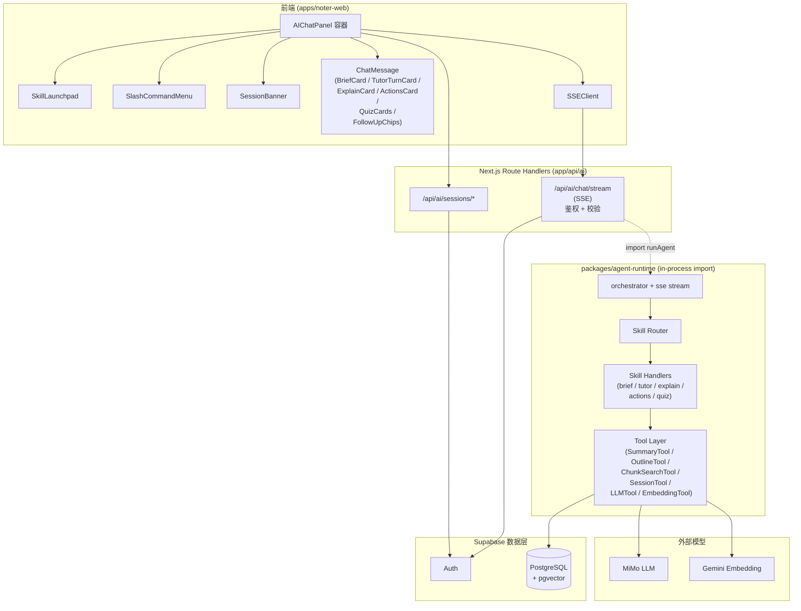
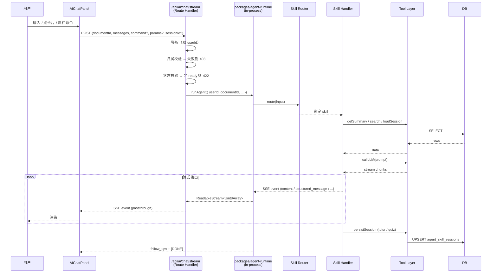
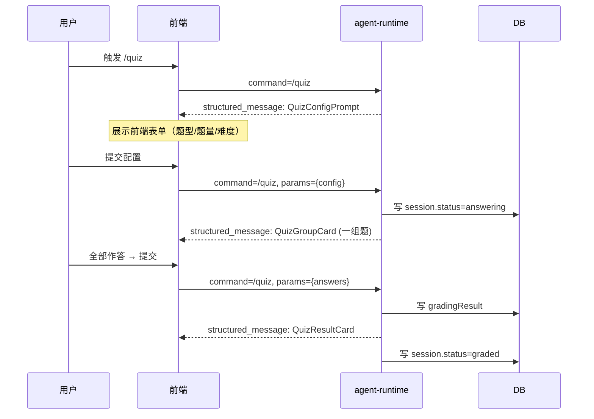

# Design Document — Noter Agent

## Overview

Noter Agent 是 Noter 文档智能阅读系统中的 AI 交互层，基于 **Skill Router + Tool Layer** 架构构建，作用域固定在"单文档对话"语境（每次会话绑定一个 `documentId`）。

不同于传统 RAG"先无差别检索、再让 LLM 自由生成"的范式，Noter Agent 把用户的阅读意图拆分为五个边界明确的 **Skill**：`/brief`（速览）、`/tutor`（私教）、`/explain`（释疑）、`/actions`（行动项）、`/quiz`（出题）。每个 Skill 拥有独立的：

- 触发条件（斜杠命令 / 启动卡片 / 自然语言意图分类）
- 检索策略（结构化数据直读 / 摘要直读 / 向量召回 + 混合搜索）
- 提示词模板与输出契约（Markdown / 结构化卡片）
- 多轮状态机（单轮即终 / 章节驱动 / 题组驱动）

系统基于 Next.js 16 App Router 路由处理器对外暴露 SSE 端点；agent 核心实现为 monorepo 内部包 `packages/agent-runtime`（TypeScript），由 Route Handler 直接 `import` 调用、零网络跨服务；具体的检索执行、向量化与 LLM 调用都在该进程内完成；前端在 `apps/noter-web/components/document-detail/AIChatPanel.tsx` 中以可伸缩面板形态承载 chat 与结构化卡片。

## MVP Scope

为了控制本期实现复杂度，下列能力**简化或暂不实现**：

- ❌ **OnTopic_Classifier 与 OffTopicNotice**：本期不做。多轮 session 进行中如果用户输入了任意消息，**直接当作对当前 session 的回应**喂给 Skill Handler；Skill 自身决定如何处理（必要时由 Skill 内部 prompt 引导回主题）。SSE 协议不再发送 `off_topic_notice` 事件、前端不渲染 `OffTopicNotice` 组件、TutorSessionState / QuizSessionState 不保留 `parkingLot` 字段。
- ❌ **`/explain` 反问态入库（`pending_skill` 字段）**：本期不再创建 session、不写 `agent_skill_sessions.pending_skill`。`/explain` 触发时若无 concept 参数，直接通过 SSE `content` 文本回复「想了解哪个概念？请直接输入想了解的概念」，前端可以在输入框 placeholder 上做提示；用户下次发送的消息走正常路径，由意图分类匹配到 `/explain` 并把消息内容当作 concept。
- ❌ **复杂 SkillSwitch 原子事务**：本期简化为顺序操作——先 `UPDATE agent_skill_sessions SET state.status = 'interrupted'`，再启动新 Skill。不引入数据库事务、不强制原子性。
- ❌ **`clarification` 事件**：从 SSE 协议事件清单中删除，不再保留协议位。
- ❌ **SkillRouter 三级优先级中"OnTopic 判定"那一级**：删除。本期 Router 简化为两级：(1) 显式 command 直达；(2) 自然语言 → 关键词 + LLM 兜底意图分类。

### 设计原则

- **意图先行**：先识别 Skill，再决定检索策略与输出形态，避免 RAG 的"答非所问"
- **检索最小化**：能直读结构化字段（summary / outline / chunks）就不做向量搜索，节省 token 与时延
- **前端零冷启动**：用户首次打开 chat panel 即看到 SkillLaunchpad，三入口同源（点卡片 / 斜杠命令 / 自然语言）
- **状态可观测**：多轮 Skill（tutor、quiz）持久化到 `agent_skill_sessions`，可恢复、可中断、可审计
- **降级兜底**：所有 Skill 都有"摘要缺失 / 向量未就绪 / LLM 失败"的降级路径

### 与传统 RAG 的对比（学术性说明）

| 维度 | 传统 RAG | Skill-based Agent（本设计） |
|------|----------|------------------------------|
| 检索范围 | 全库无差别向量召回 | 按 Skill 决定：结构化直读 / 章节级 / 全文向量 |
| 输出形态 | 自由文本 | 受 Skill 输出契约约束（Markdown 段 / JSON 卡片） |
| 多轮支持 | 通常仅靠 message history | 显式状态机 + `agent_skill_sessions` 持久化 |
| 可解释性 | 引用混杂、易幻觉 | 每个 Skill 检索范围可证明（property test 覆盖） |
| 冷启动 | 用户需要"问对问题" | SkillLaunchpad 提供五种结构化入口 |

> 本质区别：传统 RAG 把"理解阅读意图"的负担丢给了 LLM；本设计把意图识别提前到 Router 层，并用 Skill 把检索策略具象化。

---

## Architecture

### 系统架构图



> Frontend 子图严格对应实现层级：`AIChatPanel` 是容器组件，承载 `SkillLaunchpad`、`SlashCommandMenu`、`SessionBanner`、消息列表与 `SSEClient`；消息列表内部根据 Skill 渲染不同的结构化卡片。
>
> Backend 不再使用独立的 Supabase Edge Function 或独立 Deno 服务；`packages/agent-runtime` 是 monorepo workspace 内部包，由 Next.js Route Handler **直接 `import`** 调用，**Route Handler 极薄、agent-runtime 富**：Route Handler 只负责鉴权、文档归属与状态校验、SSE 流的 Response 包装；Skill 路由、Tool 调用、LLM/Embedding/检索全部由 agent-runtime 完成。

### 请求生命周期



---

## Skill Router 设计

Skill Router 是 `packages/agent-runtime` 的入口，负责把"用户输入"映射到"具体 Skill + 参数"。

### 路由优先级（本期简化为两级）

```pascal
PROCEDURE route(input)
  INPUT: input = { command?: string, params?: object, message: string,
                   activeSession?: SkillSession }
  OUTPUT: { skill: SkillName, params: object, mode: 'fresh' | 'resume' }

  SEQUENCE
    // 1. 显式 command 最高优先级（来自 SkillLaunchpad / SlashCommandMenu）
    IF input.command IS NOT NULL THEN
      IF input.activeSession IS NOT NULL AND
         input.activeSession.skill ≠ input.command THEN
        // Skill 切换：直接打断旧 session（顺序约束，非事务原子）
        interruptSession(input.activeSession)
      END IF
      RETURN { skill: input.command, params: input.params, mode: 'fresh' }
    END IF

    // 2. 多轮 session 进行中：直接续签，不做 OnTopic 判定
    //    任何用户消息都被当作对当前 session 的回应交给 Skill Handler
    //    （Skill 内部如需引导回主题，由 prompt 自行处理）
    IF input.activeSession IS NOT NULL AND
       input.activeSession.skill IN ['/tutor', '/quiz'] THEN
      RETURN { skill: input.activeSession.skill, params: input.message,
               mode: 'resume' }
    END IF

    // 3. 慢路径：自然语言意图分类（关键词 + LLM 兜底）
    intent ← classifyIntent(input.message)
    RETURN { skill: intent.skill, params: intent.params, mode: 'fresh' }
  END SEQUENCE
END PROCEDURE
```

> 本期 **不实现 OnTopic_Classifier**，也不发送 `off_topic_notice` / `clarification` 事件。所有偏题判定由 Skill Handler 自身在 prompt 层面处理。

### 意图分类规则（关键词 + LLM 兜底）

| 关键词 / 短语 | 命中 Skill |
|---------------|-----------|
| "速览"、"快速了解"、"这是什么"、"先看看" | `/brief` |
| "教我"、"私教"、"带我读"、"逐章讲" | `/tutor` |
| "什么是 X"、"X 是什么意思"、"解释一下 X" | `/explain` (X 作为参数) |
| "我读完了"、"接下来做什么"、"行动项"、"todo" | `/actions` |
| "考考我"、"测试"、"出题"、"quiz" | `/quiz` |
| 其他（关键词与 LLM 均未给出明确分类） | `/explain` 兜底 |

> 本期不使用 confidence 阈值，也不发送 `clarification` 事件。低置信场景统一走 `/explain` 兜底，由用户在结果中决定下一步。

---

## Skills 详细设计

> 五个 Skill 共用模板：**触发 / 检索 / Prompt / 输出 / 交互 / 状态 / 降级**。

### `/brief` — 文档速览

- **触发**：SkillLaunchpad 主推卡 / 斜杠 `/brief` / "速览这篇"
- **检索**：直读 `document_summaries`（summary / key_points / keywords / suitable_scenarios）+ `document_contents.outline`，**不触发向量搜索**
- **Prompt**：
  ```
  基于以下结构化信息，输出五区块速览：
  1) 文档类型（论文 / 教程 / 报告 / 其他）
  2) 核心主张（一句话）
  3) 章节地图（取 outline 前两层）
  4) 适合谁读（来自 suitable_scenarios）
  5) 建议阅读路径（顺读 / 跳读 / 速读）
  ```
- **输出**：`structured_message` `BriefCard` payload，五字段 JSON
- **交互**：单轮即终；末尾追加 `FollowUpChips`（变更 2.9）
- **状态**：不写 `agent_skill_sessions`
- **降级**：`document_summaries` 缺失 → 直接读 `document_contents.markdown_content` 前 3000 字 + outline，让 LLM 现场提取

### `/tutor` — 章节私教

- **触发**：启动卡片 / `/tutor` / "教我这篇"
- **流程**：基于 `outline` 切章节 → 每章一轮 → "讲核心要点 → 引导提问 → 评估回答 → 进入下一章"
- **检索**：每轮按当前章节 `heading_path` 过滤 `document_chunks`，取章节内全部分片（不超过 8000 token）
- **Prompt**：
  ```
  [角色] 你是私教
  [当前章节] {chapter.title}
  [章节内容] {chunks_concat}
  [上一轮回答评估] {assessment}
  请输出：
  1) 本章核心讲解（200-400 字）
  2) 一道引导问题（开放题，引导思考下一章主题）
  ```
- **输出**：`structured_message` `TutorTurnCard`：`{ chapterTitle, explanation, question }`
- **交互**：多轮，由 `SessionBanner` 显示"第 X/Y 章"
- **状态**：`agent_skill_sessions` 记录 `currentChapterIndex`、`exchangeHistory`、`understanding`
- **降级**：outline 缺失 → 按字数等分 5 块作为虚拟章节

### `/explain` — 概念释疑

- **触发**：`/explain {concept}` / 选中文本右键（后续迭代） / 自然语言提问
- **参数缺省（本期简化）**：触发时未带参数 → **不**写入 `agent_skill_sessions.pending_skill`，**不**创建 session；通过 SSE `content` 直接回复一条文本「想了解哪个概念？请直接输入想了解的概念」。前端可在输入框 placeholder 上做提示。用户下一条消息走正常路径，由意图分类匹配到 `/explain` 并把消息内容当作 concept。
- **检索**：用 concept 计算 embedding → 在当前 `documentId` 内做向量搜索取 top-5 chunk + 关键词搜索 top-3，融合去重
- **Prompt**：
  ```
  基于以下文档相关位置，解释概念 "{concept}"：
  - 给出 100-300 字的清晰定义
  - 关联本文出现的相关概念（≤3 个）
  - 引用原文（带 chunk_index）
  ```
- **输出**：`structured_message` `ExplainCard`：`{ markdown, references: { chunkId, headingPath, snippet }[] }`
- **交互**：单轮；末尾 `FollowUpChips`（再深一点 / 关联概念有哪些）
- **状态**：不写 session
- **降级**：检索 0 命中 → 提示"文档中未直接讨论此概念"，让 LLM 给通用解释并显式标注"非文档内容"

### `/actions` — 行动项提取

- **触发**：`/actions` / 启动卡 / "我读完了应该做什么"
- **检索**：直读 `document_summaries.todos` + `document_summaries.key_points` + `outline` 各章首段（章首段从 `document_chunks` 按 `chunk_index = 0 of each heading_path` 取）
- **Prompt**：
  ```
  基于结构化信息，输出三块：
  1) Todo List（≤ 20 条；优先用 summary.todos，不足则补充提炼）
  2) 需进一步学习的概念（≤ 8 条；候选词来自 keywords + LLM 提炼）
  3) 推荐延伸阅读（≤ 5 条；基于 keywords + 文档主题）
  ```
- **输出**：`structured_message` `ActionsCard`：`{ todos: string[], conceptsToLearn: string[], readingSuggestions: string[] }`
- **交互**：单轮，**只读纯展示**（不可勾选、不写回 notes）；末尾 `FollowUpChips`
- **状态**：不写 session
- **降级**：summary 缺失 → 读 outline + 各章首段 + 关键词，让 LLM 现场提取（结果数量受 Property `/actions 数据完整性` 约束）

### `/quiz` — 出题考我

#### 流程总览



#### 配置 → 出题 → 评分

- **第一阶段（配置）**：触发即弹出 `QuizConfigPrompt`（结构化前端表单消息），让用户选：
  - 题型多选：`single` / `multi` / `fill` / `short`
  - 题量：1–10
  - 难度：`recall` / `understand` / `apply` / `mixed`（默认 mixed）
- **第二阶段（出题）**：用户提交配置 → agent **一次性生成一组题**
  - 检索：基于 `outline` 取每章关键内容采样 + 必要时章节级向量搜索
  - 难度分配：`recall` 取关键术语 / 定义；`understand` 取概念关系；`apply` 取场景题
- **第三阶段（评分）**：前端 `QuizGroupCard` 全部作答后一次性提交 → agent 一次性返回所有题评分 + 解析 → `QuizResultCard`
- **输出契约**：见 Data Models 中的 `QuizQuestion` / `QuizSessionState`
- **交互**：多轮但轻量（配置 → 出题 → 提交评分），不像 tutor 持续 N 轮
- **状态**：`agent_skill_sessions` 记录题组、用户答案、评分（详见 Data Models）
- **降级**：outline 缺失 → 按字数等分章节抽样；LLM 输出 JSON 不合法 → 重试一次，仍失败则报错

---

## Frontend Interaction Design

> 本章节描述 Skill 系统的前端交互层。**它驱动 SSE 协议设计**，因此放在 SSE 协议之前。

### 设计原则

1. **零冷启动**：用户**完全没看过文档**就打开 chat panel，必须降低门槛——首屏即提供结构化入口，避免空白对话框。
2. **自适应面板尺寸**：复用现有 `AIChatPanel` 三种尺寸：
   - `normal`（默认窄）：单列，主推 3 张卡
   - `tall`（向上拉长，覆盖元数据）：单列，全展示 5 张
   - `wide`（两栏，隐藏元数据与大纲）：双列 3+2 排布
3. **呼吸感优先**：normal 尺寸下**不强求 5 个 Skill 全展示**，按 priority 取前 3 张主推卡，其余折叠到"更多 ▾"。
4. **三入口同源**：点卡片 / 斜杠命令 / 自然语言三种触发方式最终都收敛到同一份 SSE 请求体（`{ documentId, command?, params?, message? }`）。

### SkillLaunchpad（启动面板）

打开 panel **且消息列表为空**时显示。

#### 自适应规则

| 面板尺寸 | 布局 | 展示策略 |
|----------|------|----------|
| `normal` | 单列 | 取 priority 最小的 **3 张主推卡**（`/brief`、`/tutor`、`/quiz`），其余折叠到"更多 ▾"展开 |
| `tall` | 单列 | 全部 5 张卡纵向展示 |
| `wide` | 双列 | 3+2 网格排布，5 张卡全展示 |

#### 卡片结构

```
┌──────────────────────────────────┐
│ 📖  速览这篇                      │
│     30 秒掌握全文骨架              │
└──────────────────────────────────┘
```

每张卡：`launchpadIcon`（emoji）+ `launchpadTagline`（一句话价值）+ Skill 标题。点击直接触发对应 Skill（等价于在输入框打 `/brief` 后回车）。

#### 启动面板下方分割

```
─── 或直接提问 ───
[输入框]
```

#### 显示/隐藏时机

- **显示**：消息列表为空（含初始打开 / 用户清空会话 / 重新打开 panel）
- **隐藏**：发送任意消息后立即隐藏
- **持久性**：每次重新打开 panel，只要消息列表为空就重新展示

### 三入口同源

| 入口 | 触发方式 | 请求体 |
|------|----------|--------|
| 点卡片 | 鼠标点击 SkillLaunchpad 卡片 | `{ command: '/brief' }`（零输入） |
| 斜杠命令 | 输入框打 `/` 弹出 `SlashCommandMenu` 浮层 | `{ command: '/explain', params: {...} }` |
| 自然语言 | 直接打字回车 | `{ message: '考考我吧' }` → Router 慢路径分类 |

#### SlashCommandMenu（浮层）

- **触发**：输入框首字符为 `/`
- **位置**：输入框**上方**浮层，避免遮挡键盘
- **内容**：列出 5 个 Skill 名 + 简介 + 是否需要参数
- **键盘操作**：上下键移动 / Enter 选中 / Esc 关闭
- **选中后**：自动填充命令到输入框；若 `requiresParams = true` 则光标停在命令后等待用户输入参数

### SessionBanner（多轮 Skill 状态栏）

用于 `/tutor` 和 `/quiz` 两个多轮 Skill。**消息列表顶部固定 banner**（不随消息滚动），结构：

```
┌──────────────────────────────────┐
│ 🎓 私教进行中  第 3/8 章   [退出] │
└──────────────────────────────────┘
```

| Skill | banner 文案 | 进度 |
|-------|-------------|------|
| `/tutor` | 🎓 私教进行中 | 第 X/Y 章 |
| `/quiz` (configuring) | 📝 测验配置中 | — |
| `/quiz` (answering) | 📝 测验进行中 | 第 X/Y 题 / 待提交 |
| `/quiz` (graded) | 📝 测验已完成 | — |

#### 退出按钮

点击 `[退出]` → 弹出确认对话框 → 确认后：
1. 清空 session 状态（`status = 'ended'`、`expires_at = now()`）
2. 重置消息列表到空状态（恢复 SkillLaunchpad）

#### 输入框 placeholder 联动

| 场景 | placeholder |
|------|-------------|
| 默认（无 session） | `输入你的问题...` 或 `按 / 唤起命令...` |
| `/tutor` 答题中 | `回答 AI 的问题...` |
| `/quiz` configuring | `通过上方表单选择题型和题量`（输入框暂时禁用或仅文字补充） |
| `/quiz` answering | `输入答案 A/B/C/D 或文字...` |

### Skill 切换处理（直接打断）

用户在 `/tutor` 或 `/quiz` 进行中**触发任意新 Skill**（点卡片 / 斜杠命令 / 强意图自然语言）→ **直接打断当前 session**，不弹确认。本期采用**顺序约束**而非数据库事务：

```pascal
PROCEDURE handleSkillSwitch(currentSession, newSkill)
  SEQUENCE
    // 1. 先标记旧 session 已中断（顺序先于新 Skill 启动）
    currentSession.state.status ← 'interrupted'
    currentSession.expires_at ← now()
    persistSession(currentSession)        // ← 必须在新 skill 启动前完成

    // 2. 在消息流追加系统提示
    appendSystemNotice("已退出私教，开始新的 " + skillLabel(newSkill) + "...")

    // 3. 启动新 skill（fresh）
    startSkill(newSkill, mode: 'fresh')
  END SEQUENCE
END PROCEDURE
```

> **顺序约束**由 `Property: Skill 切换顺序约束` 保证（详见 Correctness Properties）。本期不要求事务原子性。

### 需要参数的 Skill 反问

某些 Skill 需要必填参数（由 `requiresParams = true` 标记），触发时若无参数则进入"反问态"。**本期采用文本提示而非入库**：

| Skill | 反问行为 |
|-------|----------|
| `/explain` | 通过 SSE `content` 直接回复一条文本「想了解哪个概念？请直接输入想了解的概念」；输入框 placeholder 可变为 `输入想了解的概念...`；**不**写 `agent_skill_sessions.pending_skill`、**不**创建 session；用户下一条消息走正常路径，由意图分类匹配到 `/explain` 并把消息内容当作 concept |
| `/quiz` | 不走文本反问，直接发 `structured_message: QuizConfigPrompt`，由前端展示结构化表单 |

### 结构化卡片消息

扩展 `ChatMessage`，支持 `messageType` 字段区分纯文本与结构化卡片：

| Skill | 卡片 | 用途 |
|-------|------|------|
| `/brief` | **BriefCard** | 5 区块：类型 / 主张 / 章节地图 / 适合谁 / 阅读路径 |
| `/tutor` | **TutorTurnCard** | 章节标题 + 核心讲解 + 引导提问 |
| `/explain` | **ExplainCard** | markdown + ReferenceList 折叠区（文档相关位置） |
| `/actions` | **ActionsCard** | 三栏纯展示：todo / 概念 / 推荐阅读 |
| `/quiz` | **QuizConfigPrompt** + **QuizGroupCard** + **QuizResultCard** | 配置 → 答题 → 评分解析 |

> `FollowUpChips` 与 `OffTopicNotice` **不**通过 `structured_message` 投递。FollowUpChips 用独立的 `follow_ups` 事件；OffTopicNotice 本期不实现。

新增 SSE 事件 `structured_message`：`data: { messageType, payload }`（详见 SSE 协议章节）。

### Suggested Follow-ups

单轮 Skill（`/brief`、`/explain`、`/actions`）回答末尾追加 chip 按钮组（**FollowUpChips**），降低用户"下一步该干嘛"的认知负担：

| Skill | Chips |
|-------|-------|
| `/brief` | `[开始私教 🎓]` `[提取行动项 ✅]` `[考考我 📝]` |
| `/explain` | `[再深一点]` `[关联概念有哪些]` |
| `/actions` | `[考考我 📝]` `[开始私教 🎓]` |

点击 chip 等同触发对应 Skill。SSE 事件 `follow_ups`：`data: { chips: { label, command, params? }[] }`。

---

## SSE 协议

### 端点

`POST /api/ai/chat/stream`

```typescript
interface ChatStreamRequest {
  documentId: string
  messages: { role: 'user' | 'assistant'; content: string }[]
  command?: SkillName            // 来自 SkillLaunchpad / SlashCommandMenu
  params?: Record<string, unknown>
  sessionId?: string             // 多轮 Skill 续签
}
```

`Content-Type: text/event-stream`，逐行 `data: {json}\n\n`，结束以 `data: [DONE]\n\n`。

### 事件清单

| 事件 | 时机 | 数据 |
|------|------|------|
| `content` | 文本流式片段（用于 markdown 流式渲染） | `{ content: string }` |
| `structured_message` | 输出结构化卡片 | `{ messageType: string, payload: object }` |
| `follow_ups` | 单轮 Skill 结束 | `{ chips: { label: string, command: SkillName, params?: object }[] }` |
| `session_banner` | 多轮 session 状态变化 | `{ skill: SkillName, status: 'active' \| 'ended' \| 'interrupted', progress?: { current: number; total: number } }` |
| `error` | 任意阶段失败 | `{ error: string, code?: number }` |
| `done` | 流式响应正常结束 | 等价于终止帧 `data: [DONE]\n\n`（无独立 JSON payload） |

### structured_message.messageType 取值集合

`messageType` 收紧到主要卡片：

- `BriefCard`
- `TutorTurnCard`
- `ExplainCard`
- `ActionsCard`
- `QuizConfigPrompt`
- `QuizGroupCard`
- `QuizResultCard`

> `FollowUpChips` 通过独立的 `follow_ups` 事件投递，不再以 `structured_message` 形式重复出现；`OffTopicNotice` 本期不实现，已从协议清单中移除。

### 终止帧

每次完整响应结束输出 `data: [DONE]\n\n` 作为终止标记。事件清单中的 `done` 仅作为协议层语义名称，不对应独立的 JSON 事件。

### 事件交互示例（/tutor 第三章）

```
data: {"event":"session_banner","skill":"/tutor","status":"active","progress":{"current":3,"total":8}}

data: {"event":"content","content":"## 第三章 ：依赖倒置原则\n\n核心是..."}

data: {"event":"content","content":"...更高层模块。"}

data: {"event":"structured_message","messageType":"TutorTurnCard","payload":{"chapterTitle":"依赖倒置原则","explanation":"...","question":"为什么..."}}

data: [DONE]
```

---

## Tool Layer 设计

Tool Layer 是 Skill Handler 与外部能力之间的薄封装，每个 Tool 单一职责、可独立测试。

| Tool | 职责 | 关键方法 |
|------|------|----------|
| `SummaryTool` | 读 `document_summaries` 结构化字段 | `getSummary(documentId)` |
| `OutlineTool` | 读 `document_contents.outline`、按 heading 取章节范围 | `getOutline()` / `getChapterChunks(headingPath)` |
| `ChunkSearchTool` | 在当前 documentId 内做向量 / 关键词 / 混合搜索 | `vectorSearch(query, k)` / `keywordSearch(query, k)` / `hybridSearch(query, k)` |
| `SessionTool` | CRUD `agent_skill_sessions`，含 interrupt 原子操作 | `load(sessionId)` / `upsert(session)` / `interrupt(sessionId)` |
| `LLMTool` | MiMo LLM 调用（流式 / 非流式 / JSON 模式） | `stream(prompt)` / `complete(prompt)` / `completeJson(prompt, schema)` |
| `EmbeddingTool` | Gemini Embedding 调用 | `embed(text)` |

```typescript
interface ChunkSearchTool {
  vectorSearch(query: string, k?: number): Promise<ChunkHit[]>
  keywordSearch(query: string, k?: number): Promise<ChunkHit[]>
  hybridSearch(query: string, k?: number): Promise<ChunkHit[]>
}

interface ChunkHit {
  chunkId: string
  chunkIndex: number
  headingPath: string[]
  content: string
  score: number
}
```

> **作用域约束**：所有 `ChunkSearchTool` 方法都在 SQL WHERE 中强制 `document_id = :currentDocumentId`，确保 Skill 只能检索当前文档。

---

## Data Models

### `agent_skill_sessions` — 多轮 Skill 会话表（新增）

| 字段 | 类型 | 说明 |
|------|------|------|
| id | UUID PK | 会话ID |
| user_id | UUID (FK→profiles) | 所属用户 |
| document_id | UUID (FK→documents) | 关联文档 |
| skill | text | `'/tutor'` / `'/quiz'` |
| state | jsonb | Skill 特定状态（详见下方接口） |
| expires_at | timestamptz | 过期时间（默认 24h） |
| deleted | int (0/1) | 软删除 |
| created_at / updated_at | timestamptz | 时间戳 |

> RLS：`auth.uid() = user_id`，与 documents 表保持一致。
>
> **本期简化**：表只服务于 `/tutor` 和 `/quiz`，不服务于 `/explain` 反问态；**已删除 `pending_skill` 字段**（如果未来要做反问态可重新加）。

### `state` 字段在不同 Skill 下的结构

```typescript
// /tutor 会话状态
interface TutorSessionState {
  status: 'active' | 'ended' | 'interrupted'
  currentChapterIndex: number
  totalChapters: number
  currentTopic: string
  understanding: number          // 0-100
  exchangeHistory: {
    question: string
    userAnswer: string
    assessment: 'good' | 'partial' | 'confused'
  }[]
}

// /quiz 会话状态
interface QuizSessionState {
  status: 'configuring' | 'answering' | 'graded' | 'ended' | 'interrupted'
  config: {
    questionTypes: ('single' | 'multi' | 'fill' | 'short')[]
    count: number                // 1-10
    difficulty?: 'recall' | 'understand' | 'apply' | 'mixed'
  }
  questions: QuizQuestion[]
  userAnswers: Record<number, unknown>     // index → answer
  gradingResult?: {
    questionIndex: number
    correct: boolean
    explanation: string
  }[]
}

interface QuizQuestion {
  index: number
  type: 'single' | 'multi' | 'fill' | 'short'
  difficulty: 'recall' | 'understand' | 'apply'
  question: string
  options?: string[]             // 仅 single / multi
  correctAnswer: unknown         // single: string; multi: string[]; fill/short: string
}
```

### 复用文档管理模块的现有表

> 以下表由 `noter-document-management` 模块定义，本模块只读不写。

| 表 | 本模块用途 |
|----|------------|
| `documents` | 校验文档归属、`status = 'ready'` 才允许会话 |
| `document_contents` | `outline`（/tutor、/actions、/quiz） / `markdown_content`（/brief 降级） |
| `document_chunks` | `/tutor` 章节召回 / `/explain` 向量搜索 / `/actions` 章首段 |
| `document_summaries` | `/brief`、`/actions` 的结构化字段直读 |

### 混合搜索复用

`/explain` 的混合搜索复用文档管理模块已有的 `hybrid_search(query_text, query_embedding, match_count)` RPC，但在 agent-runtime 的 ChunkSearchTool 中**追加 documentId 过滤**：在 RPC 之上包一层 `document_chunks` 子查询，确保检索范围限定在当前文档。

---

## 权限校验

### Route Handler 层（两步显式分离）

`/api/ai/chat/stream` 进入时：

1. 通过 Supabase Auth 获取 `user_id`
2. **第一步：归属与软删检查 → 403**
   - 校验 `documents.id = :documentId AND documents.user_id = :userId AND documents.deleted = 0`
   - 失败时统一返回 403 Forbidden，**不区分**「文档不存在」「不属于该用户」「已软删」
   - 错误信息脱敏：响应体不泄露任何能区分这三种情况的信息
3. **第二步：处理状态检查 → 422**
   - 仅在第一步通过后才执行
   - 校验 `documents.status = 'ready'`
   - 失败时返回 422 + 「文档尚未处理完成」提示
4. 若 `sessionId` 存在，校验 `agent_skill_sessions.user_id = :userId AND document_id = :documentId`
5. 通过后调用 `runAgent({ userId, documentId, ... })`，由 `packages/agent-runtime` 接管 SSE 流生成

### 关键约定

- **404 等同于 403** —— 不存在与无权限对外不可区分
- **422 不会在归属校验未通过时出现** —— 必须先 403
- 这一顺序消除了"403 与 422 同时校验"可能造成的语义冲突

### agent-runtime 层

- 所有 SQL 查询都使用 service_role，但在 WHERE 中**强制带 user_id**，等价于二次 RLS
- `ChunkSearchTool` / `OutlineTool` / `SummaryTool` 在 SQL 中强制 `document_id = :currentDocumentId AND user_id = :userId`

### 数据库层

- `agent_skill_sessions` 启用 RLS：`auth.uid() = user_id`
- 复用文档管理模块的所有 RLS 策略（documents / document_contents / document_chunks / document_summaries）

---

## Error Handling

| 阶段 | 错误情形 | 处理 |
|------|----------|------|
| Route Handler（第一步：归属） | 文档不存在 / 不属于当前用户 / 已软删 | 403 Forbidden，统一脱敏（不区分三种情况） |
| Route Handler（第二步：状态） | `documents.status ≠ 'ready'` | 422 + 提示"文档尚未处理完成"（仅在归属校验通过后才出现） |
| Skill Router | `command` 不在已注册 Skill 列表 | 400 + 列出可用 Skill |
| Skill Handler | `document_summaries` 缺失（/brief、/actions） | 走降级路径，**不报错** |
| Skill Handler | `document_chunks` 为空（/tutor、/explain） | SSE `error` 事件 + 提示"文档未完成向量化" |
| Skill Handler | LLM 调用超时 / 失败 | 重试一次；仍失败 → SSE `error` |
| Skill Handler | LLM 输出 JSON 不合法（/quiz） | 重试一次；仍失败 → SSE `error` |
| SessionTool | session 过期或不存在 | 静默重置为 `mode: 'fresh'`，前端隐藏 banner |

### 超时

| 操作 | 超时 |
|------|------|
| `/brief` / `/actions`（结构化直读） | 15s |
| `/explain`（向量搜索 + LLM） | 25s |
| `/tutor` 单轮 | 30s |
| `/quiz` 出题（一次性生成 N 题） | 45s |
| `/quiz` 评分（一次性评 N 题） | 30s |

---

## Components and Interfaces

### 部署形态

agent 核心实现为 **monorepo 内部包 `packages/agent-runtime`**（TypeScript，与 `packages/api`、`packages/ui` 等同级），由 Next.js Route Handler **直接 `import`** 调用、整体部署到一台服务器上、零网络跨服务调用。

**职责切分（关键）：**

- **Route Handler 极薄**（`apps/noter-web/app/api/ai/chat/stream/route.ts`）：
  - 读取 Supabase Auth session 拿 userId
  - 校验 documentId 归属和文档状态（先 403、后 422）
  - 把 `{ userId, documentId, messages, command?, params?, sessionId? }` 传给 `runAgent`
  - 把 agent 返回的 SSE 流原样转给客户端

- **`packages/agent-runtime` 富**：
  - Skill Router（含简化版意图分类）
  - 5 个 Skill：/brief、/tutor、/explain、/actions、/quiz
  - Tool Layer
  - LLM 调用、Embedding 调用、Chunk 检索
  - session 状态读写
  - SSE event 生成（返回一个 ReadableStream，由 Route Handler 包装为 Response）

> 不再使用 Supabase Edge Function `agent-runtime`、不再使用独立的 `apps/noter-agent` Deno 服务。

### 目录结构

```
packages/agent-runtime/
├── package.json                # workspace 包，name: "@noter/agent-runtime"
├── tsconfig.json
├── src/
│   ├── index.ts                # 唯一对外入口：runAgent({...}) 返回 SSE 流
│   ├── orchestrator.ts         # 协调 Router → Skill → SSE
│   ├── router/
│   │   ├── skill-router.ts     # 简化版两级路由
│   │   └── intent.ts           # 关键词 + LLM 兜底意图分类
│   ├── skills/
│   │   ├── registry.ts         # 显式注册 5 个 Skill
│   │   ├── types.ts            # SkillManifest / SkillContext / SkillHandler
│   │   ├── brief.ts
│   │   ├── tutor.ts
│   │   ├── explain.ts
│   │   ├── actions.ts
│   │   └── quiz.ts
│   ├── tools/
│   │   ├── summary.ts          # SummaryTool
│   │   ├── outline.ts          # OutlineTool
│   │   ├── chunk-search.ts     # ChunkSearchTool（vector / keyword / hybrid）
│   │   ├── session.ts          # SessionTool（agent_skill_sessions CRUD）
│   │   ├── llm.ts              # MiMo LLM（流式 / 非流式 / JSON 模式）
│   │   └── embedding.ts        # Gemini Embedding
│   ├── sse/
│   │   └── stream.ts           # SSE 流封装：write(event, data) / done() / error()
│   ├── db/
│   │   └── client.ts           # supabase-js 单例（service_role）
│   ├── prompts/                # 5 个 Skill 的 prompt 模板
│   │   ├── brief.ts
│   │   ├── tutor.ts
│   │   ├── explain.ts
│   │   ├── actions.ts
│   │   └── quiz.ts
│   └── types/
│       ├── skill.ts
│       ├── sse.ts
│       ├── tool.ts
│       └── session.ts
└── tests/
    ├── unit/
    └── integration/

apps/noter-web/
├── app/
│   └── api/
│       └── ai/
│           ├── chat/
│           │   └── stream/
│           │       └── route.ts            # 鉴权 + 校验 + 调用 runAgent + 返回 SSE
│           └── sessions/
│               ├── route.ts                # GET 当前文档活跃 session
│               └── [id]/
│                   └── route.ts            # PATCH 退出 / DELETE 清理
├── components/
│   └── document-detail/
│       ├── AIChatPanel.tsx                 # 容器（已有，扩展）
│       ├── ChatMessage.tsx                 # 已有，扩展支持 messageType
│       ├── chat/
│       │   ├── SkillLaunchpad.tsx          # 启动面板
│       │   ├── SlashCommandMenu.tsx        # 斜杠命令浮层
│       │   ├── SessionBanner.tsx           # 多轮 session 状态栏
│       │   ├── FollowUpChips.tsx           # 单轮末尾推荐
│       │   └── cards/
│       │       ├── BriefCard.tsx
│       │       ├── TutorTurnCard.tsx
│       │       ├── ExplainCard.tsx
│       │       ├── ActionsCard.tsx
│       │       ├── QuizConfigPrompt.tsx
│       │       ├── QuizGroupCard.tsx
│       │       └── QuizResultCard.tsx
│       └── sse/
│           └── useChatStream.ts            # SSE Client Hook
├── lib/axios/
│   └── ai.ts                               # 扩展：sessions / abort
├── stores/
│   └── chatSession.ts                      # 新增：当前活跃 session
└── types/
    └── agent.ts                            # 新增：SkillName / SkillManifest / 各 Card payload
```

### 对外入口签名

`packages/agent-runtime` 对外只暴露一个函数：

```typescript
// packages/agent-runtime/src/index.ts
export interface RunAgentInput {
  userId: string                // 已由 Route Handler 校验
  documentId: string            // 已由 Route Handler 校验归属
  messages: { role: 'user' | 'assistant'; content: string }[]
  command?: SkillName           // 显式触发
  params?: Record<string, unknown>
  sessionId?: string            // 多轮 session
  abortSignal?: AbortSignal
}

export interface RunAgentResult {
  /** 标准 Web ReadableStream<Uint8Array>，可直接作为 Response.body */
  stream: ReadableStream<Uint8Array>
}

export function runAgent(input: RunAgentInput): RunAgentResult
```

### Route Handler 用法（伪代码示意）

```typescript
// apps/noter-web/app/api/ai/chat/stream/route.ts
export async function POST(req: NextRequest) {
  const { userId, supabase } = await requireAuth(req)
  const body = await req.json()

  // 第一步：归属与软删 → 失败 403（不区分三种情况）
  await assertDocumentBelongsToUser(supabase, body.documentId, userId)
  // 第二步：处理状态 → 失败 422
  await assertDocumentReady(supabase, body.documentId)

  if (body.sessionId) {
    await assertSessionAccessible(supabase, body.sessionId, userId, body.documentId)
  }

  const { stream } = runAgent({ userId, ...body })
  return new Response(stream, {
    headers: { 'Content-Type': 'text/event-stream', 'Cache-Control': 'no-cache' }
  })
}
```

### 职责约定

- **`AIChatPanel`**：仅负责面板尺寸、显示/隐藏、整体布局；具体子组件解耦
- **`SkillLaunchpad`**：根据 `size` 自适应展示 3 / 5 张卡，从 `SkillRegistry` 读取 manifest
- **`SlashCommandMenu`**：监听输入框 `/` 触发，从 `SkillRegistry` 读 manifest 列出命令
- **`SessionBanner`**：从 `useChatSessionStore` 订阅活跃 session
- **`useChatStream`**：封装 SSE 解析（`content` / `structured_message` / `follow_ups` / `session_banner` / `error`）
- **`packages/agent-runtime/src/skills/registry.ts`**：**显式注册**所有 Skill（不动态扫描），保证可静态分析

### TypeScript 接口

```typescript
// types/agent.ts
export type SkillName = '/brief' | '/tutor' | '/explain' | '/actions' | '/quiz'

export interface SkillManifest {
  name: SkillName
  label: string                  // 中文标题，例如 "速览这篇"
  description: string            // 长描述（用于 SlashCommandMenu）
  multiTurn: boolean             // 是否多轮
  // Launchpad 与反问相关字段
  launchpadPriority: number      // 数字越小越靠前；normal 取 priority 最小 3 个
  launchpadIcon: string          // emoji
  launchpadTagline: string       // 一句话价值
  requiresParams: boolean        // true 时触发后反问参数（/explain 走 content 文本提示，不入库）
}

export interface ChatMessage {
  role: 'user' | 'assistant' | 'system'
  content: string
  messageType?: 'text' | 'BriefCard' | 'TutorTurnCard' | 'ExplainCard'
                | 'ActionsCard' | 'QuizConfigPrompt' | 'QuizGroupCard'
                | 'QuizResultCard'
  payload?: unknown              // 与 messageType 对应的结构化数据
}

// 卡片 payload
export interface BriefPayload {
  docType: string
  thesis: string
  chapterMap: { level: number; title: string }[]
  audience: string
  readingPath: 'sequential' | 'skim' | 'deep_dive'
}

export interface TutorTurnPayload {
  chapterTitle: string
  chapterIndex: number
  totalChapters: number
  explanation: string
  question: string
}

export interface ExplainPayload {
  concept: string
  markdown: string
  references: { chunkId: string; headingPath: string[]; snippet: string }[]
}

export interface ActionsPayload {
  todos: string[]
  conceptsToLearn: string[]
  readingSuggestions: string[]
}

export interface QuizConfigPayload {
  availableTypes: ('single' | 'multi' | 'fill' | 'short')[]
  maxCount: 10
  difficulties: ('recall' | 'understand' | 'apply' | 'mixed')[]
}

export interface QuizGroupPayload {
  questions: QuizQuestion[]      // correctAnswer 在出题阶段不返回前端
}

export interface QuizResultPayload {
  results: { questionIndex: number; correct: boolean; explanation: string }[]
  score: number                  // 0-100
}

// SSE
export interface SSEEvent {
  event: 'content' | 'structured_message' | 'follow_ups'
       | 'session_banner' | 'error'
  [key: string]: unknown
}
```

### 5 个 Skill 优先级建议

| Skill | priority | requiresParams | normal 主推 |
|-------|----------|----------------|-------------|
| `/brief` | 1 | false | ✅ |
| `/tutor` | 2 | false | ✅ |
| `/quiz` | 3 | false | ✅ |
| `/actions` | 4 | false | 折叠到"更多 ▾" |
| `/explain` | 5 | true | 折叠到"更多 ▾"（需参数，不适合零输入） |

> normal 取 `priority` 最小的 3 个；tall 与 wide 全展示。

---

## Performance Considerations

- **检索最小化**：`/brief`、`/actions` **不触发向量搜索**，直读结构化字段，token 与时延都接近 LLM-only baseline
- **分片召回上限**：`/tutor` 每章 chunks 拼接不超过 8000 token；超长章节按 `chunk_index` 顺序截断
- **流式输出**：所有 Skill 的文本主体都走 SSE `content` 流，结构化卡片在文本流结束后追加（避免阻塞首屏）
- **session 过期清理**：`expires_at < now() AND deleted = 0` 走定时任务软删（每日一次）
- **/quiz 题量上限**：硬限制 `count ≤ 10`，避免一次性 LLM 调用过长

---

## Security Considerations

- **作用域强制**：所有 Tool 在 SQL 层强制 `document_id = :currentDocumentId`，前端无法通过参数注入跨文档检索
- **Prompt 注入防御**：用户消息在 prompt 中以 `[USER_MESSAGE]` 包裹，明确告诉 LLM 这是**输入数据**而非指令；系统指令置于 system role
- **结构化输出校验**：`/quiz` 的 LLM 输出严格 JSON Schema 校验（type ∈ {single,multi,fill,short}、options 仅在 single/multi 出现），不合法直接拒绝
- **Session 不可跨用户读取**：RLS + agent-runtime 二次校验
- **错误信息脱敏**：500 错误对外返回 `internal error`，详细堆栈仅写日志

---

## Dependencies

| 依赖 | 用途 |
|------|------|
| Supabase Auth | 用户身份 |
| Supabase PostgreSQL + pgvector | 文档结构化数据、向量检索、session 存储 |
| `packages/agent-runtime`（monorepo workspace 包） | agent 主体，运行在 Next.js Route Handler 进程内（Node.js 运行时） |
| `@supabase/supabase-js` | DB 客户端（pnpm workspace 共享，与 noter-web 复用同一版本） |
| Gemini Embedding (`gemini-embedding-2`, 768 维) | `/explain` 概念向量化 |
| MiMo LLM (`mimo-v2.5-pro`) | 所有 Skill 的语言生成；`/quiz` 用 JSON 模式 |
| `react-markdown` + `remark-gfm` | 前端 Markdown 渲染（已有） |
| 复用 `noter-document-management` 提供的 `hybrid_search` RPC | `/explain` 检索 |

> 不再依赖 Supabase Edge Function (Deno) 运行时；不再需要 Deno import map / std 库。agent-runtime 整体运行在 Next.js Route Handler 的 Node.js 进程内。

---

## Correctness Properties

> 正确性属性是一种在系统所有有效执行中都应成立的特征或行为——本质上是对系统应做什么的形式化陈述。属性是人类可读规格说明与机器可验证正确性保证之间的桥梁。

### Property 1: Skill Router 显式 command 优先

*For any* 输入同时包含 `command` 和自然语言 `message`，Router 都应直接选用 `command` 指定的 Skill，不进入意图分类。

**Validates: Requirements 15.1, 2.1, 2.5**

### Property 2: 多轮 session 续签作用域

*For any* 活跃 `/tutor` 或 `/quiz` session，且请求体 `command` 为空，Router 必须返回 `mode = 'resume'` 且不创建新 session（本期任意用户消息都被视作对当前 session 的回应，由 Skill Handler 自身处理偏题）。

**Validates: Requirements 15.2**

### Property 3: 同文档作用域强制

*For any* `ChunkSearchTool` / `OutlineTool` / `SummaryTool` 的查询，生成的 SQL 必须包含 `document_id = :currentDocumentId AND user_id = :userId` 谓词。

**Validates: Requirements 13.5**

### Property 4: 文档归属 403 不泄露

*For any* 跨用户访问某 `documentId`，Route Handler 应在归属校验阶段返回 403，且响应体不区分"文档不存在"、"不属于该用户"、"已软删"三种情况。**`document.status ≠ 'ready'` 必须在归属校验通过后才返回 422**，不得提前返回 422 泄露文档存在。

**Validates: Requirements 13.1, 13.2, 13.3**

### Property 5: `/explain` 引用片段完整性

*For any* `/explain` 返回的 `references[i]`，其 `chunkId` 必须存在于 `document_chunks`，且 `headingPath` / `snippet` 必须与该 chunk 的真实记录一致。

**Validates: Requirements 5.7**

### Property 6: `/brief` 不触发向量搜索

*For any* `/brief` 请求，处理流程中不应调用 `ChunkSearchTool.vectorSearch` 或 `hybridSearch`（仅允许 `SummaryTool` 与 `OutlineTool`）。

**Validates: Requirements 3.3, 16.1**

### Property 7: `/actions` 数据完整性

*For any* `/actions` 输出，`todos.length ≤ document_summaries.todos.length + 20`（即：直读条目 + LLM 补全条目，补全部分硬上限 20）。

**Validates: Requirements 6.4**

### Property 8: `/quiz` 题组结构合法性

*For any* `/quiz` 出题阶段产生的 `QuizQuestion`：
- `type ∈ {single, multi, fill, short}`
- `options` 字段当且仅当 `type ∈ {single, multi}` 时存在
- `correctAnswer` 类型与 `type` 匹配（single → string；multi → string[]；fill / short → string）

**Validates: Requirements 7.5**

### Property 9: `/quiz` 题量上限

*For any* `/quiz` 配置阶段的 `config.count`，最终生成的 `questions.length` 应等于 `config.count` 且 `≤ 10`。

**Validates: Requirements 7.4, 16.3**

### Property 10: Skill 切换顺序约束

*For any* 用户在活跃 session 中触发新 Skill，旧 session 必须**先**被标记 `state.status = 'interrupted'`（顺序先后），新 Skill 才开始生成响应。本期不要求事务原子性。

**Validates: Requirements 8.2, 8.3**

### Property 11: SkillLaunchpad 自适应展示

*For any* 面板尺寸：
- `normal` → 主推卡数量 = 3，且为 `launchpadPriority` 最小的 3 个 Skill
- `tall` / `wide` → 主推卡数量 = 5

**Validates: Requirements 1.5, 1.6**

### Property 12: 多轮 banner 一致性

*For any* 时刻 `t`，`SessionBanner` 显示状态应与最近一次 SSE `session_banner` 事件的 payload 一致；session 不存在或 `status = 'ended' | 'interrupted'` 时 banner 必须不可见。

**Validates: Requirements 4.5, 7.7, 8.5, 14.5**

### Property 13: SSE 事件包络

*For any* SSE 事件 `e`，其 JSON 必须包含 `event` 字段且取值在 `{content, structured_message, follow_ups, session_banner, error, done}` 集合内（`done` 等价于终止帧 `data: [DONE]\n\n`）。

**Validates: Requirements 11.2**

### Property 14: 结构化卡片消息类型一致

*For any* `messageType ∈ {BriefCard, TutorTurnCard, ExplainCard, ActionsCard, QuizConfigPrompt, QuizGroupCard, QuizResultCard}` 的消息，`payload` 必须符合对应接口的字段约束（必填字段不缺失、类型正确）。

**Validates: Requirements 11.4**

---

## Testing Strategy

### 双轨测试方法

延续文档管理模块的 **单元测试 + 属性测试** 双轨策略。

| 层级 | 工具 | 覆盖范围 |
|------|------|----------|
| 属性测试 | `fast-check` + `vitest` | Skill Router、Tool 层作用域、`/quiz` 输出契约、SkillLaunchpad 自适应 |
| 单元测试 | `vitest` | Skill Handler 关键分支（含降级路径）、SSE 事件解析 |
| 集成测试 | `vitest` + `supabase-js` | RLS 策略、`agent_skill_sessions` CRUD、Route Handler → agent-runtime 端到端 |
| E2E（可选） | Playwright | SkillLaunchpad → 出题 → 评分 全流程 |

### 属性测试库与配置

- 测试库：`fast-check`
- 运行器：`vitest`
- 每个属性测试最少运行 **100 次迭代**
- 标签格式：`Feature: noter-agent, Property {N}: {property_text}`

### 属性测试重点覆盖

1. **Router 优先级**（Property 1, 2）：同时 fuzz `command` / `activeSession` / `message` 三维度
2. **作用域强制**（Property 3, 4, 5）：fuzz 不同 user_id × document_id 组合，断言 SQL 谓词；403 / 422 顺序不可颠倒
3. **`/quiz` 输出契约**（Property 8, 9）：fuzz config × LLM 输出，断言每题结构合法
4. **Skill 切换顺序约束**（Property 10）：用 fake DB 模拟"标记 interrupted 失败"场景，断言新 Skill 不会被触发
5. **SkillLaunchpad 自适应**（Property 11）：fuzz manifest 列表 × 面板尺寸，断言展示卡数
6. **SSE 事件包络**（Property 13, 14）：fuzz 各 Skill 输出，断言所有事件结构合法

### 单元测试重点覆盖

1. **降级路径**：summary 缺失时 `/brief`、`/actions` 的 fallback prompt 构造
2. **`/explain` 缺参提示**：无 concept 时直接通过 `content` 文本提示，且**不**写 session
3. **Banner 联动**：session 状态变化 → SSE `session_banner` 事件 → 前端 banner 显隐
4. **结构化卡片渲染**：每种 `messageType` 的 payload 正反例

### 集成测试重点覆盖

1. **RLS**：跨用户访问 `agent_skill_sessions` 应返回空
2. **Session 过期**：`expires_at < now()` 时 router 静默重置为 fresh
3. **完整链路**：`/tutor` 多轮续签 + 中途打断 + 重启 fresh
4. **`/quiz` 三阶段**：configuring → answering → graded，DB 状态机正确推进
