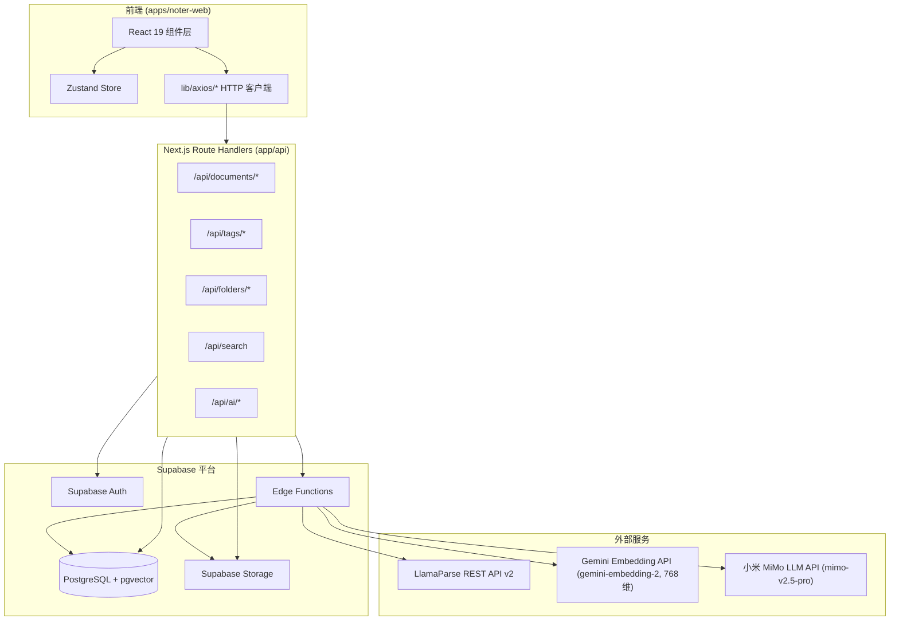
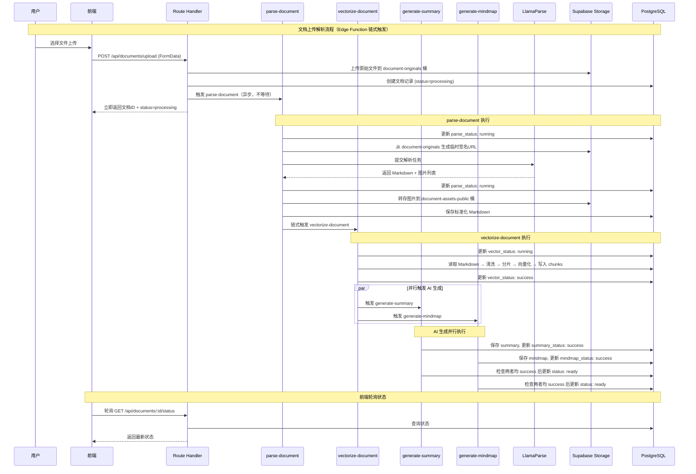
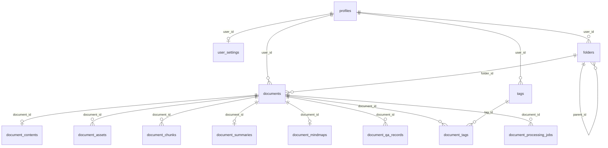
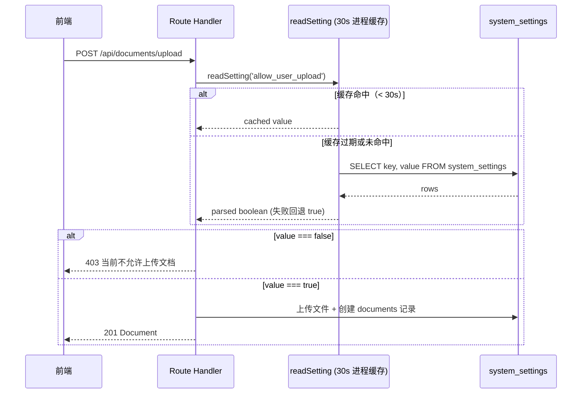
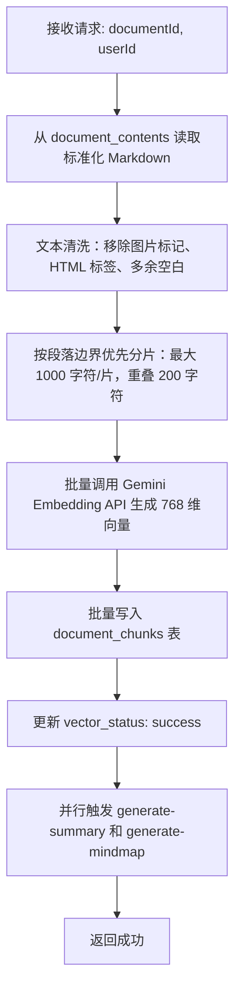
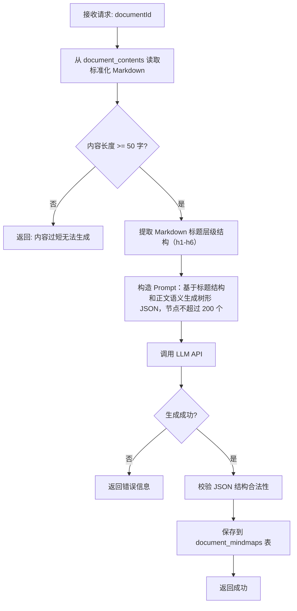
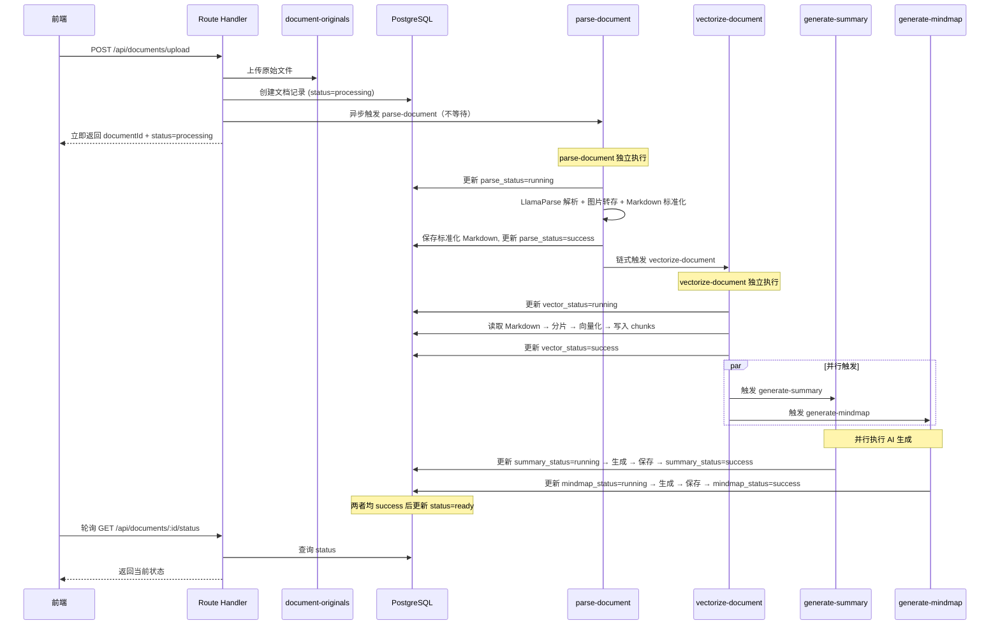
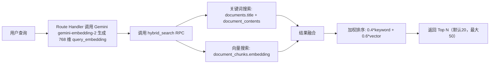

# Design Document — Noter 文档管理系统

## Overview

本设计文档描述 Noter 文档管理系统的技术架构，涵盖文档上传解析、列表展示、混合搜索、标签管理、文档详情渲染、AI 问答/总结/思维导图、下载服务以及数据安全等核心模块。

系统基于 Next.js 16 App Router + React 19 + Supabase 全栈架构，前端通过 `@noter/api` 封装的 axios 客户端与 Next.js Route Handler 通信，后端重计算任务（文档解析、向量化、AI 生成）由 Supabase Edge Function (Deno) 异步处理。

### 设计原则

- **低耦合高内聚**：每个模块（types / lib/axios / stores / components / app/api）职责清晰
- **前端不直接调用外部 AI 服务**：所有 AI/解析操作通过 Edge Function 代理
- **RLS 优先**：数据隔离在数据库层强制执行，API 层做二次校验
- **渐进式加载**：骨架屏 + 流式输出提升用户体验

---

## Architecture

### 系统架构图



### 数据流概览



---

## Components and Interfaces

### 前端组件层级

```
components/
├── documents/                        # 文档列表页组件
│   ├── DocumentsHeader.tsx           # 顶部 sticky 胶囊导航：logo / 品牌 / SearchBar / 上传 / UserAvatarDropdown
│   ├── DocumentGrid.tsx
│   ├── DocumentCard.tsx              # 电影海报比例 (aspect-[2/3], max-w-[160px])，整张以封面为背景，底部毛玻璃面板
│   ├── DocumentCardMenu.tsx          # 卡片左上角三点菜单：更换背景图 / 恢复默认封面 / 删除文档
│   ├── PaginationController.tsx      # ⚠️ 已下线，被 LoadMoreController 替代（保留文件以便回滚）
│   ├── LoadMoreController.tsx        # 「X / Y documents」+「加载更多」+「已经到底啦」终态（也可直接在 page.tsx 中实现）
│   ├── SearchBar.tsx                 # 顶部胶囊内的全站搜索；防抖 300ms / 超时 10s / 命中类型 chip / 客户端高亮兜底
│   ├── FilterSortBar.tsx             # Notion 风格筛选排序栏
│   ├── FolderSidebar.tsx             # 左侧文件夹导航；支持系统文件夹只读样式
│   ├── UserAvatarDropdown.tsx        # 用户头像下拉：用户名 + 邮箱 / 编辑资料 / 登出
│   ├── UploadDialog.tsx              # 多文件上传队列 + 「保存到」文件夹选择
│   ├── UploadProgress.tsx
│   └── EmptyState.tsx
├── document-detail/                  # 文档详情页组件
│   ├── templates/                    # 模板系统
│   │   ├── core/
│   │   │   ├── BaseMarkdownRenderer.tsx
│   │   │   ├── TemplateHost.tsx
│   │   │   └── template-registry.ts
│   │   ├── default/                  # 现代简约模板
│   │   ├── academic/                 # 学术论文模板
│   │   ├── compact/                  # 紧凑模板
│   │   └── card/                     # 卡片模板
│   ├── DocumentDetailHeader.tsx      # 顶部 sticky 居中胶囊：返回 / 面包屑 / 模板切换 / 下载 / AI 开关
│   ├── TemplateSwitcher.tsx
│   ├── DocumentOutline.tsx           # shadcn ScrollArea, sticky top-28, h1-h6 全层级
│   ├── DocumentMeta.tsx              # 右侧元数据面板：创建时间 / 文件大小 / 语言 / 字数 / 标签管理区
│   ├── DocumentTagPicker.tsx         # 内联标签选择器：搜索 / 勾选 /「创建并添加 X」
│   ├── AIChatPanel.tsx               # AI 问答面板容器（normal / tall / wide 尺寸切换；Skill 实现属于 noter-agent spec）
│   ├── ChatMessage.tsx
│   ├── MindmapViewer.tsx             # 基于 @xyflow/react 的左→右树形布局
│   ├── SummaryCard.tsx
│   └── DownloadButton.tsx            # 仅需 title prop, window.print() 方案

utils/feature/search/
└── scrollAndHighlight.ts             # buildMatchAnchor / findFirstMatchInDom / scrollAndFlash 工具函数

types/
├── template.ts                       # TemplateConfig 接口, TemplateType 类型

app/(main)/documents/
├── page.tsx                          # 文档管理主页面（左侧文件夹导航 | 中间主内容 | 右侧标签筛选；顶部 DocumentsHeader）
└── [id]/
    └── page.tsx                      # 文档详情页（三栏：大纲 | 正文 | 元数据 + AI 面板；顶部 DocumentDetailHeader）

app/(main)/profile/
├── page.tsx                          # 账号设置页：左侧 Tab 导航 + 右侧内容区 + 顶部「返回」
├── ProfileSection.tsx                # 个人资料 Tab
├── PasswordSection.tsx               # 修改密码 Tab
└── EmailSection.tsx                  # 修改邮箱 Tab
```

> **下线说明**：`PaginationController.tsx`（页码翻页）已被「加载更多」式分页取代；左侧旧版用户操作面板（User_Panel）相关组件已下线，账号入口统一收敛到顶部 `UserAvatarDropdown`。

### 关键容器组件

#### DocumentsHeader（文档列表顶部胶囊）

- 位置：`/documents` 页面顶部 sticky，左右贴齐内容区。
- 结构：左侧 `Image src="/logo.svg"` + brand `noter`；右侧依次 `SearchBar`（容器宽度 `w-72`）、上传按钮（`<Upload>` icon + 「上传文档」文案，触发 `onUpload` 回调）、`UserAvatarDropdown`。
- 与详情页的 `DocumentDetailHeader` 风格一致（同样的 sticky / 半透明 / 胶囊语言），共同构成「上下两段统一头」。

#### DocumentDetailHeader（文档详情页顶部胶囊）

- 位置：详情页正文之上，`sticky top-3 z-30`，使用 `bg-background/80 backdrop-blur-md` 半透明 + 模糊；高度固定 `h-12`，宽度 `max-w-5xl` 居中。
- 结构（左→右）：
  1. 圆形返回按钮：点击后 `router.push('/documents')`。
  2. 面包屑 `<nav aria-label="面包屑">`：`用户名 → folderTrail[0] → … → folderTrail[n] → 文档标题`。
     - 用户名锚点：`<Link href='/documents'>`，`max-w-[140px] truncate`，缺省取 `user.email` 前缀。
     - 文件夹链：从当前 `document.folderId` 沿 `parentId` 向上回溯，最多 16 层防循环（实现见 `buildFolderTrail`）；每层 `<Link href={'/documents?folderId=' + id}>`，`max-w-[160px] truncate`。
     - 文档标题：剩余宽度内 `truncate`，`title={document.title}` 提供 hover tooltip。
  3. 右侧操作组：`TemplateSwitcher` / `DownloadButton iconOnly` / AI 问答 toggle。
     - AI toggle 使用 `<Button variant={panelVisible ? 'default' : 'ghost'} aria-pressed={panelVisible}>`，与 `AIChatPanel.visible` 双向绑定。

#### UserAvatarDropdown（用户头像下拉）

- 触发器：`<Avatar size-9>`，`AvatarImage src={user.avatarUrl}`；缺省渲染 `AvatarFallback` 取 `(user.username ?? user.email)[0]` 大写。
- 下拉内容：
  - `DropdownMenuLabel`：双行展示 `user.username` 与 `user.email`，均 `truncate`。
  - `DropdownMenuItem` 「编辑资料」→ `router.push('/profile')`。
  - `DropdownMenuItem` 「登出」→ `userApi.signout()` → `clearUser()` → `router.push('/signin')`；`signout` 异常时仍执行 `clearUser` + 跳转，避免用户停在受保护页面。
- 不再提供「注销账号」入口（账号注销能力当前不在本 spec 范围）。

#### DocumentCard 与 DocumentCardMenu（电影海报式文档卡片）

- `DocumentCard` 容器使用 `<Link href={'/documents/' + id}>` 包裹整张卡片，`Card` 上加 `aspect-[2/3] max-w-[160px] overflow-hidden`。
- 背景：绝对定位的 `<div style={{ backgroundImage: 'url(' + cover + ')' }} bg-cover bg-center>`；`cover = document.coverUrl ?? pickDefaultCover(document.id)`。
  - 默认封面 5 张，资源放在 `apps/noter-web/public/covers/{blue,green,pink,puper,yellow}.svg`。
  - `pickDefaultCover(id)` 简单哈希：按字符 ASCII 累加（`hash = (hash * 31 + code) | 0`）后 `Math.abs(hash) % 5` 选取，保证同文档每次刷新拿到同一张默认封面。
- 底部毛玻璃面板：`backdrop-blur-md backdrop-saturate-150` + 顶部 `mask-image: linear-gradient(to top, black 70%, transparent 100%)` 实现羽化过渡，叠加显示：
  - 文档标题：`truncate(title, 50)`，`line-clamp-2`。
  - 标签：最多展示前 3 个 chip（`Badge variant='secondary'`），超出部分以 `+N` 文本提示。
- `DocumentCardMenu` 渲染在卡片左上角 `absolute top-1.5 left-1.5 z-10`，使用 `DropdownMenu`：
  - 「更换背景图」：触发隐藏 `<input type="file" accept="image/jpeg,image/png,image/webp,image/gif">`；客户端先校验 `type ∈ ALLOWED_TYPES` 与 `size ≤ 5MB`，调用 `documentApi.uploadCover(documentId, file)` 上传，`useDocumentStore.uploadCover` 同步更新本地 `coverUrl`。
  - 「恢复默认封面」：仅在 `hasCustomCover === true` 时渲染，调用 `documentApi.resetCover(documentId)`，删除 storage 中已存在的旧文件并把 `coverUrl` 置空。
  - 「删除文档」：弹 `AlertDialog` 二次确认；确认后由 `useDocumentStore.deleteDocument` 乐观更新（先从列表移除并将 `total - 1`），调用 `documentApi.delete` 失败则回滚。

#### FolderSidebar 与系统文件夹只读语义

- `GET /api/folders` 一次性返回用户私有文件夹与系统文件夹（`isSystemFolder=true`）；前端按返回顺序渲染（系统文件夹由后端置顶）。
- 系统文件夹禁止重命名 / 删除（前端不显示对应菜单项），上传 Dialog 在文件夹下拉中过滤掉系统文件夹。
- `documentCount` 由后端按文件夹来源分别统计：用户私有文件夹按 `user_id=auth.uid()` 统计，系统文件夹按 `document_scope='public'` 统计。

#### LoadMoreController（「加载更多」分页）

- 位置：文档卡片网格底部。当 `hasMore === true` 时渲染按钮 + `X / Y documents` 计数；`hasMore === false` 且至少加载过一页时渲染「已经到底啦」终态文案。
- 行为：
  - 点击「加载更多」→ `useDocumentStore.loadMore()`：把 `page + 1` 的请求结果 append 到 `documents` 末尾，并按 `page * pageSize >= total` 维护 `hasMore`。
  - `fetchDocuments()`（含 reset / 排序变化 / 筛选变化 / 标签变化）始终重置 `page=1` 并重置 `documents`。
  - `loadingMore` 控制按钮 spinner 与禁用态，避免重复点击。
- pageSize 默认 10，本期不暴露每页条数选择控件。

#### SearchBar（混合搜索体验）

- 输入约束：`maxLength=200`；输入 300ms 防抖触发 `searchApi.search`；超时 10s 由 axios 配置控制。
- 结果下拉：最多 50 条，按 `score` 降序兜底排序；每条结果包含：
  - `<FileText>` 图标 + 文档标题（truncate）；
  - 命中类型 chip：`keyword`（蓝, `<Type>` icon）/ `vector`（紫, `<Sparkles>` icon）/ `hybrid`（绿, `<Layers>` icon）；
  - 命中片段（`HighlightedSnippet`）：服务端关键词命中保留 `<mark>` 直接渲染，向量命中走客户端 token 高亮兜底；统一 `stripMarkdown` 后再截断（`SNIPPET_MAX_LENGTH = 220`），避免下拉被超长正文撑开。
- 错误态：超时 / 服务端失败时下拉展示「重试」按钮，重新调用 `searchApi.search`。
- 点击命中结果：`router.push('/documents/{id}?match={anchor}&q={query}')`，`anchor = buildMatchAnchor(rawSnippet)`（首个 `<mark>` 内文本剥离 markdown 后取前 60 字符）。

#### 文档详情页的 match / q 处理

- 详情页 `useEffect` 监听 `searchParams.match` 与 `searchParams.q`：
  - `mainRef` 指向正文容器；待 `loading=false` 后用 `findFirstMatchInDom(mainRef.current, phrase)` 在 DOM 中查找首个匹配文本（按候选顺序：`match` → `q`）。
  - 命中节点调用 `scrollAndFlash(target, 120)`：平滑滚动到 `top - 120px`，对目标元素做两次黄色背景闪烁（`rgba(250, 204, 21, 0.45)` + 阴影），完成后还原内联样式。
  - 处理完成后 `router.replace` 清除 `match` / `q` query，避免返回 / 刷新时重复触发。
- 工具函数集中在 `apps/noter-web/utils/feature/search/scrollAndHighlight.ts`：
  - `findFirstMatchInDom(root: HTMLElement, phrase: string): HTMLElement | null`：用 `TreeWalker` 把文本节点拼成扁平字符串后 `indexOf`，跨多个 inline 节点的命中也能落到最近块级容器。
  - `scrollAndFlash(target: HTMLElement, offsetPx?: number): void`：保存 / 恢复 `backgroundColor` / `boxShadow` / `transition` / `borderRadius` 内联样式，闪烁两次（apply→clear→apply→clear→restore）。
  - `buildMatchAnchor(rawSnippet: string): string`：优先取首个 `<mark>` 内文本，剥离 markdown 与 HTML 标签后取前 60 字符。

#### DocumentMeta 与 DocumentTagPicker（文档详情页内联标签管理）

- `DocumentMeta` 在右侧元数据面板渲染：创建时间 / 文件大小 / 语言 / 字数 + 标签管理区。
- 标签管理区：
  - 已挂载标签：每个 `Badge` 自带 X 按钮，点击调用 `useDocumentDetailStore.removeTagFromDocument(tagId)`；store 内做乐观更新 + 回滚。
  - 「添加标签」入口 `DocumentTagPicker`：`Popover` + `Input`（`maxLength=20`）+ `ScrollArea`：
    - 列表展示 `useTagStore.tags`，已挂载标签置为 `disabled` + `<Check>` 标记。
    - 输入框关键词大小写不敏感过滤；`trimmed.length ∈ [1, 20]` 且不与现有标签同名时，列表底部展示「创建并添加 X」选项。
    - 选择已有标签 → `addTagToDocument(tag)` 乐观追加并调 `POST /api/documents/[id]/tags`；失败回滚。
    - 「创建并添加 X」→ 先 `useTagStore.createTag(trimmed)`（自动刷新全局 tags），再从最新 tags 中找到新建标签调 `addTagToDocument`。

#### UploadDialog（多文件上传与文件夹选择）

- 队列模型：组件内部维护 `QueueItem[]`，按 `${file.name}__${file.size}` 去重；校验失败的文件汇总到一条 `validationError`，校验通过的进入待上传队列。
- 单文件场景：仍走原有 `documentApi.upload` + `UploadProgress`（轮询 `parseStatus / summaryStatus / mindmapStatus` 并展示阶段化进度），上传成功后立即 `onUploadComplete()` 触发列表 `reset()`。
- 多文件场景：顺序逐个调用 `documentApi.upload`；UI 以「正在上传 X / N」紧凑总进度条 + 当前文件名展示；全部完成后展示成功 / 失败汇总；只要至少有一个成功就触发一次 `onUploadComplete()`。
- 上传过程中（无论单 / 多文件）禁止关闭 Dialog，避免请求被打断。
- 「保存到」：`Select` 列出 `useFolderStore.folders` 中**用户私有**文件夹（系统文件夹被过滤）；未选择时 `folder_id=null`，文档落到「全部文档」。
- 文件类型 / 大小校验复用 `utils/feature/documents/schemas.ts` 中的 `ALLOWED_EXTENSIONS` 与 `MAX_FILE_SIZE`（PDF / DOCX / PPTX / TXT / MD，≤ 50MB）。

#### AIChatPanel 容器（仅描述文档详情页中的容器与布局影响）

- 本 spec 不展开 Skill / SSE 协议 / 结构化卡片 / `agent_skill_sessions` 表设计——这部分由 `noter-agent` spec 维护。
- 在文档详情页中，`AIChatPanel` 只承担**容器**职责：
  - 头部按钮：「向上拉长」（切 `tall`）/「两栏布局」（切 `wide`）/「关闭」；切换时不重置消息流（消息流由 `noter-agent` 的 `chatSessionStore` 维护）。
  - `panelSize ∈ {'normal', 'tall', 'wide'}`，`panelVisible: boolean`，由 `useDocumentDetailStore` 维护。
  - 关闭按钮触发 `togglePanel()`，store 内会强制把 `panelSize` 还原为 `normal`，避免下次打开仍停留在 tall / wide。
  - 详情页布局派生量：
    - `showOutline = !(panelVisible && panelSize === 'wide')`
    - `showMeta = panelVisible ? panelSize === 'normal' : true`
    - 右侧栏宽度：未开 AI = `w-72` (288px)；`normal` / `tall` = `w-[420px]`；`wide` = `w-[640px]`。

#### MindmapViewer（基于 React Flow 的思维导图）

- 库：`@xyflow/react`（>=12），样式入口 `import '@xyflow/react/dist/style.css'`。
- 数据源：`document_mindmaps.mindmap_json` 仍为 `MindmapNode` 树（`{ id, label, children }`）；前端用 `convertToFlowElements(root)` 递归算出 React Flow 的 `Node[]` 与 `Edge[]`。
- 布局参数：
  - `NODE_WIDTH = 180`、`NODE_HEIGHT = 40`、`HORIZONTAL_GAP = 60`、`VERTICAL_GAP = 30`；
  - 第一遍遍历计算每个子树的高度（`getSubtreeHeight`），第二遍按子树高度居中布局（左→右）；
  - 边类型 `smoothstep`，边 id 为 `${node.id}-${child.id}`。
- React Flow 配置：`fitView`、`fitViewOptions={{ padding: 0.2 }}`、`minZoom={0.3}`、`maxZoom={2}`、`proOptions={{ hideAttribution: true }}`，搭配 `<Background />` + `<Controls />`。
- 状态机（与 `mindmapStatus` 联动）：
  - `pending / running` 且无数据 → 加载占位（`<Loader2>` + 「AI 正在生成思维导图」）。
  - 终态（`success` / `failed`）且无数据 → 「暂无思维导图」+「生成思维导图」按钮。
  - 有数据 → 渲染思维导图 + 头部「重新生成」按钮（`running` 时禁用并显示 spinner）。
- `SummaryCard` 使用同一套 `summaryStatus` 状态机渲染加载占位 / 空态 /「重新生成」按钮。

### API 模块接口

#### 前端 HTTP 客户端 (`lib/axios/`)

```typescript
// lib/axios/documents.ts - 扩展现有模块
export const documentApi = {
  upload: (formData: FormData) => http.post<Document>('api/documents/upload', formData),
  list: (params: ListParams) => http.get<PaginatedResult<Document>>('api/documents', { ...params }),
  getById: (id: string) => http.get<Document>(`api/documents/${id}`),
  delete: (id: string) => http.delete<void>(`api/documents/${id}`),
  getStatus: (id: string) => http.get<DocumentStatus>(`api/documents/${id}/status`),
  /** 上传 / 更换文档封面，返回 `{ coverUrl }`（带 `?t=Date.now()` 时间戳便于浏览器刷新缓存） */
  uploadCover: (id: string, file: File) => http.post<{ coverUrl: string }>(`api/documents/${id}/cover`, formData),
  /** 删除自定义封面，恢复默认 */
  resetCover: (id: string) => http.delete<void>(`api/documents/${id}/cover`),
}

// lib/axios/folders.ts - 新增模块
export const folderApi = {
  list: () => http.get<Folder[]>('api/folders'),
  create: (data: CreateFolderInput) => http.post<Folder>('api/folders', data),
  update: (id: string, data: UpdateFolderInput) => http.patch<Folder>(`api/folders/${id}`, data),
  delete: (id: string) => http.delete<void>(`api/folders/${id}`),
}

// lib/axios/tags.ts - 新增模块
export const tagApi = {
  list: () => http.get<Tag[]>('api/tags'),
  create: (data: CreateTagInput) => http.post<Tag>('api/tags', data),
  delete: (id: string) => http.delete<void>(`api/tags/${id}`),
  addToDocument: (documentId: string, tagId: string) => http.post<void>(`api/documents/${documentId}/tags`, { tagId }),
  /** 移除文档标签；服务端在该标签已无任何文档使用时会级联软删除 tag 实体并返回 `tagDeleted: true` */
  removeFromDocument: (documentId: string, tagId: string) => http.delete<{ tagDeleted: boolean }>(`api/documents/${documentId}/tags/${tagId}`),
}

// lib/axios/search.ts - 扩展现有模块
export const searchApi = {
  search: (params: SearchParams) => http.get<SearchResult[]>('api/search', { ...params }, { timeout: 10_000 }),
}

// lib/axios/ai.ts - 扩展现有模块
export const aiApi = {
  regenerateSummary: (documentId: string) => http.post<{ success: boolean; message?: string }>('api/ai/regenerate-summary', { documentId }),
  regenerateMindmap: (documentId: string) => http.post<{ success: boolean; message?: string }>('api/ai/regenerate-mindmap', { documentId }),
  // chat / sessions 相关接口属于 noter-agent spec 范围
}
```

#### Route Handler 端点设计

| 方法 | 路径 | 描述 | Zod Schema |
|------|------|------|------------|
| GET | `/api/documents` | 文档列表（分页 + 标签筛选 + 文件夹筛选 + 状态/收藏/扩展名/创建时间筛选 + 多字段排序）。`public_documents_visible=true` 时合并查询 `user_id=auth.uid() OR document_scope='public'`，`false` 时退化为仅查询 `user_id=auth.uid()` | `listDocumentsSchema` |
| POST | `/api/documents/upload` | 上传文档（FormData：`file` 必填、`folderId` 可选）。`allow_user_upload=false` 时直接返回 403 | `uploadDocumentSchema` |
| GET | `/api/documents/[id]` | 文档详情：合并私有 ∪ 公共文档（同 list 规则）。响应额外携带 `documentScope: 'private' \| 'public'`，便于前端按只读语义渲染公共文档 | `documentIdSchema` |
| DELETE | `/api/documents/[id]` | 软删除文档。`allow_user_delete_own=false` 时返回 403；`document_scope='public'` 由 RLS 拒绝 | `documentIdSchema` |
| GET | `/api/documents/[id]/status` | 查询解析与 AI 状态：返回 `{ status, parseStatus, vectorStatus, summaryStatus, mindmapStatus }` | `documentIdSchema` |
| POST | `/api/documents/[id]/cover` | 上传 / 更换文档封面（FormData `file`，校验 `type ∈ {jpeg,png,webp,gif}` 且 `size ≤ 5MB`），写入 `userResources/{userId}/{documentId}.{ext}`（upsert: true），返回 `{ coverUrl }`（URL 末尾附 `?t=Date.now()`） | `documentIdSchema` |
| DELETE | `/api/documents/[id]/cover` | 清空 `documents.cover_url` 并尝试从 storage 删除旧文件（容错忽略失败） | `documentIdSchema` |
| POST | `/api/documents/[id]/tags` | 为文档添加标签 | `addTagSchema` |
| DELETE | `/api/documents/[id]/tags/[tagId]` | 解除文档与标签的关联（`document_tags` 真删除）；若该标签解除后已无任何文档引用则级联软删除 `tags.deleted=1`，响应中带 `tagDeleted: boolean` | params 校验 |
| GET | `/api/folders` | 合并返回 `user_id=auth.uid() OR is_system_folder=true`；系统文件夹置顶；私有文件夹按用户私有文档计数 `documentCount`，系统文件夹按 `document_scope='public'` 计数；响应中带 `isSystemFolder: boolean` | 无 body |
| POST | `/api/folders` | 创建文件夹（仅创建用户私有文件夹） | `createFolderSchema` |
| PATCH | `/api/folders/[id]` | 更新文件夹（重命名 / 移动）。业务层先 query `is_system_folder`，命中时显式返回 403「系统文件夹不可修改」，RLS 作为兜底 | `updateFolderSchema` |
| DELETE | `/api/folders/[id]` | 删除文件夹。同 PATCH 显式拒绝系统文件夹；删除后将该文件夹下所有文档的 `folder_id` 置为 null | `folderIdSchema` |
| GET | `/api/tags` | 获取用户标签列表 | 无 body |
| POST | `/api/tags` | 创建标签 | `createTagSchema` |
| DELETE | `/api/tags/[id]` | 删除标签 | `tagIdSchema` |
| GET | `/api/search` | 混合搜索（向量 + 关键词），最多返回 50 条，含 `<mark>` 高亮的 `matchedContent` | `searchSchema` |
| POST | `/api/ai/regenerate-summary` | 触发 generate-summary Edge Function 重新生成总结，独立于上传链路 | `regenerateSchema` |
| POST | `/api/ai/regenerate-mindmap` | 触发 generate-mindmap Edge Function 重新生成思维导图，独立于上传链路 | `regenerateSchema` |

> AI 对话 / Skill 相关端点（`/api/ai/chat/stream`、`/api/ai/sessions/*`、SSE 协议、agent_skill_sessions 表读写等）由 `noter-agent` spec 单独定义，不在本表范围内。

### Zustand Store 设计

```typescript
// stores/document.ts —— 文档列表 store
interface DocumentFilters {
  status: 'ready' | 'processing' | 'failed' | null
  favoriteOnly: boolean
  fileExts: string[]                   // 'pdf' | 'docx' | 'pptx' | 'txt' | 'md'
  createdWithinDays: number | null     // 7 / 30 / 90，null = 不限
}

interface DocumentState {
  documents: Document[]
  total: number
  page: number
  pageSize: number                     // 默认 10
  loading: boolean
  loadingMore: boolean
  error: string | null
  selectedTags: string[]
  hasMore: boolean
  // 排序
  orderBy: 'created_at' | 'updated_at' | 'title' | 'file_size' | 'word_count'
  order: 'asc' | 'desc'
  // 筛选
  filters: DocumentFilters
  setSelectedTags: (tags: string[]) => void
  setSort: (orderBy: SortField, order: SortOrder) => void
  setFilters: (patch: Partial<DocumentFilters>) => void
  resetFilters: () => void
  fetchDocuments: () => Promise<void>  // 重置 documents 列表 + 拉取第 1 页
  loadMore: () => Promise<void>        // 把下一页结果 append 到 documents 末尾
  reset: () => void                    // 设置 page=1 + 清空列表 + 触发 fetchDocuments
  deleteDocument: (id: string) => Promise<void>  // 乐观更新 + 失败回滚
  uploadCover: (id: string, file: File) => Promise<void>
  resetCover: (id: string) => Promise<void>
}

// stores/folders.ts
interface FolderState {
  folders: Folder[]                    // 包含用户私有文件夹与系统文件夹（isSystemFolder=true）
  selectedFolderId: string | null      // null = 全部文档
  loading: boolean
  fetchFolders: () => Promise<void>
  createFolder: (name: string, parentId?: string) => Promise<void>
  renameFolder: (id: string, name: string) => Promise<void>
  deleteFolder: (id: string) => Promise<void>
  setSelectedFolder: (id: string | null) => void
}

// stores/tags.ts
interface TagState {
  tags: Tag[]
  loading: boolean
  fetchTags: () => Promise<void>
  createTag: (name: string) => Promise<void>
  deleteTag: (id: string) => Promise<void>
}

// stores/documentDetail.ts —— 文档详情页 store
type AIPanelSize = 'normal' | 'tall' | 'wide'

interface DocumentDetailState {
  document: Document | null
  loading: boolean
  error: string | null
  template: TemplateType
  panelVisible: boolean                // AI 面板显隐（容器层）
  panelSize: AIPanelSize               // AI 面板尺寸；togglePanel() 关闭时强制回到 normal
  summaryStatus: ProcessingStatus | null
  mindmapStatus: ProcessingStatus | null
  pollingTimer: ReturnType<typeof setInterval> | null
  setTemplate: (template: TemplateType) => void
  togglePanel: () => void
  setPanelSize: (size: AIPanelSize) => void
  fetchDocument: (id: string) => Promise<void>      // 拉取详情后，按需启动状态轮询
  stopPolling: () => void                            // 离开页面或终态时清理 timer
  regenerateSummary: () => Promise<void>             // 触发 + 轮询直到 success / failed / 超时
  regenerateMindmap: () => Promise<void>             // 触发 + 轮询直到 success / failed / 超时
  addTagToDocument: (tag: Tag) => Promise<void>      // 乐观追加 + 失败回滚 + 同步 useTagStore.fetchTags
  removeTagFromDocument: (tagId: string) => Promise<void> // 乐观移除 + tagDeleted=true 时同步刷新筛选面板并从 selectedTags 中剔除
}
```

**轮询机制约束（与需求 19 / 20 对齐）**：

- 轮询间隔 `POLL_INTERVAL = 3_000` ms。
- 单次轮询最多 `MAX_POLL_ATTEMPTS = 100` 次（约 5 分钟）；超过上限把仍在进行中（`pending` / `running`）的状态强制标记为 `failed` 并停止轮询。
- 单次 `getStatus` 调用失败不停止轮询（下次再试）；累计超过上限才兜底失败。
- 当 `summaryStatus` 或 `mindmapStatus` 由进行中转为 `success` 时，立即重新 `GET /api/documents/[id]` 拉取详情刷新 `SummaryCard` / `MindmapViewer`。
- `fetchDocument` 在切换文档时先调用 `stopPolling` 清掉旧 timer；详情页 `useEffect` 卸载时也调用 `stopPolling` 避免后台空转。

---

## Data Models

### 数据库表设计

> 以下为 Supabase 中已建好的实际表结构，设计文档以此为准。

#### profiles — 用户资料表

| 字段 | 类型 | 说明 |
|------|------|------|
| id | UUID PK | 用户ID，对应 auth.users.id |
| username | text | 用户名 |
| email | text (unique) | 用户邮箱 |
| avatar_url | text | 用户头像地址 |
| role | text (default 'user') | 用户角色 |
| nike_name | text | 用户昵称 |
| provider | text | 登录方式（email/github） |
| deleted | smallint (default 0) | 是否已注销 |
| not_active | smallint (default 0) | 是否禁用 |
| created_at / updated_at | timestamptz | 时间戳 |

#### user_settings — 用户设置表

| 字段 | 类型 | 说明 |
|------|------|------|
| id | UUID PK | 设置记录ID |
| user_id | UUID (unique, FK→profiles) | 所属用户 |
| default_reader_template | text (default 'default') | 默认阅读模板 |
| deleted | int (0/1) | 软删除 |
| created_at / updated_at | timestamptz | 时间戳 |

#### documents — 文档主表

| 字段 | 类型 | 说明 |
|------|------|------|
| id | UUID PK | 文档ID |
| user_id | UUID (FK→profiles) | 所属用户 |
| folder_id | UUID (nullable, FK→folders) | 所属文件夹，null 表示未分类（显示在"全部文档"中） |
| title | text | 文档标题 |
| original_filename | text | 原始文件名 |
| file_ext | text | 文件后缀（pdf/docx/md 等） |
| mime_type | text | MIME 类型 |
| file_size | bigint | 文件大小（字节） |
| original_bucket | text (default 'document-originals') | 原始文件存储桶 |
| original_storage_path | text | 原始文件存储路径 |
| status | text (default 'processing') | 整体状态：processing/ready/failed |
| parse_status | text (default 'pending') | 解析状态：pending/running/success/failed |
| vector_status | text (default 'pending') | 向量化状态 |
| summary_status | text (default 'pending') | AI 总结状态 |
| mindmap_status | text (default 'pending') | 思维导图状态 |
| short_description | text | 文档摘要片段（卡片展示用） |
| word_count | int (default 0) | 文档字数 |
| page_count | int | 文档页数 |
| language | text | 文档语言 |
| is_favorite | int (0/1) | 是否收藏 |
| is_archived | int (0/1) | 是否归档 |
| cover_url | text (nullable) | 文档封面图 URL，存储在 `userResources/{user_id}/{document_id}.{ext}`；为 null 时由前端基于文档 ID 哈希在 5 张内置默认封面中稳定选取 |
| document_scope | text (default 'private') | 文档范围：'private'（私有）/ 'public'（公共，由系统账号持有，全体登录用户只读可见） |
| deleted | int (0/1) | 软删除 |
| deleted_at | timestamptz | 删除时间 |
| created_at / updated_at | timestamptz | 时间戳 |

#### folders — 文件夹表

| 字段 | 类型 | 说明 |
|------|------|------|
| id | UUID PK | 文件夹ID |
| user_id | UUID (FK→profiles) | 所属用户 |
| name | text | 文件夹名称 |
| parent_id | UUID (nullable, FK→folders) | 父文件夹ID，null 表示顶层 |
| icon | text | 文件夹图标 |
| sort_order | int | 排序序号 |
| is_system_folder | boolean (default false) | 系统文件夹标记。`true` 时由 noter-admin 平台维护、挂在系统账号下，对所有 authenticated 用户只读可见且置顶；普通用户业务接口与 RLS 双重拒绝 UPDATE / DELETE |
| deleted | int (0/1) | 软删除 |
| created_at / updated_at | timestamptz | 时间戳 |

#### document_contents — 文档内容表

| 字段 | 类型 | 说明 |
|------|------|------|
| id | UUID PK | 内容ID |
| user_id | UUID (FK→profiles) | 所属用户 |
| document_id | UUID (unique, FK→documents) | 对应文档 |
| markdown_content | text | 标准化 Markdown 正文 |
| outline | jsonb | 文档大纲（标题层级 JSON） |
| metadata | jsonb | 解析元数据 |
| deleted | int (0/1) | 软删除 |
| created_at / updated_at | timestamptz | 时间戳 |

#### document_assets — 文档资源表

| 字段 | 类型 | 说明 |
|------|------|------|
| id | UUID PK | 资源ID |
| user_id | UUID (FK→profiles) | 所属用户 |
| document_id | UUID (FK→documents) | 所属文档 |
| bucket | text (default 'document-assets-public') | 存储桶 |
| storage_path | text | Storage 路径 |
| public_url | text | 公开访问 URL |
| original_url | text | LlamaParse 返回的原始 URL |
| filename | text | 文件名 |
| mime_type | text | MIME 类型 |
| file_size | bigint | 文件大小 |
| width / height | int | 图片尺寸 |
| sort_order | int (default 0) | 排序序号 |
| deleted | int (0/1) | 软删除 |
| created_at | timestamptz | 创建时间 |

#### tags — 标签表

| 字段 | 类型 | 说明 |
|------|------|------|
| id | UUID PK | 标签ID |
| user_id | UUID (FK→profiles) | 所属用户 |
| name | text | 标签名称 |
| color | text | 标签颜色 |
| description | text | 标签描述 |
| deleted | int (0/1) | 软删除 |
| created_at / updated_at | timestamptz | 时间戳 |

#### document_tags — 文档标签关联表

| 字段 | 类型 | 说明 |
|------|------|------|
| id | UUID PK | 关联ID |
| user_id | UUID (FK→profiles) | 所属用户 |
| document_id | UUID (FK→documents) | 文档ID |
| tag_id | UUID (FK→tags) | 标签ID |
| deleted | int (0/1) | 软删除 |
| created_at | timestamptz | 创建时间 |

#### document_chunks — 文档分片表

| 字段 | 类型 | 说明 |
|------|------|------|
| id | UUID PK | 分片ID |
| user_id | UUID (FK→profiles) | 所属用户 |
| document_id | UUID (FK→documents) | 所属文档 |
| chunk_index | int | 分片序号 |
| content | text | 分片文本 |
| heading_path | jsonb | 标题层级路径 |
| token_count | int | token 数量 |
| char_start / char_end | int | 在原始 Markdown 中的字符位置 |
| embedding | vector(768) | 向量数据（768 维，Gemini gemini-embedding-2） |
| metadata | jsonb | 额外元数据 |
| deleted | int (0/1) | 软删除 |
| created_at | timestamptz | 创建时间 |

#### document_summaries — AI 总结表

| 字段 | 类型 | 说明 |
|------|------|------|
| id | UUID PK | 总结ID |
| user_id | UUID (FK→profiles) | 所属用户 |
| document_id | UUID (unique, FK→documents) | 所属文档 |
| summary | text | 文档摘要正文 |
| key_points | jsonb | 关键要点 |
| todos | jsonb | 待办事项 |
| keywords | text[] | 关键词 |
| suitable_scenarios | jsonb | 适用场景 |
| model_name | text | 使用的模型 |
| deleted | int (0/1) | 软删除 |
| generated_at | timestamptz | 生成时间 |
| created_at / updated_at | timestamptz | 时间戳 |

#### document_mindmaps — AI 思维导图表

| 字段 | 类型 | 说明 |
|------|------|------|
| id | UUID PK | 思维导图ID |
| user_id | UUID (FK→profiles) | 所属用户 |
| document_id | UUID (unique, FK→documents) | 所属文档 |
| mindmap_json | jsonb | 思维导图结构化 JSON |
| markdown_outline | text | Markdown 大纲 |
| model_name | text | 使用的模型 |
| deleted | int (0/1) | 软删除 |
| generated_at | timestamptz | 生成时间 |
| created_at / updated_at | timestamptz | 时间戳 |

#### document_qa_records — 文档问答记录表（后续迭代实现接口逻辑）

| 字段 | 类型 | 说明 |
|------|------|------|
| id | UUID PK | 问答记录ID |
| user_id | UUID (FK→profiles) | 所属用户 |
| document_id | UUID (FK→documents) | 所属文档 |
| question | text | 用户问题 |
| answer | text | AI 回答 |
| retrieved_chunk_ids | uuid[] | 检索到的分片ID列表 |
| retrieval_context | jsonb | 检索上下文 |
| model_name | text | 使用的模型 |
| deleted | int (0/1) | 软删除 |
| created_at | timestamptz | 创建时间 |

#### document_processing_jobs — 文档处理任务表

| 字段 | 类型 | 说明 |
|------|------|------|
| id | UUID PK | 任务ID |
| user_id | UUID (FK→profiles) | 所属用户 |
| document_id | UUID (FK→documents) | 所属文档 |
| job_type | text | 任务类型：parse-document/vectorize-document/generate-summary/generate-mindmap |
| status | text (default 'pending') | 任务状态：pending/running/success/failed |
| input_payload | jsonb | 输入参数 |
| output_payload | jsonb | 输出结果 |
| error_message | text | 错误信息 |
| retry_count | int (default 0) | 重试次数 |
| deleted | int (0/1) | 软删除 |
| started_at / finished_at | timestamptz | 开始/完成时间 |
| created_at / updated_at | timestamptz | 时间戳 |

#### 表关系总览



> **设计特点**：
> - 所有表均启用 RLS
> - 所有表使用 `deleted` 字段实现软删除，不做物理删除
> - AI 总结和思维导图独立成表（document_summaries / document_mindmaps），与文档主表解耦
> - 文档内容（Markdown）独立存储在 document_contents 表，避免文档主表过大
> - document_processing_jobs 记录每个 Edge Function 的执行状态，便于重试和监控
> - **公共文档（`documents.document_scope='public'`）与系统文件夹（`folders.is_system_folder=true`）由 noter-admin 平台维护**：noter-web 仅以只读语义对外展示；UPDATE / DELETE 路径在业务层先 query 标记字段命中时直接返回 403，RLS 仅放开 SELECT 给 authenticated 全员作为兜底。

### RLS 策略

> 所有表均已启用 RLS（`rls_enabled: true`）。以下为各表的 RLS 策略设计：

| 表 | 策略 | 规则 |
|----|------|------|
| profiles | SELECT/UPDATE | `auth.uid() = id` |
| user_settings | SELECT/INSERT/UPDATE | `auth.uid() = user_id` |
| documents | SELECT | `auth.uid() = user_id OR document_scope = 'public'`（公共文档对全体登录用户只读可见） |
| documents | INSERT/UPDATE/DELETE | `auth.uid() = user_id`（公共文档仅由系统账号 / noter-admin 维护） |
| folders | SELECT | `auth.uid() = user_id OR is_system_folder = true`（系统文件夹对全体登录用户只读可见） |
| folders | INSERT/UPDATE/DELETE | `auth.uid() = user_id AND is_system_folder = false`（系统文件夹由 noter-admin 维护） |
| document_contents | SELECT/INSERT/UPDATE | `auth.uid() = user_id` |
| document_assets | SELECT/INSERT | `auth.uid() = user_id` |
| tags | SELECT/INSERT/UPDATE/DELETE | `auth.uid() = user_id` |
| document_tags | SELECT/INSERT/DELETE | `auth.uid() = user_id` |
| document_chunks | SELECT/INSERT/DELETE | `auth.uid() = user_id` |
| document_summaries | SELECT/INSERT/UPDATE | `auth.uid() = user_id` |
| document_mindmaps | SELECT/INSERT/UPDATE | `auth.uid() = user_id` |
| document_qa_records | SELECT/INSERT | `auth.uid() = user_id` |
| document_processing_jobs | SELECT/INSERT/UPDATE | `auth.uid() = user_id` |
| system_settings | SELECT | `authenticated`（全体登录用户可读，写入仅限 admin / service_role） |

> **应用层与 RLS 协同**：
> - `system_settings.public_documents_visible=false` 时，本 spec 在 Route Handler `GET /api/documents` / `GET /api/documents/[id]` 查询条件中**不再** OR 上 `document_scope='public'`，仅查 `user_id=auth.uid()`，即使 RLS 仍允许读取公共文档，应用层也不会拼出公共文档结果。该开关本质上是「应用层是否合并查询公共文档」。
> - `system_settings.allow_user_upload=false` / `allow_user_delete_own=false` 时由 Route Handler 入口直接返回 403；RLS 不再做二次门控。
> - 系统文件夹的 SELECT 由 RLS 放开给所有 authenticated 用户，但 UPDATE / DELETE 在 noter-web Route Handler `PATCH/DELETE /api/folders/[id]` 中先显式 query `is_system_folder` 命中时直接返回 403「系统文件夹不可修改 / 不可删除」，RLS 作为兜底再拒一次。

> **RLS 设计原则**：RLS 主要负责用户数据隔离 + 公共内容只读放开。`deleted=0` 的过滤在业务查询和 RPC 中处理，不在 RLS 策略中加入，避免影响后续恢复、清理和后台维护逻辑。

**Storage Policy：**

| Bucket | 读取 | 写入 |
|--------|------|------|
| `userResources` | 全员可读（用于头像 / 文档封面跨用户展示） | 用户仅能写入自身 `auth.uid() = user_id` 目录 |
| `document-originals` | 用户仅能读取自身 user_id 目录 | 用户仅能写入自身 user_id 目录 |
| `document-assets-public` | 公开读取（无需鉴权） | 仅 Edge Function（service_role）可写入 |

### Storage Bucket 设计

| Bucket | 访问级别 | 路径格式 | 用途 |
|--------|----------|----------|------|
| `userResources` | 公开读取 / 用户自身写入 | `{user_id}/avatar/{filename}`、`{user_id}/{document_id}.{ext}` | 用户头像与文档封面（封面文件名直接使用 `{document_id}.{ext}`，便于 upsert 覆盖） |
| `document-originals` | 私有 | `{user_id}/{document_id}` | 原始上传文件（PDF/DOCX/PPTX/TXT/MD），不含文件名以避免中文路径问题 |
| `document-assets-public` | 公开 | `{user_id}/{document_id}/{image_filename}` | 文档解析产生的图片资源 |

**设计说明：**

- **原始文件与图片资源分离**：原始文档存放于 `document-originals` 私有桶，受 RLS 和 Storage Policy 控制；解析产生的图片存放于 `document-assets-public` 公开桶，前端渲染 Markdown 时可直接通过公网 URL 访问图片，无需额外鉴权
- **`userResources` 桶承载用户头像与文档封面**：封面采用 `{user_id}/{document_id}.{ext}` 扁平路径，`POST /api/documents/[id]/cover` 使用 `upsert: true` 直接覆盖旧文件；`DELETE` 则尝试清理旧文件后再把 `documents.cover_url` 置空。封面 URL 末尾附 `?t=Date.now()` 时间戳，便于浏览器在替换封面后立即刷新缓存
- **权限控制重点**：系统的数据权限控制作用于原始文件、文档记录、Markdown 正文、标签、向量片段和 AI 结果；公开桶中的图片仅作为 Markdown 渲染的静态资源，不包含敏感信息
- **Storage Policy**：`document-originals` 桶设置 RLS 策略确保用户仅能读写自身 `user_id` 目录下的文件；`document-assets-public` 桶允许公开读取，写入仅限 Edge Function（service_role）；`userResources` 桶允许全员读取（用于跨用户展示头像 / 封面），写入仅限 `auth.uid() = user_id` 的目录

### TypeScript 类型定义

```typescript
// types/document.ts
export type DocumentStatus = 'processing' | 'ready' | 'failed'
export type ProcessingStatus = 'pending' | 'running' | 'success' | 'failed'

export interface Document {
  id: string
  userId: string
  folderId: string | null
  title: string
  originalFilename: string
  fileExt: string | null
  mimeType: string | null
  fileSize: number | null
  originalBucket: string
  originalStoragePath: string
  status: DocumentStatus
  parseStatus: ProcessingStatus
  vectorStatus: ProcessingStatus
  summaryStatus: ProcessingStatus
  mindmapStatus: ProcessingStatus
  shortDescription: string | null
  wordCount: number
  pageCount: number | null
  language: string | null
  isFavorite: number
  isArchived: number
  /** 文档封面图 URL；为 null 时由前端基于文档 ID 哈希在 5 张内置默认封面中稳定选取 */
  coverUrl: string | null
  /** 文档范围；GET /api/documents/[id] 详情接口额外返回此字段，便于前端按只读语义渲染公共文档 */
  documentScope?: 'private' | 'public'
  deleted: number
  tags: Tag[]
  createdAt: string
  updatedAt: string
}

export interface DocumentContent {
  id: string
  userId: string
  documentId: string
  markdownContent: string
  outline: OutlineNode[] | null
  metadata: Record<string, unknown> | null
}

export interface OutlineNode {
  id: string
  level: number
  title: string
  children: OutlineNode[]
}

export interface DocumentAsset {
  id: string
  documentId: string
  bucket: string
  storagePath: string
  publicUrl: string
  originalUrl: string | null
  filename: string | null
  mimeType: string | null
  fileSize: number | null
  width: number | null
  height: number | null
  sortOrder: number
}

export interface DocumentSummary {
  id: string
  documentId: string
  summary: string
  keyPoints: string[] | null
  todos: string[] | null
  keywords: string[] | null
  suitableScenarios: Record<string, unknown> | null
  modelName: string | null
  generatedAt: string
}

export interface DocumentMindmap {
  id: string
  documentId: string
  mindmapJson: MindmapNode
  markdownOutline: string | null
  modelName: string | null
  generatedAt: string
}

export interface MindmapNode {
  id: string
  label: string
  children: MindmapNode[]
}

export interface Tag {
  id: string
  name: string
  color: string | null
  description: string | null
  documentCount?: number
}

export interface DocumentProcessingJob {
  id: string
  documentId: string
  jobType: 'parse-document' | 'vectorize-document' | 'generate-summary' | 'generate-mindmap'
  status: ProcessingStatus
  errorMessage: string | null
  retryCount: number
  startedAt: string | null
  finishedAt: string | null
}

export interface ListParams {
  page: number
  pageSize: number
  folderId?: string | null
  tagIds?: string[]
  isFavorite?: number
  isArchived?: number
  /** 整体状态筛选：ready / processing / failed */
  status?: 'ready' | 'processing' | 'failed'
  /** 文件扩展名筛选（多选 OR）：pdf / docx / pptx / txt / md */
  fileExts?: string[]
  /** 创建时间范围（ISO 字符串） */
  createdFrom?: string
  createdTo?: string
  orderBy?: 'created_at' | 'updated_at' | 'title' | 'file_size' | 'word_count'
  order?: 'asc' | 'desc'
}

export interface PaginatedResult<T> {
  items: T[]
  total: number
  page: number
  pageSize: number
}

export interface SearchParams {
  query: string
  limit?: number
}

export interface SearchResult {
  documentId: string
  title: string
  matchedContent: string    // 渲染为纯文本（strip HTML tags），避免块级元素撑开高度
  score: number
  matchType: 'keyword' | 'vector' | 'hybrid'
}

// 搜索结果列表中使用 `${documentId}-${index}` 作为 key 避免重复
// 搜索结果按钮加 max-h-20 overflow-hidden

// types/ai.ts (扩展)
// ChatInput / ChatMessage / QA 相关类型后续迭代补充

export type TemplateType = 'default' | 'academic' | 'compact' | 'card'

// types/template.ts
export interface TemplateConfig {
  name: TemplateType
  label: string
  description: string
  components: Record<string, React.ComponentType<any>>  // react-markdown components prop
}

// types/folder.ts
export interface Folder {
  id: string
  userId: string
  name: string
  parentId: string | null
  icon: string | null
  sortOrder: number
  deleted: number
  createdAt: string
  updatedAt: string
  documentCount?: number
  /**
   * 标记是否为系统文件夹。
   * `true` 时由 noter-admin 维护，前端展示为只读、不允许重命名 / 删除 / 移动 / 在其下新建子文件夹或上传文档。
   * 由 GET /api/folders 返回，用于驱动 FolderSidebar 的只读样式与上传 Dialog 的可选项过滤。
   */
  isSystemFolder?: boolean
}

export interface CreateFolderInput {
  name: string
  parentId?: string
  icon?: string
}

export interface UpdateFolderInput {
  name?: string
  parentId?: string
  icon?: string
  sortOrder?: number
}
```

---

## 外部服务配置

### API 端点与模型

| 服务 | Endpoint | 模型 | 向量维度 | Secret 名称 |
|------|----------|------|----------|-------------|
| Gemini Embedding | `https://generativelanguage.googleapis.com/v1beta/models/gemini-embedding-2:embedContent` | gemini-embedding-2 | 768（需要 outputDimensionality: 768 参数） | `Embedding` |
| 小米 MiMo LLM | `https://token-plan-sgp.xiaomimimo.com/v1/chat/completions` | mimo-v2.5-pro | — | `LLM` |
| LlamaParse | `https://api.cloud.llamaindex.ai/api/v2/parse` | agentic tier | — | `LlamaParse` |

### Edge Function 环境变量（Supabase Secrets）

| Secret 名称 | 用途 |
|---|---|
| `Embedding` | Gemini Embedding API Key |
| `LLM` | 小米 MiMo LLM API Key |
| `LlamaParse` | LlamaParse API Key |
| `SUPABASE_URL` | Supabase 项目 URL |
| `SUPABASE_SERVICE_ROLE_KEY` | Supabase Service Role Key（Edge Function 内部操作数据库/Storage） |

### Embedding API 调用示例

```typescript
// Edge Function 中调用 Gemini Embedding
const response = await fetch(
  'https://generativelanguage.googleapis.com/v1beta/models/gemini-embedding-2:embedContent',
  {
    method: 'POST',
    headers: {
      'Content-Type': 'application/json',
      'x-goog-api-key': Deno.env.get('Embedding'),
    },
    body: JSON.stringify({
      content: { parts: [{ text: chunkText }] },
      outputDimensionality: 768,
    }),
  }
)
// 注意：Gemini Embedding API 使用 header x-goog-api-key 或 URL query param ?key=API_KEY
// 必须指定 outputDimensionality: 768 以获得 768 维向量
```

### LLM API 调用示例

```typescript
// Edge Function 中调用小米 MiMo LLM（OpenAI 兼容格式）
const response = await fetch('https://token-plan-sgp.xiaomimimo.com/v1/chat/completions', {
  method: 'POST',
  headers: {
    'Content-Type': 'application/json',
    'Authorization': `Bearer ${Deno.env.get('LLM')}`,
  },
  body: JSON.stringify({
    model: 'mimo-v2.5-pro',
    messages: [{ role: 'user', content: prompt }],
    temperature: 0.3,
  }),
})
```

---

## 系统级访问开关 (System_Settings_Gate)

`system_settings` 表由 noter-admin 平台维护（key: text, value: jsonb，本 spec 仅需关心 boolean 形态）。本 spec 关心的开关共四类：

| Key | 默认值 | 作用域 |
|-----|--------|--------|
| `allow_user_upload` | `true` | `POST /api/documents/upload` 入口；`false` 时直接 403「当前不允许上传文档」 |
| `allow_user_delete_own` | `true` | `DELETE /api/documents/[id]` 入口；`false` 时直接 403「当前不允许删除文档」 |
| `public_documents_visible` | `true` | `GET /api/documents` 与 `GET /api/documents/[id]` 是否合并查询 `document_scope='public'` 的公共文档 |
| `audit_log_enabled` | `true` | 审计日志开关；本 spec 仅列出名称，**不**实现日志写入逻辑（由 noter-admin 维护） |

### 读取入口

```typescript
// apps/noter-web/lib/settings/readSetting.ts
export type SettingKey = 'allow_user_upload' | 'allow_user_delete_own' | 'public_documents_visible' | 'audit_log_enabled'

/**
 * 读取系统级开关。
 * - 30s 进程内缓存，避免每次请求都打 DB；
 * - 任意读取失败回退默认值 true，保证门控代码不会把整条 API 拖垮；
 * - 仅可在 server 端（Route Handler / Server Component / Server Action）调用。
 */
export async function readSetting(key: SettingKey): Promise<boolean>
```

### 调用链



### 调用点清单

- `POST /api/documents/upload`：入口判断 `allow_user_upload`，`false` 时返回 403。
- `DELETE /api/documents/[id]`：入口判断 `allow_user_delete_own`，`false` 时返回 403。
- `GET /api/documents` 与 `GET /api/documents/[id]`：判断 `public_documents_visible`：
  - `true` → 查询条件 `user_id=auth.uid() OR document_scope='public'`；
  - `false` → 查询条件仅 `user_id=auth.uid()`。
- `audit_log_enabled` 在本 spec 中只透传读取，不写入审计记录；具体审计日志写入由 noter-admin 范围实现。

---

## 公共文档可见性策略

公共文档（`documents.document_scope='public'`）由系统账号持有，由 noter-admin 平台维护内容、文件夹归属与官方标签；本 spec 中 noter-web 仅以**只读**语义对外展示。

| 入口 | 行为 |
|------|------|
| `GET /api/folders` | 合并 `user_id=auth.uid() OR is_system_folder=true`；系统文件夹置顶；私有文件夹按用户私有文档计数 `documentCount`，系统文件夹按 `document_scope='public'` 公共文档计数 |
| `GET /api/documents` | 按 `public_documents_visible` 决定是否合并查询公共文档（见上节）；标签关联仍仅查 `user_id=auth.uid()` 的 `document_tags`（公共文档的官方标签由 noter-admin 维护，不在本 spec 范围内对外展示） |
| `GET /api/documents/[id]` | 同上；响应额外携带 `documentScope: 'private' \| 'public'` |
| `DELETE /api/documents/[id]` | 仅允许删除自己的私有文档；公共文档由 RLS 自然拒绝 |
| 文档详情页前端 | 收到 `documentScope === 'public'` 时按只读语义渲染：`DocumentTagPicker`、封面更换 / 删除等可写入的操作隐藏或禁用 |
| `FolderSidebar` | `isSystemFolder === true` 的文件夹禁用重命名 / 删除入口；`UploadDialog` 的「保存到」过滤掉系统文件夹 |
| `PATCH/DELETE /api/folders/[id]` | 业务层先 query `is_system_folder`，命中时直接返回 403；RLS 作为兜底再拒一次 |

---

## Edge Function 设计

系统共 4 个 Edge Function，各自职责单一、互不耦合：

| Edge Function | 职责 | 触发方式 |
|---------------|------|----------|
| `parse-document` | 文档解析主链路：读取原始文件 → LlamaParse → 图片转存 → Markdown 标准化 | Upload Route Handler 异步触发 |
| `vectorize-document` | 文本清洗、分片、向量化，写入 document_chunks | parse-document 链式触发 |
| `generate-summary` | 基于标准化 Markdown 生成 AI 总结 | vectorize-document 链式触发 / 用户手动重新生成 |
| `generate-mindmap` | 基于标题结构和正文语义生成思维导图 JSON | vectorize-document 链式触发 / 用户手动重新生成 |

### parse-document Edge Function

**职责**：文档解析主链路，只负责将原始文件转换为标准化 Markdown。

```mermaid
flowchart TD
    A[接收请求: documentId, userId] --> B[从 document-originals 桶读取原始文件路径]
    B --> C[生成临时签名 URL（有效期 1 小时）]
    C --> D[更新 parse_status: running]
    D --> E[调用 LlamaParse API（agentic tier, expand: markdown_full + images_content_metadata）]
    E --> F{解析成功?}
    F -->|否| G[更新 parse_status: failed, documents.status: failed, 记录错误信息]
    F -->|是| H[获取 Markdown 全文 + 图片 presigned URL 列表]
    H --> I[遍历图片列表，逐一下载]
    J --> K{下载成功?}
    K -->|是| L[上传到 document-assets-public 桶]
    K -->|否| M[保留原始 alt 文本或插入文字提示"[图片暂时无法显示]"]
    L --> N[获取 Supabase 公网图片 URL]
    N --> O[替换 Markdown 中对应的临时图片地址]
    M --> O
    O --> P{所有图片处理完?}
    P -->|否| J
    P -->|是| Q[保存标准化 Markdown 到 document_contents 表]
    Q --> R[更新 parse_status: success]
    R --> S[链式调用 vectorize-document Edge Function]
```

**输入**：`{ documentId: string, userId: string, storagePath: string }`
**输出**：`{ success: boolean, error?: string }`

### vectorize-document Edge Function

**职责**：基于标准化 Markdown 进行文本清洗、分片、向量化，将向量片段写入数据库。



**输入**：`{ documentId: string, userId: string }`
**输出**：`{ success: boolean, chunkCount: number, error?: string }`

### generate-summary Edge Function

**职责**：基于标准化 Markdown 或文档分片生成 AI 总结，保存结构化总结结果。

```mermaid
flowchart TD
    A[接收请求: documentId] --> B[从 document_contents 读取标准化 Markdown]
    B --> C{内容长度 >= 50 字?}
    C -->|否| D[返回: 内容过短无法生成]
    C -->|是| E[构造 Prompt：提取不超过 5 条要点 + 200 字摘要]
    E --> F[调用 LLM API]
    F --> G{生成成功?}
    G -->|否| H[返回错误信息]
    G -->|是| I[解析 LLM 返回为 { keyPoints: string[], abstract: string }]
    I --> J[保存到 document_summaries 表]
    J --> K[返回成功]
```

**输入**：`{ documentId: string }`
**输出**：`{ success: boolean, summary?: AISummary, error?: string }`

### generate-mindmap Edge Function

**职责**：基于标准化 Markdown 的标题结构和正文语义生成思维导图数据，保存为可渲染的结构化 JSON。



**输入**：`{ documentId: string }`
**输出**：`{ success: boolean, mindmap?: MindmapNode, error?: string }`

### 文档上传完整编排流程



**编排规则：**

- **Route Handler 职责最小化**：upload 接口只负责上传文件、创建记录、异步触发 `parse-document`，然后立即返回，不等待任何后续处理
- **Edge Function 链式触发**：每个 Edge Function 完成后主动调用下一个，形成 `parse-document → vectorize-document → (generate-summary ∥ generate-mindmap)` 的链路
- **状态最终一致**：`generate-summary` 和 `generate-mindmap` 并行执行，两者均完成后将文档状态更新为 `ready`（通过数据库条件更新实现：仅当 summary_status 和 mindmap_status 均为 success 时才设置 status=ready）
- **失败隔离**：任一 Edge Function 失败只影响当前步骤，不回滚前序步骤的结果；失败时将 status 标记为 `failed` 并记录错误信息
- **手动重新生成**：`POST /api/ai/regenerate-summary` 与 `POST /api/ai/regenerate-mindmap` 由 Route Handler 直接调用对应 Edge Function（`generate-summary` / `generate-mindmap`），独立于上传链路；前端调用后按相同的 3s 一次轮询机制等待 `summary_status` / `mindmap_status` 转为 `success` 或 `failed`，`success` 后由前端再 `GET /api/documents/[id]` 拉详情刷新 `SummaryCard` / `MindmapViewer`

### 关键实现细节

1. **临时 URL 有效期**：1 小时，足够 LlamaParse 完成解析
2. **超时控制**：每个 Edge Function 独立超时，parse-document 5 分钟，其余 2 分钟
3. **分片策略**：最大 1000 字符/片，相邻片段重叠 200 字符，按段落边界优先切分
4. **图片失败处理**：保留原始 alt 文本或插入文字提示"[图片暂时无法显示]"，不生成空图片链接，不中断流程
5. **状态轮询**：前端每 3 秒轮询 `/api/documents/:id/status`
6. **链式触发**：Edge Function 之间通过 Supabase Edge Function invoke 互相调用，不经过 Route Handler 中转
7. **幂等性**：每个 Edge Function 支持重复调用（先清除旧数据再写入），便于失败重试
8. **并行完成检测**：generate-summary 和 generate-mindmap 各自完成后检查对方是否也已 success，最后一个完成的负责将 documents.status 更新为 ready

---

## 混合搜索实现



### hybrid_search RPC 函数签名

```sql
-- 混合搜索函数（标签不参与搜索，仅用于筛选）
CREATE OR REPLACE FUNCTION hybrid_search(
  query_text TEXT,
  query_embedding vector,           -- 768 维（Gemini gemini-embedding-2）
  match_count INT DEFAULT 20        -- 最大限制 50
)
RETURNS TABLE (
  document_id UUID,
  title TEXT,
  matched_content TEXT,
  score FLOAT,
  match_type TEXT                    -- 'keyword' | 'vector' | 'hybrid'
) AS $$
BEGIN
  -- 内部限制 match_count 最大为 50
  match_count := LEAST(match_count, 50);

  RETURN QUERY
  WITH keyword_results AS (
    SELECT d.id, d.title,
      ts_headline('simple', dc.markdown_content, plainto_tsquery('simple', query_text),
        'MaxWords=30, MinWords=15, StartSel=<mark>, StopSel=</mark>') AS matched_content,
      ts_rank_cd(to_tsvector('simple', d.title || ' ' || dc.markdown_content),
        plainto_tsquery('simple', query_text)) AS rank,
      'keyword'::TEXT AS match_type
    FROM documents d
    JOIN document_contents dc ON dc.document_id = d.id AND dc.deleted = 0
    WHERE d.user_id = auth.uid()
      AND d.deleted = 0
      AND d.status = 'ready'
      AND to_tsvector('simple', d.title || ' ' || dc.markdown_content)
        @@ plainto_tsquery('simple', query_text)
  ),
  vector_results AS (
    SELECT ch.document_id AS id, d.title,
      ch.content AS matched_content,
      1 - (ch.embedding <=> query_embedding) AS rank,
      'vector'::TEXT AS match_type
    FROM document_chunks ch
    JOIN documents d ON d.id = ch.document_id
    WHERE ch.user_id = auth.uid()
      AND ch.deleted = 0
      AND d.deleted = 0
      AND d.status = 'ready'
    ORDER BY ch.embedding <=> query_embedding
    LIMIT match_count
  ),
  combined AS (
    SELECT COALESCE(k.id, v.id) AS id,
      COALESCE(k.title, v.title) AS title,
      COALESCE(k.matched_content, v.matched_content) AS matched_content,
      (COALESCE(k.rank, 0) * 0.4 + COALESCE(v.rank, 0) * 0.6) AS score,
      CASE
        WHEN k.id IS NOT NULL AND v.id IS NOT NULL THEN 'hybrid'
        WHEN k.id IS NOT NULL THEN 'keyword'
        ELSE 'vector'
      END AS match_type
    FROM keyword_results k
    FULL OUTER JOIN vector_results v ON k.id = v.id
  )
  SELECT c.id AS document_id, c.title, c.matched_content, c.score, c.match_type
  FROM combined c
  ORDER BY c.score DESC
  LIMIT match_count;
END;
$$ LANGUAGE plpgsql SECURITY DEFINER;
```

> **说明**：Route Handler `/api/search/route.ts` 负责生成 query_embedding（调用 Gemini gemini-embedding-2 API），然后调用此 RPC。标签不参与搜索，仅通过左侧面板筛选。

---

## 文件/目录结构新增

```
apps/noter-web/
├── app/
│   ├── (main)/
│   │   ├── documents/
│   │   │   ├── page.tsx              # 文档管理主页面（顶部 DocumentsHeader + 三段式：FolderSidebar | 主内容 | TagFilterList）
│   │   │   └── [id]/
│   │   │       └── page.tsx          # 文档详情页（顶部 DocumentDetailHeader + 三栏：大纲 | 正文 | 元数据 + AIChatPanel）
│   │   └── profile/
│   │       ├── page.tsx              # 账号设置页：左侧 Tab + 右侧内容 + 顶部「返回」
│   │       ├── ProfileSection.tsx    # 个人资料 Tab
│   │       ├── PasswordSection.tsx   # 修改密码 Tab
│   │       └── EmailSection.tsx      # 修改邮箱 Tab
│   └── api/
│       ├── documents/
│       │   ├── route.ts              # GET 列表（支持 folderId / status / fileExts / createdFrom-To 筛选 + 多字段排序 + 公共文档合并）
│       │   ├── upload/
│       │   │   └── route.ts          # POST 上传（FormData 含 folderId）；allow_user_upload=false 时 403
│       │   └── [id]/
│       │       ├── route.ts          # GET 详情（带 documentScope）, DELETE 删除（allow_user_delete_own=false 时 403）
│       │       ├── status/
│       │       │   └── route.ts      # GET 状态查询
│       │       ├── cover/
│       │       │   └── route.ts      # POST 上传 / 更换封面，DELETE 恢复默认
│       │       └── tags/
│       │           ├── route.ts      # POST 添加标签
│       │           └── [tagId]/
│       │               └── route.ts  # DELETE 解除关联（带 tagDeleted 级联软删）
│       ├── folders/
│       │   ├── route.ts              # GET 列表（合并系统文件夹 + isSystemFolder 字段）, POST 创建
│       │   └── [id]/
│       │       └── route.ts          # PATCH 更新, DELETE 删除（系统文件夹直接 403）
│       ├── tags/
│       │   ├── route.ts              # GET 列表, POST 创建
│       │   └── [id]/
│       │       └── route.ts          # DELETE 删除
│       ├── search/
│       │   └── route.ts              # GET 混合搜索（生成 embedding → 调用 hybrid_search RPC）
│       └── ai/
│           ├── regenerate-summary/
│           │   └── route.ts          # POST 重新生成总结
│           └── regenerate-mindmap/
│               └── route.ts          # POST 重新生成思维导图
│           # 注：/api/ai/chat/stream、/api/ai/sessions/* 由 noter-agent spec 维护
├── components/
│   ├── documents/                    # 文档列表页组件
│   │   ├── DocumentsHeader.tsx       # 顶部 sticky 胶囊导航
│   │   ├── DocumentGrid.tsx
│   │   ├── DocumentCard.tsx          # 电影海报比例 (aspect-[2/3], max-w-[160px])
│   │   ├── DocumentCardMenu.tsx      # 卡片左上角三点菜单
│   │   ├── PaginationController.tsx  # ⚠️ 已下线
│   │   ├── LoadMoreController.tsx    # 「加载更多」/「已经到底啦」终态
│   │   ├── SearchBar.tsx
│   │   ├── FilterSortBar.tsx         # Notion 风格筛选排序栏
│   │   ├── FolderSidebar.tsx         # 左侧文件夹导航
│   │   ├── UserAvatarDropdown.tsx    # 用户头像下拉
│   │   ├── UploadDialog.tsx          # 多文件队列 + 文件夹选择
│   │   ├── UploadProgress.tsx
│   │   └── EmptyState.tsx
│   └── document-detail/              # 文档详情页组件
│       ├── templates/
│       │   ├── core/
│       │   │   ├── BaseMarkdownRenderer.tsx
│       │   │   ├── TemplateHost.tsx
│       │   │   └── template-registry.ts
│       │   ├── default/              # 现代简约
│       │   ├── academic/             # 学术论文
│       │   ├── compact/              # 紧凑
│       │   └── card/                 # 卡片
│       ├── DocumentDetailHeader.tsx  # 顶部 sticky 居中胶囊
│       ├── TemplateSwitcher.tsx
│       ├── DocumentOutline.tsx       # shadcn ScrollArea, sticky top-28
│       ├── DocumentMeta.tsx          # 右侧元数据面板（含标签管理区）
│       ├── DocumentTagPicker.tsx     # 内联标签选择器
│       ├── AIChatPanel.tsx           # 容器层：尺寸切换 + 显隐；Skill 实现见 noter-agent spec
│       ├── ChatMessage.tsx
│       ├── MindmapViewer.tsx         # 基于 @xyflow/react 的左→右树形布局
│       ├── SummaryCard.tsx
│       └── DownloadButton.tsx        # 仅需 title prop, window.print() 方案
├── lib/
│   ├── axios/
│   │   ├── documents.ts              # 扩展（含 uploadCover / resetCover）
│   │   ├── folders.ts                # 新增
│   │   ├── tags.ts                   # 新增（含 removeFromDocument 返回 tagDeleted）
│   │   ├── search.ts                 # 扩展
│   │   └── ai.ts                     # 扩展（regenerate-summary / regenerate-mindmap）
│   └── settings/
│       └── readSetting.ts            # 新增：30s 进程缓存读取 system_settings 开关
├── stores/
│   ├── document.ts                   # hasMore / loadingMore / loadMore / filters / setSort 等
│   ├── folders.ts
│   ├── tags.ts
│   └── documentDetail.ts             # panelSize / summaryStatus / mindmapStatus / pollingTimer / addTagToDocument 等
├── types/
│   ├── document.ts                   # 含 coverUrl / documentScope，ListParams 扩展
│   ├── folder.ts                     # 含 isSystemFolder
│   ├── template.ts
│   ├── search.ts
│   └── ai.ts
└── utils/feature/
    ├── documents/
    │   └── schemas.ts                # listDocumentsSchema 含 status/fileExts/createdFrom-To/orderBy 扩展
    ├── folders/
    │   └── schemas.ts
    ├── tags/
    │   └── schemas.ts
    ├── search/
    │   ├── schemas.ts
    │   └── scrollAndHighlight.ts     # findFirstMatchInDom / scrollAndFlash / buildMatchAnchor
    └── ai/
        └── schemas.ts

supabase/functions/
├── parse-document/
│   └── index.ts                      # 文档解析主链路
├── vectorize-document/
│   └── index.ts                      # 文本清洗、分片、向量化
├── generate-summary/
│   └── index.ts                      # AI 总结生成（也用于 POST /api/ai/regenerate-summary）
└── generate-mindmap/
    └── index.ts                      # 思维导图生成（也用于 POST /api/ai/regenerate-mindmap）
```

---

## Correctness Properties

*正确性属性是一种在系统所有有效执行中都应成立的特征或行为——本质上是对系统应做什么的形式化陈述。属性是人类可读规格说明与机器可验证正确性保证之间的桥梁。*

### Property 1: 分页返回正确子集

*For any* 用户拥有 N 篇文档，给定页码 p 和每页条数 s，返回的文档列表长度应为 min(s, N - (p-1)*s)（当 (p-1)*s < N 时），且所有文档按 created_at 降序排列。

**Validates: Requirements 1.1, 1.4**

### Property 2: 文档卡片格式化截断

*For any* 文档标题长度 > 50 字符时，格式化后的标题长度应 ≤ 53（50 + 省略号）；*For any* 文档摘要长度 > 100 字符时，格式化后的摘要长度应 ≤ 103；*For any* 标签列表长度 > 3 时，仅展示前 3 个标签。

**Validates: Requirements 1.2**

### Property 3: 搜索输入校验

*For any* 长度在 1-200 之间的字符串，搜索校验应通过；*For any* 空字符串或长度 > 200 的字符串，搜索校验应拒绝。

**Validates: Requirements 2.1**

### Property 4: 混合搜索融合排序

*For any* 关键词搜索结果集和向量搜索结果集，融合后的结果应按加权分数（0.4*keyword_score + 0.6*vector_score）严格降序排列。

**Validates: Requirements 2.2**

### Property 5: 搜索范围覆盖

*For any* 文档，若其标题或正文中包含某唯一关键词，则搜索该关键词时该文档应出现在结果中。标签不参与搜索。

**Validates: Requirements 2.3**

### Property 6: 搜索结果上限

*For any* 搜索查询，返回的结果数量不应超过 50 条。

**Validates: Requirements 2.4**

### Property 7: 标签名称校验

*For any* 长度在 1-20 之间的非空字符串，标签创建应成功；*For any* 空字符串或长度 > 20 的字符串，标签创建应被拒绝。

**Validates: Requirements 3.2, 3.3**

### Property 8: 标签筛选 OR 语义

*For any* 文档集合和已选标签集合，筛选结果中的每篇文档至少包含已选标签中的一个；且所有包含已选标签中任一标签的文档都应出现在结果中。

**Validates: Requirements 3.4**

### Property 9: 标签唯一性约束

*For any* 已存在的标签名称，再次创建同名标签应被拒绝并返回重复错误。

**Validates: Requirements 3.6**

### Property 10: 标签删除级联

*For any* 标签，删除后所有文档的标签列表中不应再包含该标签。

**Validates: Requirements 3.7**

### Property 11: 模板切换数据不可变性

*For any* Markdown 内容和任意模板切换序列，底层存储的 Markdown 数据应始终保持不变。

**Validates: Requirements 5.4**

### Property 12: 标题大纲提取

*For any* 包含 h1-h6 标题的 Markdown 文档，提取的大纲应包含所有 h1-h6 标题，按文档顺序排列，且层级嵌套关系正确。

**Validates: Requirements 5.7**

### Property 13: 空白问题拒绝（UI 层）

*For any* 仅由空白字符（空格、制表符、换行符）组成的字符串，AI 问答面板的发送按钮应处于禁用状态。

**Validates: Requirements 6.5**

### Property 14: AI 面板展开/收起

*For any* 面板状态切换操作，面板的 visible 状态应在 true/false 之间正确切换，且不影响文档正文内容。

**Validates: Requirements 6.3, 6.4**

### Property 15: 思维导图节点上限

*For any* 文档生成的思维导图，节点总数不应超过 200 个。

**Validates: Requirements 7.3**

### Property 16: AI 总结格式约束

*For any* 生成的 AI 总结，要点列表长度应 ≤ 5，核心摘要字符数应 ≤ 200。

**Validates: Requirements 8.2**

### Property 17: 浏览器打印下载

*For any* 文档正文，通过 window.print() 打开的新窗口应包含完整的文档正文内容和当前模板样式。

**Validates: Requirements 9.2**

### Property 18: 下载按钮状态

*For any* 文档正文为空的情况，下载按钮应处于禁用状态。

**Validates: Requirements 9.4**

### Property 19: RLS 数据隔离

*For any* 两个不同用户 A 和 B，用户 A 的文档查询和标签查询结果中不应包含任何属于用户 B 的数据，反之亦然。

**Validates: Requirements 10.1, 10.2**

### Property 20: 存储路径格式

*For any* 上传的文件，其在 `document-originals` 桶中的存储路径应匹配格式 `{user_id}/{document_id}`（不含文件名，避免中文路径问题）；解析产生的图片在 `document-assets-public` 桶中的路径应匹配格式 `{user_id}/{document_id}/{image_filename}`。

**Validates: Requirements 10.4**

### Property 21: 越权访问拒绝

*For any* 用户尝试访问不属于自己的文档资源，系统应返回 403 状态码且不泄露目标资源是否存在的信息。

**Validates: Requirements 10.6**

### Property 22: 文件上传校验

*For any* 文件，若格式为 PDF/DOCX/PPTX/TXT/MD 且大小 ≤ 50MB，上传应被接受；否则应被拒绝并返回具体原因。

**Validates: Requirements 11.1, 11.12**

### Property 23: Markdown 图片 URL 重写

*For any* 包含 LlamaParse 临时图片 URL 的 Markdown 内容，经过重写处理后，不应残留任何 LlamaParse 域名的 URL，所有图片链接应指向 `document-assets-public` 桶的公网 URL。

**Validates: Requirements 11.7**

### Property 24: 文本分片正确性

*For any* 文本内容，分片后每个片段长度应 ≤ 1000 字符，且相邻片段的重叠部分应为 200 字符（最后一个片段除外）。

**Validates: Requirements 11.9**

### Property 25: 部分图片失败处理

*For any* 图片列表中存在下载失败的图片，最终 Markdown 中失败图片应保留原始 alt 文本或替换为文字提示"[图片暂时无法显示]"，成功图片应有有效的 Supabase Storage URL。

**Validates: Requirements 11.14**

### Property 26: 文件夹数据隔离

*For any* 两个不同用户 A 和 B，用户 A 的文件夹查询结果中不应包含任何属于用户 B 的文件夹数据，反之亦然。

**Validates: Requirements 12.7**

### Property 27: 文件夹筛选正确性

*For any* 文件夹 F 和属于该文件夹的文档集合，当用户选择文件夹 F 时，返回的文档列表应仅包含 folder_id = F.id 的文档；当未选择文件夹时，应返回所有文档（包括 folder_id 为 null 的文档）。

**Validates: Requirements 12.3, 12.4**

### Property 28: 默认封面稳定选取

*For any* 文档 ID（任意非空字符串），多次调用 `pickDefaultCover(id)` 应返回完全相同的结果，且结果必定属于 5 张内置默认封面集合（`/covers/{blue,green,pink,puper,yellow}.svg`）。

**Validates: Requirements 14.5**

### Property 29: 封面文件类型与大小校验

*For any* 待上传的封面文件 `f`：当 `f.type ∈ {image/jpeg, image/png, image/webp, image/gif}` 且 `f.size ≤ 5 × 1024 × 1024` 时，`POST /api/documents/[id]/cover` 应通过校验；否则应返回 400 并在错误信息中明确指出失败原因。

**Validates: Requirements 14.2, 14.3**

### Property 30: 面包屑回溯防循环

*For any* `folders: Folder[]` 与任意 `folderId`（可为 null，可在 folders 中形成 `parentId` 环），`buildFolderTrail(folders, folderId)` 必定终止，且返回的 `trail` 数组长度 ≤ 16。

**Validates: Requirements 15.4**

### Property 31: 筛选 / 排序变化重置分页

*For any* `useDocumentStore` 的初始状态与任意筛选 / 排序变化操作序列（`setFilters` / `resetFilters` / `setSort` / `setSelectedTags`），每次变化触发后，store 中的 `page === 1` 且 `documents` 列表被清空（即在 `fetchDocuments` 重新拉取前不会保留旧数据）。

**Validates: Requirements 17.4, 17.5**

### Property 32: tagDeleted 级联清理 selectedTags

*For any* `useDocumentStore` 中任意初始 `selectedTags` 与任意 `tagId`，当 `removeTagFromDocument(tagId)` 调用结果为 `{ tagDeleted: true }` 时，操作完成后 `useDocumentStore.selectedTags` 中不再包含该 `tagId`。

**Validates: Requirements 18.8**

### Property 33: AI 状态轮询的终态停止与超时兜底

*For any* `summaryStatus` 与 `mindmapStatus` 的合法状态序列：

- 若两者都已进入终态（`success` 或 `failed`），则在最近一次轮询完成后 `useDocumentDetailStore.pollingTimer === null`；
- 若任一项在 ≤ 100 次轮询内仍处于 `pending` / `running`，则到达第 100 次轮询时该项会被强制标记为 `failed`，且轮询会被立即停止。

**Validates: Requirements 19.2, 19.5, 19.6**

### Property 34: 上传进度 AI 阶段合并函数

*For any* `(summary, mindmap)` 状态二元组（每项取值于 `{pending, running, success, failed}`），`mergeAiStatus(summary, mindmap)` 满足：

- 任一为 `failed` → 输出 `failed`；
- 两者均为 `success` → 输出 `success`；
- 任一为 `running`，或恰一项为 `success` 而另一项仍未失败 → 输出 `running`；
- 其余情况 → 输出 `pending`。

**Validates: Requirements 20.3**

### Property 35: 加载更多分页保留与累积

*For any* 文档总数 `N` 与 `pageSize`，初始 `page=1` 经过 `k` 次成功的 `loadMore()` 调用后：

- `documents.length === min(N, k+1) * pageSize`（最后一页若不足整页，按实际剩余数）；
- 当 `(k+1) * pageSize >= N` 时 `hasMore === false`，且后续 `loadMore` 调用不会再增加 `documents.length`。

**Validates: Requirements 1.4, 1.5**

---

## Error Handling

### 错误处理策略

| 层级 | 策略 | 实现方式 |
|------|------|----------|
| Route Handler | 统一错误包装 | `handler()` 高阶函数捕获 ZodError / Error |
| 前端 HTTP | 统一响应拦截 | `onResponseError` 处理 401/403/500 |
| Edge Function | 状态标记 + 错误记录 | 失败时更新 document.status = 'failed' |
| 前端 UI | 错误边界 + Toast | 组件级错误展示 + 全局 Toast 通知 |

### 超时配置

| 操作 | 超时时间 | 处理方式 |
|------|----------|----------|
| 文档列表加载 | 15s (axios 默认) | 显示错误 + 重试按钮 |
| 搜索请求 | 10s | 取消请求 + 错误提示 + 重试按钮 |
| 文档详情加载 | 15s | 显示错误 + 重试按钮 |
| 封面上传 | 15s (axios 默认) | 错误 toast；不阻塞文档主链路 |
| AI 状态轮询 | 单次 ≤ 3s（轮询间隔），累计上限 100 次（≈5min） | 超过上限把仍 in-progress 的项强制标记为 failed |
| AI 问答生成 | — | noter-agent spec 范围 |
| 思维导图重新生成 | 5min（与轮询上限一致） | 错误提示 + 保留重试按钮 |
| AI 总结重新生成 | 5min（与轮询上限一致） | 错误提示 + 保留重试按钮 |
| Edge Function 解析 | 5min | 标记 failed + 保留原始文件 |
| `readSetting` 进程缓存 | 30s | TTL 过期或失败时回退默认值 true |

### 错误码规范

```typescript
// 业务错误码
enum ErrorCode {
  VALIDATION_ERROR = 400,
  UNAUTHORIZED = 401,
  FORBIDDEN = 403,
  NOT_FOUND = 404,
  FILE_TOO_LARGE = 413,
  UNSUPPORTED_FORMAT = 415,
  RATE_LIMITED = 429,
  INTERNAL_ERROR = 500,
  AI_SERVICE_ERROR = 503,
}
```

---

## Testing Strategy

### 双轨测试方法

本项目采用 **单元测试 + 属性测试** 双轨并行策略：

- **单元测试 (Vitest)**：验证具体示例、边界条件和错误处理
- **属性测试 (fast-check + Vitest)**：验证跨所有输入的通用属性

### 属性测试配置

- 测试库：`fast-check` (TypeScript 生态最成熟的 PBT 库)
- 运行器：`vitest`
- 每个属性测试最少运行 **100 次迭代**
- 标签格式：`Feature: noter-document-management, Property {N}: {property_text}`

### 测试分层

| 层级 | 工具 | 覆盖范围 |
|------|------|----------|
| 属性测试 | fast-check + vitest | 格式化函数、校验逻辑、分片算法、搜索排序、URL 重写 |
| 单元测试 | vitest | 组件渲染、Store 逻辑、API 调用 mock |
| 集成测试 | vitest + supabase-js | RLS 策略、Edge Function 流程、数据库操作 |
| E2E 测试 | Playwright (可选) | 关键用户流程 |

### 属性测试重点覆盖

1. **纯函数逻辑**：格式化截断、输入校验、文件名生成、分片算法、`pickDefaultCover`、`mergeAiStatus`、`buildMatchAnchor` / `findFirstMatchInDom` 路径断言
2. **数据转换**：Markdown URL 重写、搜索结果融合排序、`buildFolderTrail` 的 16 层防循环
3. **约束验证**：分页计算、结果上限、节点数上限、消息数上限、`loadMore` 累积量
4. **状态机不变量**：FilterSortBar 任意变化重置 `page=1`、`removeTagFromDocument(tagDeleted=true)` 清理 `selectedTags`、AI 轮询的终态停止与超时兜底
5. **安全属性**：数据隔离（私有文档不互相泄漏 / 公共文档只读）、路径格式（封面 `userResources/{userId}/{documentId}.{ext}`）、越权拒绝、系统文件夹 UPDATE/DELETE 双重拒绝

### 单元测试重点覆盖

1. **UI 组件**：骨架屏、空状态、错误状态、模板切换、`DocumentsHeader` / `DocumentDetailHeader` 胶囊导航、`UploadDialog` 多文件队列与文件夹选择、`DocumentCardMenu` 二次确认、`Profile` 页 Tab 切换
2. **Store 逻辑**：状态更新、异步操作、乐观更新 + 回滚（删除文档、添加 / 移除标签、上传 / 重置封面）
3. **API 集成**：请求参数构造、响应解析、`readSetting` 30s 缓存命中 / 失败回退默认值
4. **Edge Case**：超时处理、部分失败、会话过期、面包屑空 / 单层 / 多层 / 成环、登出接口失败仍清除会话
