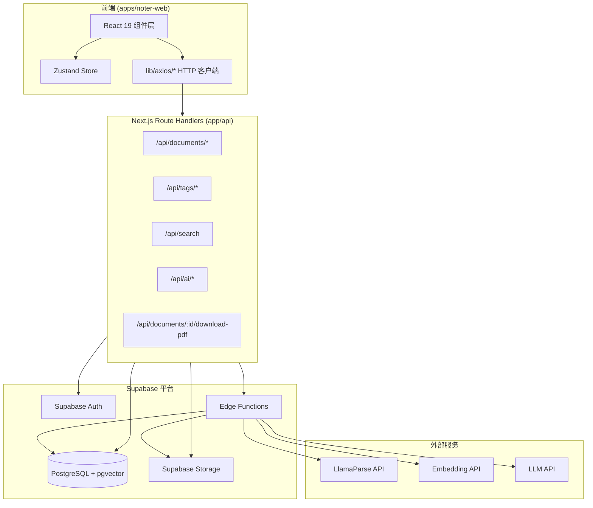
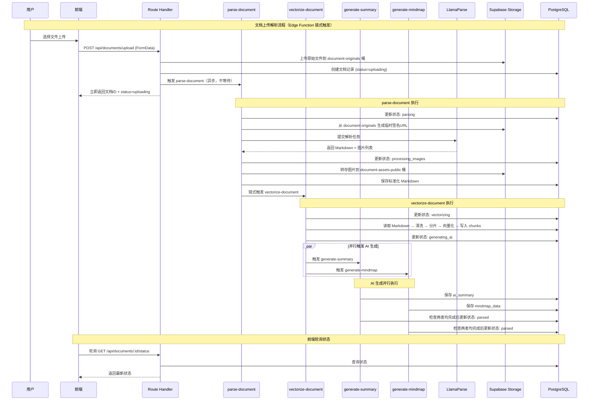
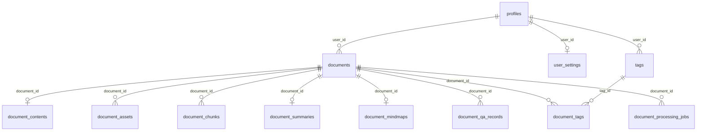
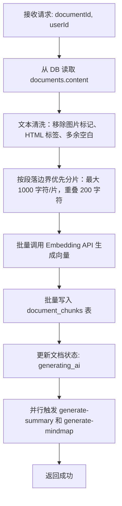
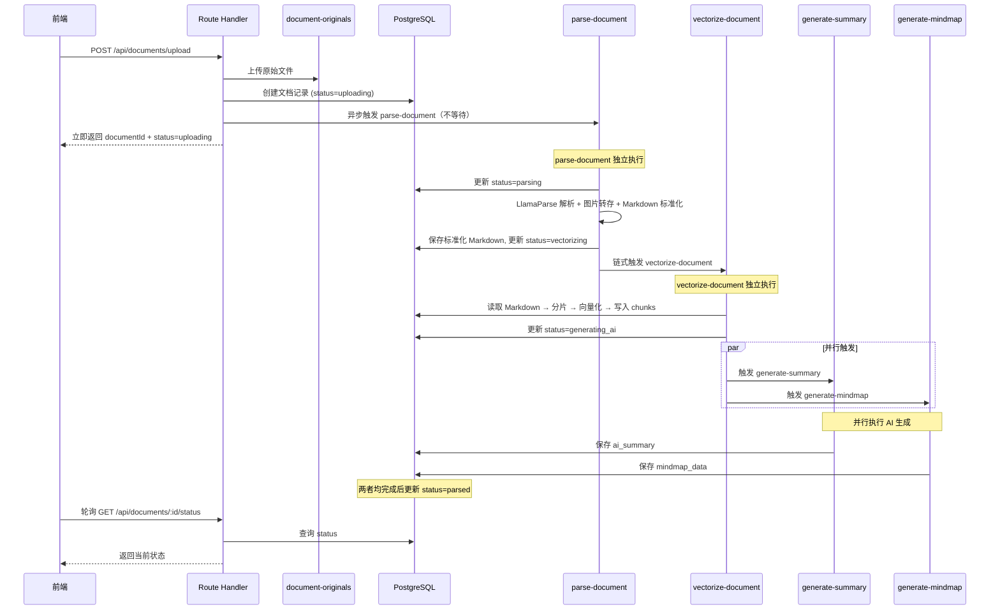
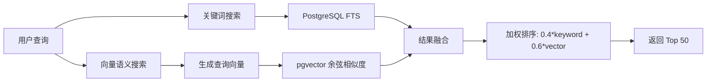

# 技术设计文档 — Noter 文档管理系统

## 概述

本设计文档描述 Noter 文档管理系统的技术架构，涵盖文档上传解析、列表展示、混合搜索、标签管理、文档详情渲染、AI 问答/总结/思维导图、下载服务以及数据安全等核心模块。

系统基于 Next.js 16 App Router + React 19 + Supabase 全栈架构，前端通过 `@noter/api` 封装的 axios 客户端与 Next.js Route Handler 通信，后端重计算任务（文档解析、向量化、AI 生成）由 Supabase Edge Function (Deno) 异步处理。

### 设计原则

- **低耦合高内聚**：每个模块（types / lib/axios / stores / components / app/api）职责清晰
- **前端不直接调用外部 AI 服务**：所有 AI/解析操作通过 Edge Function 代理
- **RLS 优先**：数据隔离在数据库层强制执行，API 层做二次校验
- **渐进式加载**：骨架屏 + 流式输出提升用户体验

---

## 架构

### 系统架构图



### 数据流概览



---

## 组件与接口

### 前端组件层级

```
app/(main)/documents/
├── page.tsx                          # 文档管理主页面
├── components/
│   ├── DocumentGrid.tsx              # 文档卡片网格容器
│   ├── DocumentCard.tsx              # 单个文档卡片
│   ├── PaginationController.tsx      # 分页控件
│   ├── SearchBar.tsx                 # 搜索输入框
│   ├── UploadDialog.tsx              # 上传对话框（拖拽+选择）
│   ├── UploadProgress.tsx            # 上传进度指示器
│   ├── SidePanel/
│   │   ├── SidePanel.tsx             # 左侧悬浮卡片容器
│   │   ├── TagManager.tsx            # 标签管理面板
│   │   ├── UserPanel.tsx             # 用户操作面板
│   │   └── TagFilterList.tsx         # 标签筛选列表
│   └── EmptyState.tsx                # 空状态组件

app/(main)/documents/[id]/
├── page.tsx                          # 文档详情页
├── components/
│   ├── DocumentViewer.tsx            # 文档正文渲染容器
│   ├── TemplateRenderer.tsx          # 模板化 Markdown 渲染器
│   ├── TemplateSwitcher.tsx          # 模板切换器
│   ├── DocumentOutline.tsx           # 文档大纲
│   ├── DocumentMeta.tsx              # 文档元信息
│   ├── AIChatPanel.tsx               # AI 问答面板
│   ├── ChatMessage.tsx               # 对话气泡
│   ├── MindmapViewer.tsx             # 思维导图展示
│   ├── SummaryCard.tsx               # AI 总结卡片
│   └── DownloadButton.tsx            # 下载按钮
```

### API 模块接口

#### 前端 HTTP 客户端 (`lib/axios/`)

```typescript
// lib/axios/documents.ts - 扩展现有模块
export const documentApi = {
  upload: (formData: FormData) => http.post<Document>('api/documents/upload', formData),
  list: (params: ListParams) => http.get<PaginatedResult<Document>>('api/documents', { ...params }),
  getById: (id: string) => http.get<Document>(`api/documents/${id}`),
  delete: (id: string) => http.delete<void>(`api/documents/${id}`),
  getStatus: (id: string) => http.get<DocumentStatus>(`api/documents/${id}/status`),
  downloadPdf: (id: string) => http.get<Blob>(`api/documents/${id}/download-pdf`, undefined, { responseType: 'blob' }),
}

// lib/axios/tags.ts - 新增模块
export const tagApi = {
  list: () => http.get<Tag[]>('api/tags'),
  create: (data: CreateTagInput) => http.post<Tag>('api/tags', data),
  delete: (id: string) => http.delete<void>(`api/tags/${id}`),
  addToDocument: (documentId: string, tagId: string) => http.post<void>(`api/documents/${documentId}/tags`, { tagId }),
  removeFromDocument: (documentId: string, tagId: string) => http.delete<void>(`api/documents/${documentId}/tags/${tagId}`),
}

// lib/axios/search.ts - 扩展现有模块
export const searchApi = {
  search: (params: SearchParams) => http.get<SearchResult[]>('api/search', { ...params }),
}

// lib/axios/ai.ts - 扩展现有模块
export const aiApi = {
  regenerateSummary: (documentId: string) => http.post<Summary>('api/ai/regenerate-summary', { documentId }),
  regenerateMindmap: (documentId: string) => http.post<MindmapData>('api/ai/regenerate-mindmap', { documentId }),
  // chat 相关接口后续迭代补充
}
```

#### Route Handler 端点设计

| 方法 | 路径 | 描述 | Zod Schema |
|------|------|------|------------|
| GET | `/api/documents` | 文档列表（分页+标签筛选） | `listDocumentsSchema` |
| POST | `/api/documents/upload` | 上传文档 | FormData 校验 |
| GET | `/api/documents/[id]` | 文档详情 | `documentIdSchema` |
| DELETE | `/api/documents/[id]` | 删除文档 | `documentIdSchema` |
| GET | `/api/documents/[id]/status` | 查询解析状态 | `documentIdSchema` |
| GET | `/api/documents/[id]/download-pdf` | 生成并下载 PDF | `documentIdSchema` |
| POST | `/api/documents/[id]/tags` | 为文档添加标签 | `addTagSchema` |
| DELETE | `/api/documents/[id]/tags/[tagId]` | 移除文档标签 | params 校验 |
| GET | `/api/tags` | 获取用户标签列表 | 无 body |
| POST | `/api/tags` | 创建标签 | `createTagSchema` |
| DELETE | `/api/tags/[id]` | 删除标签 | `tagIdSchema` |
| GET | `/api/search` | 混合搜索 | `searchSchema` |
| POST | `/api/ai/chat/stream` | AI 问答（流式） | 后续迭代 |
| GET | `/api/ai/history` | 获取对话历史 | 后续迭代 |
| POST | `/api/ai/regenerate-summary` | 重新生成总结 | `regenerateSchema` |
| POST | `/api/ai/regenerate-mindmap` | 重新生成思维导图 | `regenerateSchema` |

### Zustand Store 设计

```typescript
// stores/document.ts
interface DocumentState {
  documents: Document[]
  total: number
  page: number
  pageSize: number
  loading: boolean
  error: string | null
  selectedTags: string[]
  setPage: (page: number) => void
  setPageSize: (size: number) => void
  setSelectedTags: (tags: string[]) => void
  fetchDocuments: () => Promise<void>
}

// stores/tags.ts
interface TagState {
  tags: Tag[]
  loading: boolean
  fetchTags: () => Promise<void>
  createTag: (name: string) => Promise<void>
  deleteTag: (id: string) => Promise<void>
}

// stores/documentDetail.ts
interface DocumentDetailState {
  document: Document | null
  loading: boolean
  error: string | null
  template: TemplateType
  panelVisible: boolean          // AI 面板展开/收起状态（仅 UI）
  setTemplate: (template: TemplateType) => void
  fetchDocument: (id: string) => Promise<void>
  togglePanel: () => void
}
```

---

## 数据模型

### 数据库表设计

> 以下为 Supabase 中已建好的实际表结构，设计文档以此为准。

#### profiles — 用户资料表

| 字段 | 类型 | 说明 |
|------|------|------|
| id | UUID PK | 用户ID，对应 auth.users.id |
| username | text | 用户名 |
| email | text (unique) | 用户邮箱 |
| avatar_url | text | 用户头像地址 |
| role | text (default 'user') | 用户角色 |
| nike_name | text | 用户昵称 |
| provider | text | 登录方式（email/github） |
| deleted | smallint (default 0) | 是否已注销 |
| not_active | smallint (default 0) | 是否禁用 |
| created_at / updated_at | timestamptz | 时间戳 |

#### user_settings — 用户设置表

| 字段 | 类型 | 说明 |
|------|------|------|
| id | UUID PK | 设置记录ID |
| user_id | UUID (unique, FK→profiles) | 所属用户 |
| default_reader_template | text (default 'default') | 默认阅读模板 |
| deleted | int (0/1) | 软删除 |
| created_at / updated_at | timestamptz | 时间戳 |

#### documents — 文档主表

| 字段 | 类型 | 说明 |
|------|------|------|
| id | UUID PK | 文档ID |
| user_id | UUID (FK→profiles) | 所属用户 |
| title | text | 文档标题 |
| original_filename | text | 原始文件名 |
| file_ext | text | 文件后缀（pdf/docx/md 等） |
| mime_type | text | MIME 类型 |
| file_size | bigint | 文件大小（字节） |
| original_bucket | text (default 'document-originals') | 原始文件存储桶 |
| original_storage_path | text | 原始文件存储路径 |
| status | text (default 'uploaded') | 整体状态：uploaded/parsing/parsed/vectorizing/ready/failed |
| parse_status | text (default 'pending') | 解析状态：pending/running/success/failed |
| vector_status | text (default 'pending') | 向量化状态 |
| summary_status | text (default 'pending') | AI 总结状态 |
| mindmap_status | text (default 'pending') | 思维导图状态 |
| short_description | text | 文档摘要片段（卡片展示用） |
| word_count | int (default 0) | 文档字数 |
| page_count | int | 文档页数 |
| language | text | 文档语言 |
| is_favorite | int (0/1) | 是否收藏 |
| is_archived | int (0/1) | 是否归档 |
| deleted | int (0/1) | 软删除 |
| deleted_at | timestamptz | 删除时间 |
| created_at / updated_at | timestamptz | 时间戳 |

#### document_contents — 文档内容表

| 字段 | 类型 | 说明 |
|------|------|------|
| id | UUID PK | 内容ID |
| user_id | UUID (FK→profiles) | 所属用户 |
| document_id | UUID (unique, FK→documents) | 对应文档 |
| markdown_content | text | 标准化 Markdown 正文 |
| outline | jsonb | 文档大纲（标题层级 JSON） |
| metadata | jsonb | 解析元数据 |
| deleted | int (0/1) | 软删除 |
| created_at / updated_at | timestamptz | 时间戳 |

#### document_assets — 文档资源表

| 字段 | 类型 | 说明 |
|------|------|------|
| id | UUID PK | 资源ID |
| user_id | UUID (FK→profiles) | 所属用户 |
| document_id | UUID (FK→documents) | 所属文档 |
| bucket | text (default 'document-assets-public') | 存储桶 |
| storage_path | text | Storage 路径 |
| public_url | text | 公开访问 URL |
| original_url | text | LlamaParse 返回的原始 URL |
| filename | text | 文件名 |
| mime_type | text | MIME 类型 |
| file_size | bigint | 文件大小 |
| width / height | int | 图片尺寸 |
| sort_order | int (default 0) | 排序序号 |
| deleted | int (0/1) | 软删除 |
| created_at | timestamptz | 创建时间 |

#### tags — 标签表

| 字段 | 类型 | 说明 |
|------|------|------|
| id | UUID PK | 标签ID |
| user_id | UUID (FK→profiles) | 所属用户 |
| name | text | 标签名称 |
| color | text | 标签颜色 |
| description | text | 标签描述 |
| deleted | int (0/1) | 软删除 |
| created_at / updated_at | timestamptz | 时间戳 |

#### document_tags — 文档标签关联表

| 字段 | 类型 | 说明 |
|------|------|------|
| id | UUID PK | 关联ID |
| user_id | UUID (FK→profiles) | 所属用户 |
| document_id | UUID (FK→documents) | 文档ID |
| tag_id | UUID (FK→tags) | 标签ID |
| deleted | int (0/1) | 软删除 |
| created_at | timestamptz | 创建时间 |

#### document_chunks — 文档分片表

| 字段 | 类型 | 说明 |
|------|------|------|
| id | UUID PK | 分片ID |
| user_id | UUID (FK→profiles) | 所属用户 |
| document_id | UUID (FK→documents) | 所属文档 |
| chunk_index | int | 分片序号 |
| content | text | 分片文本 |
| heading_path | jsonb | 标题层级路径 |
| token_count | int | token 数量 |
| char_start / char_end | int | 在原始 Markdown 中的字符位置 |
| embedding | vector | 向量数据 |
| metadata | jsonb | 额外元数据 |
| deleted | int (0/1) | 软删除 |
| created_at | timestamptz | 创建时间 |

#### document_summaries — AI 总结表

| 字段 | 类型 | 说明 |
|------|------|------|
| id | UUID PK | 总结ID |
| user_id | UUID (FK→profiles) | 所属用户 |
| document_id | UUID (unique, FK→documents) | 所属文档 |
| summary | text | 文档摘要正文 |
| key_points | jsonb | 关键要点 |
| todos | jsonb | 待办事项 |
| keywords | text[] | 关键词 |
| suitable_scenarios | jsonb | 适用场景 |
| model_name | text | 使用的模型 |
| deleted | int (0/1) | 软删除 |
| generated_at | timestamptz | 生成时间 |
| created_at / updated_at | timestamptz | 时间戳 |

#### document_mindmaps — AI 思维导图表

| 字段 | 类型 | 说明 |
|------|------|------|
| id | UUID PK | 思维导图ID |
| user_id | UUID (FK→profiles) | 所属用户 |
| document_id | UUID (unique, FK→documents) | 所属文档 |
| mindmap_json | jsonb | 思维导图结构化 JSON |
| markdown_outline | text | Markdown 大纲 |
| model_name | text | 使用的模型 |
| deleted | int (0/1) | 软删除 |
| generated_at | timestamptz | 生成时间 |
| created_at / updated_at | timestamptz | 时间戳 |

#### document_qa_records — 文档问答记录表（后续迭代实现接口逻辑）

| 字段 | 类型 | 说明 |
|------|------|------|
| id | UUID PK | 问答记录ID |
| user_id | UUID (FK→profiles) | 所属用户 |
| document_id | UUID (FK→documents) | 所属文档 |
| question | text | 用户问题 |
| answer | text | AI 回答 |
| retrieved_chunk_ids | uuid[] | 检索到的分片ID列表 |
| retrieval_context | jsonb | 检索上下文 |
| model_name | text | 使用的模型 |
| deleted | int (0/1) | 软删除 |
| created_at | timestamptz | 创建时间 |

#### document_processing_jobs — 文档处理任务表

| 字段 | 类型 | 说明 |
|------|------|------|
| id | UUID PK | 任务ID |
| user_id | UUID (FK→profiles) | 所属用户 |
| document_id | UUID (FK→documents) | 所属文档 |
| job_type | text | 任务类型：parse-document/vectorize-document/generate-summary/generate-mindmap |
| status | text (default 'pending') | 任务状态：pending/running/success/failed |
| input_payload | jsonb | 输入参数 |
| output_payload | jsonb | 输出结果 |
| error_message | text | 错误信息 |
| retry_count | int (default 0) | 重试次数 |
| deleted | int (0/1) | 软删除 |
| started_at / finished_at | timestamptz | 开始/完成时间 |
| created_at / updated_at | timestamptz | 时间戳 |

#### 表关系总览



> **设计特点**：
> - 所有表均启用 RLS
> - 所有表使用 `deleted` 字段实现软删除，不做物理删除
> - AI 总结和思维导图独立成表（document_summaries / document_mindmaps），与文档主表解耦
> - 文档内容（Markdown）独立存储在 document_contents 表，避免文档主表过大
> - document_processing_jobs 记录每个 Edge Function 的执行状态，便于重试和监控

### RLS 策略

> 所有表均已启用 RLS（`rls_enabled: true`）。以下为各表的 RLS 策略设计：

| 表 | 策略 | 规则 |
|----|------|------|
| profiles | SELECT/UPDATE | `auth.uid() = id` |
| user_settings | SELECT/INSERT/UPDATE | `auth.uid() = user_id` |
| documents | SELECT/INSERT/UPDATE/DELETE | `auth.uid() = user_id AND deleted = 0` |
| document_contents | SELECT/INSERT/UPDATE | `auth.uid() = user_id` |
| document_assets | SELECT/INSERT | `auth.uid() = user_id` |
| tags | SELECT/INSERT/UPDATE/DELETE | `auth.uid() = user_id AND deleted = 0` |
| document_tags | SELECT/INSERT/DELETE | `auth.uid() = user_id` |
| document_chunks | SELECT/INSERT/DELETE | `auth.uid() = user_id` |
| document_summaries | SELECT/INSERT/UPDATE | `auth.uid() = user_id` |
| document_mindmaps | SELECT/INSERT/UPDATE | `auth.uid() = user_id` |
| document_qa_records | SELECT/INSERT | `auth.uid() = user_id` |
| document_processing_jobs | SELECT/INSERT/UPDATE | `auth.uid() = user_id` |

**Storage Policy：**

| Bucket | 读取 | 写入 |
|--------|------|------|
| `userResources` | 用户仅能读取自身路径 | 用户仅能写入自身路径 |
| `document-originals` | 用户仅能读取自身 user_id 目录 | 用户仅能写入自身 user_id 目录 |
| `document-assets-public` | 公开读取（无需鉴权） | 仅 Edge Function（service_role）可写入 |

### Storage Bucket 设计

| Bucket | 访问级别 | 路径格式 | 用途 |
|--------|----------|----------|------|
| `userResources` | 私有 | `{user_id}/avatar/{filename}` | 用户头像 |
| `document-originals` | 私有 | `{user_id}/{document_id}/{filename}` | 原始上传文件（PDF/DOCX/PPTX/TXT/MD） |
| `document-assets-public` | 公开 | `{user_id}/{document_id}/{image_filename}` | 文档解析产生的图片资源 |

**设计说明：**

- **原始文件与图片资源分离**：原始文档存放于 `document-originals` 私有桶，受 RLS 和 Storage Policy 控制；解析产生的图片存放于 `document-assets-public` 公开桶，前端渲染 Markdown 时可直接通过公网 URL 访问图片，无需额外鉴权
- **权限控制重点**：系统的数据权限控制作用于原始文件、文档记录、Markdown 正文、标签、向量片段和 AI 结果；公开桶中的图片仅作为 Markdown 渲染的静态资源，不包含敏感信息
- **Storage Policy**：`document-originals` 桶设置 RLS 策略确保用户仅能读写自身 user_id 目录下的文件；`document-assets-public` 桶允许公开读取，写入仅限 Edge Function（service_role）

### TypeScript 类型定义

```typescript
// types/document.ts
export type DocumentStatus = 'uploaded' | 'parsing' | 'parsed' | 'vectorizing' | 'ready' | 'failed'
export type ProcessingStatus = 'pending' | 'running' | 'success' | 'failed'

export interface Document {
  id: string
  userId: string
  title: string
  originalFilename: string
  fileExt: string | null
  mimeType: string | null
  fileSize: number | null
  originalBucket: string
  originalStoragePath: string
  status: DocumentStatus
  parseStatus: ProcessingStatus
  vectorStatus: ProcessingStatus
  summaryStatus: ProcessingStatus
  mindmapStatus: ProcessingStatus
  shortDescription: string | null
  wordCount: number
  pageCount: number | null
  language: string | null
  isFavorite: number
  isArchived: number
  deleted: number
  tags: Tag[]
  createdAt: string
  updatedAt: string
}

export interface DocumentContent {
  id: string
  userId: string
  documentId: string
  markdownContent: string
  outline: OutlineNode[] | null
  metadata: Record<string, unknown> | null
}

export interface OutlineNode {
  id: string
  level: number
  title: string
  children: OutlineNode[]
}

export interface DocumentAsset {
  id: string
  documentId: string
  bucket: string
  storagePath: string
  publicUrl: string
  originalUrl: string | null
  filename: string | null
  mimeType: string | null
  fileSize: number | null
  width: number | null
  height: number | null
  sortOrder: number
}

export interface DocumentSummary {
  id: string
  documentId: string
  summary: string
  keyPoints: string[] | null
  todos: string[] | null
  keywords: string[] | null
  suitableScenarios: Record<string, unknown> | null
  modelName: string | null
  generatedAt: string
}

export interface DocumentMindmap {
  id: string
  documentId: string
  mindmapJson: MindmapNode
  markdownOutline: string | null
  modelName: string | null
  generatedAt: string
}

export interface MindmapNode {
  id: string
  label: string
  children: MindmapNode[]
}

export interface Tag {
  id: string
  name: string
  color: string | null
  description: string | null
  documentCount?: number
}

export interface DocumentProcessingJob {
  id: string
  documentId: string
  jobType: 'parse-document' | 'vectorize-document' | 'generate-summary' | 'generate-mindmap'
  status: ProcessingStatus
  errorMessage: string | null
  retryCount: number
  startedAt: string | null
  finishedAt: string | null
}

export interface ListParams {
  page: number
  pageSize: number
  tagIds?: string[]
  isFavorite?: number
  isArchived?: number
  orderBy?: 'created_at' | 'title' | 'file_size'
  order?: 'asc' | 'desc'
}

export interface PaginatedResult<T> {
  items: T[]
  total: number
  page: number
  pageSize: number
}

export interface SearchParams {
  query: string
  limit?: number
}

export interface SearchResult {
  documentId: string
  title: string
  snippet: string
  tags: Tag[]
  score: number
}

// types/ai.ts (扩展)
// ChatInput / ChatMessage / QA 相关类型后续迭代补充

export type TemplateType = 'default' | 'academic' | 'clean' | 'card'
```

---

## Edge Function 设计

系统共 4 个 Edge Function，各自职责单一、互不耦合：

| Edge Function | 职责 | 触发方式 |
|---------------|------|----------|
| `parse-document` | 文档解析主链路：读取原始文件 → LlamaParse → 图片转存 → Markdown 标准化 | Route Handler 调用 |
| `vectorize-document` | 文本清洗、分片、向量化，写入 document_chunks | parse-document 完成后由 Route Handler 调用 |
| `generate-summary` | 基于标准化 Markdown 生成 AI 总结 | vectorize-document 完成后调用 / 用户手动重新生成 |
| `generate-mindmap` | 基于标题结构和正文语义生成思维导图 JSON | vectorize-document 完成后调用 / 用户手动重新生成 |

### parse-document Edge Function

**职责**：文档解析主链路，只负责将原始文件转换为标准化 Markdown。

```mermaid
flowchart TD
    A[接收请求: documentId, userId] --> B[从 document-originals 桶读取原始文件路径]
    B --> C[生成临时签名 URL（有效期 1 小时）]
    C --> D[更新文档状态: parsing]
    D --> E[调用 LlamaParse API（agentic tier, expand: markdown_full + images_content_metadata）]
    E --> F{解析成功?}
    F -->|否| G[更新状态: failed, 记录错误信息]
    F -->|是| H[获取 Markdown 全文 + 图片 presigned URL 列表]
    H --> I[更新状态: processing_images]
    I --> J[遍历图片列表，逐一下载]
    J --> K{下载成功?}
    K -->|是| L[上传到 document-assets-public 桶]
    K -->|否| M[记录占位标记: ]
    L --> N[获取 Supabase 公网图片 URL]
    N --> O[替换 Markdown 中对应的临时图片地址]
    M --> O
    O --> P{所有图片处理完?}
    P -->|否| J
    P -->|是| Q[保存标准化 Markdown 到 documents.content]
    Q --> R[更新状态: vectorizing]
    R --> S[链式调用 vectorize-document Edge Function]
```

**输入**：`{ documentId: string, userId: string, storagePath: string }`
**输出**：`{ success: boolean, error?: string }`

### vectorize-document Edge Function

**职责**：基于标准化 Markdown 进行文本清洗、分片、向量化，将向量片段写入数据库。



**输入**：`{ documentId: string, userId: string }`
**输出**：`{ success: boolean, chunkCount: number, error?: string }`

### generate-summary Edge Function

**职责**：基于标准化 Markdown 或文档分片生成 AI 总结，保存结构化总结结果。

```mermaid
flowchart TD
    A[接收请求: documentId] --> B[从 DB 读取 documents.content]
    B --> C{内容长度 >= 50 字?}
    C -->|否| D[返回: 内容过短无法生成]
    C -->|是| E[构造 Prompt：提取不超过 5 条要点 + 200 字摘要]
    E --> F[调用 LLM API]
    F --> G{生成成功?}
    G -->|否| H[返回错误信息]
    G -->|是| I[解析 LLM 返回为 { keyPoints: string[], abstract: string }]
    I --> J[保存到 documents.ai_summary]
    J --> K[返回成功]
```

**输入**：`{ documentId: string }`
**输出**：`{ success: boolean, summary?: AISummary, error?: string }`

### generate-mindmap Edge Function

**职责**：基于标准化 Markdown 的标题结构和正文语义生成思维导图数据，保存为可渲染的结构化 JSON。


**输入**：`{ documentId: string }`
**输出**：`{ success: boolean, mindmap?: MindmapNode, error?: string }`

### 文档上传完整编排流程



**编排规则：**

- **Route Handler 职责最小化**：upload 接口只负责上传文件、创建记录、异步触发 `parse-document`，然后立即返回，不等待任何后续处理
- **Edge Function 链式触发**：每个 Edge Function 完成后主动调用下一个，形成 `parse-document → vectorize-document → (generate-summary ∥ generate-mindmap)` 的链路
- **状态最终一致**：`generate-summary` 和 `generate-mindmap` 并行执行，两者均完成后将文档状态更新为 `parsed`（通过数据库条件更新实现：仅当 ai_summary 和 mindmap_data 均非空时才设置 status=parsed）
- **失败隔离**：任一 Edge Function 失败只影响当前步骤，不回滚前序步骤的结果；失败时将 status 标记为 `failed` 并记录错误信息

### 关键实现细节

1. **临时 URL 有效期**：1 小时，足够 LlamaParse 完成解析
2. **超时控制**：每个 Edge Function 独立超时，parse-document 5 分钟，其余 2 分钟
3. **分片策略**：最大 1000 字符/片，相邻片段重叠 200 字符，按段落边界优先切分
4. **图片失败处理**：替换为 ``，不中断流程
5. **状态轮询**：前端每 3 秒轮询 `/api/documents/:id/status`
6. **链式触发**：Edge Function 之间通过 Supabase Edge Function invoke 互相调用，不经过 Route Handler 中转
7. **幂等性**：每个 Edge Function 支持重复调用（先清除旧数据再写入），便于失败重试
8. **并行完成检测**：generate-summary 和 generate-mindmap 各自完成后检查对方是否也已完成，最后一个完成的负责将 status 更新为 parsed

---

## 混合搜索实现



### 搜索 SQL 示例

```sql
-- 混合搜索函数
CREATE OR REPLACE FUNCTION hybrid_search(
  query_text TEXT,
  query_embedding vector(1536),
  match_count INT DEFAULT 50,
  keyword_weight FLOAT DEFAULT 0.4,
  vector_weight FLOAT DEFAULT 0.6,
  current_user_id UUID DEFAULT auth.uid()
)
RETURNS TABLE (
  document_id UUID,
  title VARCHAR,
  snippet TEXT,
  score FLOAT
) AS $$
BEGIN
  RETURN QUERY
  WITH keyword_results AS (
    SELECT d.id, d.title,
      ts_headline('chinese', d.content, plainto_tsquery('chinese', query_text),
        'MaxWords=30, MinWords=15, StartSel=<mark>, StopSel=</mark>') AS snippet,
      ts_rank(d.fts, plainto_tsquery('chinese', query_text)) AS rank
    FROM documents d
    WHERE d.user_id = current_user_id
      AND d.fts @@ plainto_tsquery('chinese', query_text)
      AND d.status = 'parsed'
  ),
  vector_results AS (
    SELECT dc.document_id AS id, d.title,
      dc.content AS snippet,
      1 - (dc.embedding <=> query_embedding) AS rank
    FROM document_chunks dc
    JOIN documents d ON d.id = dc.document_id
    WHERE dc.user_id = current_user_id
      AND d.status = 'parsed'
    ORDER BY dc.embedding <=> query_embedding
    LIMIT match_count
  ),
  combined AS (
    SELECT COALESCE(k.id, v.id) AS id,
      COALESCE(k.title, v.title) AS title,
      COALESCE(k.snippet, v.snippet) AS snippet,
      (COALESCE(k.rank, 0) * keyword_weight + COALESCE(v.rank, 0) * vector_weight) AS score
    FROM keyword_results k
    FULL OUTER JOIN vector_results v ON k.id = v.id
  )
  SELECT c.id AS document_id, c.title, c.snippet, c.score
  FROM combined c
  ORDER BY c.score DESC
  LIMIT match_count;
END;
$$ LANGUAGE plpgsql SECURITY DEFINER;
```

---

## 文件/目录结构新增

```
apps/noter-web/
├── app/
│   ├── (main)/
│   │   └── documents/
│   │       ├── page.tsx
│   │       ├── [id]/
│   │       │   └── page.tsx
│   │       └── components/          # 新增
│   │           ├── DocumentGrid.tsx
│   │           ├── DocumentCard.tsx
│   │           ├── PaginationController.tsx
│   │           ├── SearchBar.tsx
│   │           ├── UploadDialog.tsx
│   │           ├── UploadProgress.tsx
│   │           ├── EmptyState.tsx
│   │           ├── SidePanel/
│   │           │   ├── SidePanel.tsx
│   │           │   ├── TagManager.tsx
│   │           │   ├── UserPanel.tsx
│   │           │   └── TagFilterList.tsx
│   │           └── detail/
│   │               ├── DocumentViewer.tsx
│   │               ├── TemplateRenderer.tsx
│   │               ├── TemplateSwitcher.tsx
│   │               ├── DocumentOutline.tsx
│   │               ├── DocumentMeta.tsx
│   │               ├── AIChatPanel.tsx
│   │               ├── ChatMessage.tsx
│   │               ├── MindmapViewer.tsx
│   │               ├── SummaryCard.tsx
│   │               └── DownloadButton.tsx
│   └── api/
│       ├── documents/
│       │   ├── route.ts              # GET 列表
│       │   ├── upload/
│       │   │   └── route.ts          # POST 上传
│       │   └── [id]/
│       │       ├── route.ts          # GET 详情, DELETE 删除
│       │       ├── status/
│       │       │   └── route.ts      # GET 状态查询
│       │       ├── download-pdf/
│       │       │   └── route.ts      # GET PDF 下载
│       │       └── tags/
│       │           ├── route.ts      # POST 添加标签
│       │           └── [tagId]/
│       │               └── route.ts  # DELETE 移除标签
│       ├── tags/
│       │   ├── route.ts              # GET 列表, POST 创建
│       │   └── [id]/
│       │       └── route.ts          # DELETE 删除
│       ├── search/
│       │   └── route.ts              # GET 混合搜索
│       └── ai/
│           ├── chat/
│           │   └── stream/
│           │       └── route.ts      # POST 流式问答（后续迭代，本阶段不实现）
│           ├── history/
│           │   └── route.ts          # GET 对话历史（后续迭代，本阶段不实现）
│           ├── regenerate-summary/
│           │   └── route.ts          # POST 重新生成总结
│           └── regenerate-mindmap/
│               └── route.ts          # POST 重新生成思维导图
├── lib/axios/
│   ├── documents.ts                  # 扩展
│   ├── tags.ts                       # 新增
│   ├── search.ts                     # 扩展
│   └── ai.ts                         # 扩展
├── stores/
│   ├── document.ts                   # 新增
│   ├── tags.ts                       # 新增
│   └── documentDetail.ts            # 新增
├── types/
│   ├── document.ts                   # 新增
│   ├── search.ts                     # 扩展
│   └── ai.ts                         # 扩展
└── utils/noterFetch/feature/
    ├── documents/
    │   └── schemas.ts                # 新增
    ├── tags/
    │   └── schemas.ts                # 新增
    ├── search/
    │   └── schemas.ts                # 新增
    └── ai/
        └── schemas.ts                # 新增

supabase/functions/
├── parse-document/
│   └── index.ts                      # 文档解析主链路：LlamaParse + 图片转存 + Markdown 标准化
├── vectorize-document/
│   └── index.ts                      # 文本清洗、分片、向量化
├── generate-summary/
│   └── index.ts                      # AI 总结生成
└── generate-mindmap/
    └── index.ts                      # 思维导图生成
```

---

## 正确性属性

*正确性属性是一种在系统所有有效执行中都应成立的特征或行为——本质上是对系统应做什么的形式化陈述。属性是人类可读规格说明与机器可验证正确性保证之间的桥梁。*

### Property 1: 分页返回正确子集

*For any* 用户拥有 N 篇文档，给定页码 p 和每页条数 s，返回的文档列表长度应为 min(s, N - (p-1)*s)（当 (p-1)*s < N 时），且所有文档按 created_at 降序排列。

**Validates: Requirements 1.1, 1.4**

### Property 2: 文档卡片格式化截断

*For any* 文档标题长度 > 50 字符时，格式化后的标题长度应 ≤ 53（50 + 省略号）；*For any* 文档摘要长度 > 100 字符时，格式化后的摘要长度应 ≤ 103；*For any* 标签列表长度 > 3 时，仅展示前 3 个标签。

**Validates: Requirements 1.2**

### Property 3: 搜索输入校验

*For any* 长度在 1-200 之间的字符串，搜索校验应通过；*For any* 空字符串或长度 > 200 的字符串，搜索校验应拒绝。

**Validates: Requirements 2.1**

### Property 4: 混合搜索融合排序

*For any* 关键词搜索结果集和向量搜索结果集，融合后的结果应按加权分数（0.4*keyword_score + 0.6*vector_score）严格降序排列。

**Validates: Requirements 2.2**

### Property 5: 搜索范围覆盖

*For any* 文档，若其标题、正文或标签中包含某唯一关键词，则搜索该关键词时该文档应出现在结果中。

**Validates: Requirements 2.3**

### Property 6: 搜索结果上限

*For any* 搜索查询，返回的结果数量不应超过 50 条。

**Validates: Requirements 2.4**

### Property 7: 标签名称校验

*For any* 长度在 1-20 之间的非空字符串，标签创建应成功；*For any* 空字符串或长度 > 20 的字符串，标签创建应被拒绝。

**Validates: Requirements 3.2, 3.3**

### Property 8: 标签筛选 OR 语义

*For any* 文档集合和已选标签集合，筛选结果中的每篇文档至少包含已选标签中的一个；且所有包含已选标签中任一标签的文档都应出现在结果中。

**Validates: Requirements 3.4**

### Property 9: 标签唯一性约束

*For any* 已存在的标签名称，再次创建同名标签应被拒绝并返回重复错误。

**Validates: Requirements 3.6**

### Property 10: 标签删除级联

*For any* 标签，删除后所有文档的标签列表中不应再包含该标签。

**Validates: Requirements 3.7**

### Property 11: 模板切换数据不可变性

*For any* Markdown 内容和任意模板切换序列，底层存储的 Markdown 数据应始终保持不变。

**Validates: Requirements 5.4**

### Property 12: 标题大纲提取

*For any* 包含 h1-h4 标题的 Markdown 文档，提取的大纲应包含所有 h1-h4 标题，按文档顺序排列，且层级嵌套关系正确。

**Validates: Requirements 5.5**

### Property 13: 空白问题拒绝（UI 层）

*For any* 仅由空白字符（空格、制表符、换行符）组成的字符串，AI 问答面板的发送按钮应处于禁用状态。

**Validates: Requirements 6.5**

### Property 14: AI 面板展开/收起

*For any* 面板状态切换操作，面板的 visible 状态应在 true/false 之间正确切换，且不影响文档正文内容。

**Validates: Requirements 6.3, 6.4**

### Property 15: 思维导图节点上限

*For any* 文档生成的思维导图，节点总数不应超过 200 个。

**Validates: Requirements 7.3**

### Property 16: AI 总结格式约束

*For any* 生成的 AI 总结，要点列表长度应 ≤ 5，核心摘要字符数应 ≤ 200。

**Validates: Requirements 8.2**

### Property 17: 下载文件名格式

*For any* 文档标题和下载日期，生成的文件名应匹配格式 `{title}_{YYYY-MM-DD}.pdf`。

**Validates: Requirements 9.4**

### Property 18: 下载内容优雅降级

*For any* 文档内容组合（Markdown 存在，AI 总结可能为空，思维导图可能为空），生成的 PDF 应包含所有已有内容，缺失部分标注为"暂无内容"。

**Validates: Requirements 9.6**

### Property 19: RLS 数据隔离

*For any* 两个不同用户 A 和 B，用户 A 的文档查询和标签查询结果中不应包含任何属于用户 B 的数据，反之亦然。

**Validates: Requirements 10.1, 10.2**

### Property 20: 存储路径格式

*For any* 上传的文件，其在 `document-originals` 桶中的存储路径应匹配格式 `{user_id}/{document_id}/{filename}`；解析产生的图片在 `document-assets-public` 桶中的路径应匹配格式 `{user_id}/{document_id}/{image_filename}`。

**Validates: Requirements 10.4**

### Property 21: 越权访问拒绝

*For any* 用户尝试访问不属于自己的文档资源，系统应返回 403 状态码且不泄露目标资源是否存在的信息。

**Validates: Requirements 10.6**

### Property 22: 文件上传校验

*For any* 文件，若格式为 PDF/DOCX/PPTX/TXT/MD 且大小 ≤ 50MB，上传应被接受；否则应被拒绝并返回具体原因。

**Validates: Requirements 11.1, 11.12**

### Property 23: Markdown 图片 URL 重写

*For any* 包含 LlamaParse 临时图片 URL 的 Markdown 内容，经过重写处理后，不应残留任何 LlamaParse 域名的 URL，所有图片链接应指向 `document-assets-public` 桶的公网 URL。

**Validates: Requirements 11.7**

### Property 24: 文本分片正确性

*For any* 文本内容，分片后每个片段长度应 ≤ 1000 字符，且相邻片段的重叠部分应为 200 字符（最后一个片段除外）。

**Validates: Requirements 11.9**

### Property 25: 部分图片失败处理

*For any* 图片列表中存在下载失败的图片，最终 Markdown 中失败图片应被替换为占位标记 ``，成功图片应有有效的 Supabase Storage URL。

**Validates: Requirements 11.14**

---

## 错误处理

### 错误处理策略

| 层级 | 策略 | 实现方式 |
|------|------|----------|
| Route Handler | 统一错误包装 | `handler()` 高阶函数捕获 ZodError / Error |
| 前端 HTTP | 统一响应拦截 | `onResponseError` 处理 401/403/500 |
| Edge Function | 状态标记 + 错误记录 | 失败时更新 document.status = 'failed' |
| 前端 UI | 错误边界 + Toast | 组件级错误展示 + 全局 Toast 通知 |

### 超时配置

| 操作 | 超时时间 | 处理方式 |
|------|----------|----------|
| 文档列表加载 | 15s (axios 默认) | 显示错误 + 重试按钮 |
| 搜索请求 | 10s | 取消请求 + 错误提示 |
| 文档详情加载 | 15s | 显示错误 + 重试按钮 |
| AI 问答生成 | — | 后续迭代，本阶段不实现 |
| 思维导图重新生成 | 60s | 错误提示 + 保留重试按钮 |
| AI 总结重新生成 | 30s | 错误提示 + 保留重试按钮 |
| PDF 下载生成 | 60s | 错误提示 + 恢复按钮 |
| Edge Function 解析 | 5min | 标记 failed + 保留原始文件 |

### 错误码规范

```typescript
// 业务错误码
enum ErrorCode {
  VALIDATION_ERROR = 400,
  UNAUTHORIZED = 401,
  FORBIDDEN = 403,
  NOT_FOUND = 404,
  FILE_TOO_LARGE = 413,
  UNSUPPORTED_FORMAT = 415,
  RATE_LIMITED = 429,
  INTERNAL_ERROR = 500,
  AI_SERVICE_ERROR = 503,
}
```

---

## 测试策略

### 双轨测试方法

本项目采用 **单元测试 + 属性测试** 双轨并行策略：

- **单元测试 (Vitest)**：验证具体示例、边界条件和错误处理
- **属性测试 (fast-check + Vitest)**：验证跨所有输入的通用属性

### 属性测试配置

- 测试库：`fast-check` (TypeScript 生态最成熟的 PBT 库)
- 运行器：`vitest`
- 每个属性测试最少运行 **100 次迭代**
- 标签格式：`Feature: noter-document-management, Property {N}: {property_text}`

### 测试分层

| 层级 | 工具 | 覆盖范围 |
|------|------|----------|
| 属性测试 | fast-check + vitest | 格式化函数、校验逻辑、分片算法、搜索排序、URL 重写 |
| 单元测试 | vitest | 组件渲染、Store 逻辑、API 调用 mock |
| 集成测试 | vitest + supabase-js | RLS 策略、Edge Function 流程、数据库操作 |
| E2E 测试 | Playwright (可选) | 关键用户流程 |

### 属性测试重点覆盖

1. **纯函数逻辑**：格式化截断、输入校验、文件名生成、分片算法
2. **数据转换**：Markdown URL 重写、搜索结果融合排序
3. **约束验证**：分页计算、结果上限、节点数上限、消息数上限
4. **安全属性**：数据隔离、路径格式、越权拒绝

### 单元测试重点覆盖

1. **UI 组件**：骨架屏、空状态、错误状态、模板切换
2. **Store 逻辑**：状态更新、异步操作
3. **API 集成**：请求参数构造、响应解析
4. **Edge Case**：超时处理、部分失败、会话过期
