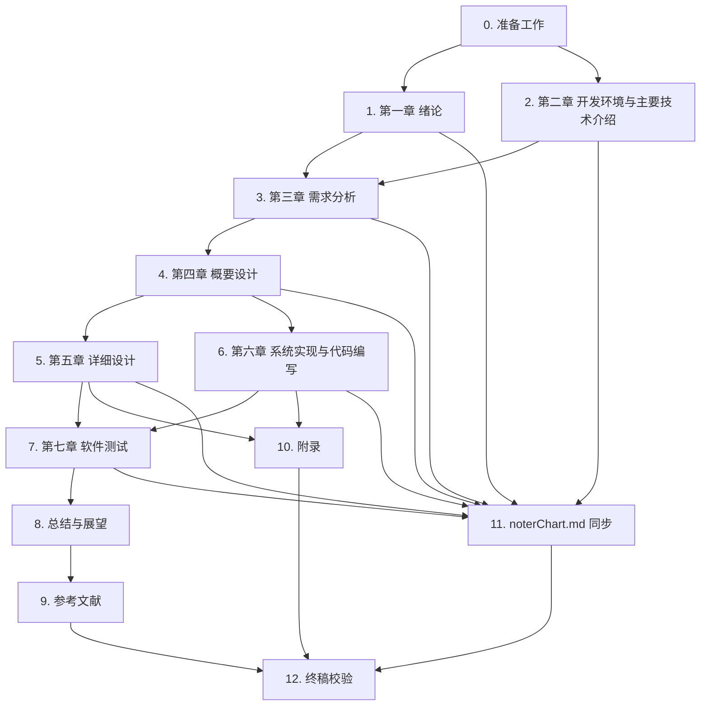

# Implementation Plan

> 本 spec 的「任务」是**论文写作任务**，不是代码任务。每个三级子任务的 deliverable 是 `paper/noterPaper.md` 中某一小节的成稿，或 `paper/noterChart.md` 中某张图的同步条目。整篇论文以仓库本身为唯一事实来源，所有功能描述、目录结构、字段表、版本号都从仓库当前代码与 supabase 实际结构核对后落笔，不到外部资料里补充功能。

## Overview

本计划把 noter-paper 的写作工作拆成 13 个主任务（0—12）。0 完成事实核对、字数预算与骨架初始化；1—7 顺序撰写七章正文；8 写总结与展望；9 收集与对账参考文献；10 整理附录代码；11 把正文 mermaid 图镜像到 `paper/noterChart.md`；12 做终稿七项校验。前置依赖按下方依赖图组织，章与章之间允许小幅并行（例如第一、第二章可以并行起步），但第三章需要前两章奠定的角色与技术语境，第五、六章需要第四章先确定的数据模型，第七章需要第五、六章已落笔的核心模块作为测试目标。

## Task Dependency Graph



```json
{
  "waves": [
    { "id": 0, "tasks": ["0.1", "0.2", "0.3", "0.4", "0.5"] },
    { "id": 1, "tasks": ["1.1", "1.2", "1.3", "1.4.1", "1.4.2", "1.4.3", "1.4.4", "2.1", "2.2"] },
    { "id": 2, "tasks": ["3.1", "3.2.1", "3.2.2", "3.3.1", "3.3.2", "3.3.3"] },
    { "id": 3, "tasks": ["4.1", "4.2.1", "4.2.2", "4.2.3", "4.2.4", "4.3.1", "4.3.2", "4.3.3"] },
    { "id": 4, "tasks": ["5.1.1", "5.1.2", "5.1.3", "5.2.1", "5.2.2", "6.1", "6.2", "6.3.1", "6.3.2"] },
    { "id": 5, "tasks": ["7.1", "7.2", "7.3.1", "7.3.2"] },
    { "id": 6, "tasks": ["8.1", "8.2", "10.1"] },
    { "id": 7, "tasks": ["9.1", "11.1"] },
    { "id": 8, "tasks": ["9.2", "11.2"] },
    { "id": 9, "tasks": ["12.1", "12.2", "12.3", "12.4", "12.5", "12.6", "12.7"] }
  ]
}
```

## Tasks

- [x] 0. 准备工作
  - 在动笔之前完成事实核对、字数预算、图表与编号体系的初始化，避免后续返工。

  - [x] 0.1 拉取并核对 noter 仓库当前真实事实清单
    - 目标章节：服务于第二、三、四、六、七章所有需要引用版本号 / 路径 / 字段 / 配置的小节
    - 取材来源：仓库根目录 `package.json`、`pnpm-workspace.yaml`、`tsconfig.base.json`、`apps/noter-web/package.json`、`apps/noter-admin/package.json`、`packages/{ui,api,agent-runtime,hooks,utils}/package.json`、`supabase/migrations/`、`supabase/functions/`、`.kiro/specs/noter-document-management/requirements.md`、`.kiro/specs/noter-agent/requirements.md`、`.kiro/specs/noter-admin-platform/requirements.md`
    - 写作要点：通读上述文件，整理出一张「事实清单」草稿（作者本地维护，非交付物），内容包括：技术栈版本号、目录树、四个角色的真实命名（未登录访客 / user / admin / super_admin）、四类文档处理状态字段、三类业务流水线的边界。后续每一节落笔前先回到这张清单核对，再下笔
    - 字数建议:不计入正文
    - _Validates Requirements: 6.1, 6.2_

  - [x] 0.2 通过 supabase 工具拉取 public schema 当前 18 张表与字段清单
    - 目标章节：服务于 3.3.3 数据字典、4.3.1 概念结构、4.3.2 逻辑结构、4.3.3 物理结构
    - 取材来源：supabase MCP 的 `list_tables` 与 `information_schema.columns`，对照 `supabase/migrations/*.sql` 中的 `COMMENT` 文本
    - 写作要点：导出一份字段级 JSON / Markdown 表格作者本地草稿，列出每张表的字段名、类型、长度、是否可空、默认值、主键 / 外键、含义。后续 4.3.3 的 18 张表表格、3.3.3 数据字典都直接以这份草稿为底
    - 字数建议:不计入正文
    - _Validates Requirements: 3.4, 6.2_

  - [x] 0.3 建立图编号、表编号、参考文献编号的总账文件
    - 目标章节：贯穿全书图 X.Y / 表 X.Y / `[N]` 三套编号
    - 取材来源：design.md「图编号 / 表编号 / 参考文献编号统一规则」一节
    - 写作要点：作者本地维护一份 `_paper_index.md` 或表格（不交付），三列分别记录「图编号 → 图名 → 所在小节」「表编号 → 表名 → 所在小节」「`[N]` → 类型 → 出现位置」。每新增一张图 / 一张表 / 一处引用，立刻在总账登记，避免悬挂引用
    - 字数建议:不计入正文
    - _Validates Requirements: 2.1, 2.2, 2.3, 4.1, 4.2_

  - [x] 0.4 制定全文字数预算与节级字数上下限
    - 目标章节:第一至第七章 + 总结与展望
    - 取材来源:requirements.md 需求 9 给出的 15000—30000 字区间
    - 写作要点:按以下粗略预算落到每一节：第一章 2500—4500、第二章 1500—2500、第三章 2500—4500、第四章 2500—4500、第五章 2500—4500、第六章 1500—3000、第七章 1200—2000、总结与展望 800—1500，合计落在 15000—27000 字之间，留出修订余量。每节落笔前先看预算上限，避免单节膨胀挤掉其他章节
    - 字数建议:不计入正文
    - _Validates Requirements: 9.1_

  - [x] 0.5 初始化 noterPaper.md 与 noterChart.md 的章节骨架
    - 目标章节：两份交付文件的整体骨架
    - 取材来源：requirements.md 需求 1 的目录骨架；design.md「双文件分工与同步机制」一节
    - 写作要点：在 `paper/noterPaper.md` 中写入第一章至第七章 + 总结与展望 + 参考文献 + 附录 的所有 Markdown 标题（一级 = 章、二级 = 节、三级 = 小节），每个标题下留一个空段占位。在 `paper/noterChart.md` 中写入「图 X.Y 图名 + 一句话解释 + mermaid 源代码占位」的清单骨架。两份文件的标题和图编号在落笔阶段都用相同顺序，便于后续每节填空
    - 字数建议:不计入正文
    - _Validates Requirements: 1.1, 1.2, 1.3, 8.1, 8.2_

- [x] 1. 第一章 绪论
  - 撰写绪论四节，把「来龙去脉、对社会与生产的意义、国内外同类系统、可行性结论」交代清楚，不要写成文献综述也不要把引言写成模块划分。
  - 配图数量：本章不出图。

  - [x] 1.1 撰写 1.1 项目开发背景
    - 目标章节：noterPaper.md → 第一章 → 1.1 项目开发背景
    - 取材来源：仓库根目录 `README.md`（如有）、`apps/noter-web/README.md`、`apps/noter-admin/README.md`、`paper/` 已存在的占位文件、`.kiro/specs/noter-document-management/requirements.md` 的 Introduction
    - 写作要点：交代本项目来龙去脉（为什么要做一个文档智能阅读平台，团队里 PDF / Markdown 资料越来越多但难检索难提问、AI 大模型已可以承担总结和问答），点明项目产生的时间地点单位（学校、毕业设计、年份），说明作者在本项目中的任务（架构设计、前后端实现、Edge Function 接入、Agent 多轮 Skill 设计、管理后台开发等具体工作）。避免「首先 / 其次 / 最后」「在本节中我们将」等空洞过渡句
    - 字数建议:500—900 字
    - _Validates Requirements: 6.1, 7.1, 7.2_

  - [x] 1.2 撰写 1.2 项目开发意义
    - 目标章节：noterPaper.md → 第一章 → 1.2 项目开发意义
    - 取材来源：`.kiro/specs/noter-document-management/requirements.md` Introduction 里对系统价值的描述（参考语义，不直接抄）；`.kiro/specs/noter-agent/requirements.md` 里关于 RAG 与 Skill 的价值描述
    - 写作要点：从对学习与科研工作、对知识管理、对内容生产效率、对 AI 技术落地几个角度说明项目意义，最好能引用一段代表性单位（如所在实验室、企业用户）的简短评价或一段公开报告中的趋势描述（在 1.3 之外不另立条目）。避免堆叠形容词（高效 / 稳定 / 可靠 / 可扩展）
    - 字数建议:400—700 字
    - _Validates Requirements: 6.1, 7.2_

  - [x] 1.3 撰写 1.3 国内外发展状况
    - 目标章节：noterPaper.md → 第一章 → 1.3 国内外发展状况
    - 取材来源：本节资料以外部公开资料为主（不在仓库中），每个实例的引用条目落到第 9 条参考文献任务中收集；候选实例：飞书妙记、有道云笔记 AI、Notion AI、Mendeley AI（需作者自行核查后选定，至少国内 2 个、国外 2 个）
    - 写作要点：每个实例用一段 80—150 字介绍其定位、核心能力、与 noter 的差异点（如商业化 vs 自托管、闭源 vs 开源、是否支持多轮 Agent Skill）；避免大段直译或照抄。最后用一段话归纳行业总体走向（文档智能阅读 + RAG + LLM 知识助手），自然过渡到 1.4
    - 字数建议:800—1500 字
    - _Validates Requirements: 6.1, 6.3, 7.2_

  - [x] 1.4 撰写 1.4 可行性分析（含 1.4.1—1.4.4）
    - 把可行性分析拆为四个三级子任务依次落地。

    - [x] 1.4.1 撰写 1.4.1 经济可行性分析
      - 目标章节：noterPaper.md → 第一章 → 1.4 → 1.4.1
      - 取材来源:仓库 `package.json` 中的开源依赖、`supabase/`（自托管 / 云端 supabase 都可用）、Edge Function 调用 LlamaParse 与 LLM API 的开销描述（来自 `.kiro/specs/noter-document-management/requirements.md` 需求 19—21）
      - 写作要点:从开发成本（学生毕设无显著开发成本，使用开源工具链 pnpm + Next.js + Supabase）、运行成本（不需要新增专有硬件，supabase 提供托管 Postgres + Storage + Edge Functions、模型 API 按调用计费）、对生产管理带来的好处（团队统一知识入口、减少人工总结时间）三个角度落笔。不堆形容词，给出具体描述
      - 字数建议:200—350 字
      - _Validates Requirements: 6.1, 7.2_

    - [x] 1.4.2 撰写 1.4.2 技术可行性分析
      - 目标章节：noterPaper.md → 第一章 → 1.4 → 1.4.2
      - 取材来源:根目录 `package.json`、`apps/noter-web/package.json`、`apps/noter-admin/package.json`、`packages/agent-runtime/package.json` 中的真实依赖版本
      - 写作要点:列举 Next.js 16 / React 19 / Supabase Postgres / pgvector / shadcn 4 / TypeScript 等技术栈均成熟可靠、被业界广泛使用、作者已熟练掌握、开源免费、无知识产权纠纷；可以举出 RAG 与 SSE 在 Next.js Route Handler 上的标准实现路径来佐证「技术路径已被验证」。引用 `package.json` 中真实依赖名 / 版本号
      - 字数建议:200—350 字
      - _Validates Requirements: 6.1, 6.2, 7.2_

    - [x] 1.4.3 撰写 1.4.3 社会可行性分析
      - 目标章节：noterPaper.md → 第一章 → 1.4 → 1.4.3
      - 取材来源:基于自有开发与开源依赖（无封闭组件、无第三方专利绑定）
      - 写作要点:作者独立开发，所用依赖均为 MIT / Apache / BSD 等宽松许可；功能符合个人知识管理与教学场景的法规要求（不涉及个人敏感信息批量处理）；利于学校与团队对资料的整理；用户为常规笔记软件用户群体，使用门槛低，无需专门培训
      - 字数建议:200—350 字
      - _Validates Requirements: 6.1, 7.2_

    - [x] 1.4.4 撰写 1.4.4 可行性分析结论
      - 目标章节：noterPaper.md → 第一章 → 1.4 → 1.4.4
      - 取材来源:1.4.1—1.4.3 三小节的论述
      - 写作要点:综合三个方面给出结论「项目在经济、技术、社会三方面均具备可行性」；以一段话承接，自然过渡到第二章。避免「总而言之」「综上所述」之类的 AI 腔，可以改写为「上述三方面表明……」之类的表达
      - 字数建议:150—250 字
      - _Validates Requirements: 6.1, 7.2_

- [x] 2. 第二章 开发环境与主要技术介绍
  - 把开发环境列清楚，把仓库真实使用的技术栈介绍到位。
  - 配图数量：本章不出图（如需要可在 2.1 出一张「开发工具与版本一览表」表 2.1，非必需）。

  - [x] 2.1 撰写 2.1 开发环境概述
    - 目标章节：noterPaper.md → 第二章 → 2.1
    - 取材来源:作者本地开发环境 + 仓库 `package.json`（pnpm@10.32.1）、`tsconfig.base.json`、`.husky/`、`docker/`（如有）；版本管理为 git；UML 工具沿用 mermaid（仓库 `paper/noterChart.md` 内嵌方案）
    - 写作要点:按「操作系统 / 浏览器 / 数据库 / 开发工具 / 版本管理工具 / 应用服务器 / UML 工具」列出（macOS、Chrome / Edge、Supabase Postgres、VS Code / Cursor、git、Next.js Dev Server / Edge Functions、mermaid）。可选嵌入「表 2.1 开发环境一览表」收纳。版本号写明，不用形容词
    - 字数建议:600—1000 字
    - _Validates Requirements: 6.1, 6.2, 7.2_

  - [x] 2.2 撰写 2.2 主要技术简介
    - 目标章节：noterPaper.md → 第二章 → 2.2
    - 取材来源:`apps/noter-web/package.json`（Next.js 16.1.6、React 19、@supabase/ssr、@supabase/supabase-js、@xyflow/react、react-markdown、remark-gfm、remark-math、rehype-katex、rehype-raw、rehype-slug、rehype-highlight、@react-pdf/renderer、zustand、tailwindcss v4、zod）；`apps/noter-admin/package.json`（Next.js 16.2.6、recharts、vitest、playwright、tsx）；`packages/ui/package.json`（shadcn 4、radix-ui、class-variance-authority、tailwind-merge、lucide-react、next-themes、tw-animate-css）；`packages/api/package.json`（axios）；`packages/agent-runtime/package.json`（TypeScript、@supabase/supabase-js、zod、fast-check）；`supabase/migrations/`、`supabase/functions/`
    - 写作要点:按「前端用户端 / 前端管理端 / 共享 UI 库 / 共享代码包 / 后端」五个分组各写一段，每段 2—4 句话说明该分组的主要技术、版本号与在本项目中的作用（例如 @xyflow/react 用于思维导图节点画布、react-markdown 全家桶用于阅读模板渲染、agent-runtime 是抽出的多轮 Skill 引擎）。每个版本号都和 `package.json` 一致。避免「我们采用了……我们选择了……」之类堆叠句
    - 字数建议:900—1500 字
    - _Validates Requirements: 6.1, 6.2, 7.1, 7.2_

- [x] 3. 第三章 需求分析
  - 从用户实际工作出发描述需求，再画用例图与数据流图，最后落到数据字典；不要上来就划分模块。
  - 配图：图 3.1 总用例图、图 3.2 / 图 3.3 子模块用例图、图 3.4 总体数据流图、图 3.5 / 图 3.6 文档上传与解析流水线 1、2 层 DFD、图 3.7 / 图 3.8 AI 问答 SSE 流水线 1、2 层 DFD。

  - [x] 3.1 撰写 3.1 用户需求
    - 目标章节：noterPaper.md → 第三章 → 3.1
    - 取材来源:`.kiro/specs/noter-document-management/requirements.md` 需求 1—21 的「用户故事」字段（撰写、上传、阅读、提问、AI 总结、AI 思维导图、混合搜索、收藏归档、文件夹标签管理）；`.kiro/specs/noter-agent/requirements.md` 关于多轮 Skill 的用户故事；`.kiro/specs/noter-admin-platform/requirements.md` 关于管理员的用户故事
    - 写作要点:从用户实际业务动作展开（不要用「文档管理模块、Agent 模块、管理后台模块」这种程序员视角）。可以按「日常学习 / 科研工作流」「知识库共享与发布」「平台维护」三条线索叙述具体动作；不在本节出现模块名词，模块划分留到 4.2 系统总体规划再写
    - 字数建议:600—1000 字
    - _Validates Requirements: 6.4, 7.2_

  - [x] 3.2 撰写 3.2 系统用例分析（含 3.2.1、3.2.2）
    - [x] 3.2.1 绘制总用例图并撰写说明（图 3.1）
      - 目标章节：noterPaper.md → 第三章 → 3.2.1
      - 取材来源:`.kiro/specs/noter-admin-platform/requirements.md` 中 `profiles.role` 的三档（user / admin / super_admin），加上 `.kiro/specs/noter-document-management/requirements.md` 隐含的「未登录访客」共四个角色；用例集合从三份 spec 的功能清单合并去重
      - 配图:图 3.1 noter 系统总用例图（用例图，mermaid `flowchart` 模拟或 mermaid `graph` + actor 表示），同步到 noterChart.md
      - 写作要点:先用一段话说明角色与主要用例的归属，再以「如图 3.1 所示」收尾。用例命名要直白（上传文档、阅读文档、AI 提问、混合搜索、管理员审核公共文档、超级管理员管理用户角色等）
      - 字数建议:400—700 字（不含图）
      - _Validates Requirements: 2.1, 2.3, 3.3, 8.1_

    - [x] 3.2.2 绘制子模块用例图与撰写用例说明（图 3.2、图 3.3）
      - 目标章节：noterPaper.md → 第三章 → 3.2.2
      - 取材来源:`.kiro/specs/noter-document-management/requirements.md` 文档生命周期相关需求；`.kiro/specs/noter-agent/requirements.md` 多轮 Skill 相关需求；`.kiro/specs/noter-admin-platform/requirements.md` 公共文档与版本归档相关需求
      - 配图:图 3.2 文档生命周期子模块用例图、图 3.3 Noter Agent 多轮 Skill 子模块用例图（如有第三个子模块可追加图 3.4 之前的编号），同步到 noterChart.md
      - 写作要点:每张子用例图配一张用例说明表（用例编号 / 用例名 / 角色 / 前置条件 / 主流程 / 异常分支），表格条目 5—8 行，覆盖关键路径。子模块的角色与总用例图保持一致
      - 字数建议:600—1000 字（不含图）
      - _Validates Requirements: 2.1, 2.3, 3.3, 8.1_

  - [x] 3.3 撰写 3.3 系统数据流分析（含 3.3.1、3.3.2、3.3.3）
    - [x] 3.3.1 绘制总体数据流图并撰写说明（图 3.4）
      - 目标章节：noterPaper.md → 第三章 → 3.3.1
      - 取材来源:`apps/noter-web/app/api/`（用户端 API 入口）、`supabase/functions/`、`supabase/migrations/`、`apps/noter-admin/app/api/admin/`（管理端入口）
      - 配图:图 3.4 noter 系统总体数据流图（数据流图，mermaid `flowchart`），同步到 noterChart.md
      - 写作要点:数据源点和终点为「用户 / 管理员」，处理为「上传 → Storage → Edge Function 解析 → Postgres 入库 → 前端阅读 / 提问」，数据存储标记为「Storage 桶 documents / Postgres 主库 / pgvector 索引 / agent_skill_sessions」。每个数据存储后续都要在 3.3.3 数据字典中描述
      - 字数建议:400—700 字（不含图）
      - _Validates Requirements: 2.1, 2.3, 3.1, 6.1, 8.1_

    - [x] 3.3.2 绘制子模块 1、2 层数据流图并撰写说明（图 3.5—图 3.8）
      - 目标章节：noterPaper.md → 第三章 → 3.3.2
      - 取材来源:`apps/noter-web/app/api/documents/upload/`、`supabase/functions/parse-document/index.ts`、`vectorize-document/index.ts`、`generate-summary/index.ts`、`generate-mindmap/index.ts`；`apps/noter-web/app/api/ai/chat/`、`packages/agent-runtime/src/{router,skills,sse}/`
      - 配图:图 3.5 文档上传与 RAG 解析流水线 1 层 DFD、图 3.6 文档上传与 RAG 解析流水线 2 层 DFD、图 3.7 AI 问答 SSE 流水线 1 层 DFD、图 3.8 AI 问答 SSE 流水线 2 层 DFD（数据流图，mermaid `flowchart`），同步到 noterChart.md
      - 写作要点:1 层 DFD 把模块作为整体看，列出输入输出与外部存储；2 层 DFD 拆开模块内部的解析 / 分片 / 向量化 / 总结 / 思维导图、或路由 / Skill / 工具 / SSE 各步骤。每张图前用一段文字说明，再以「如图 X.Y 所示」收尾
      - 字数建议:700—1200 字（不含图）
      - _Validates Requirements: 2.1, 2.3, 3.1, 6.1, 8.1_

    - [x] 3.3.3 撰写 3.3.3 数据字典（表 3.1 起）
      - 目标章节：noterPaper.md → 第三章 → 3.3.3
      - 取材来源:0.2 任务导出的 supabase 字段清单；`supabase/migrations/*.sql` 中的 `COMMENT`
      - 配表:表 3.1 文档主域数据字典、表 3.2 组织域数据字典、表 3.3 用户域数据字典、表 3.4 Agent 会话域数据字典、表 3.5 管理后台域数据字典（按 design.md 五分组组织，每张表列「序号 / 数据项 / 数据对象说明 / 数据构成」）
      - 写作要点:数据字典只覆盖与业务直接相关的核心数据存储项（Storage 桶 documents / Postgres 主库各域 / pgvector 索引 / agent_skill_sessions），不必把 18 张表全字段都铺开（详细字段表放到 4.3.3）。每张表前用一句话点明本域包含哪些数据存储
      - 字数建议:600—1000 字（含表内文字，但表格内文字不计入正文字数）
      - _Validates Requirements: 3.1, 3.2, 3.4, 6.2_

- [x] 4. 第四章 概要设计
  - 把开发规定、系统总体规划、数据库设计三件事写完。
  - 配图：图 4.1 系统总体功能模块图、图 4.2 / 图 4.3 E-R 图、表 4.1—表 4.18 物理结构表（每张表对应一张物理结构表）。

  - [x] 4.1 撰写 4.1 开发规定
    - 目标章节：noterPaper.md → 第四章 → 4.1
    - 取材来源:`.eslintrc`、`.eslintignore`、`.prettierrc`、`.prettierignore`、`.commitlintrc.json`、`.cz-config.js`、`.lintstagedrc.js`、`.husky/pre-commit`、`.husky/commit-msg`、`tsconfig.base.json`、`pnpm-workspace.yaml`
    - 写作要点:从「代码风格规定」「提交信息规定」「类型与构建规定」「monorepo 工作区规定」四个角度展开。代码风格用一段话说明 ESLint + Prettier 链路、缩进与引号约定；提交信息说明 commitlint + commitizen + cz-config + husky pre-commit / commit-msg 钩子的串联；类型规定说明 `tsconfig.base.json` 的 strict 选项；monorepo 规定说明 `pnpm-workspace.yaml` 中 apps / packages 划分。可选嵌入「表 4.0 开发规定一览」做汇总
    - 字数建议:400—700 字
    - _Validates Requirements: 6.1, 6.2, 7.2_

  - [x] 4.2 撰写 4.2 系统总体规划（含 4.2.1—4.2.4）
    - [x] 4.2.1 绘制系统总体功能模块图并撰写 4.2.1 总体功能划分说明（图 4.1）
      - 目标章节：noterPaper.md → 第四章 → 4.2.1
      - 取材来源:`apps/noter-web/`、`apps/noter-admin/`、`packages/{ui,api,agent-runtime,hooks,utils}/`、`supabase/{migrations,functions,tests}/`
      - 配图:图 4.1 noter 系统总体功能模块图（模块图，mermaid `flowchart`），同步到 noterChart.md
      - 写作要点:把系统分为「用户端前端 / 管理端前端 / 共享 UI 与代码包 / Supabase 后端」四大模块；每个模块下列出其内部子模块（用户端：阅读、写作、Agent 对话、搜索、收藏归档；管理端：用户管理、公共文档、版本归档、审计；共享：UI 组件、API 客户端、agent-runtime；后端：迁移 / Edge Function / 测试）。说明完后以「如图 4.1 所示」收尾
      - 字数建议:300—500 字（不含图）
      - _Validates Requirements: 2.1, 2.3, 6.1, 8.1_

    - [x] 4.2.2 撰写 4.2.2 用户端前端模块功能划分
      - 目标章节：noterPaper.md → 第四章 → 4.2.2
      - 取材来源:`apps/noter-web/app/(auth)/`、`apps/noter-web/app/(main)/`、`apps/noter-web/components/`、`apps/noter-web/stores/`
      - 写作要点:用一段 2—3 段的文字说明用户端按路由组与组件目录的划分，列出阅读模板（remark / rehype 全家桶）、思维导图（@xyflow/react）、AI 对话（AIChatPanel）、混合搜索（搜索弹层）、收藏与归档、文件夹与标签管理这几条主线
      - 字数建议:200—400 字
      - _Validates Requirements: 6.1, 7.2_

    - [x] 4.2.3 撰写 4.2.3 管理端前端模块功能划分
      - 目标章节：noterPaper.md → 第四章 → 4.2.3
      - 取材来源:`apps/noter-admin/app/(admin)/dashboard/`、`documents/`、`logs/`、`public-categories/`、`public-documents/`、`public-tags/`、`settings/`、`users/`、`apps/noter-admin/components/`
      - 写作要点:列出 Dashboard、文档总览、审计日志、公共分类、公共文档（含编辑器与版本抽屉）、公共标签、系统设置、用户与角色八个子模块，并简述它们与 admin / super_admin 角色的对应关系
      - 字数建议:200—400 字
      - _Validates Requirements: 6.1, 7.2_

    - [x] 4.2.4 撰写 4.2.4 后端与共享包模块功能划分
      - 目标章节：noterPaper.md → 第四章 → 4.2.4
      - 取材来源:`packages/ui/src/`、`packages/api/`、`packages/agent-runtime/src/`、`packages/hooks/`、`packages/utils/`、`supabase/migrations/`、`supabase/functions/parse-document/`、`vectorize-document/`、`generate-summary/`、`generate-mindmap/`、`supabase/tests/`
      - 写作要点:说明共享 UI 库基于 shadcn 4、API 客户端基于 axios、agent-runtime 是抽出的 Skill 引擎；后端围绕迁移文件 + Edge Function + Postgres + pgvector 展开，迁移 SQL 用版本号顺序演进
      - 字数建议:200—400 字
      - _Validates Requirements: 6.1, 7.2_

  - [x] 4.3 撰写 4.3 模块数据库设计（含 4.3.1—4.3.3）
    - [x] 4.3.1 绘制 E-R 图并撰写 4.3.1 概念结构（图 4.2、图 4.3）
      - 目标章节：noterPaper.md → 第四章 → 4.3.1
      - 取材来源:0.2 任务的字段清单；`supabase/migrations/` 各迁移注释
      - 配图:图 4.2 文档主域与组织域 E-R 图（涵盖 documents、document_contents、document_assets、document_chunks、document_summaries、document_mindmaps、document_qa_records、document_processing_jobs、folders、tags、document_tags），图 4.3 用户域与 Agent 域 E-R 图（涵盖 profiles、user_settings、agent_skill_sessions），管理后台域 E-R 图（图 4.4，涵盖 public_categories、public_document_versions、admin_audit_logs、system_settings），同步到 noterChart.md
      - 写作要点:每张 E-R 图配一段文字说明实体之间的关系（一对多、一对一、多对多），E-R 图标题命名要带上实体范围，例如「图 4.2 文档主域与组织域实体关系图」。mermaid 用 `erDiagram` 块绘制
      - 字数建议:600—1000 字（不含图）
      - _Validates Requirements: 2.1, 2.3, 3.4, 6.2, 8.1_

    - [x] 4.3.2 撰写 4.3.2 逻辑结构
      - 目标章节：noterPaper.md → 第四章 → 4.3.2
      - 取材来源:E-R 图（4.3.1）；`supabase/migrations/` 中的外键定义
      - 写作要点:把 E-R 图转写为关系模式列表（用「关系名（属性 1，属性 2，……，主键，外键 → 引用关系）」格式），并按「一对多 / 一对一 / 多对多」三类整理：一对多典型为 user → documents → document_chunks；一对一典型为 documents ↔ document_contents、documents ↔ document_summaries、documents ↔ document_mindmaps；多对多典型为 documents ↔ tags via document_tags、documents ↔ public_categories（虽是外键但通过 public_category_id 单边引用，不算多对多，写明这一点避免误读）
      - 字数建议:600—1000 字
      - _Validates Requirements: 3.4, 6.2_

    - [x] 4.3.3 撰写 4.3.3 物理结构（表 4.1—表 4.18）
      - 目标章节：noterPaper.md → 第四章 → 4.3.3
      - 取材来源:0.2 任务的字段清单（来源于 supabase MCP 拉取结果）；`supabase/migrations/*.sql` 中的 `COMMENT` 与 `CHECK`
      - 配表:每张表对应一张物理结构表，列「字段名 / 类型 / 长度 / 是否可空 / 主键 / 外键 / 默认值 / 含义」八列；按 design.md 列出的 18 张表逐表展开（文档主域 8 张 → 表 4.1—表 4.8、组织域 3 张 → 表 4.9—表 4.11、用户域 2 张 → 表 4.12—表 4.13、Agent 域 1 张 → 表 4.14、管理后台域 4 张 → 表 4.15—表 4.18）
      - 写作要点:每张表前用一句到两句话点明这张表承载什么数据，再贴出物理结构表。同一字段在 supabase 实际为 nullable 或带 default 的，必须写明；含义列以迁移 `COMMENT` 为准；不要把 generated 列与触发器逻辑写到含义里（那部分到第五、六章再写）。表格内文字不计入正文字数
      - 字数建议:正文文字部分 800—1500 字（表格本身不计入正文字数）
      - _Validates Requirements: 2.2, 2.3, 3.4, 6.2_

- [x] 5. 第五章 详细设计
  - 重点写两个核心功能模块：文档上传与 RAG 解析流水线、Noter Agent 多轮 Skill 与 SSE。每个模块都要画时序图（带返回箭头）、贴关键代码、配运行界面截图。不重点写注册登录，不写成用户使用手册。
  - 配图：图 5.1 文档上传与 RAG 解析流水线时序图、图 5.2 Noter Agent 多轮 Skill 与 SSE 时序图。

  - [x] 5.1 撰写 5.1 核心功能模块一：文档上传与 RAG 解析流水线（含 5.1.1—5.1.3）
    - [x] 5.1.1 撰写 5.1.1 模块用途与业务流程概述
      - 目标章节：noterPaper.md → 第五章 → 5.1.1
      - 取材来源:`.kiro/specs/noter-document-management/requirements.md` 需求 11、19、20、21；`apps/noter-web/components/documents/UploadDialog.tsx`、`UploadProgress.tsx`
      - 写作要点:用一段话说明本模块解决的问题（用户上传 PDF / Markdown 等文档后自动完成解析、分片、向量化、总结、思维导图）、入口在哪里、最终在前端如何呈现（阅读模板渲染 + AI 总结卡片 + 思维导图 Tab）。避免把这一节写成使用手册（不要列「点击上传按钮 → 选择文件 → 等待」之类的步骤）
      - 字数建议:300—500 字
      - _Validates Requirements: 5.1, 5.2, 6.1_

    - [x] 5.1.2 绘制时序图并撰写 5.1.2 内部处理逻辑（图 5.1）
      - 目标章节：noterPaper.md → 第五章 → 5.1.2
      - 取材来源:`apps/noter-web/app/api/documents/upload/`、`apps/noter-web/app/api/documents/[id]/`、`supabase/functions/parse-document/index.ts`、`vectorize-document/index.ts`、`generate-summary/index.ts`、`generate-mindmap/index.ts`、`document_processing_jobs` 表
      - 配图:图 5.1 文档上传与 RAG 解析流水线时序图（mermaid `sequenceDiagram`，参与者包括用户、用户端 Web、Next.js Route Handler、Supabase Storage、parse-document Edge Function、LlamaParse 外部服务、Postgres 主库、vectorize-document、generate-summary、generate-mindmap，最后必须有返回箭头从 Edge Functions 回传到 Postgres 再到前端轮询查询），同步到 noterChart.md
      - 写作要点:配文字解释主要步骤：上传 → 写 Storage → 入 documents 表 → 投递 parse-document → 写 document_contents / document_assets → 触发 vectorize → 写 document_chunks（含 embedding）→ 触发 generate-summary 与 generate-mindmap → 前端轮询四类状态字段直至 ready。最后段说明「失败重试 / `document_processing_jobs.retry_count` / 状态字段回滚」的返回路径
      - 字数建议:500—900 字（不含图）
      - _Validates Requirements: 2.1, 2.3, 2.4, 5.1, 5.2, 6.1, 8.1_

    - [x] 5.1.3 摘录关键代码与运行界面截图说明（5.1.3）
      - 目标章节：noterPaper.md → 第五章 → 5.1.3
      - 取材来源:`supabase/functions/parse-document/index.ts`、`supabase/functions/vectorize-document/index.ts`（向量分片参数 1000 字符 / 200 字符重叠的相关逻辑）、`apps/noter-web/app/api/documents/upload/route.ts`、`apps/noter-web/components/documents/UploadDialog.tsx`
      - 代码片段:贴出 30—60 行关键片段 2—3 段（如 vectorize-document 的分片函数、parse-document 的 LlamaParse 调用、UploadDialog 的进度回调），每段附「摘自 `<相对路径>` 第 X 至 Y 行」标注；超出篇幅的整段源码放入第 10 任务（附录）
      - 配图:图（截图）若有则在 5.1.3 末尾贴 1—2 张运行界面截图（上传弹窗 + 阅读页面 AI 总结卡片），并配文字解释；截图编号沿用图 5.1 之后的图 5.2、图 5.3（按出现顺序计）
      - 写作要点:代码块前用一句话说明这段代码解决了什么问题，代码块后简评关键变量与控制流（如「`processingJob.retry_count` 用于幂等重试」），不要简单复述代码做了什么。函数与变量命名风格保持驼峰一致
      - 字数建议:400—800 字（不含代码与图）
      - _Validates Requirements: 5.1, 5.3, 5.4, 6.1, 6.2_

  - [x] 5.2 撰写 5.2 核心功能模块二：Noter Agent 多轮 Skill 与 SSE（含 5.2.1—5.2.2）
    - [x] 5.2.1 绘制时序图并撰写 5.2.1 模块用途与内部处理逻辑（图 5.X，序号承 5.1 之后）
      - 目标章节：noterPaper.md → 第五章 → 5.2.1
      - 取材来源:`apps/noter-web/app/api/ai/chat/route.ts`、`apps/noter-web/app/api/ai/sessions/`、`packages/agent-runtime/src/{router,skills,tools,sse,db,prompts,types}/`、`packages/agent-runtime/src/orchestrator.ts`、`packages/agent-runtime/src/index.ts`、`apps/noter-web/components/document-detail/AIChatPanel.tsx`、`apps/noter-web/components/document-detail/chat/`、`apps/noter-web/components/document-detail/sse/`、`apps/noter-web/stores/chatSession.ts`、`apps/noter-web/lib/agent/session-sanitize.ts`、`apps/noter-web/lib/agent/session-validation.ts`、`agent_skill_sessions` 表
      - 配图:图 5.2 Noter Agent 多轮 Skill 与 SSE 时序图（mermaid `sequenceDiagram`，参与者包括用户、AIChatPanel、Next.js Route Handler `/api/ai/chat`、orchestrator、skill-router、各 Skill、tools、SSE 通道、Postgres `agent_skill_sessions`，最后必须有 SSE `done` 事件与会话状态回写的返回箭头），同步到 noterChart.md
      - 写作要点:用一段话说明本模块解决的问题（用户在阅读文档时与 AI 多轮对话、AI 主动调用工具与跨会话维持状态）、入口与最终呈现。再用 2—3 段说明 router → skill → tools → sse 的调度顺序与 `agent_skill_sessions.state` 的演进规则。强调 RLS 仅 service_role 可访问 `agent_skill_sessions` 这一关键设计决策
      - 字数建议:600—1000 字（不含图）
      - _Validates Requirements: 2.1, 2.3, 2.4, 5.1, 5.2, 6.1, 8.1_

    - [x] 5.2.2 摘录关键代码与运行界面截图说明（5.2.2）
      - 目标章节：noterPaper.md → 第五章 → 5.2.2
      - 取材来源:`packages/agent-runtime/src/router/skill-router.ts`、`packages/agent-runtime/src/skills/`（如 quiz、summary、ask 之类）、`packages/agent-runtime/src/sse/`、`apps/noter-web/app/api/ai/chat/route.ts`、`apps/noter-web/components/document-detail/AIChatPanel.tsx`、`apps/noter-web/lib/agent/session-validation.ts`
      - 代码片段:贴出 30—60 行关键片段 3—4 段（路由分发、Skill 实现、SSE 编码 / 解码、会话校验），每段附「摘自 `<相对路径>` 第 X 至 Y 行」标注；超出篇幅整段源码放入第 10 任务（附录）
      - 配图:运行界面截图 1—2 张（AI 对话面板正在流式输出 + 多轮 Skill 状态切换），编号沿用图 5.2 之后
      - 写作要点:代码块前后都要给出语义解释，避免「代码自说自话」。重点解释 SSE 在 Next.js Route Handler 上的实现（用 `ReadableStream` 包 `TextEncoder`，与 `agent-runtime` 解耦的部分）、`agent_skill_sessions` 在多轮里的状态合并方式、failure-mode 下的 SSE error 事件
      - 字数建议:600—1000 字（不含代码与图）
      - _Validates Requirements: 5.1, 5.3, 5.4, 6.1, 6.2_

- [x] 6. 第六章 系统实现与代码编写
  - 把后端 / 前端结构一图带过，再展开 2 个关键功能简述。
  - 配图：图 6.1 项目后端结构图、图 6.2 项目前端结构图。

  - [x] 6.1 撰写 6.1 项目后端结构（图 6.1）
    - 目标章节：noterPaper.md → 第六章 → 6.1
    - 取材来源:`apps/noter-web/app/api/`、`apps/noter-admin/app/api/admin/`、`supabase/functions/`、`supabase/migrations/`
    - 配图:图 6.1 noter 项目后端结构图（mermaid `flowchart`，分为「用户端 API（apps/noter-web/app/api）/ 管理端 API（apps/noter-admin/app/api/admin）/ Edge Functions（supabase/functions）/ 迁移与表（supabase/migrations）」四块），同步到 noterChart.md
    - 写作要点:配 1—2 段文字解释每一块的职责与互通方式（用户端 API 走 `@supabase/ssr`、管理端 API 走 service role、Edge Function 走 deno、迁移按版本号演进）。说明完后以「如图 6.1 所示」收尾
    - 字数建议:400—700 字（不含图）
    - _Validates Requirements: 2.1, 2.3, 6.1, 8.1_

  - [x] 6.2 撰写 6.2 项目前端结构（图 6.2）
    - 目标章节：noterPaper.md → 第六章 → 6.2
    - 取材来源:`apps/noter-web/app/(auth)/`、`apps/noter-web/app/(main)/`、`apps/noter-web/app/provider/`、`apps/noter-admin/app/(admin)/`、`apps/noter-admin/app/(auth)/`、`packages/ui/src/`
    - 配图:图 6.2 noter 项目前端结构图（mermaid `flowchart`，分为「用户端路由组 (auth)/(main)/provider / 管理端路由组 (admin)/(auth) / 共享 UI 包 packages/ui/src」三块），同步到 noterChart.md
    - 写作要点:配 1—2 段文字说明 Next.js App Router 的路由组在本项目中的用法（用户端用 `(main)` 容器布局 + `(auth)` 登录注册分支、管理端把鉴权放到 `(admin)` layout）；说明共享 UI 包基于 shadcn 4 并被两端复用；以「如图 6.2 所示」收尾
    - 字数建议:400—700 字（不含图）
    - _Validates Requirements: 2.1, 2.3, 6.1, 8.1_

  - [x] 6.3 撰写 6.3 关键功能简述（含 6.3.1、6.3.2）
    - [x] 6.3.1 撰写 6.3.1 混合搜索（向量召回 + ts_headline 关键词召回融合）
      - 目标章节：noterPaper.md → 第六章 → 6.3.1
      - 取材来源:`apps/noter-web/app/api/search/`、`supabase/migrations/20260516180339_add_hybrid_search_scoped_rpc.sql`、`supabase/migrations/20260516182557_add_vector_and_keyword_search_scoped_rpcs.sql`
      - 代码片段:摘录 RPC SQL 关键 20—40 行（向量召回 / ts_headline / 融合打分），附「摘自 `<相对路径>` 第 X 至 Y 行」
      - 写作要点:用一段话说明混合搜索的目标（既能命中语义近似又能命中关键词高亮）；用一段话拆解打分融合策略；最后简评 RPC 的好处（一次往返 + 命中 RLS 边界）
      - 字数建议:400—800 字（不含代码）
      - _Validates Requirements: 5.1, 5.4, 6.1, 6.2_

    - [x] 6.3.2 撰写 6.3.2 公共文档在线编辑与版本归档
      - 目标章节：noterPaper.md → 第六章 → 6.3.2
      - 取材来源:`apps/noter-admin/app/api/admin/public-documents/`、`apps/noter-admin/components/MarkdownEditor.tsx`、`apps/noter-admin/components/VersionDrawer.tsx`、`supabase/migrations/20260517223448_admin_platform_public_document_versions.sql`、`supabase/migrations/20260517223452_admin_platform_auto_version_v1_trigger.sql`
      - 代码片段:摘录 MarkdownEditor 的关键 20—40 行（如自动保存与脏标记）+ 版本触发器 SQL 关键片段，附「摘自 `<相对路径>` 第 X 至 Y 行」
      - 写作要点:说明公共文档的发布流程（admin 编辑 → 自动版本归档 v1 触发 → VersionDrawer 回滚），强调版本表的 `version_no` 单调递增由触发器保证；MarkdownEditor 的完整源码放到第 10 任务（附录）
      - 字数建议:400—800 字（不含代码）
      - _Validates Requirements: 5.1, 5.4, 6.1, 6.2_

- [x] 7. 第七章 软件测试
  - 写测试目的、测试环境、两个核心模块的测试用例。
  - 配图：可在 7.3 各小节附运行结果截图。

  - [x] 7.1 撰写 7.1 软件测试目的
    - 目标章节：noterPaper.md → 第七章 → 7.1
    - 取材来源:`apps/noter-admin/vitest.config.ts`、`apps/noter-admin/playwright.config.ts`、`packages/agent-runtime/vitest.config.ts`
    - 写作要点:说明测试目的为验证两个核心模块（文档上传与 RAG 流水线、Noter Agent SSE）的功能正确性、关键路径稳定性、边界条件健壮性；测试覆盖单元与集成两层
    - 字数建议:200—400 字
    - _Validates Requirements: 6.1, 7.2_

  - [x] 7.2 撰写 7.2 软件测试环境
    - 目标章节：noterPaper.md → 第七章 → 7.2
    - 取材来源:作者本地环境 + `package.json` 中 vitest / playwright 版本 + supabase CLI 版本 + 模型 API 版本
    - 写作要点:列出操作系统（macOS）、浏览器版本（Chrome / Edge）、Node 版本、pnpm 版本、Supabase CLI 版本、用到的模型 API 版本（如 OpenAI / Qwen 等所选模型），格式建议为「表 7.1 软件测试环境一览」
    - 字数建议:200—400 字
    - _Validates Requirements: 6.1, 6.2, 7.2_

  - [x] 7.3 撰写 7.3 系统测试用例（含 7.3.1、7.3.2）
    - [x] 7.3.1 撰写 7.3.1 文档上传与 RAG 流水线测试用例
      - 目标章节：noterPaper.md → 第七章 → 7.3.1
      - 取材来源:`apps/noter-admin/tests/integration/`（管理端公共文档相关）、`supabase/tests/`（迁移与 RLS 集成测试）、`apps/noter-web` 端可用的测试入口（如有）
      - 配表:表 7.2 文档上传与 RAG 流水线测试用例表，列「用例编号 / 用例名 / 输入 / 期望输出 / 实际输出 / 通过情况」
      - 写作要点:列 5—8 条用例，覆盖正常上传、超大文件被拒、解析失败重试、向量化幂等、总结失败回滚、思维导图生成超时分支等；每条用例后附一句运行结果说明；可附 1—2 张运行结果截图
      - 字数建议:400—700 字（不含表）
      - _Validates Requirements: 5.4, 6.1, 7.2_

    - [x] 7.3.2 撰写 7.3.2 Noter Agent SSE 测试用例
      - 目标章节：noterPaper.md → 第七章 → 7.3.2
      - 取材来源:`packages/agent-runtime/tests/router/`、`packages/agent-runtime/tests/skills/`、`packages/agent-runtime/tests/sse/`、`packages/agent-runtime/tests/tools/`
      - 配表:表 7.3 Noter Agent SSE 测试用例表，同样四列输入 / 期望 / 实际 / 通过
      - 写作要点:列 5—8 条用例，覆盖 router 正常分发、Skill 之间的状态切换、SSE 流式输出顺序、`done` 事件触发、错误事件触发、`agent_skill_sessions` 状态合并；每条用例后附一句运行结果说明；最后段写「总测试结论：系统通过测试」
      - 字数建议:400—700 字（不含表）
      - _Validates Requirements: 5.4, 6.1, 7.2_

- [x] 8. 总结与展望
  - 围绕实际开发中具体出现的问题写总结，不要泛泛重复前文。

  - [x] 8.1 撰写 总结（节标题为「1. 总结」）
    - 目标章节：noterPaper.md → 总结与展望 → 1. 总结
    - 取材来源:作者本人开发记录 + design.md「总结与展望」段落给出的具体实例（LlamaParse 接入、向量分片参数调优、SSE 协议在 Next.js Route Handler 上的实现、`agent_skill_sessions` service-role-only RLS 调试经历）
    - 写作要点:挑选 3—4 个具体实例，每个实例 1 段 80—150 字，写明问题、解决思路、最终方案。避免「本次毕业设计完成了 noter 系统的设计与实现……」这种空洞总结句。可以引用前文图编号 / 表编号回顾
    - 字数建议:400—700 字
    - _Validates Requirements: 6.1, 7.2, 9.1_

  - [x] 8.2 撰写 展望（节标题为「2. 展望」）
    - 目标章节：noterPaper.md → 总结与展望 → 2. 展望
    - 取材来源:作者对未来工作的设想；可参考 `.kiro/specs/` 中标记为后续迭代的需求项（如有）
    - 写作要点:从领域趋势（多模态文档理解、Agent 编排、知识图谱融合）+ 围绕开发中已发现的问题提出改进设想（如分片参数自适应、SSE 心跳与重连、RLS 与 Edge Function 调试工具链）展开。给出 2—3 个具体方向
    - 字数建议:400—700 字
    - _Validates Requirements: 6.1, 7.2, 9.1_

- [x] 9. 参考文献
  - 至少 15 条，按正文出现顺序连续编号 `[1]` 起。

  - [x] 9.1 收集 15 条以上参考资料并按格式范本整理
    - 目标章节：noterPaper.md → 参考文献
    - 取材来源:1.3 国内外发展状况引用的同类系统资料、第二章技术栈对应的官方文档（Next.js、React、Supabase、shadcn、LlamaParse、pgvector）、Markdown CommonMark 规范、毕业论文常用学位论文资料、相关连续出版物论文、企业技术资料
    - 写作要点:类型分布建议为：学位论文 2—3 条、连续出版物 4—6 条、网络资料 4—6 条、技术标准 1 条、企业技术资料 1—2 条；格式严格按 design.md 中给出的 8 类范本（连续出版物、著作、论文集、学位论文、专利、技术标准、网络资料、企业技术资料）；编号按正文首次出现顺序 `[1]` `[2]` …… 连续递增
    - 字数建议:不计入正文字数
    - _Validates Requirements: 4.1, 4.2, 6.3_

  - [x] 9.2 与正文 `[N]` 引用做双向对账
    - 目标章节：noterPaper.md → 参考文献（与全文 `[N]` 引用对账）
    - 取材来源:0.3 任务建立的总账文件
    - 写作要点:用正则 `\[\d+\]` 把全文所有引用编号提取出来，与文末文献条目做集合对账：每个 `[N]` 在文末有对应、每条文末条目在文中至少出现一次、编号按首次出现顺序连续递增不跳号不重号。任何不一致都立即修订
    - 字数建议:不计入正文字数
    - _Validates Requirements: 4.1, 4.2_

- [x] 10. 附录
  - 把详细设计中没展开的整段代码放进来。

  - [x] 10.1 整理附录代码清单
    - 目标章节：noterPaper.md → 附录
    - 取材来源:`apps/noter-admin/components/MarkdownEditor.tsx` 完整源码、`packages/agent-runtime/src/skills/quiz.ts` 完整源码、关键迁移 SQL（如 `20260517223448_admin_platform_public_document_versions.sql`、`20260517223452_admin_platform_auto_version_v1_trigger.sql`）全文
    - 写作要点:按「附录 A 管理端 Markdown 编辑器源码」「附录 B Quiz Skill 源码」「附录 C 关键迁移 SQL」分节组织；每段代码上方附「摘自 `<相对路径>`，于本论文 ____ 节引用」一句话；附录代码不计入正文字数
    - 字数建议:不计入正文字数
    - _Validates Requirements: 5.1, 5.4, 6.1, 6.2_

- [x] 11. mermaid 图清单 noterChart.md 同步
  - 把正文所有 mermaid 图按编号镜像到 noterChart.md。

  - [x] 11.1 按图编号顺序拷贝 mermaid 代码块到 noterChart.md
    - 目标章节：paper/noterChart.md
    - 取材来源:noterPaper.md 中所有 mermaid 代码块
    - 写作要点:对图 3.1、3.2、3.3、3.4、3.5、3.6、3.7、3.8、4.1、4.2、4.3、4.4、5.1、5.2、6.1、6.2 等每张图，都在 noterChart.md 中加一条目，包含「图 X.Y 图名」「一句话简短解释（30—80 字）」「与正文一致的 mermaid 源代码」三个字段。条目按图编号升序排列
    - 字数建议:不计入正文字数
    - _Validates Requirements: 8.1, 8.2_

  - [x] 11.2 双文件 mermaid 镜像一致性校对
    - 目标章节：paper/noterPaper.md 与 paper/noterChart.md 之间
    - 取材来源:两份文件
    - 写作要点:对每个图编号，把 noterPaper.md 与 noterChart.md 中对应的 mermaid 源代码做 diff，应当为空 diff；正文新增或删除一张图时，同步在清单中增删；正文图编号变化时，清单顺序同步
    - 字数建议:不计入正文字数
    - _Validates Requirements: 8.2, 8.3_

- [x] 12. 终稿校验
  - 七项硬性卡点全部通过才算定稿。

  - [x] 12.1 章节骨架完整性检查
    - 目标章节：全文
    - 取材来源:requirements.md 需求 1 给出的章节骨架
    - 写作要点:对照 requirements.md 需求 1 的章节列表逐项勾选，包括第一章 1.4 的四个小节、第三章 3.3 的三个小节、第四章 4.3 的三个小节、第五章 5.1—5.2 的三 / 二个小节、第七章 7.3 的两个小节、总结与展望两节、参考文献、附录。任何缺失立即补齐
    - 字数建议:不计入正文字数
    - _Validates Requirements: 1.1, 1.2, 1.3_

  - [x] 12.2 图编号双向匹配校对
    - 目标章节：全文
    - 取材来源:noterPaper.md、noterChart.md
    - 写作要点:用正则 `图 \d+\.\d+` 与 `如图 \d+\.\d+ 所示` 提取两个集合，校验完全相等；同时校对每个图编号在 noterChart.md 中存在条目；时序图最后必须有返回箭头一并核对
    - 字数建议:不计入正文字数
    - _Validates Requirements: 2.1, 2.3, 2.4, 8.1, 8.2_

  - [x] 12.3 参考文献双向引用核对
    - 目标章节：全文
    - 取材来源:9.2 任务的总账
    - 写作要点:用正则 `\[\d+\]` 提取全文引用集合，与文末文献条目集合作对比，必须一一对应，编号按首次出现顺序连续递增
    - 字数建议:不计入正文字数
    - _Validates Requirements: 4.1, 4.2_

  - [x] 12.4 字数 15000—30000 区间核对
    - 目标章节：第一章至第七章正文 + 总结与展望
    - 取材来源:noterPaper.md
    - 写作要点:按规则统计中文字符数（mermaid 代码块、参考文献条目、附录、表格内文字不计入；总结与展望计入）；如低于 15000 字则按 0.4 任务的预算定位偏少的章节回写，如超过 30000 字则按预算上限回缩冗余段落
    - 字数建议:目标 15000—27000 字（留 3000 字修订余量）
    - _Validates Requirements: 9.1_

  - [x] 12.5 字段表与 supabase 实际一致性核对
    - 目标章节：3.3.3 数据字典 + 4.3.3 物理结构（表 4.1—表 4.18）
    - 取材来源:再次通过 supabase MCP 拉取 `information_schema.columns`
    - 写作要点:与 4.3.3 物理结构表逐表逐字段比对，论文中有但库里无、库里有但论文中漏写的字段都视为不通过；不一致即在 4.3.3 与 3.3.3 同步修订
    - 字数建议:不计入正文字数
    - _Validates Requirements: 3.4, 6.2_

  - [x] 12.6 代码片段路径与行号有效性核对
    - 目标章节：第五、六章的所有「摘自 ……」代码片段
    - 取材来源:noterPaper.md 中所有代码块
    - 写作要点:对每段「摘自 `<路径>` 第 X 至 Y 行」标注，按路径与行号回到仓库实际取出该段代码，确认与论文中所贴片段逐字一致；仓库重构导致行号偏移的情况立即更新论文标注
    - 字数建议:不计入正文字数
    - _Validates Requirements: 5.4, 6.1, 6.2_

  - [x] 12.7 AI 写作腔关键词扫描
    - 目标章节：全文
    - 取材来源:noterPaper.md
    - 写作要点:在全文搜索高频 AI 腔关键词（首先 / 其次 / 再次 / 最后 / 总而言之 / 接下来让我们看看 / 值得注意的是 / 在本节中我们将 / 综上所述 / 总的来说），逐处确认是否真有并列或递进语义、是否可以改写为更自然的表达。形容词堆叠（高效 / 稳定 / 可靠 / 可扩展）也一并筛查并替换为具体描述
    - 字数建议:不计入正文字数
    - _Validates Requirements: 7.1, 7.2_

## Notes

- 本 spec 的所有任务都是**论文写作任务**，不存在代码实现、单元测试、property-based test 这类工程任务；任务的动词是「撰写 / 绘制 / 摘录 / 整理 / 校对 / 同步」。
- 每个三级子任务末尾的 `_Validates Requirements: X.Y_` 引用 `requirements.md` 中的需求条目编号，用于追溯写作内容与验收标准的对应关系。
- 字数预算（0.4 任务给出）按节落地，定稿前由 12.4 任务统一核对，确保第一至第七章 + 总结与展望合计字数落在 15000—30000 区间内。
- 所有 mermaid 图都以代码块形式直接嵌入 `paper/noterPaper.md`，并由第 11 任务镜像同步到 `paper/noterChart.md`；两份文件的图编号集合在定稿时必须严格相等。
- 第 12 任务的七项校验是定稿硬性卡点，任何一项不通过都需要回到对应章节修改，再重新跑一次完整清单。
