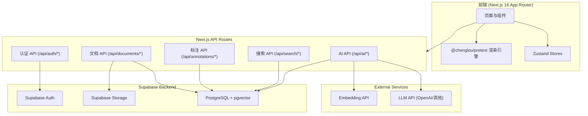
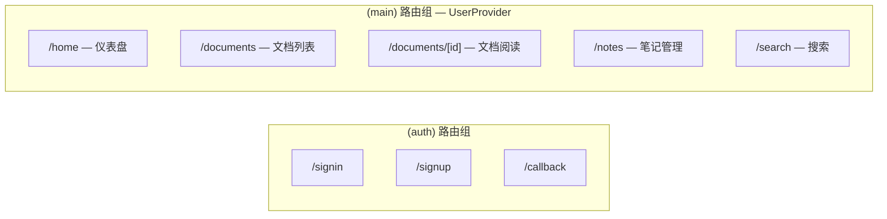
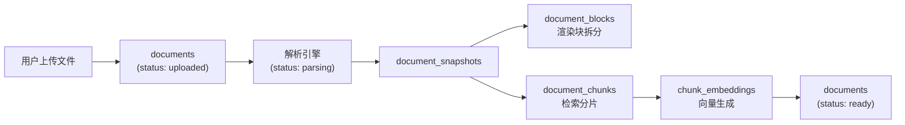
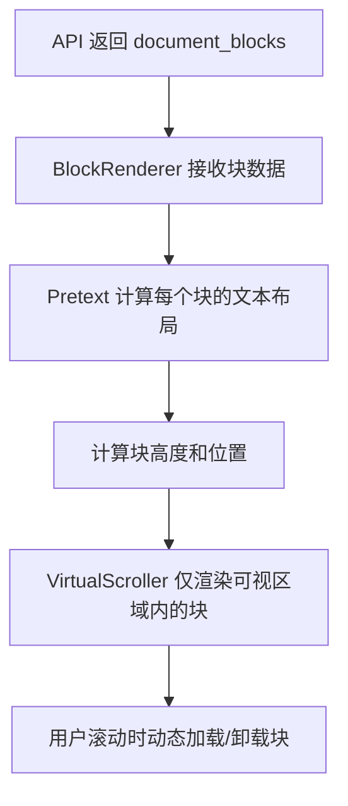
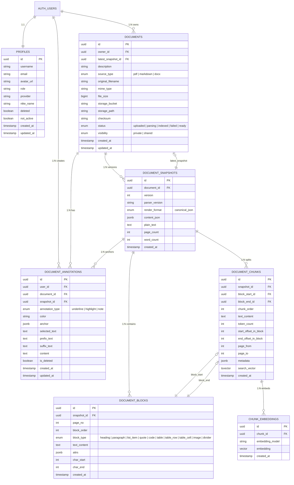
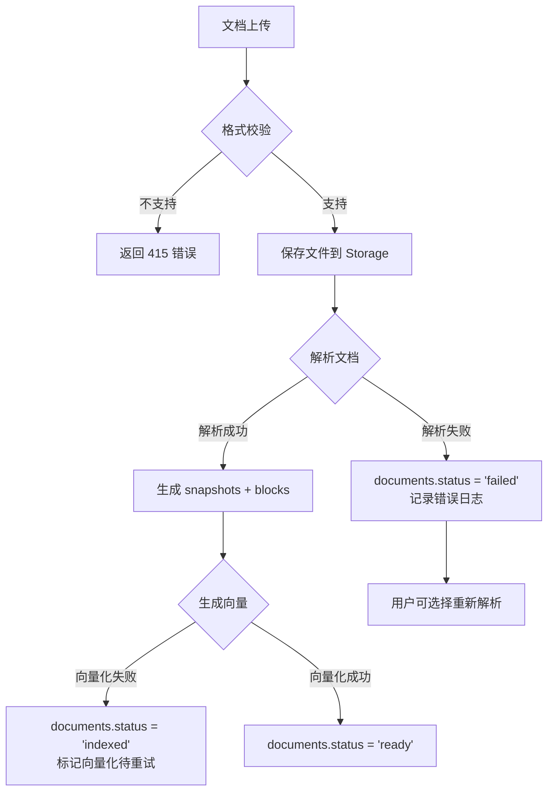

# 技术设计文档 — 智能文档库系统

## 概述

智能文档库系统是 Noter 平台的核心功能模块，围绕"文档"构建完整的上传、解析、渲染、标注、搜索和 AI 辅助理解流程。系统基于现有的 Next.js 16 + Supabase 技术栈，扩展文档管理、在线阅读、标注笔记、AI 问答和全文搜索五大能力。

### 核心设计决策

1. **文档渲染引擎**：采用 `@chenglou/pretext` 库进行纯算术文本测量和布局计算，配合虚拟滚动实现大文档高性能渲染
2. **文档解析流水线**：上传 → 解析 → 分块 → 向量化的异步处理管线，通过 `document_snapshots` 实现版本化管理
3. **标注锚定机制**：基于 `prefix + selected_text + suffix` 的文本锚定方案，确保标注在文档重新解析后仍能准确定位
4. **搜索双引擎**：PostgreSQL `tsvector` 全文检索 + `pgvector` 向量语义搜索，兼顾精确匹配和模糊语义
5. **AI 上下文构建**：基于 `document_chunks` 的 RAG 架构，通过向量检索获取相关文档片段作为 LLM 上下文

### 技术约束

- 前端遵循现有 monorepo 架构，UI 组件来自 `@noter/ui`，HTTP 客户端使用 `@noter/api`
- API 路由遵循 `handler()` + `success()/error()` 统一模式
- 状态管理使用 Zustand，表单校验使用 Zod
- 数据库使用 Supabase (PostgreSQL)，文件存储使用 Supabase Storage
- 代码注释和 API 消息使用中文
- 包管理器为pnpm

---

## 架构

### 系统架构总览



### 前端路由架构



### 数据处理流水线



---

## 组件与接口

### 1. 前端组件架构

#### 1.1 页面组件

| 页面 | 路径 | 职责 |
|------|------|------|
| 仪表盘 | `app/(main)/home/page.tsx` | 展示文档统计、最近文档、快捷操作 |
| 文档列表 | `app/(main)/documents/page.tsx` | 文档 CRUD、分页、筛选、可见性管理 |
| 文档阅读 | `app/(main)/documents/[id]/page.tsx` | 文档渲染、标注、笔记、AI 侧边栏 |
| 笔记管理 | `app/(main)/notes/page.tsx` | 跨文档笔记汇总、筛选、管理 |
| 搜索 | `app/(main)/search/page.tsx` | 关键词/语义搜索、结果定位 |

#### 1.2 核心业务组件

```
components/
├── documents/
│   ├── DocumentUploader.tsx        # 文档上传组件（拖拽 + 文件选择）
│   ├── DocumentList.tsx            # 文档列表（分页、筛选）
│   ├── DocumentCard.tsx            # 文档卡片（状态、操作菜单）
│   └── DocumentStatusBadge.tsx     # 文档状态标识
├── reader/
│   ├── DocumentReader.tsx          # 文档阅读主容器
│   ├── BlockRenderer.tsx           # 按块渲染器（基于 Pretext）
│   ├── VirtualScroller.tsx         # 虚拟滚动容器
│   ├── TextSelectionToolbar.tsx    # 文本选中浮动工具栏
│   └── PageIndicator.tsx           # 页码指示器
├── annotations/
│   ├── HighlightLayer.tsx          # 高亮渲染层
│   ├── UnderlineLayer.tsx          # 下划线渲染层
│   ├── NoteMarker.tsx              # 笔记标记图标
│   ├── NoteEditor.tsx              # 笔记编辑弹窗
│   ├── AnnotationList.tsx          # 标注列表侧边栏
│   └── ColorPicker.tsx             # 标注颜色选择器
├── ai/
│   ├── AIChatPanel.tsx             # AI 对话面板
│   ├── ChatMessage.tsx             # 对话消息气泡
│   ├── SummaryView.tsx             # 文档摘要展示
│   └── AIGeneratedNote.tsx         # AI 生成笔记预览
└── search/
    ├── SearchInput.tsx             # 搜索输入框
    ├── SearchResults.tsx           # 搜索结果列表
    └── SearchResultItem.tsx        # 搜索结果条目（含高亮片段）
```

#### 1.3 Pretext 文档渲染方案

`@chenglou/pretext` 是一个纯 TypeScript 文本测量库（15KB，零依赖），通过纯算术计算文本布局，不触碰 DOM，比传统 `getBoundingClientRect` 快约 500-600 倍。

**渲染流程：**



**核心实现策略：**

1. **按块渲染**：每个 `document_block` 作为独立渲染单元，Pretext 计算其文本测量数据（行高、行数、总高度）
2. **虚拟滚动**：`VirtualScroller` 维护一个块高度映射表，仅渲染视口内 ± 缓冲区的块，通过 Pretext 预计算的高度实现精确滚动定位
3. **懒加载**：大文档按页分批请求 `document_blocks`，滚动到接近边界时预加载下一批
4. **标注叠加**：标注层基于 Pretext 计算的字符位置（`char_start`/`char_end`）精确定位高亮和下划线的渲染坐标

### 2. Zustand Store 设计

```typescript
// stores/document.ts — 文档列表状态
interface DocumentState {
  documents: Document[]
  pagination: { page: number; pageSize: number; total: number }
  loading: boolean
  fetchDocuments: (page?: number) => Promise<void>
  deleteDocument: (id: string) => Promise<void>
  updateVisibility: (id: string, visibility: 'private' | 'shared') => Promise<void>
}

// stores/reader.ts — 文档阅读状态
interface ReaderState {
  document: Document | null
  blocks: DocumentBlock[]
  annotations: Annotation[]
  loadingBlocks: boolean
  fetchDocument: (id: string) => Promise<void>
  fetchBlocks: (snapshotId: string, page: number) => Promise<void>
  fetchAnnotations: (documentId: string) => Promise<void>
}

// stores/ai.ts — AI 对话状态
interface AIState {
  messages: ChatMessage[]
  conversationId: string | null
  loading: boolean
  sendMessage: (content: string, documentId: string) => Promise<void>
  clearConversation: () => void
  loadHistory: (documentId: string) => Promise<void>
}

// stores/search.ts — 搜索状态
interface SearchState {
  query: string
  results: SearchResult[]
  loading: boolean
  search: (query: string) => Promise<void>
}
```

### 3. API 路由设计

所有 API 路由遵循现有 `handler()` + `success()/error()` 模式，请求体通过 Zod schema 校验。

#### 3.1 文档 API

| 方法 | 路径 | 描述 | Zod Schema |
|------|------|------|------------|
| POST | `/api/documents/upload` | 上传文档 | `uploadSchema` |
| GET | `/api/documents` | 获取文档列表（分页） | query params |
| GET | `/api/documents/[id]` | 获取文档详情 | — |
| PATCH | `/api/documents/[id]` | 更新文档信息 | `updateDocSchema` |
| DELETE | `/api/documents/[id]` | 删除文档及关联数据 | — |
| PATCH | `/api/documents/[id]/visibility` | 设置可见性 | `visibilitySchema` |
| GET | `/api/documents/[id]/download` | 下载原始文件 | — |
| GET | `/api/documents/[id]/blocks` | 获取渲染块（分页） | query params |

#### 3.2 标注与笔记 API

| 方法 | 路径 | 描述 | Zod Schema |
|------|------|------|------------|
| POST | `/api/annotations` | 创建标注/笔记 | `createAnnotationSchema` |
| GET | `/api/annotations?documentId=x` | 获取文档标注列表 | query params |
| PATCH | `/api/annotations/[id]` | 更新笔记内容 | `updateAnnotationSchema` |
| DELETE | `/api/annotations/[id]` | 删除标注/笔记 | — |

#### 3.3 AI API

| 方法 | 路径 | 描述 | Zod Schema |
|------|------|------|------------|
| POST | `/api/ai/chat` | 发送对话消息 | `chatSchema` |
| POST | `/api/ai/summarize` | 生成文档摘要 | `summarizeSchema` |
| POST | `/api/ai/explain` | 解释选中内容 | `explainSchema` |
| POST | `/api/ai/generate-note` | AI 生成笔记 | `generateNoteSchema` |
| POST | `/api/ai/key-points` | 提炼文档重点 | `keyPointsSchema` |
| POST | `/api/ai/outline` | 梳理文档逻辑结构 | `outlineSchema` |
| GET | `/api/ai/history?documentId=x` | 获取对话历史 | query params |

#### 3.4 搜索 API

| 方法 | 路径 | 描述 | Zod Schema |
|------|------|------|------------|
| GET | `/api/search` | 关键词 + 语义搜索 | query params |

#### 3.5 HTTP 客户端封装

```typescript
// lib/axios/documents.ts
export const documentApi = {
  upload: (formData: FormData) => http.post<Document>('api/documents/upload', formData),
  list: (params: ListParams) => http.get<PaginatedResult<Document>>('api/documents', { params }),
  getById: (id: string) => http.get<DocumentDetail>(`api/documents/${id}`),
  update: (id: string, data: UpdateDocInput) => http.patch<Document>(`api/documents/${id}`, data),
  delete: (id: string) => http.delete<void>(`api/documents/${id}`),
  setVisibility: (id: string, visibility: string) =>
    http.patch<Document>(`api/documents/${id}/visibility`, { visibility }),
  download: (id: string) => http.get<Blob>(`api/documents/${id}/download`, { responseType: 'blob' }),
  getBlocks: (id: string, params: BlockParams) =>
    http.get<PaginatedResult<DocumentBlock>>(`api/documents/${id}/blocks`, { params }),
}

// lib/axios/annotations.ts
export const annotationApi = {
  create: (data: CreateAnnotationInput) => http.post<Annotation>('api/annotations', data),
  list: (documentId: string) => http.get<Annotation[]>('api/annotations', { params: { documentId } }),
  update: (id: string, data: UpdateAnnotationInput) => http.patch<Annotation>(`api/annotations/${id}`, data),
  delete: (id: string) => http.delete<void>(`api/annotations/${id}`),
}

// lib/axios/ai.ts
export const aiApi = {
  chat: (data: ChatInput) => http.post<ChatResponse>('api/ai/chat', data),
  summarize: (data: SummarizeInput) => http.post<SummaryResponse>('api/ai/summarize', data),
  explain: (data: ExplainInput) => http.post<ExplainResponse>('api/ai/explain', data),
  generateNote: (data: GenerateNoteInput) => http.post<GeneratedNote>('api/ai/generate-note', data),
  keyPoints: (data: KeyPointsInput) => http.post<KeyPointsResponse>('api/ai/key-points', data),
  outline: (data: OutlineInput) => http.post<OutlineResponse>('api/ai/outline', data),
  history: (documentId: string) => http.get<ChatMessage[]>('api/ai/history', { params: { documentId } }),
}

// lib/axios/search.ts
export const searchApi = {
  search: (params: SearchParams) => http.get<SearchResult[]>('api/search', { params }),
}
```

### 4. Zod Schema 设计

```typescript
// utils/noterFetch/feature/documents/schemas.ts
import { z } from 'zod'

export const uploadSchema = z.object({
  file: z.instanceof(File),
  description: z.string().optional(),
})

export const updateDocSchema = z.object({
  description: z.string().max(500, '描述不能超过 500 字').optional(),
})

export const visibilitySchema = z.object({
  visibility: z.enum(['private', 'shared']),
})

// utils/noterFetch/feature/annotations/schemas.ts
export const createAnnotationSchema = z.object({
  documentId: z.string().uuid('文档 ID 格式不正确'),
  snapshotId: z.string().uuid('快照 ID 格式不正确'),
  annotationType: z.enum(['underline', 'highlight', 'note']),
  color: z.string().regex(/^#[0-9a-fA-F]{6}$/, '颜色格式不正确').optional(),
  anchor: z.object({
    blockId: z.string().uuid(),
    charStart: z.number().int().min(0),
    charEnd: z.number().int().min(0),
  }),
  selectedText: z.string().min(1, '选中文本不能为空'),
  prefixText: z.string().optional(),
  suffixText: z.string().optional(),
  content: z.string().optional(), // 笔记内容，仅 annotation_type = 'note' 时必填
})

export const updateAnnotationSchema = z.object({
  content: z.string().min(1, '笔记内容不能为空'),
})

// utils/noterFetch/feature/ai/schemas.ts
export const chatSchema = z.object({
  documentId: z.string().uuid('文档 ID 格式不正确'),
  message: z.string().min(1, '消息不能为空').max(2000, '消息不能超过 2000 字'),
  conversationId: z.string().uuid().optional(),
})

export const summarizeSchema = z.object({
  documentId: z.string().uuid('文档 ID 格式不正确'),
})

export const explainSchema = z.object({
  documentId: z.string().uuid('文档 ID 格式不正确'),
  selectedText: z.string().min(1, '选中文本不能为空'),
})

export const generateNoteSchema = z.object({
  documentId: z.string().uuid('文档 ID 格式不正确'),
  conversationId: z.string().uuid().optional(),
})

export const keyPointsSchema = z.object({
  documentId: z.string().uuid('文档 ID 格式不正确'),
})

export const outlineSchema = z.object({
  documentId: z.string().uuid('文档 ID 格式不正确'),
})

// utils/noterFetch/feature/search/schemas.ts
export const searchSchema = z.object({
  q: z.string().min(1, '搜索关键词不能为空').max(200, '搜索关键词不能超过 200 字'),
  mode: z.enum(['keyword', 'semantic', 'hybrid']).default('hybrid'),
  page: z.coerce.number().int().min(1).default(1),
  pageSize: z.coerce.number().int().min(1).max(50).default(20),
})
```

---

## 数据模型

### 数据库 ER 图



### 表结构详细说明

#### profiles（用户资料表）

| 字段 | 类型 | 约束 | 说明 |
|------|------|------|------|
| id | uuid | PK | 关联 auth.users.id |
| username | text | NOT NULL | 用户名 |
| email | text | NOT NULL, UNIQUE | 邮箱 |
| avatar_url | text | — | 头像 URL |
| role | text | DEFAULT 'user' | 角色 |
| provider | text | — | 登录来源（email/github） |
| nike_name | text | — | 昵称 |
| deleted | boolean | DEFAULT false | 软删除标记 |
| not_active | boolean | DEFAULT true | 未激活标记 |
| created_at | timestamptz | DEFAULT now() | 创建时间 |
| updated_at | timestamptz | DEFAULT now() | 更新时间 |

**关系**：`auth.users` 1:1 `profiles`（通过 Supabase trigger 自动创建）

#### documents（文档主表）

| 字段 | 类型 | 约束 | 说明 |
|------|------|------|------|
| id | uuid | PK, DEFAULT gen_random_uuid() | 文档 ID |
| owner_id | uuid | FK → auth.users.id, NOT NULL | 文档所有者 |
| latest_snapshot_id | uuid | FK → document_snapshots.id | 最新快照引用 |
| description | text | — | 文档描述 |
| source_type | text | NOT NULL, CHECK | pdf / markdown / docx |
| original_filename | text | NOT NULL | 原始文件名 |
| mime_type | text | NOT NULL | MIME 类型 |
| file_size | bigint | NOT NULL | 文件大小（字节） |
| storage_bucket | text | NOT NULL | 存储桶名称 |
| storage_path | text | NOT NULL | 存储路径 |
| checksum | text | — | 文件校验和 |
| status | text | NOT NULL, DEFAULT 'uploaded' | uploaded / parsing / indexed / failed / ready |
| visibility | text | NOT NULL, DEFAULT 'private' | private / shared |
| created_at | timestamptz | DEFAULT now() | 创建时间 |
| updated_at | timestamptz | DEFAULT now() | 更新时间 |

**RLS 策略**：
- SELECT：`owner_id = auth.uid()` OR `visibility = 'shared'`
- INSERT/UPDATE/DELETE：`owner_id = auth.uid()`

#### document_snapshots（文档快照表）

| 字段 | 类型 | 约束 | 说明 |
|------|------|------|------|
| id | uuid | PK | 快照 ID |
| document_id | uuid | FK → documents.id, NOT NULL | 所属文档 |
| version | int | NOT NULL | 版本号 |
| parser_version | text | — | 解析器版本 |
| render_format | text | DEFAULT 'canonical_json' | 渲染格式 |
| content_json | jsonb | — | 完整结构化内容 |
| plain_text | text | — | 纯文本内容 |
| page_count | int | — | 页数 |
| word_count | int | — | 字数 |
| created_at | timestamptz | DEFAULT now() | 创建时间 |

**唯一约束**：`(document_id, version)`

#### document_blocks（文档渲染块表）

| 字段 | 类型 | 约束 | 说明 |
|------|------|------|------|
| id | uuid | PK | 块 ID |
| snapshot_id | uuid | FK → document_snapshots.id, NOT NULL | 所属快照 |
| page_no | int | NOT NULL | 所在页码 |
| block_order | int | NOT NULL | 块排序序号 |
| block_type | text | NOT NULL | heading / paragraph / list_item / quote / code / table / table_row / table_cell / image / divider |
| text_content | text | — | 文本内容 |
| attrs | jsonb | — | 块属性（如 heading level、code language） |
| char_start | int | NOT NULL | 在全文中的字符起始偏移 |
| char_end | int | NOT NULL | 在全文中的字符结束偏移 |
| created_at | timestamptz | DEFAULT now() | 创建时间 |

**唯一约束**：`(snapshot_id, block_order)`
**索引**：`snapshot_id + page_no`（按页查询优化）

#### document_chunks（文档检索分片表）

| 字段 | 类型 | 约束 | 说明 |
|------|------|------|------|
| id | uuid | PK | 分片 ID |
| snapshot_id | uuid | FK → document_snapshots.id, NOT NULL | 所属快照 |
| block_start_id | uuid | FK → document_blocks.id | 起始块引用 |
| block_end_id | uuid | FK → document_blocks.id | 结束块引用 |
| chunk_order | int | NOT NULL | 分片排序序号 |
| text_content | text | NOT NULL | 分片文本 |
| token_count | int | — | token 数量 |
| start_offset_in_block | int | — | 在起始块中的偏移 |
| end_offset_in_block | int | — | 在结束块中的偏移 |
| page_from | int | — | 起始页码 |
| page_to | int | — | 结束页码 |
| metadata | jsonb | — | 额外元数据 |
| search_vector | tsvector | — | 全文检索向量 |
| created_at | timestamptz | DEFAULT now() | 创建时间 |

**唯一约束**：`(snapshot_id, chunk_order)`
**索引**：`search_vector` GIN 索引（全文检索）

#### chunk_embeddings（分片向量表）

| 字段 | 类型 | 约束 | 说明 |
|------|------|------|------|
| id | uuid | PK | 向量 ID |
| chunk_id | uuid | FK → document_chunks.id, NOT NULL | 所属分片 |
| embedding_model | text | NOT NULL | 向量模型名称 |
| embedding | vector | NOT NULL | 向量数据（pgvector） |
| created_at | timestamptz | DEFAULT now() | 创建时间 |

**唯一约束**：`(chunk_id, embedding_model)`
**索引**：`embedding` HNSW 索引（向量近似搜索）

#### document_annotations（用户标注表）

| 字段 | 类型 | 约束 | 说明 |
|------|------|------|------|
| id | uuid | PK | 标注 ID |
| user_id | uuid | FK → auth.users.id, NOT NULL | 标注创建者 |
| document_id | uuid | FK → documents.id, NOT NULL | 所属文档 |
| snapshot_id | uuid | FK → document_snapshots.id, NOT NULL | 锚定快照 |
| annotation_type | text | NOT NULL | underline / highlight / note |
| color | text | — | 标注颜色（#RRGGBB） |
| anchor | jsonb | NOT NULL | 锚定信息 `{ blockId, charStart, charEnd }` |
| selected_text | text | NOT NULL | 选中的原文文本 |
| prefix_text | text | — | 选中文本前的上下文（用于模糊定位） |
| suffix_text | text | — | 选中文本后的上下文（用于模糊定位） |
| content | text | — | 笔记内容（仅 note 类型） |
| is_deleted | boolean | DEFAULT false | 软删除标记 |
| created_at | timestamptz | DEFAULT now() | 创建时间 |
| updated_at | timestamptz | DEFAULT now() | 更新时间 |

**RLS 策略**：
- SELECT/INSERT/UPDATE/DELETE：`user_id = auth.uid()`

### 业务数据流

```
用户上传文档 → documents (status: uploaded)
    ↓
解析生成结构化版本 → document_snapshots (status: parsing → indexed)
    ↓
拆分渲染块 → document_blocks
    ↓
拆分检索分片 → document_chunks
    ↓
生成向量 → chunk_embeddings (status: ready)
    ↓
用户阅读时做标注 → document_annotations
```

### TypeScript 类型定义

```typescript
// types/document.ts
export interface Document {
  id: string
  ownerId: string
  description: string | null
  sourceType: 'pdf' | 'markdown' | 'docx'
  originalFilename: string
  mimeType: string
  fileSize: number
  status: 'uploaded' | 'parsing' | 'indexed' | 'failed' | 'ready'
  visibility: 'private' | 'shared'
  createdAt: string
  updatedAt: string
}

export interface DocumentBlock {
  id: string
  snapshotId: string
  pageNo: number
  blockOrder: number
  blockType: 'heading' | 'paragraph' | 'list_item' | 'quote' | 'code'
    | 'table' | 'table_row' | 'table_cell' | 'image' | 'divider'
  textContent: string | null
  attrs: Record<string, unknown> | null
  charStart: number
  charEnd: number
}

export interface Annotation {
  id: string
  userId: string
  documentId: string
  snapshotId: string
  annotationType: 'underline' | 'highlight' | 'note'
  color: string | null
  anchor: { blockId: string; charStart: number; charEnd: number }
  selectedText: string
  prefixText: string | null
  suffixText: string | null
  content: string | null
  isDeleted: boolean
  createdAt: string
  updatedAt: string
}

// types/ai.ts
export interface ChatMessage {
  id: string
  role: 'user' | 'assistant'
  content: string
  createdAt: string
}

export interface ChatInput {
  documentId: string
  message: string
  conversationId?: string
}

// types/search.ts
export interface SearchResult {
  documentId: string
  documentTitle: string
  chunkId: string
  snippet: string
  highlightedSnippet: string
  pageNo: number
  score: number
}

export interface SearchParams {
  q: string
  mode: 'keyword' | 'semantic' | 'hybrid'
  page: number
  pageSize: number
}
```

---

## 正确性属性（Correctness Properties）

*正确性属性是一种在系统所有合法执行路径上都应成立的特征或行为——本质上是对系统应做什么的形式化陈述。属性是连接人类可读规格说明与机器可验证正确性保证之间的桥梁。*

### Property 1: 注册输入校验

*For any* 包含无效邮箱格式或不符合要求的密码的注册请求，系统应拒绝该请求并返回包含具体校验错误信息的响应，且不创建任何用户账户。

**Validates: Requirements 1.1, 1.2**

### Property 2: 用户信息更新往返

*For any* 已登录用户和任意合法的个人信息更新（用户名、头像），更新后重新获取用户信息应返回包含更新后字段值的完整用户资料（用户名、邮箱、头像）。

**Validates: Requirements 3.1, 3.2**

### Property 3: 文档上传完整性

*For any* 支持格式的文件上传，系统应创建包含原始文件名、文件大小、MIME 类型和创建时间的文档记录；对于不支持格式的文件，系统应拒绝上传并返回错误。

**Validates: Requirements 5.1, 5.4, 5.5**

### Property 4: 文档列表分页

*For any* 用户的文档列表请求，返回的文档数量不应超过请求的页大小，且每条文档记录应包含文件名、上传时间和文档状态字段，分页元数据（总数、当前页、总页数）应与实际数据一致。

**Validates: Requirements 6.1, 6.2**

### Property 5: 文档描述更新往返

*For any* 文档和任意合法描述文本，更新描述后重新获取该文档应返回更新后的描述内容。

**Validates: Requirements 6.3**

### Property 6: 文档级联删除

*For any* 文档，删除该文档后，该文档的所有关联数据（快照、渲染块、检索分片、向量、标注、笔记）均不应再可查询到。

**Validates: Requirements 6.4**

### Property 7: 文档可见性访问控制

*For any* 文档和任意两个不同用户，当文档可见性为 "private" 时仅所有者可访问；当可见性为 "shared" 时任意已登录用户均可访问；且可见性切换应立即生效。

**Validates: Requirements 6.5, 6.6, 6.7, 21.1**

### Property 8: 块渲染器类型覆盖

*For any* `document_block`（类型为 heading、paragraph、list_item、quote、code、table、table_row、table_cell、image、divider 中的任意一种），块渲染器应产生有效的渲染输出而不抛出错误。

**Validates: Requirements 7.2**

### Property 9: 渲染块分页加载

*For any* 文档快照的块查询请求，返回的块应按 `block_order` 排序，数量不超过请求的页大小，且支持按页码筛选。

**Validates: Requirements 7.3**

### Property 10: 文件下载往返

*For any* 已上传的文档，下载该文档的原始文件后，其内容（校验和）应与上传时的原始文件完全一致。

**Validates: Requirements 8.1, 8.2**

### Property 11: 标注创建往返

*For any* 合法的标注创建请求（类型为 highlight、underline 或 note，包含有效的锚定信息、选中文本和可选颜色），创建后通过标注列表 API 查询应能获取到该标注，且所有字段值与创建时一致。

**Validates: Requirements 9.1, 9.2, 9.3, 10.2**

### Property 12: 标注锚定准确性

*For any* 标注的锚定信息（blockId、charStart、charEnd），在对应的 `document_block` 中按 charStart 和 charEnd 截取的文本应与标注的 `selected_text` 一致。

**Validates: Requirements 9.4, 12.2**

### Property 13: 标注不修改文档

*For any* 文档和任意数量的标注操作（创建、更新、删除），文档的 `document_blocks` 内容应保持不变。

**Validates: Requirements 9.5**

### Property 14: 标注列表完整性

*For any* 用户和文档，标注列表 API 应返回该用户在该文档上创建的所有未删除标注和笔记，且不遗漏。

**Validates: Requirements 11.1, 12.1**

### Property 15: 笔记内容更新往返

*For any* 笔记和任意合法的新内容，更新后重新获取该笔记应返回更新后的内容。

**Validates: Requirements 11.2**

### Property 16: 标注软删除

*For any* 标注或笔记，执行删除操作后，该标注不应再出现在标注列表 API 的返回结果中。

**Validates: Requirements 11.3**

### Property 17: 新对话清除上下文

*For any* 用户和文档，开始新对话（不传 conversationId）时，系统应创建新的 conversationId，且新对话的上下文不应包含之前对话的消息。

**Validates: Requirements 15.3**

### Property 18: 对话历史持久化

*For any* 用户与文档的对话，对话历史 API 应按时间顺序返回所有已发送的消息（包含用户消息和 AI 回复）。

**Validates: Requirements 15.4**

### Property 19: AI 生成笔记持久化

*For any* 用户确认保存的 AI 生成笔记，该笔记应出现在用户的标注列表中，且内容与 AI 生成的内容一致。

**Validates: Requirements 16.3**

### Property 20: 关键词搜索覆盖

*For any* 在用户文档标题或正文中确实存在的关键词，搜索该关键词应返回包含该关键词的文档结果。

**Validates: Requirements 18.1, 18.2**

### Property 21: 搜索结果排序与高亮

*For any* 搜索结果列表，结果应按相关度分数降序排列，且每条结果的高亮片段应包含搜索关键词。

**Validates: Requirements 18.3**

### Property 22: 语义搜索相关性

*For any* 与文档内容语义相关的搜索查询（即使存在拼写偏差），向量搜索应返回语义相关的文档分片结果。

**Validates: Requirements 19.1**

### Property 23: 搜索结果定位信息

*For any* 搜索结果条目，应包含足够的定位信息（documentId、chunkId、pageNo），使前端能够导航到文档中的对应位置。

**Validates: Requirements 20.1**

### Property 24: 标注数据隔离

*For any* 两个不同用户，用户 A 不应能通过标注 API 查看、修改或删除用户 B 创建的标注和笔记。

**Validates: Requirements 11.4, 21.2**

### Property 25: AI 对话历史隔离

*For any* 两个不同用户，用户 A 不应能通过对话历史 API 查看用户 B 的 AI 对话记录。

**Validates: Requirements 21.3**

### Property 26: 全局输入校验

*For any* API 端点和任意不符合 Zod schema 定义的请求数据，系统应返回包含具体校验错误信息的 400 响应，且不执行任何业务逻辑。

**Validates: Requirements 1.2, 21.4**

### Property 27: 未认证访问拒绝

*For any* 受保护的 API 端点，未携带有效认证信息的请求应收到 401 响应。

**Validates: Requirements 21.5**

---

## 错误处理

### 错误处理架构

系统沿用现有的 `handler()` + `success()/error()` 统一错误处理模式，所有 API 路由通过 `handler()` 包装，自动捕获 Zod 校验错误、JSON 解析错误和运行时异常。

### 错误分类与处理策略

| 错误类型 | HTTP 状态码 | 处理方式 | 示例 |
|----------|------------|----------|------|
| Zod 校验失败 | 400 | 返回首条校验错误信息 | 邮箱格式不正确、密码至少 6 位 |
| JSON 解析失败 | 400 | 返回"请求体不是合法 JSON" | 畸形请求体 |
| 未认证 | 401 | 前端自动跳转登录页 | 未携带 session cookie |
| 无权限 | 403 | 返回权限不足提示 | 访问他人私有文档 |
| 资源不存在 | 404 | 返回资源不存在提示 | 文档 ID 不存在 |
| 文件格式不支持 | 415 | 返回支持的格式列表 | 上传 .exe 文件 |
| 文件过大 | 413 | 返回文件大小限制提示 | 超过上传限制 |
| 服务器内部错误 | 500 | 记录日志，返回通用错误 | 数据库连接失败 |

### 文档处理流水线错误



### 前端错误处理

- HTTP 客户端（`lib/axios/client.ts`）已有 401 自动跳转登录的拦截器
- 各 Zustand store 的异步方法通过 try/catch 捕获错误，更新 loading/error 状态
- 文档上传组件显示上传进度和错误反馈
- 文档阅读页根据 `document.status` 显示不同状态（parsing/failed/ready）
- AI 对话面板处理流式响应中断和超时

### Supabase RLS 错误

当 RLS 策略拒绝访问时，Supabase 返回空结果集（SELECT）或抛出错误（INSERT/UPDATE/DELETE）。API 路由层需要区分"无数据"和"无权限"两种情况：

```typescript
// API 路由中的权限检查模式
const { data, error } = await supabase
  .from('documents')
  .select('*')
  .eq('id', documentId)
  .single()

if (error || !data) {
  return error('文档不存在或无权访问', 404)
}
```

---

## 测试策略

### 测试框架选型

| 测试类型 | 工具 | 说明 |
|----------|------|------|
| 单元测试 | Vitest | Next.js 生态首选，兼容 Jest API |
| 属性测试 | fast-check + Vitest | fast-check 是 TypeScript 生态最成熟的属性测试库 |
| 组件测试 | Vitest + @testing-library/react | React 组件渲染和交互测试 |
| API 集成测试 | Vitest + Supabase local | 使用 Supabase CLI 本地实例 |

### 属性测试配置

- 使用 `fast-check` 库（`npm install -D fast-check`）
- 每个属性测试最少运行 100 次迭代
- 每个属性测试必须通过注释引用设计文档中的属性编号
- 注释格式：`// Feature: smart-document-library, Property {number}: {property_text}`
- 每个正确性属性由一个属性测试实现

### 单元测试与属性测试分工

**单元测试负责：**
- 具体示例验证（如：上传特定 Markdown 文件、GitHub OAuth 回调处理）
- 边界条件（如：过期验证链接、空搜索结果、文档解析失败状态）
- 组件渲染快照（如：各种 block_type 的渲染输出）
- API 集成点（如：Supabase Auth 交互、Storage 上传）

**属性测试负责：**
- 所有正确性属性（Property 1-27）的自动化验证
- 通过随机生成输入覆盖大量场景
- 重点覆盖：
  - 输入校验（Property 1, 26）：随机生成各种非法输入
  - 往返属性（Property 2, 5, 10, 11, 15）：随机生成合法数据，验证写入-读取一致性
  - 数据隔离（Property 7, 24, 25, 27）：随机生成多用户场景，验证访问控制
  - 不变量（Property 13）：随机执行标注操作，验证文档内容不变
  - 分页（Property 4, 9）：随机生成数据量和页参数，验证分页正确性

### 测试目录结构

```
__tests__/
├── unit/
│   ├── schemas/           # Zod schema 校验测试
│   ├── components/        # 组件渲染测试
│   └── utils/             # 工具函数测试
├── properties/
│   ├── document.prop.ts   # 文档相关属性测试 (P3-P10)
│   ├── annotation.prop.ts # 标注相关属性测试 (P11-P16)
│   ├── ai.prop.ts         # AI 相关属性测试 (P17-P19)
│   ├── search.prop.ts     # 搜索相关属性测试 (P20-P23)
│   ├── auth.prop.ts       # 认证相关属性测试 (P1-P2, P26-P27)
│   └── isolation.prop.ts  # 数据隔离属性测试 (P7, P24-P25)
└── integration/
    ├── upload.test.ts     # 文档上传集成测试
    ├── reader.test.ts     # 文档阅读集成测试
    └── ai-chat.test.ts    # AI 对话集成测试
```

### 属性测试示例

```typescript
import { describe, it, expect } from 'vitest'
import fc from 'fast-check'

// Feature: smart-document-library, Property 26: 全局输入校验
describe('Property 26: 全局输入校验', () => {
  it('对于任意不符合 schema 的请求数据，应返回 400 错误', () => {
    fc.assert(
      fc.property(
        fc.record({
          email: fc.oneof(fc.constant(''), fc.constant('not-an-email'), fc.integer()),
          password: fc.oneof(fc.constant(''), fc.string({ maxLength: 5 })),
        }),
        async (invalidInput) => {
          const result = signInSchema.safeParse(invalidInput)
          expect(result.success).toBe(false)
        }
      ),
      { numRuns: 100 }
    )
  })
})

// Feature: smart-document-library, Property 12: 标注锚定准确性
describe('Property 12: 标注锚定准确性', () => {
  it('对于任意标注锚定，截取的文本应与 selectedText 一致', () => {
    fc.assert(
      fc.property(
        fc.string({ minLength: 10, maxLength: 1000 }),
        fc.integer({ min: 0, max: 500 }),
        (fullText, start) => {
          const end = Math.min(start + 5, fullText.length)
          if (start >= end || start >= fullText.length) return // 跳过无效范围
          const selectedText = fullText.slice(start, end)
          const anchor = { charStart: start, charEnd: end }
          expect(fullText.slice(anchor.charStart, anchor.charEnd)).toBe(selectedText)
        }
      ),
      { numRuns: 100 }
    )
  })
})
```
