# noter 论文配图清单

本文件集中收纳论文正文中所有 mermaid 配图。每条目按"图编号 / 图名 / 所在小节 / 简短解释 / mermaid 源代码"五要素组织，与 paper/noterPaper.md 中正文内嵌的 mermaid 代码块逐字一致。

## 总目录

1. 图 3.1 noter 系统总用例图
2. 图 3.2 文档生命周期子模块用例图
3. 图 3.3 Noter Agent 多轮 Skill 子模块用例图
4. 图 3.4 noter 系统总体数据流图
5. 图 3.5 文档上传与 RAG 解析流水线 1 层 DFD
6. 图 3.6 文档上传与 RAG 解析流水线 2 层 DFD
7. 图 3.7 AI 问答 SSE 流水线 1 层 DFD
8. 图 3.8 AI 问答 SSE 流水线 2 层 DFD
9. 图 4.1 noter 系统总体功能模块图
10. 图 4.2 文档主域与组织域实体关系图
11. 图 4.3 用户域与 Agent 域实体关系图
12. 图 4.4 管理后台域实体关系图
13. 图 5.1 文档上传与 RAG 解析流水线时序图
14. 图 5.4 Noter Agent 多轮 Skill 与 SSE 时序图
15. 图 6.1 noter 项目后端结构图
16. 图 6.2 noter 项目前端结构图

> 备注：图 5.2、图 5.3 为第五章 5.1.3 节的运行界面截图（上传弹窗与阅读页 AI 总结卡片），由 task 5.1.3 录入论文正文，本配图清单只收纳 mermaid 源图，因此此处不另起条目。

---

## 图 3.1 noter 系统总用例图

- 所在小节：第三章 3.2.1 总用例图
- 简短解释：以四档角色（未登录访客、普通用户、管理员、超级管理员）为执行者，按合并去重后的功能集合呈现 noter 系统总用例分布，超级管理员通过虚线继承管理员能力。

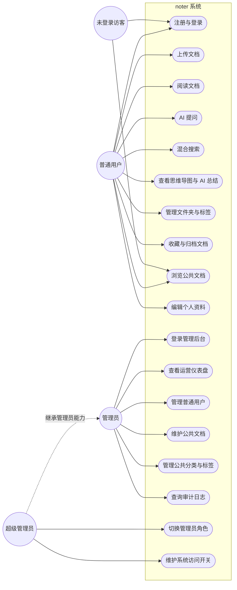

## 图 3.2 文档生命周期子模块用例图

- 所在小节：第三章 3.2.2 子模块用例图与用例说明
- 简短解释：刻画 user 完成上传、阅读、检索、删除等私有动作，以及 admin 与 super_admin 在管理端维护公共文档与切换用户角色的关键用例。

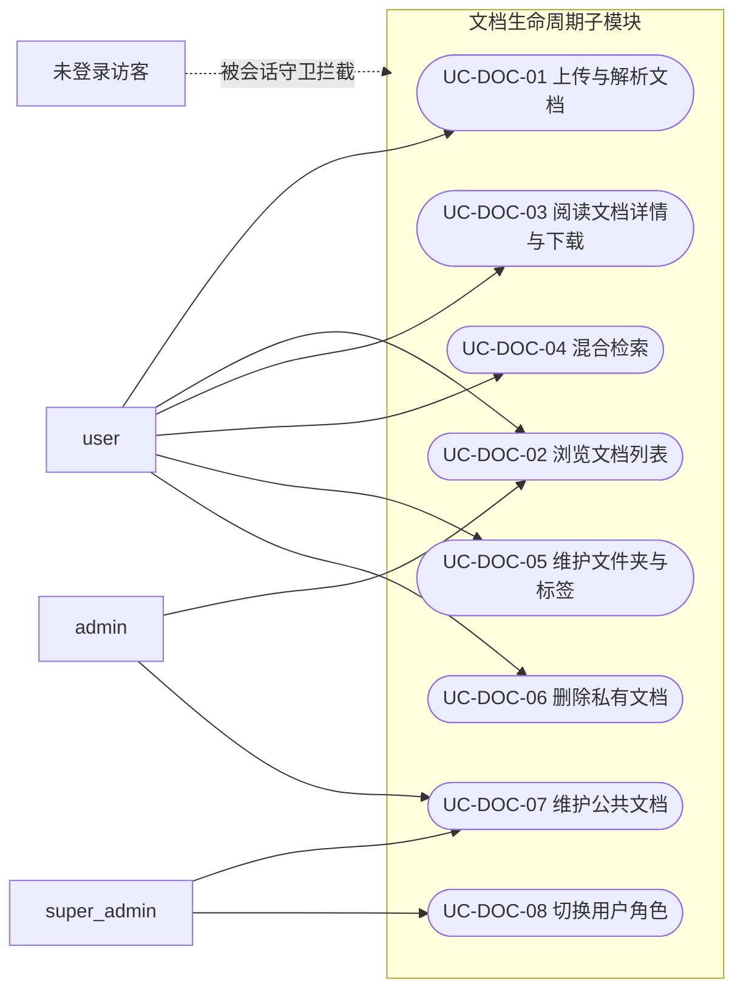

## 图 3.3 Noter Agent 多轮 Skill 子模块用例图

- 所在小节：第三章 3.2.2 子模块用例图与用例说明
- 简短解释：聚焦已登录 user 与 Noter Agent 的对话路径，覆盖五条 Skill 与启动入口、Skill 切换、SSE 接收三类公共用例。

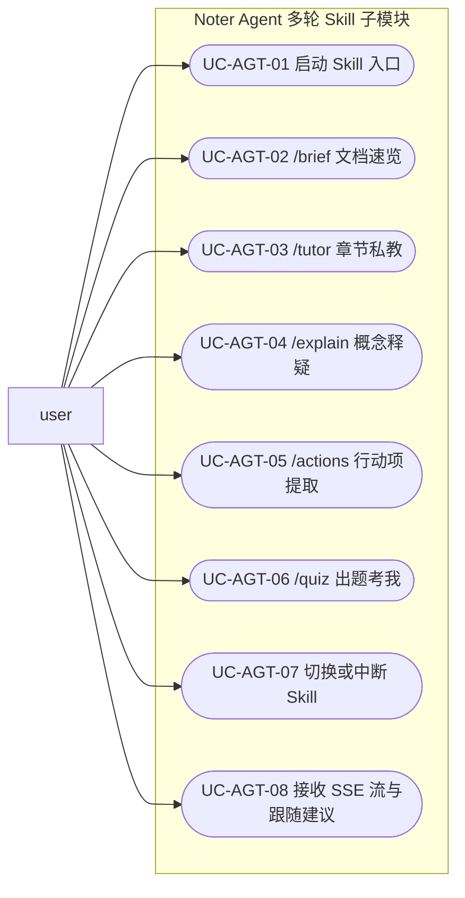

## 图 3.4 noter 系统总体数据流图

- 所在小节：第三章 3.3.1 总体数据流图
- 简短解释：以用户与管理员为源点和终点，把上传、解析向量化、总结与思维导图、阅读问答、管理后台审核五个处理串到 Storage、Postgres、pgvector、agent_skill_sessions 四类数据存储上。

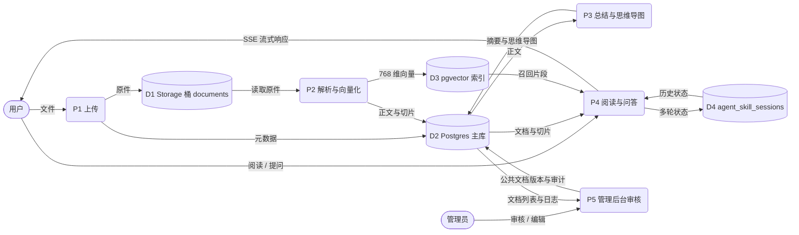

## 图 3.5 文档上传与 RAG 解析流水线 1 层 DFD

- 所在小节：第三章 3.3.2 子模块 1、2 层数据流图
- 简短解释：把文档上传与 RAG 解析视为单一加工 P1，标注用户输入、Storage 桶、文档主域 Postgres 表与 document_processing_jobs 之间的数据流向。

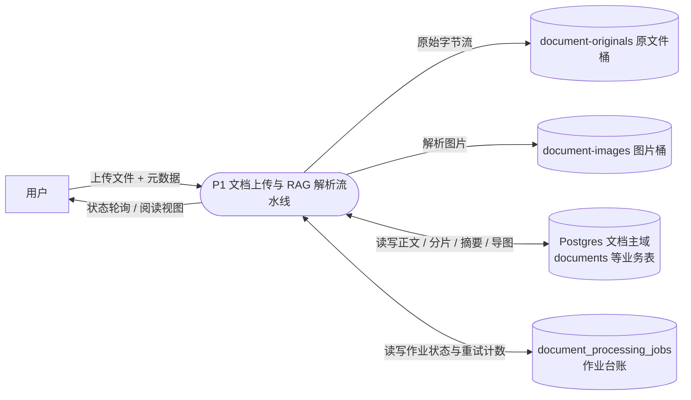

## 图 3.6 文档上传与 RAG 解析流水线 2 层 DFD

- 所在小节：第三章 3.3.2 子模块 1、2 层数据流图
- 简短解释：把 P1 拆为接收上传、LlamaParse 解析、分片向量化、AI 总结、思维导图五个子加工，标注 documents 四个 status 字段与 document_processing_jobs 的双向流。

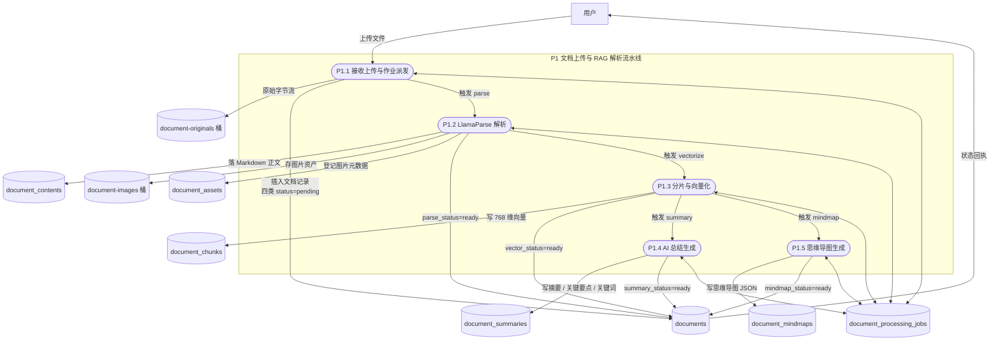

## 图 3.7 AI 问答 SSE 流水线 1 层 DFD

- 所在小节：第三章 3.3.2 子模块 1、2 层数据流图
- 简短解释：把 Noter Agent SSE 视为单一加工 P2，标注用户、文档主域 Postgres 与仅 service_role 可访问的 agent_skill_sessions 之间的输入输出。

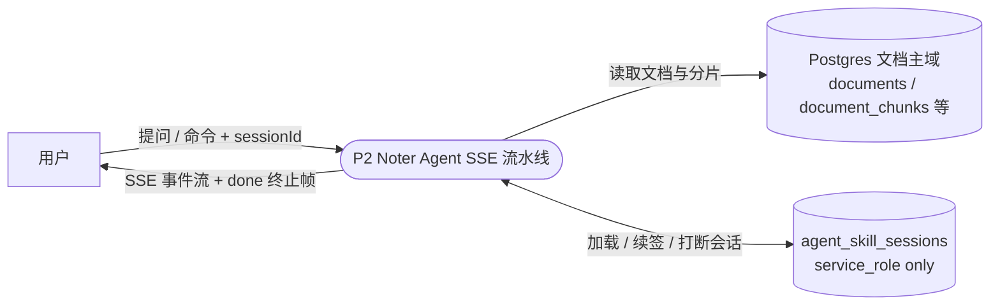

## 图 3.8 AI 问答 SSE 流水线 2 层 DFD

- 所在小节：第三章 3.3.2 子模块 1、2 层数据流图
- 简短解释：把 P2 拆为鉴权校验、Skill 路由决策、Skill 执行与工具调用、SSE 流式输出、会话状态回写五个子加工，标注与文档主域、pgvector 索引、agent_skill_sessions 及外部 LLM 之间的数据流。

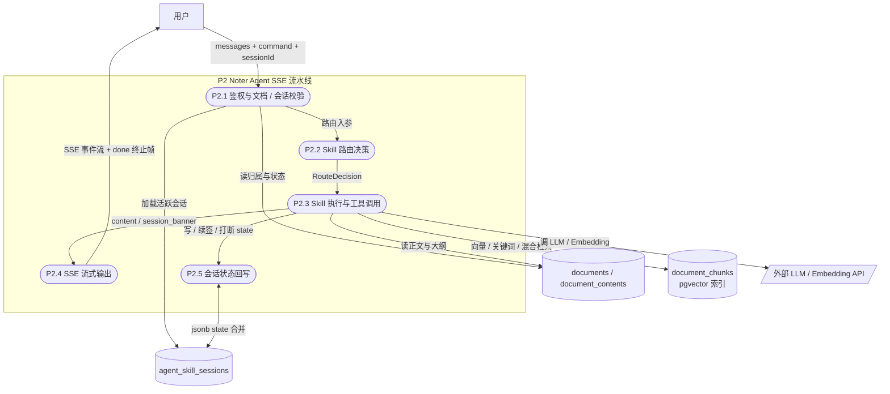

## 图 4.1 noter 系统总体功能模块图

- 所在小节：第四章 4.2.1 系统总体功能模块划分
- 简短解释：按部署形态把 noter 拆为用户端前端、管理端前端、共享 UI 与代码包、Supabase 后端四大模块，并标注前端两端经共享包按 RLS 与 service_role 直连后端的关系。

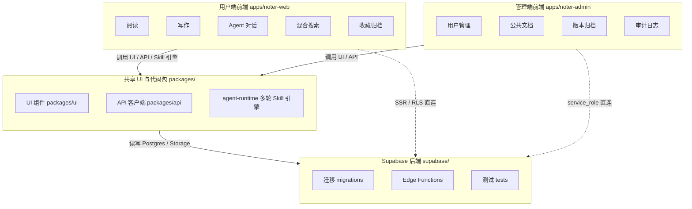

## 图 4.2 文档主域与组织域实体关系图

- 所在小节：第四章 4.3.1 概念结构设计
- 简短解释：以 documents 为核心列出文档主域八张业务表与组织域三张表之间的一对一、一对多、多对多关系，document_tags 作为关联表承载 documents 与 tags 的多对多。

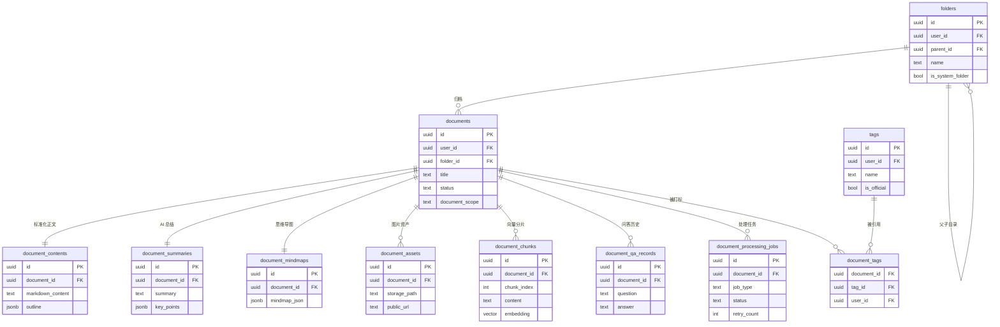

## 图 4.3 用户域与 Agent 域实体关系图

- 所在小节：第四章 4.3.1 概念结构设计
- 简短解释：刻画用户域与 Agent 域两条主线，profiles 与 user_settings 一对一、与 agent_skill_sessions 一对多，agent_skill_sessions 跨域引用 documents 形成多对一。

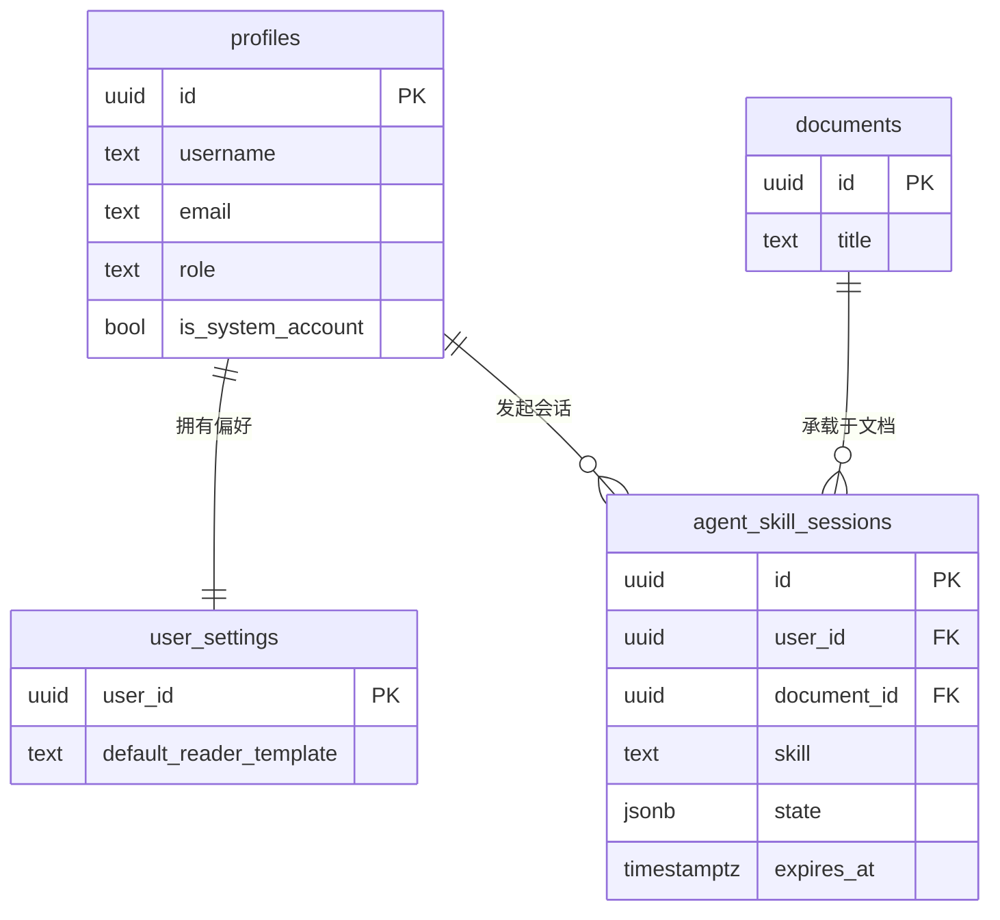

## 图 4.4 管理后台域实体关系图

- 所在小节：第四章 4.3.1 概念结构设计
- 简短解释：以管理后台四张表为骨架，标注 public_categories、public_document_versions、admin_audit_logs、system_settings 与 documents、profiles 之间的归类、版本与审计引用关系。

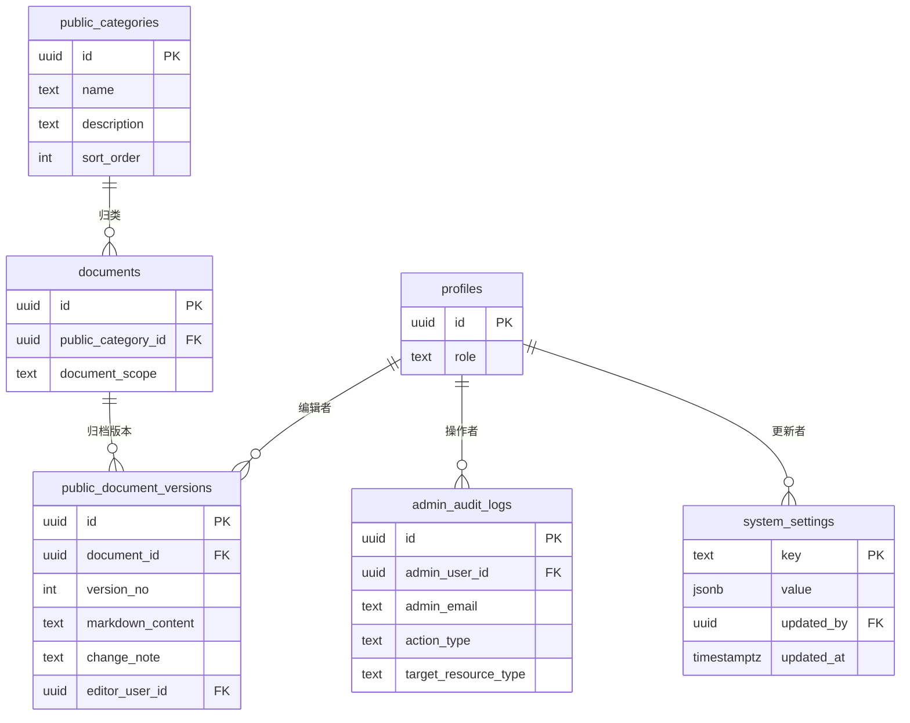

## 图 5.1 文档上传与 RAG 解析流水线时序图

- 所在小节：第五章 5.1.2 内部处理逻辑
- 简短解释：以九类参与者串起从用户提交文件到前端轮询四类 status 字段的完整流水线，覆盖 LlamaParse 解析、向量切片、AI 总结与思维导图的并行触发以及状态回写返回路径。

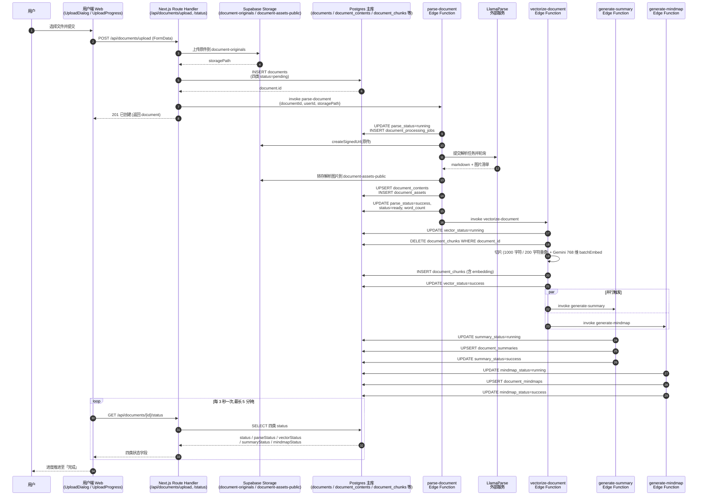

## 图 5.4 Noter Agent 多轮 Skill 与 SSE 时序图

- 所在小节：第五章 5.2.1 模块用途与内部处理逻辑
- 简短解释：刻画用户消息经 `/api/ai/chat/stream` 进入 orchestrator 后按 router → skill → tools → SSE 顺序调度，并把 `agent_skill_sessions.state` 演进与 `[DONE]` 终止帧的回写路径标出。

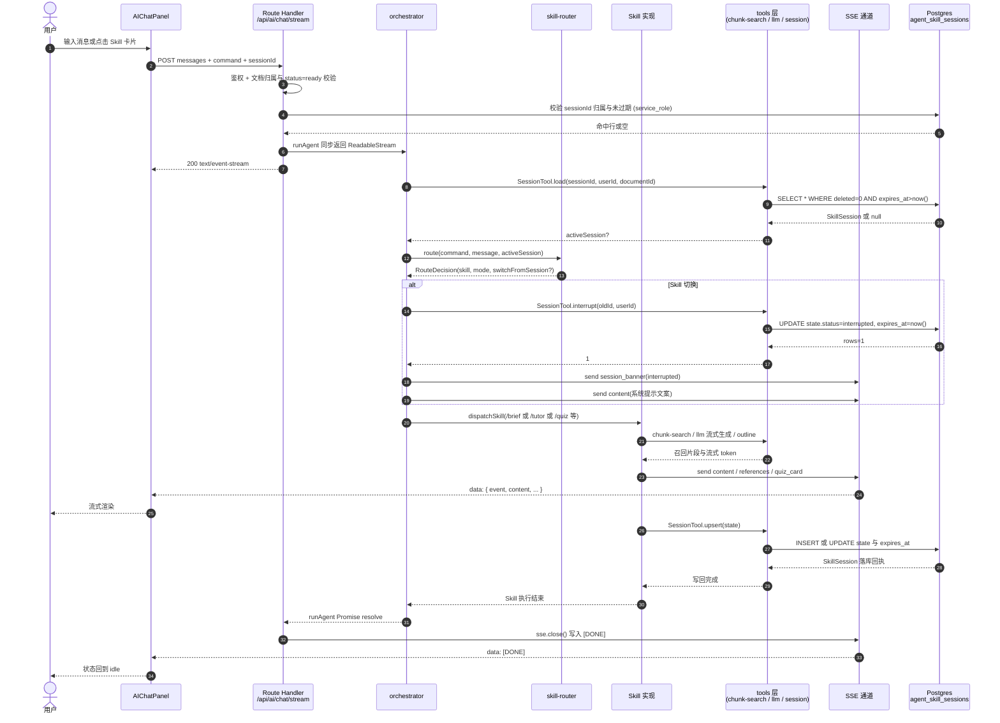

## 图 6.1 noter 项目后端结构图

- 所在小节：第六章 6.1 项目后端结构
- 简短解释：以用户端 API、管理端 API、Edge Functions、迁移与表四块为骨架，标注用户端走 SSR + RLS、管理端走 service_role、Edge Functions 在 Deno 沙箱内链式 invoke、迁移按时间戳前缀演进的互通方式。

```mermaid
flowchart TB
    subgraph WebAPI["用户端 API<br/>apps/noter-web/app/api"]
        WAI[ai/chat、ai/sessions<br/>ai/regenerate-summary<br/>ai/regenerate-mindmap]
        WAU[auth/signin、register<br/>callback、profile]
        WAD[documents/upload<br/>documents/[id]]
        WAF[folders / search / tags]
    end

    subgraph AdminAPI["管理端 API<br/>apps/noter-admin/app/api/admin"]
        AAU[users / audit-logs]
        AAP[public-documents/upload<br/>public-documents/[id]<br/>public-categories<br/>public-tags]
        AAD[dashboard/metrics<br/>dashboard/trends<br/>dashboard/distributions<br/>documents]
        AAS[system-settings]
    end

    subgraph EF["Edge Functions<br/>supabase/functions（Deno）"]
        EP[parse-document]
        EV[vectorize-document]
        ES[generate-summary]
        EM[generate-mindmap]
    end

    subgraph MIG["迁移与表<br/>supabase/migrations"]
        M1[20260516175445<br/>agent_skill_sessions]
        M2[20260516180339 / 182557<br/>混合搜索 RPC]
        M3[20260517223443—223451<br/>admin platform 一系列]
        M4[20260517223452<br/>auto_version_v1_trigger]
    end

    WebAPI -->|@supabase/ssr<br/>anon key + RLS| MIG
    AdminAPI -->|service_role<br/>绕过 RLS| MIG
    WebAPI -.invoke('parse-document').-> EP
    EP -->|invoke| EV
    EV -->|invoke| ES
    EV -->|invoke| EM
    EF -->|service_role 读写| MIG
```

## 图 6.2 noter 项目前端结构图

- 所在小节：第六章 6.2 项目前端结构
- 简短解释：按 Next.js App Router 路由组划分用户端 `(auth)/(main)` 与管理端 `(admin)/(auth)`，标注 `provider/userProvider.ts` 注入容器布局、共享 UI 包同时被两端按需引用的关系。

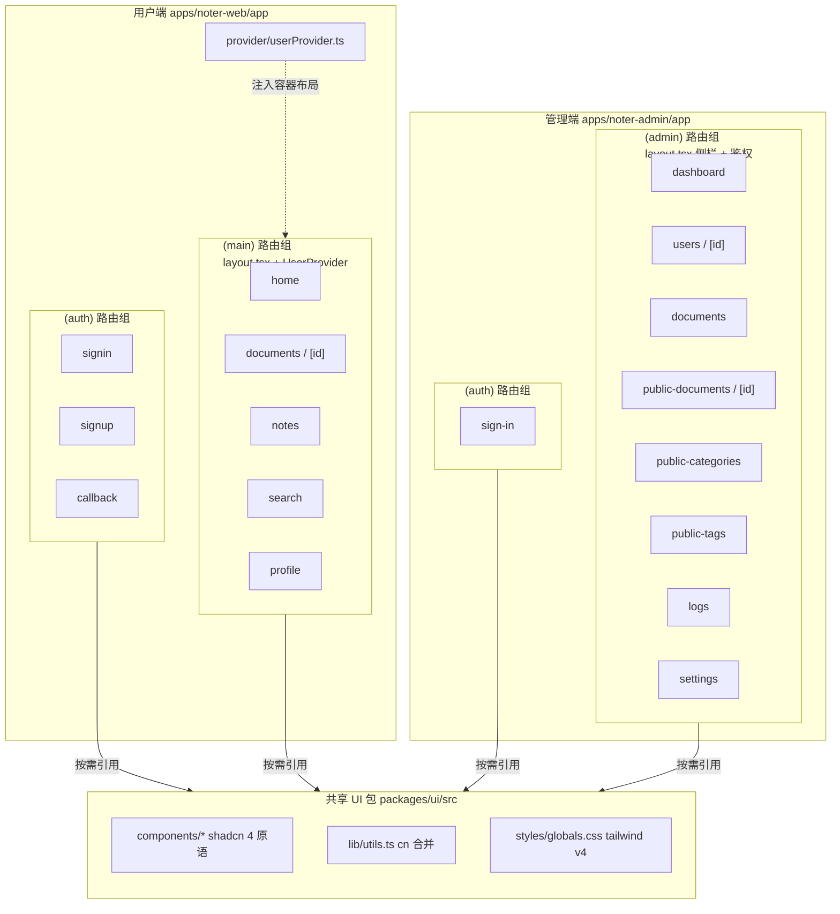
