# 第一章 绪论

<!-- TODO: 待 task 1 撰写 -->

## 1.1 项目开发背景

日常学习与科研中，PDF、Markdown、docx 等资料随课程、文献和会议纪要不断累积，本机存放数百份待读文档已成常态。传统笔记软件以文件夹加标题搜索为核心范式，对长文本中的语义片段缺乏理解能力，用户既无法对一份论文发出语义层面的提问，也难以在多份资料之间做跨文档检索，结构化阅读与归档之间出现裂缝。

近两年大语言模型在长上下文摘要与文档问答场景已具备落地能力，配合 RAG 与向量数据库，把文档切片向量化、再以片段为证据回答提问已成为可工程化的路径；Next.js、Supabase 等开源工具链则把全栈应用的运行成本压低到个人开发者可独立维护的程度。两条路径合流，在自有服务器上跑一个会读论文的智能阅读器具备了现实条件，本系统正是在这样的背景下立项，把统一文档阅读、AI 多轮提问、思维导图、多 Skill 切换这几件能力集成到同一个自托管平台。

本设计作为本科毕业设计完成，于 2026 年由 ××大学 ××学院 ××专业的作者独立设计与实现，承担工作覆盖 monorepo 架构与 apps、packages 划分，用户端、管理端、Edge Function 流水线、Agent 多轮 Skill 引擎与 Supabase 数据库设计皆由作者本人完成，论文也由本人撰写。具体而言，用户端基于 Next.js 16.1.6 与 React 19 实现阅读模板、思维导图、AI 对话面板与混合搜索，管理端基于 Next.js 16.2.6 实现 dashboard、文档编辑器与版本抽屉，Edge Function 层接入 parse-document、vectorize-document、generate-summary、generate-mindmap 四条流水线，packages/agent-runtime 内 Skill 引擎按 router、skills、tools、sse、db、prompts、orchestrator 划分；Supabase 共 18 张表，借助 RLS、pgvector 与 auto-version 触发器支撑业务。

<!-- TODO: 作者填入学校、学院、专业、年份的最终值 -->

## 1.2 项目开发意义

学习与科研中累积的 PDF、Markdown、PPT 等资料持续增多，传统笔记软件在跨文档语义检索与结构化提问上一直停留在文件名与全文关键字层面，想找回某一论点出自哪篇资料常常要翻阅许久。本系统把文档解析、向量分片、混合检索与多轮 Skill 对话组合起来，让用户既能在一份资料上对正文做语义级检索，也能让 AI 沿章节结构逐段带读与追问，把检索成本降回到几次对话之内，阅读笔记本身沉淀为可被复用的知识库。

对个人知识管理而言，本系统不要求用户在记笔记之外另外维护一份索引。文件夹与标签可以自由组合分组，AI 在文档解析阶段已经预生成核心摘要、关键要点、思维导图与章节大纲。回看一篇旧资料时，正文、大纲、摘要卡片与思维导图同步呈现，资料整理与回顾不再依赖外部应用拼接。

把阅读转化为产出是本设计的另一个着力点。读完长文档后，思维导图与 AI 总结即时给出结构化要点；多轮 Skill 中的 /quiz 把文档转写为单选、多选、填空、简答题让用户自检掌握情况，/tutor 则按章节扮演私教逐段讲解并追问。读完一篇资料顺手做一组测试题或被反问几个问题，从临时操作变成日常阅读工作流的一环。

在工程层面，本设计把多轮 Skill 调度、工具调用、SSE 流式响应、跨会话状态管理收拢到独立的 packages/agent-runtime 引擎，由 Next.js Route Handler 以 import 方式调用，无需额外维护推理服务。Skill 路由、Tool Layer 与 agent_skill_sessions 过期回收集中在同一个 TypeScript 包内，证明了 RAG 与 LLM 能够以纯 Node.js 形式落地在 Supabase 与 Next.js 之上。

## 1.3 国内外发展状况

近年来，"文档智能阅读 + 检索增强生成（RAG）+ 大语言模型知识助手"已经成为国内外知识管理类产品的共同发力方向。各家厂商围绕"上传或汇集文档、系统自动归纳、用户与文档对话"这一闭环展开竞争，但在产品形态、生态边界与开放程度上差异明显。本节挑选国内外四个代表性实例，按定位、能力边界、与 noter 的差异三条线索作简要梳理，作为后续设计取舍的对照。

飞书妙记是字节跳动飞书办公套件中的智能记录组件，定位于会议、访谈一类音视频场景，核心能力包括实时语音转写、说话人分离、AI 摘要与关键句索引，并与飞书文档、日程协同打通[1]。与 noter 的差异在于：飞书妙记为闭源商业 SaaS，按企业坐席计费；输入侧偏向音视频流，对静态 PDF / Markdown 阅读支持有限；产品不向开发者暴露分片与向量召回层面的 RAG pipeline，也不提供本地或自托管部署；AI 助手以单轮总结指令为主，未围绕单一文档维持多轮 Skill 状态。

有道云笔记 AI 是网易有道在云笔记产品上叠加的 AI 助手，定位于个人知识工作者的轻量笔记与文档辅助场景，核心能力包括长文本摘要、写作扩写、PDF 问答以及实验性的思维导图生成[2]。与 noter 的差异在于：有道云笔记 AI 同样为闭源云服务，账号与文档存储绑定平台，免费额度受限；AI 调用与底层笔记存储紧耦合，用户无法替换模型或检索后端；Skill 以单轮指令形式呈现，缺少跨轮次的会话状态与工具调用编排，分片参数与向量库结构对用户不可见。

Notion AI 是 Notion 协作文档平台原生集成的 AI 助手，定位于团队工作区内的"问答 + 写作"通用助手，核心能力包括基于工作区页面的跨页面问答、智能搜索、文档级摘要与续写[3]。与 noter 的差异在于：Notion AI 完全闭源，按席位订阅，问答内部虽采用 RAG 思路，但分片粒度、召回排序与提示词模板均由平台封装，开发者无法干预；产品以协作文档为中心，缺少独立的思维导图维度；模型选择与上下文长度由平台决定，不支持自托管或私有化部署。

ChatPDF 是较早面向"上传 PDF 即开聊"场景的轻量 Web 应用，定位于学术论文、合同等长文档的单文档问答，核心能力为文档解析、按页定位的引用回答以及付费版的跨文档检索[4]。与 noter 的差异在于：ChatPDF 为商业 SaaS，按上传文档数与字数计费；产品边界只覆盖单文档对话，不提供笔记编辑、思维导图与跨文档结构化总结；其 RAG 流水线、分片策略与会话状态对用户与开发者均不暴露；交互停留在单轮 RAG，没有多轮 Skill 调度或工具调用机制。

横向对比可以更直观看出四款产品与 noter 之间的取舍差异：

| 维度 | 飞书妙记 | 有道云笔记 AI | Notion AI | ChatPDF | noter |
| --- | --- | --- | --- | --- | --- |
| 商业模式 | 商业 SaaS | 商业云服务 | 商业 SaaS | 商业 SaaS | 自托管开源 |
| 是否开源 | 否 | 否 | 否 | 否 | 是 |
| 是否暴露 RAG pipeline | 否 | 否 | 否 | 否 | 是 |
| 是否支持多轮 Agent Skill | 否 | 否 | 部分 | 否 | 是 |
| 是否原生支持思维导图 | 否 | 实验性 | 否 | 否 | 是 |

四个实例分别代表"会议转写 + AI 摘要""云笔记 + AI 助手""协作文档 + AI 问答""单文档 PDF 问答"四类典型形态。业界共同的走向是把文档解析、向量检索与大语言模型问答串成统一闭环，使静态资料转化为可对话的智能助手。但主流产品多为闭源商业 SaaS，分片参数、召回策略、Skill 调度与会话状态对开发者均不可见，用户也难以自托管或自定义模型，同时较少把思维导图、跨文档结构化总结作为一等公民。Noter 在沿用上述行业方向的同时，把"自托管开源、暴露完整 RAG 流水线、多轮 Agent Skill、原生思维导图"确立为核心差异点。这一取舍是否在经济、技术、社会层面均能成立，将在 1.4 节展开分析。

## 1.4 可行性分析

<!-- TODO: 待 task 1.4 撰写 -->

### 1.4.1 经济可行性分析

本课题作为本科毕业设计推进，开发成本以作者投入的时间为主。仓库所用工具链 pnpm 10.32.1、Next.js 16、React 19、TypeScript 5、shadcn 4、tailwindcss 4 与 Supabase 客户端均为 MIT、Apache 2.0 或 BSD 许可下的开源软件，IDE、git 与 husky、commitlint 等提交链路工具同样免费，整个开发过程不需要采购授权或购置专有组件。

运行端可在自托管 Supabase 与 Supabase Cloud 之间二选一，自托管只需要一台普通服务器，托管版本的 Free Tier 也足以承载毕设阶段的访问量；LlamaParse 与外部 LLM API 按调用量计费，开销处于学生项目可承担的区间。系统投入使用后，团队成员可以围绕同一份资料库提问与协作，从拿到一份新材料到形成可复用产出之间的时间显著缩短，对生产管理而言是一次成本可控、收益直接的工具替换。

### 1.4.2 技术可行性分析

本系统所选技术栈在版本号、社区活跃度与工程实现路径上均已具备成熟度。Next.js 16 的 App Router、Route Handler 与流式响应能力稳定，React 19、TypeScript 5、tailwindcss 4、shadcn 4 与 radix-ui 已被国内外大量项目采用，Supabase Postgres 配合 pgvector 与 Storage 在 RAG 场景中是常见实现路径，依赖均为开源软件，文档完整、社区持续维护。

作者掌握度与落地路径在前期工作中已经得到验证。用户端、管理端、parse-document、vectorize-document、generate-summary、generate-mindmap 四个 Edge Function 与 `packages/agent-runtime` 多轮 Skill 引擎已实现并运行；SSE 在 Route Handler 中以 `ReadableStream` 与 `TextEncoder` 拼接事件流，文档分片采用 1000 字符正文加 200 字符重叠，向量维度沿用 768，不存在知识产权与采购障碍。

### 1.4.3 社会可行性分析

本系统由作者独立开发，依赖采用 MIT、Apache 2.0、BSD 等宽松开源许可，Next.js、React、shadcn 为 MIT，Supabase 客户端为 Apache 2.0，不绑定私有组件或专利，无产权纠纷。

系统承载用户上传的学习科研文档，不处理敏感信息；认证用 Supabase Auth 的 Email 与 OAuth，公共文档由管理员审核发布，符合数据与发布合规。平台服务学校和团队的资料整理，公共文档机制让教学材料统一分发，降低跨工具检索成本。

界面沿用主流笔记软件习惯，侧栏文件夹、文档卡片、阅读与对话两栏布局与 Notion、Mendeley 一致，用户上手即可上传、阅读、提问、归档；管理端复用 packages/ui 的 shadcn 4 组件，admin 无需培训。

### 1.4.4 可行性分析结论

经济、技术与社会三方面的分析合在一起表明，本项目在所需投入、所选路径与所处场景上都满足落地条件。开发与运行所依赖的工具链与平台以开源组件和现成托管服务为主，没有引入额外的硬件或专有组件成本；所选的技术栈均已在业界长期被验证，相应的工程实现路径成熟稳定，作者也具备相应的开发储备；面向个人学习与团队知识管理场景，使用门槛与合规风险都处于较低水平。在此基础上，下一章将集中介绍论文中反复出现的开发环境与主要技术，为后续需求分析与设计章节提供共用参照。

# 第二章 开发环境与主要技术介绍

## 2.1 开发环境概述

开发环境是支撑代码编写、构建、测试与运行的全部外部依赖，覆盖操作系统、浏览器、包管理器、运行时、类型系统、IDE、版本控制工具、应用容器、对象存储、数据库以及 UML 建图工具等若干维度。本系统按 monorepo 单仓库形式组织代码，apps 与 packages 在 pnpm 工作区中共用同一份依赖声明与版本约束，开发环境因此在用户端、管理端与共享包之间高度共享；仅 supabase/functions 下的 Edge Function 运行时按目录单独区分为基于 Deno 的独立沙箱，与本机 Node.js 运行时相互隔离，本机开发与 Edge Function 调试两条链路因此互不干扰。

如表 2.1 所示，本系统在毕设期间使用的开发环境与版本号集中列出，以「类别 / 名称 / 版本号 / 用途说明」四列组织。表中版本号严格与仓库根目录 `package.json`、apps 与 packages 各自 `package.json` 中的真实声明保持一致，使本机开发环境与 Supabase Cloud 项目之间形成可重现的对应关系，下文涉及具体工具时不再重复版本号。

表 2.1 开发环境一览表

| 类别 | 名称 | 版本号 | 用途说明 |
| --- | --- | --- | --- |
| 操作系统 | macOS | 14+ | 作者本机开发 |
| 浏览器 | Chrome / Edge | 最新稳定版 | 用户端与管理端调试 |
| 包管理器 | pnpm | 10.32.1 | monorepo 工作区依赖管理 |
| 运行时 | Node.js | ≥ 20 LTS | Next.js 与脚本运行 |
| 类型系统 | TypeScript | 5.x | 全仓 strict 模式 |
| 数据库 | Supabase Postgres + pgvector | 15+ | 文档元数据与向量存储 |
| 对象存储 | Supabase Storage | 内置 | 文档原件与解析图片 |
| Edge 运行时 | Deno（Supabase Functions） | 内置 | parse-document 等四个函数 |
| 应用容器 | Next.js Dev Server | 16.1.6 / 16.2.6 | 用户端 / 管理端 |
| IDE | VS Code / Cursor | 任意稳定版 | 编辑器 |
| 版本管理 | git | 任意稳定版 | 源码版本控制 |
| Git 钩子 | husky + lint-staged + commitlint | 9.1.7 / 16.3.2 / 20.4.3 | 提交前格式化与提交信息校验 |
| 提交助手 | commitizen + cz-customizable | 4.2.4 / 7.5.1 | 标准化提交信息 |
| UML 工具 | mermaid | Markdown 内嵌 | 论文与文档配图 |

表内条目反映本环境的几个共同特征。所有依赖均为开源软件或可自托管服务，不涉及商业授权或专有组件，毕设阶段不产生采购成本；表中版本号与 apps 与 packages 各自 `package.json` 中的声明保持一致，避免文档描述与代码实际版本之间出现漂移；TypeScript 在根目录 `tsconfig.base.json` 中开启 strict 模式，apps 与 packages 各自的 `tsconfig.json` 通过 extends 继承同一份编译配置，类型边界因此在工作区内保持统一。版本管理沿用 git，提交流程依次串联 commitizen、cz-customizable、commitlint、husky 与 lint-staged：commitizen 提供交互式输入，cz-customizable 维护 type 与 scope 列表，commitlint 校验消息格式，husky 在 pre-commit 与 commit-msg 钩子上调起 lint-staged，使每次提交都流经同一条静态检查链路。mermaid 作为唯一的 UML 与流程图工具沿用 Markdown 内嵌方式，与本论文 `paper/noterChart.md` 保持同源，不再引入 PowerDesigner、Visio、draw.io 等桌面建图工具，图源因此纳入仓库 git 版本控制。在覆盖范围上，本环境同时支撑 apps/noter-web 用户端、apps/noter-admin 管理端、packages 共享包与 supabase/functions 下四个 Edge Function 的开发与调试，从写代码、跑本地测试、起本地服务到部署 Edge Function 不需要在多套工具链之间切换。

## 2.2 主要技术简介

apps/noter-web 用户端基于 Next.js 16.1.6[5] 与 React 19.2.3[6] 搭建。Next.js 16.1.6 提供 App Router 路由组与 Route Handler，承担用户端入口、Server Action 与流式 SSE 通道；React 19.2.3 配套渲染层，并支持新的 useOptimistic 与 useTransition 在阅读页与对话面板上做局部更新。@supabase/ssr 0.9 与 @supabase/supabase-js 2.100[7] 一起完成浏览器端与服务器端的会话管理，签名 cookie 在两端之间透传。@xyflow/react 12.10 用于阅读页面的思维导图节点画布，react-markdown 10.1 与 remark-gfm 4.0 / remark-math 6.0 / rehype-katex 7.0 / rehype-raw 7.0 / rehype-slug 6.0 / rehype-highlight 7.0 全家桶承担阅读模板对 GFM、行内与块级公式、原始 HTML、章节锚点与代码高亮的标准化渲染，标准化 Markdown 的语法基线对齐 CommonMark 规范[8]。@react-pdf/renderer 4.5 处理「带样式的 PDF 导出」分支，把同一份标准化 Markdown 渲染为可下载的 PDF。zustand 5.0 在本端作为前端状态管理库，承载会话与对话面板状态，zod 3.25 用于跨层数据校验。

apps/noter-admin 管理端独立部署于 noter-admin 子项目，运行时基底为 Next.js 16.2.6 与 React 19.2.4，与用户端各自维护以便分别升级。本端服务器侧通过 service role 客户端执行公共文档版本写入、审计日志落库与跨用户配置变更等需要绕过 RLS 的写操作；浏览器侧继续走 @supabase/ssr 在管理员会话边界内访问数据。recharts 3.8 提供 dashboard 趋势图，把 documents、profiles 与 admin_audit_logs 的聚合结果渲染为图表。vitest 4.1 与 tsx 4.20 承载单元测试与本地脚本运行，前者用于回归用例，后者直接执行 seed-admin-platform.ts 等数据播种脚本；端到端测试由后续测试章节根据 playwright 在管理端的实际落地情况补充说明。

packages/ui 共享 UI 库基于 shadcn 4 的组件生成与注册表方案[9]，底层原语来自 radix-ui 1.4，组件以 class-variance-authority 0.7 与 tailwind-merge 3.5 控制变体与类名合并，clsx 2.1 协助拼接条件类名。lucide-react 0.577 提供图标集合，next-themes 0.4 与 tw-animate-css 1.4 提供主题切换与过渡动效。本库被 apps/noter-web 与 apps/noter-admin 通过 pnpm workspace 协议共同消费，组件源码直接落在 packages/ui/src/components 内并随两端就地修改，避免按钮、对话框、抽屉、表单等基础组件在两个 app 内重复实现。

packages/api 与 packages/agent-runtime 承担两类共享逻辑。packages/api 当前主要封装 axios 1.13 客户端，集中处理 baseURL、超时与错误归一化，用于跨子项目的 HTTP 调用。packages/agent-runtime 承载 Noter Agent 的多轮 Skill 引擎，依赖 @supabase/supabase-js 2.100 访问 agent_skill_sessions 表与 zod 3.25 校验 Skill 状态机与 Tool 入参，并以 vitest 3.2 与 fast-check 3.23 保证 Skill Router、Skill 实现、SSE 通道与工具层的单元测试与基于属性的状态转移测试。本包内含 router、skills、tools、sse、db、prompts、types 七个子目录，承担 Noter Agent 全部业务逻辑，由用户端 Route Handler 以进程内 import 方式直接调用，不再为 Agent 单独维护进程。packages/hooks 与 packages/utils 当前为占位目录，无 package.json，本期不计入主要技术清单。

后端整体由 Supabase Postgres + pgvector[10] + Storage 与四个 Edge Function 共同组成。supabase/migrations 当前包含 13 个迁移文件，按时间戳顺序演进 RLS 策略、公共文档版本归档、混合搜索 RPC 等增量结构。supabase/functions 中 parse-document、vectorize-document、generate-summary、generate-mindmap 四个 Edge Function 在 Deno 沙箱内运行，分别承担文档解析、分片向量化、AI 总结与思维导图生成，链式触发以避免在用户端长连接里塞入重活。pgvector 768 维向量索引由 vectorize-document 写入 document_chunks.embedding 列，混合搜索 RPC 同时利用向量召回与基于 ts_headline 的关键词召回，并按一定权重融合得分返回。所有数据访问受 RLS 策略约束，关键的 agent_skill_sessions 表仅 service_role 客户端可访问，document_chunks、document_summaries、document_mindmaps 等表则按所属 user_id 与 document_scope 暴露给登录用户，公共文档与公开桶则面向匿名访问开放。

# 第三章 需求分析

<!-- TODO: 待 task 3 撰写 -->

## 3.1 用户需求

学习与科研日常里，用户每天都在和大量资料打交道。一份课程论文从手机相册扫描、从邮件附件下载、或从浏览器另存为 PDF 之后，第一件事是放进系统、选一个文件夹归位、顺手挂上「机器学习」「期末复习」之类的几个标签。资料跨课程跨主题积累以后，进入文档列表的第一动作往往是在顶部搜索框里键入几个关键词，下拉里先扫一眼命中片段再点击跳进正文相应位置；只想找最近读过的几篇时，则切换到筛选排序栏按文件类型与创建时间过滤即可。卡片墙里那些封面承载着用户对资料的视觉记忆，可以更换为自己手机里的一张截图，也可以一键恢复成默认配色；遇到读完一时用不到却又舍不得删的资料，加一个收藏标记或归档到对应文件夹里就能从主视图淡出。

打开一篇资料，用户期待的不只是一份能滚动的正文。阅读模板按场景在简约、学术、紧凑、卡片几种风格之间切换；左侧大纲随章节滚动联动，右侧元数据现场添加或撤销标签，正文中的数学公式与代码块照常渲染。读到不熟悉的概念时在右侧对话面板里键入 `/explain 依赖倒置` 即可拿到结合原文片段的解释，再点击 chip 让 AI 沿章节顺序逐段带读；读完之后追加 `/quiz` 让 AI 出几道题自我检验，得分卡里回看错题解析；遇到一份长文还没决定是否细读，先发一条 `/brief` 让 AI 速览定位再决定接下来怎么处理。除了这类由用户主动调起的多轮提问，系统在文档解析阶段已自动生成核心摘要、关键要点与左→右思维导图，用户随手就能在「文档已就绪」之后直接读到结构化的产出；阅读完毕想离线归档，通过浏览器打印通道把当前模板渲染保存为 PDF。

资料如果适合广而告之，则走另一条线索。学校里某门课的统一讲义、社团内部的成员手册、教研室共享的论文范文，这类内容由超级管理员或被授权的管理员在管理端批量上传、补充分类与标签、在线编辑 Markdown 正文，每一次保存都自动归档为一个新版本，事后发现笔误时从版本历史挑一份回滚即可。普通用户登录后会看到一个固定置顶且不可改名的「Noter 官方」文件夹，里面是当前对全员可见的公共文档，可以阅读、可以提问、可以查看 AI 摘要，但不能编辑也不能删除。

平台本身的运转交给管理员盯守。超级管理员决定哪些常规账号可以提升为管理员，管理员则在控制台里巡查注册趋势、活跃用户、文档处理状态分布，遇到违规上传随手强制下架，接到密码忘记的诉求一键发送重置邮件；系统设置里那几个开关——是否允许普通用户上传、是否允许自删、公共文档是否对外可见、是否记录操作日志——决定了普通用户日常能做与不能做哪些动作。所有写操作都会留痕到审计日志，出现争议时按时间或操作人筛选即可还原现场。

## 3.2 系统用例分析

<!-- TODO: 待 task 3.2 撰写 -->

### 3.2.1 总用例图

noter 系统在用户角色上沿用 Supabase Auth 的会话边界与 `profiles.role` 字段，把能触达系统入口的角色分为四档：未登录访客、普通用户（user）、管理员（admin）与超级管理员（super_admin）。三种已登录角色按业务边界各自承担一段功能，未登录访客的可见范围被压到最小，仅保留注册登录与浏览公共文档两条入口。

普通用户位于业务主线，登录后承担文档全生命周期的常规动作：上传文档、阅读文档、围绕单篇资料发起 AI 提问、对全库做混合搜索、查看思维导图与 AI 总结卡片、按文件夹与标签整理资料、收藏与归档、浏览来自管理端发布的公共文档以及编辑个人资料。其中 AI 提问在 3.2.2 节的子用例图中会再展开为 `/brief`、`/tutor`、`/explain`、`/actions`、`/quiz` 五个 Skill，本图按合并去重原则只保留一个父用例，避免与子图重复。

管理员承担公共知识库与平台运营两条主线。登录管理后台后可在仪表盘查看运营指标与趋势，对普通用户执行封禁、解封、软删除与密码重置邮件，批量上传与维护公共文档（含元数据编辑、在线 Markdown 编辑与版本归档回滚），并维护公共分类与公共标签、查询审计日志。超级管理员在管理员能力之上独占两个用例：在 user 与 admin 之间切换管理员角色、维护 `allow_user_upload` 与 `public_documents_visible` 等系统访问开关；本图通过虚线继承关系把超级管理员与管理员衔接，省去逐条罗列管理员重复用例。如图 3.1 所示。

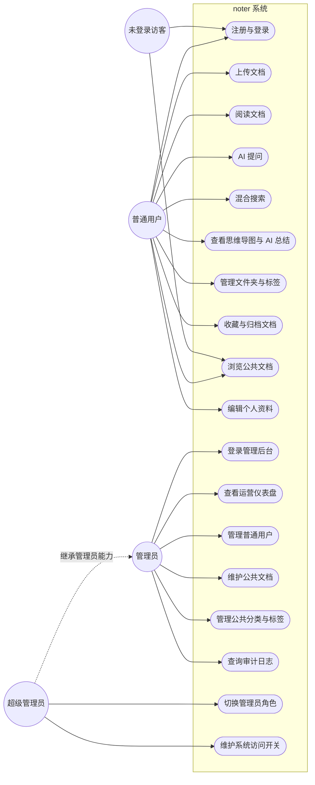

图 3.1 noter 系统总用例图

### 3.2.2 子模块用例图与用例说明

3.2.1 节的总用例图把全平台业务收在一张图上，受版面所限，单条用例的边界、参与者与异常分支只能用一句话带过。本节把其中两块业务最重的子模块抽出来单独展开：一是覆盖文档从上传到删除的「文档生命周期」子模块，二是承担多轮对话的「Noter Agent 多轮 Skill」子模块。两幅子用例图沿用总用例图中已经出现的角色命名（未登录访客 / user / admin / super_admin），不再引入新的角色。每张图都配一张说明表，按用例编号 / 用例名 / 角色 / 前置条件 / 主流程 / 异常分支六列展开关键路径，异常分支均回到三份上游 spec 的 EARS 条目对账，凡超时、RLS 拒绝、JSON 不合法等情形都来自原始需求，不另作扩展。

文档生命周期子模块对应 noter-document-management spec 的需求 1—21 与 noter-admin-platform spec 关于公共文档维护的需求 12—21、23。user 负责上传与解析、列表浏览、混合检索、模板化阅读、文件夹与标签维护、PDF 下载与软删除等私有动作；admin 与 super_admin 在管理端处理公共文档的批量上传、元数据编辑、在线 Markdown 编辑、版本历史与回滚、软删除等动作，super_admin 额外承担跨用户的角色切换与强制下架。未登录访客在本子模块没有业务用例，访问任何受保护路由都被会话守卫拦截到登录页，因此以一条虚线箭头进入子模块边界示意拦截关系，不再单独列入用例条目。auto-version 触发器在 document_contents 首次落库时自动写入版本号 1 的归档记录，editor_user_id 取系统账号；后续 admin 在线保存时由 API 路由按 max+1 续写版本，因此版本归档既覆盖管理端编辑流程，也覆盖文档刚解析完成的初始落库时刻。如图 3.2 所示。

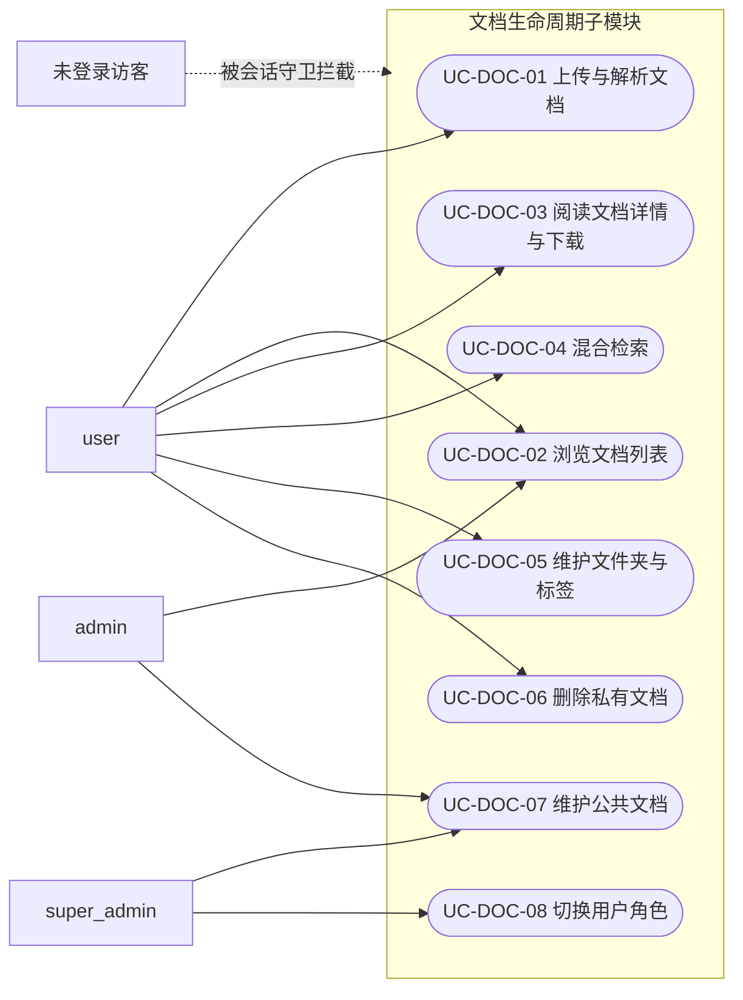

图 3.2 文档生命周期子模块用例图

| 用例编号 | 用例名 | 角色 | 前置条件 | 主流程 | 异常分支 |
| --- | --- | --- | --- | --- | --- |
| UC-DOC-01 | 上传与解析文档 | user | 已登录、文件大小未越限 | 选取文件后调 upload 接口落 Storage 与 documents 行；parse-document 解析为标准化 Markdown 后链式触发 vectorize / summary / mindmap，5 列子状态依次切到 success | 任一阶段失败时对应子状态置 failed，UploadProgress 降级为「文档已就绪，AI 总结或思维导图生成失败」 |
| UC-DOC-02 | 浏览文档列表 | user / admin | 已登录 | 进入文档列表 → 文件夹、标签、扩展名按 AND/OR 组合过滤 → 「加载更多」分页拉取卡片 | 接口失败时列表保持当前状态并展示重试按钮 |
| UC-DOC-03 | 阅读文档详情与下载 | user | 已登录且 status='ready' | 打开详情页同步渲染标准化 Markdown 正文、章节大纲、AI 总结卡与思维导图；模板下拉切换排版；点击下载按钮以 react-pdf 导出 PDF | 正文为空时禁用下载按钮并提示「文档暂无可下载内容」 |
| UC-DOC-04 | 混合检索 | user | 已登录 | 顶部搜索框输入关键字 → 后端混合搜索 RPC 同时跑向量召回与关键词召回 → 加权融合得分后跳转到命中段落 | 10 秒内未返回时取消请求，下拉中显示错误提示与重试按钮 |
| UC-DOC-05 | 维护文件夹与标签 | user | 已登录 | 侧栏新建 / 重命名 / 删除文件夹或标签 → RLS 校验通过后写库 → 刷新筛选面板与文档卡片 | 用户在删除标签确认框中点击取消时关闭对话框且不写库 |
| UC-DOC-06 | 删除私有文档 | user | 已登录且 document_scope='private' | 卡片操作菜单选删除 → 二次确认 → API 软删除并解除文件夹与标签关联 | 普通用户尝试删除 document_scope='public' 文档时 RLS 直接拒绝 |
| UC-DOC-07 | 维护公共文档 | admin / super_admin | 已登录管理端、角色为 admin 或 super_admin | 后台批量上传或在线编辑保存 → auto-version 触发器为新文档写入 version_no=1，后续保存写 version_no=max+1 → 同步落审计日志 | 回滚版本时未通过二次确认则取消，原版本保持不变 |
| UC-DOC-08 | 切换用户角色 | super_admin | 当前账号 role='super_admin' | 用户列表选目标账号 → 选择新角色 → service_role 写 profiles.role 与审计日志 | 目标账号为系统内部账号或自身降权时拒绝并提示 |

Noter Agent 多轮 Skill 子模块对应 noter-agent spec 的需求 1—15。整套 Skill 仅服务于已登录的 user，admin 与 super_admin 在管理端不持有 AI 对话面板，本子模块因此只画 user 一类角色。/brief、/actions 为单轮 Skill，/tutor 与 /quiz 为多轮 Skill，依赖 agent_skill_sessions 维护跨轮状态与 24 小时过期；/explain 介于两者之间，按命中片段一次性返回原文引用与释义。除五条具体 Skill 外，还包括 Skill 启动入口（启动卡 / 斜杠 / 自然语言三入口同源）、Skill 切换中断、SSE 流式接收与 FollowUpChips 跟随建议三类公共用例，覆盖从入口到终态的完整路径。Skill 之间的切换不需要二次确认，旧 session 在新斜杠命令落地的同时被标记为 interrupted，前端通过 session_banner 事件感知；表中的异常分支统一指向超时取消、JSON 不合法重试与 sessionId 失效静默重置三种 SSE error 路径，与 noter-agent 需求 13 的错误降级条款一一对齐。如图 3.3 所示。

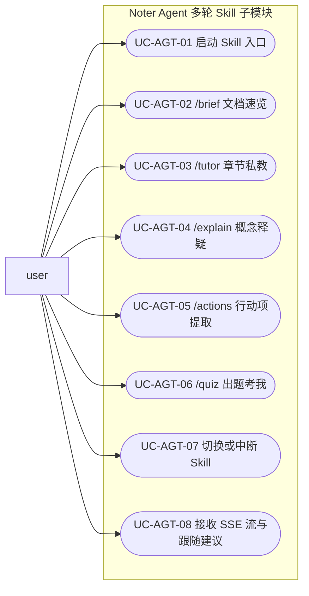

图 3.3 Noter Agent 多轮 Skill 子模块用例图

| 用例编号 | 用例名 | 角色 | 前置条件 | 主流程 | 异常分支 |
| --- | --- | --- | --- | --- | --- |
| UC-AGT-01 | 启动 Skill 入口 | user | 已登录且文档 status='ready' | 通过启动卡 / 斜杠命令 / 自然语言三入口任一发起 → Route Handler 完成鉴权与归属校验 → 转交 packages/agent-runtime 的 runAgent 由 Skill Router 决定路由 | 自然语言无明确意图时由 Skill Router 兜底为通用问答，不再发 clarification 事件 |
| UC-AGT-02 | /brief 文档速览 | user | 已选 /brief、document_summaries 可读 | 单轮输出文档骨架卡片与定位卡 → SSE 推送文本流与结构化卡片 → 以 [DONE] 终止帧收尾 | 整体超 15 秒时取消请求并通过 SSE error 事件回超时码 |
| UC-AGT-03 | /tutor 章节私教 | user | 已选 /tutor | 按 document_contents.outline 多轮带读 → 每章先讲核心再追问理解 → 跨轮状态写入 agent_skill_sessions | outline 缺失时按 markdown 字数等分为 5 块降级继续 |
| UC-AGT-04 | /explain 概念释疑 | user | 已选 /explain、命中片段可检索 | 检索 document_chunks 命中段 → 单轮输出原文引用与解释 → 末轮发 follow_ups | 整体超 25 秒时取消请求并通过 SSE error 事件回超时码 |
| UC-AGT-05 | /actions 行动项提取 | user | 已选 /actions、document_summaries 可读 | 单轮输出「我应该做什么 / 还要学什么 / 可以再读什么」三组结构化清单 → 末轮发 follow_ups | 整体超 15 秒时取消请求并通过 SSE error 事件回超时码 |
| UC-AGT-06 | /quiz 出题考我 | user | 已选 /quiz | 三阶段：出题 → 用户作答 → 评分解析；每阶段写 session 状态并以结构化卡片下发题目 | 出题或评分阶段 LLM 输出 JSON 不合法时自动重试一次，仍失败则发 error |
| UC-AGT-07 | 切换或中断 Skill | user | 已有进行中的 session | 直接发送新斜杠命令 → 旧 session 标 interrupted → 通过 session_banner 推送旧进度结束并隐藏 SessionBanner | sessionId 失效时静默重置为 mode='fresh' 并推 status='ended' |
| UC-AGT-08 | 接收 SSE 流与跟随建议 | user | 已发起任一 Skill | 单 SSE 连接承载文本流、结构化卡片、session_banner、follow_ups 等事件 → 单轮 Skill 末尾追加 FollowUpChips | 多轮 Skill 中间轮次不发 follow_ups；流异常时写服务端日志并向前端返回 internal error |

## 3.3 系统数据流分析

<!-- TODO: 待 task 3.3 撰写 -->

### 3.3.1 总体数据流图

noter 系统从用户上传一份文档起，到用户在阅读页面发起提问、管理员在管理后台对公共文档做审核为止，整条主链路由若干处理与四类数据存储拼接而成。本节按数据流图惯例把外部实体抽象为「用户」与「管理员」两个源点兼终点，把核心处理拆为 P1 上传、P2 解析与向量化、P3 总结与思维导图、P4 阅读与问答、P5 管理后台审核五个环节，对应数据存储分别记为 D1 Storage 桶 documents、D2 Postgres 主库、D3 pgvector 索引、D4 agent_skill_sessions，四个存储的字段构成在 3.3.3 数据字典中逐一展开。

P1 上传由 `apps/noter-web/app/api/documents/upload/route.ts` 接收用户提交的 PDF、Markdown、docx 等文件，原件直接落入 D1，元数据写入 D2 的 documents 表，并链式触发 `supabase/functions/parse-document/` 进入 P2。P2 解析与向量化把正文与切片写回 D2 的 document_contents、document_chunks 两表，再由 `supabase/functions/vectorize-document/` 把 768 维向量写入 D3，至此一份原件被拆为「原件 / 正文 / 切片 / 向量」四份等价表示分散在 D1、D2、D3 之间。P3 总结与思维导图由 `supabase/functions/generate-summary/` 与 `supabase/functions/generate-mindmap/` 两个函数承担，只读 D2 中的正文，写回 document_summaries 与 document_mindmaps 两表，让阅读页可以在不重新走 LLM 的情况下直接展示结构化要点。

P4 阅读与问答由 `apps/noter-web/app/api/ai/chat/route.ts` 配合 `packages/agent-runtime` 提供，借 `supabase/migrations/20260516180339_add_hybrid_search_scoped_rpc.sql` 注册的混合搜索 RPC 在 D2 与 D3 上同时跑关键词与向量召回，按 SSE 流式推送给用户；多轮 Skill 的运行时状态写入 D4，建表脚本 `supabase/migrations/20260516175445_create_agent_skill_sessions_table.sql` 已将其约束为仅 service_role 可访问，并在 24 小时后自动过期。P5 管理后台审核以 `apps/noter-admin/app/api/admin/public-documents/` 与 `apps/noter-admin/app/api/admin/audit-logs/` 为入口，把公共文档版本与操作日志写入 D2 中由 `supabase/migrations/20260517223448_admin_platform_public_document_versions.sql` 与 `20260517223449_admin_platform_admin_audit_logs.sql` 建立的两张表，不触碰 D3 与 D4。这一划分让重写操作集中在 P1—P3 与 P5，P4 始终对四个数据存储以读为主，是 SSE 通道在长会话下保持稳定的前提。系统总体数据流如图 3.4 所示。

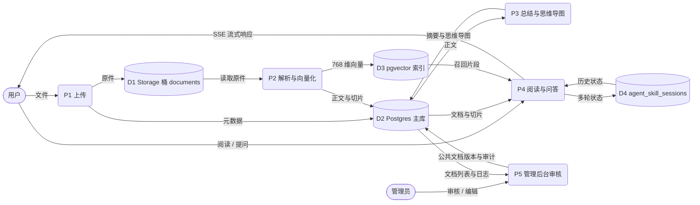

图 3.4 noter 系统总体数据流图

### 3.3.2 子模块 1、2 层数据流图

3.3.1 把系统数据流抽象到一张总体图上，本节进一步把承担最重处理逻辑的两个子模块——「文档上传与 RAG 解析流水线」与「AI 问答 SSE 流水线」——单独剥出，按 1 层、2 层两档分别绘制 DFD。1 层 DFD 把模块视为单一加工，列出输入、输出与外部存储；2 层 DFD 再把模块内部按仓库实际代码拆为带编号的子加工，方便后续详细设计与实现章节直接引用。

#### 图 3.5 文档上传与 RAG 解析流水线 1 层 DFD

文档上传与 RAG 解析流水线对应 `apps/noter-web/app/api/documents/upload/route.ts` 与 `supabase/functions/{parse-document, vectorize-document, generate-summary, generate-mindmap}/index.ts` 五段代码。从用户视角看，这一模块以浏览器中选择或拖入的文件作为输入，最终产出「可阅读的 Markdown 正文 + 向量索引 + AI 总结 + 思维导图」四件输出，全过程对应 `documents` 表上 `parse_status / vector_status / summary_status / mindmap_status` 四个字段从 pending 流转到 ready。1 层 DFD 把整条流水线视为单一加工 P1，外部实体只有「用户」，外部数据存储覆盖 Storage 桶 `document-originals` 与 `document-images`、Postgres 文档主域相关业务表，以及作业台账表 `document_processing_jobs`。如图 3.5 所示。

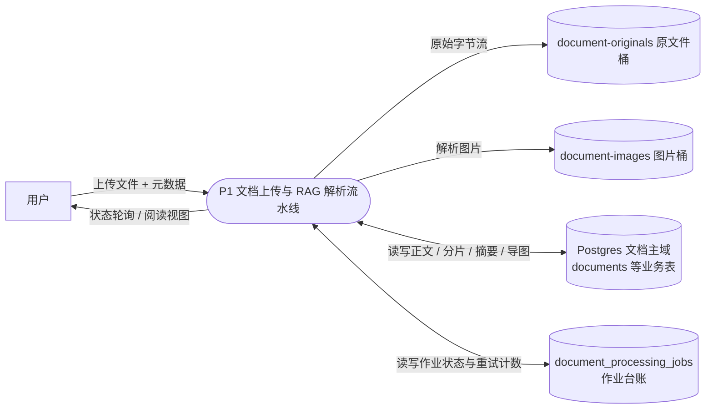
图 3.5 文档上传与 RAG 解析流水线 1 层 DFD

#### 图 3.6 文档上传与 RAG 解析流水线 2 层 DFD

2 层 DFD 把 P1 拆为五个子加工 P1.1—P1.5，分别对应用户端 Route Handler 与四个 Edge Function。P1.1 在 Route Handler 中接收上传，写入 `document-originals` 桶并落 documents 行记录（四个 status 字段初始为 pending），随后异步触发 parse-document；P1.2 在 parse-document 内调 LlamaParse 把原文件转为 Markdown 与图片，回写 `document_contents` 与 `document_assets`，再链式触发 vectorize-document；P1.3 在 vectorize-document 中按 1000 字符正文加 200 字符重叠切片，调 Gemini Embedding 生成 768 维向量写入 `document_chunks`，再分别触发 generate-summary 与 generate-mindmap；P1.4 与 P1.5 各自调外部 LLM 生成总结与思维导图 JSON，分别回写 `document_summaries` 与 `document_mindmaps`，并把对应 status 置为 ready。每个子加工失败时都会在 `document_processing_jobs` 上累计 retry_count 并把所属 status 回滚为 failed，前端通过轮询 documents 表的四个状态字段感知整条流水线的进度。如图 3.6 所示。

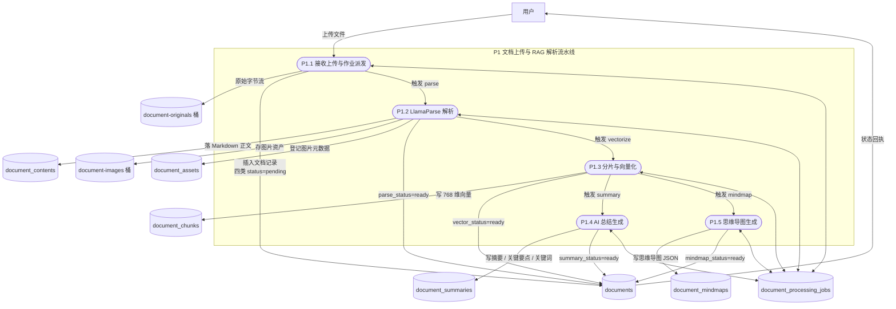
图 3.6 文档上传与 RAG 解析流水线 2 层 DFD

#### 图 3.7 AI 问答 SSE 流水线 1 层 DFD

AI 问答 SSE 流水线对应 `apps/noter-web/app/api/ai/chat/stream/route.ts` 与 `packages/agent-runtime/src/{router, skills, tools, sse, db, prompts}` 七个子目录。Route Handler 极薄，只负责鉴权与文档校验，余下的 Skill 路由、工具调用、LLM 流式生成与会话状态维护全部下沉到 agent-runtime 包。1 层 DFD 把整条流水线视为加工 P2，外部实体仍是「用户」，外部数据存储分为「Postgres 文档主域」（提供给 Skill 检索的 documents、document_chunks 等表）与「Postgres Agent 域」（agent_skill_sessions）。Agent 域通过 RLS 只对 service_role 开放，前端不直读，会话生命周期由 agent-runtime 内部管理。如图 3.7 所示。

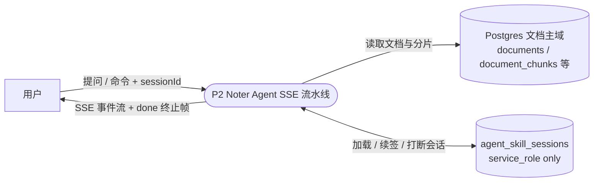
图 3.7 AI 问答 SSE 流水线 1 层 DFD

#### 图 3.8 AI 问答 SSE 流水线 2 层 DFD

2 层 DFD 把 P2 拆为五个子加工 P2.1—P2.5。P2.1 在 Route Handler 中完成鉴权、两步文档校验（归属与软删 → 状态 ready）以及 sessionId 校验，会话查询走 service_role 客户端绕过 RLS；P2.2 进入 orchestrator，调 SkillRouter 按「显式 command → 多轮 session 续签 → 自然语言意图分类」三级优先级产出 RouteDecision，遇到跨 Skill 切换时把旧 session 一并带回；P2.3 把决策派发到 brief、tutor、explain、actions、quiz 五个 Skill Handler，由 Handler 调用 ChunkSearchTool（向量 / 关键词 / 混合检索 RPC）、SessionTool、Embedding 与 LLM 工具产出回答；P2.4 通过 createSSEStream 把 content、session_banner、error、done 等事件按 `data: {json}\n\n` 写回浏览器；P2.5 在 Skill 切换或会话结束时调 SessionTool 的 interrupt / upsert 把 agent_skill_sessions.state 回写，jsonb 字段以「读取—合并—写入」方式逐轮收敛。如图 3.8 所示。

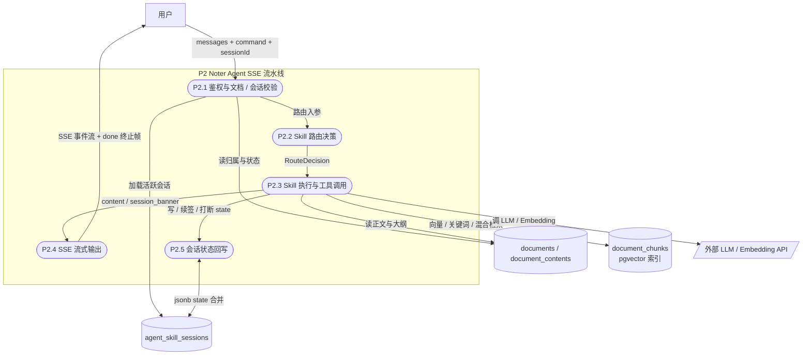
图 3.8 AI 问答 SSE 流水线 2 层 DFD

### 3.3.3 数据字典

3.3.1 与 3.3.2 的数据流图把系统持久化的数据存储归结为 Storage 桶、Postgres 主库各域、pgvector 索引与 agent_skill_sessions 四类落点。本节按文档主域、组织域、用户域、Agent 会话域、管理后台域五个分组逐一登记其数据存储项，每张表列「序号 / 数据项 / 数据对象说明 / 数据构成」。考虑到 18 张表的字段级清单将在 4.3.3 物理结构中按表展开，本节只覆盖与业务直接相关的数据存储项，描述聚焦于该项承载的数据语义与主要构成字段，避免与后文重复；表中数据对象说明以仓库 `supabase/migrations/` 各迁移 `COMMENT` 文本为准，数据构成只列出与业务语义直接相关的字段，generated 列与触发器维护字段不在此处展开。

文档主域承载用户上传文档的原始文件、解析后的标准化内容、衍生 AI 资产以及处理任务流水，对应 Supabase Storage 中的 document-originals 与 document-assets-public 两个桶，以及 Postgres 中以 documents 为中心的八张业务表；向量索引以 pgvector 形式落在 document_chunks.embedding 列上，构成混合检索的语义召回侧。本域是 3.3.2 中「文档上传与 RAG 解析流水线」的主要写入终点，也是阅读、问答与思维导图三条读路径的共同数据源，存储清单如表 3.1 所示。

表 3.1 文档主域数据字典

| 序号 | 数据项 | 数据对象说明 | 数据构成 |
| --- | --- | --- | --- |
| 1 | document-originals（Storage 桶） | 用户上传的原始文件存放区，按 `user_id/document_id/filename` 组织路径，仅 service_role 与文件归属用户可签名读取 | 文件二进制 + 路径键 + 上传时间 |
| 2 | document-assets-public（Storage 桶） | 解析阶段抽取的图片资源公开桶，对外以 publicUrl 直读，承载 Markdown 中的图片引用 | 图片二进制 + 路径键 + publicUrl |
| 3 | documents | 文档主表，承载基础元数据、四类处理状态、归属与范围、收藏归档与软删标记 | 基础元数据（title / original_filename / file_ext / mime_type / file_size / cover_url / language / word_count / page_count）、状态（status / parse_status / vector_status / summary_status / mindmap_status）、归属（user_id / folder_id）、范围（document_scope / public_category_id）、is_favorite / is_archived / deleted |
| 4 | document_contents | 标准化 Markdown 内容表，与 documents 一对一，由 parse-document 流水线写入 | markdown_content / outline / metadata |
| 5 | document_assets | 解析阶段产出的图片资源映射表，记录 Storage 路径与公网 URL | bucket / storage_path / public_url / original_url / filename / mime_type / file_size / width / height / sort_order |
| 6 | document_chunks | 文档分片表，承载向量召回与关键词召回的最小检索单元，embedding 列由 pgvector 提供 768 维向量索引 | chunk_index / content / heading_path / token_count / char_start / char_end / embedding（vector(768)） / metadata |
| 7 | document_summaries | AI 总结表，与 documents 一对一，由 generate-summary 流水线写入 | summary / key_points / todos / keywords / suitable_scenarios / model_name / generated_at |
| 8 | document_mindmaps | AI 思维导图表，与 documents 一对一，由 generate-mindmap 流水线写入 | mindmap_json / markdown_outline / model_name / generated_at |
| 9 | document_qa_records | 文档问答历史表，记录每一次问答的检索证据 | question / answer / retrieved_chunk_ids / retrieval_context / model_name |
| 10 | document_processing_jobs | 文档处理任务流水表，记录 parse / vectorize / summary / mindmap 各阶段的执行情况 | job_type / status / input_payload / output_payload / error_message / retry_count / started_at / finished_at |

组织域承载用户对文档的归类信息，文件夹与标签是两条互不冲突的归类线索：folders 通过 parent_id 自引用形成多级目录树，并以 is_system_folder 区分用户私有目录与承载公共文档的「Noter 官方」系统目录；tags 是与文件夹正交的扁平标签集合，is_official 区分用户自建标签与管理员发布的官方标签；多个标签到多份文档之间的多对多关系由 document_tags 关联表打开，存储清单如表 3.2 所示。

表 3.2 组织域数据字典

| 序号 | 数据项 | 数据对象说明 | 数据构成 |
| --- | --- | --- | --- |
| 1 | folders | 文件夹表，自引用 parent_id 形成多级树，is_system_folder 标记承载公共文档的「Noter 官方」系统文件夹 | name / parent_id / icon / sort_order / is_system_folder / user_id |
| 2 | tags | 标签表，is_official 标记由管理员发布的官方标签 | name / color / description / is_official / user_id |
| 3 | document_tags | 文档与标签的多对多关联表 | document_id / tag_id / user_id |

用户域承载账号资料与个人偏好两类信息：profiles 同时承担用户基础资料与角色判定，角色字段 role 取值 user / admin / super_admin，是 4.2 系统总体规划中区分用户端与管理端访问边界的依据；user_settings 仅记录与阅读体验相关的偏好，写入只发生在用户主动修改时，存储清单如表 3.3 所示。

表 3.3 用户域数据字典

| 序号 | 数据项 | 数据对象说明 | 数据构成 |
| --- | --- | --- | --- |
| 1 | profiles | 用户资料表，承载基础资料、角色与系统账号标记，role 取值 user / admin / super_admin | username / email / avatar_url / role / provider / nike_name / not_active / is_system_account / deleted |
| 2 | user_settings | 用户偏好表，当前承载阅读模板偏好 | default_reader_template |

Agent 会话域只包含一张表，用于跨轮次保留 /tutor 与 /quiz 两个多轮 Skill 的状态机；/brief、/explain、/actions 三个单轮 Skill 不写本表。state 字段以 jsonb 形式承载章节进度、题组、用户作答与评分等结构化中间状态，expires_at 默认在创建后 24 小时回收过期会话；表上 RLS 仅放行 service_role，浏览器端不能直接读写，存储清单如表 3.4 所示。

表 3.4 Agent 会话域数据字典

| 序号 | 数据项 | 数据对象说明 | 数据构成 |
| --- | --- | --- | --- |
| 1 | agent_skill_sessions | Noter Agent 多轮 Skill 会话表，持久化 /tutor 与 /quiz 的会话状态（含章节进度、题组、答案、评分等），过期时间默认为创建后 24 小时 | user_id / document_id / skill / state（jsonb） / expires_at / deleted |

管理后台域承载公共文档运营、版本归档、操作审计与最小访问控制开关四类数据，写操作均由管理端以 service_role 完成。public_categories 提供公共文档的扁平分类，public_document_versions 在每次保存或回滚前归档一份 Markdown 快照并保证 version_no 在文档维度内严格自增，admin_audit_logs 把所有写操作落成审计流水，system_settings 则以四个布尔开关收拢访问控制语义；这四张表共同构成本论文 4.2.3 与 5.2 节将要展开的管理后台数据基础，存储清单如表 3.5 所示。

表 3.5 管理后台域数据字典

| 序号 | 数据项 | 数据对象说明 | 数据构成 |
| --- | --- | --- | --- |
| 1 | public_categories | 公共文档扁平分类表，承载 document_scope=public 的运营分类 | name / description / sort_order / deleted |
| 2 | public_document_versions | 公共文档 Markdown 版本快照表，承载在线编辑与回滚的归档版本，version_no 在文档维度内严格自增 | document_id / version_no / markdown_content / change_note / editor_user_id |
| 3 | admin_audit_logs | 管理员后台操作审计日志表，记录所有写操作流水，由 system_settings.audit_log_enabled 控制是否启用 | admin_user_id / admin_email / action_type / target_resource_type / target_resource_id / target_resource_label / request_ip / metadata |
| 4 | system_settings | 4 项最小访问控制开关表，key 主键限定 allow_user_upload / allow_user_delete_own / public_documents_visible / audit_log_enabled | key / value（jsonb，强制 boolean） / updated_by / updated_at |

# 第四章 概要设计

<!-- TODO: 待 task 4 撰写 -->

## 4.1 开发规定

代码风格由根目录 `.eslintrc` 与 `.prettierrc` 共同约束。ESLint 以 `@typescript-eslint/parser` 解析 TypeScript，继承 `eslint:recommended`、`plugin:@typescript-eslint/recommended` 与 `prettier` 三套规则，并通过 `eslint-plugin-prettier` 把格式违例直接抛为错误；Prettier 一侧固定 2 空格缩进、`printWidth` 100、单引号（含 JSX 单引号）、不输出分号、不输出尾随逗号，并挂上 `prettier-plugin-tailwindcss` 让 className 内的工具类按官方顺序排序。`.lintstagedrc.js` 在提交链路上做了路由：`apps/noter-web` 与 `apps/noter-admin` 内的源文件走各自包内的 ESLint v9 flat 配置（带 `eslint-config-next` 与 `react-hooks`），其它位置统一走根目录 ESLint v8 与传统 `.eslintrc`，再统一调 Prettier 改写一次，避免根 ESLint 因未注册 React 插件而误报。

提交信息走 commitlint + commitizen + cz-customizable + husky 四件套。`.commitlintrc.json` 继承 `@commitlint/config-conventional`，自定义 `headerPattern` 强制 `<type>(<scope>): <subject>` 头部格式，把 `scope-empty` 设为禁用空 scope，并把 `type-enum` 限为 `✨ feat`、`🐛 fix`、`🎉 init`、`✏️ docs`、`🌈 style`、`♻️ refactor`、`🔥 perf`、`✅ test`、`⏪️ revert`、`📦 build`、`🚀 chore`、`👷 ci` 共 12 类带 emoji 的标签；`.cz-config.js` 把这 12 类 type 与 components / packages / pages / style / config / api / custom 七项 scope 注入交互菜单，subject 长度封顶 49 字符。两端钩子由 husky 收紧：`.husky/pre-commit` 调用 `lint-staged` 跑 ESLint 与 Prettier，`.husky/commit-msg` 调用 `commitlint --edit "$1"` 校验提交信息，违规提交在本地即被拦下，无法推到远端。

类型与构建规定收敛在 `tsconfig.base.json`，各 app 与 package 通过 `extends` 继承基线后按需覆写。基线把 `target` 与 `lib` 设为 ES2022（含 DOM、DOM.Iterable），`module` 为 ESNext、`moduleResolution` 为 Bundler，并打开 `resolveJsonModule`、`isolatedModules`、`esModuleInterop`，使 Next.js 与 Supabase Edge Function 两侧共用同一份模块解析语义；其中最关键的 `strict: true` 一次性启用 `noImplicitAny`、`strictNullChecks`、`strictFunctionTypes` 等全部严格检查，配合 `skipLibCheck` 跳过第三方声明，业务代码自身的类型错误必须显式修复才能通过编译。

工作区规定由 `pnpm-workspace.yaml` 声明，只列 `apps/*` 与 `packages/*` 两条路径：前者承载 `noter-web` 与 `noter-admin` 两个 Next.js 应用，后者承载 `ui`、`api`、`agent-runtime`、`hooks`、`utils` 等共享包，二者通过 `workspace:*` 协议互相依赖，避免版本漂移。根目录 `package.json` 以 `packageManager: pnpm@10.32.1` 钉死包管理器版本，并通过 `prepare: husky` 在 `pnpm install` 后自动注册 git 钩子，使新成员克隆仓库执行一次 `pnpm install` 即得到与 CI 一致的依赖、钩子、风格与类型环境，开发规定一览如表 4.0 所示。

表 4.0 开发规定一览

| 序号 | 规定方向 | 关键配置 | 主要内容 |
| --- | --- | --- | --- |
| 1 | 代码风格 | `.eslintrc` / `.prettierrc` / `.lintstagedrc.js` | ESLint + Prettier 双链路；2 空格缩进、单引号、`printWidth` 100、无分号、无尾随逗号 |
| 2 | 提交信息 | `.commitlintrc.json` / `.cz-config.js` / `.husky/pre-commit` / `.husky/commit-msg` | 12 类带 emoji 的 `type-enum`、强制 `<type>(<scope>): <subject>` 头部、subject 上限 49 字符 |
| 3 | 类型与构建 | `tsconfig.base.json` | ES2022 / Bundler 解析、`strict: true`、各 app 与 package `extends` 同一份基线 |
| 4 | monorepo 工作区 | `pnpm-workspace.yaml` / `package.json` | `apps/*` 承载应用、`packages/*` 承载共享包；`packageManager` 锁定 pnpm@10.32.1 |

## 4.2 系统总体规划

第三章已按用户工作流梳理了系统需求与数据流向，本节据此把功能落到代码归属与部署形态：4.2.1 先给出系统总体功能模块图，4.2.2 至 4.2.4 再依次展开用户端、管理端、共享包与后端的子模块划分。

### 4.2.1 系统总体功能模块划分

noter 系统按部署形态与代码归属可拆为四大模块：apps/noter-web 用户端前端、apps/noter-admin 管理端前端、packages 下的共享 UI 与代码包、supabase 目录承载的 Postgres 后端。四者通过 pnpm workspace 协议在同一仓库内协作，前端两端共用同一份 UI 组件与 API 客户端，运行时引入 packages/agent-runtime 暴露的 Skill 引擎，数据则统一落到 Supabase Postgres、Storage 与 pgvector 索引。

用户端前端覆盖文档主线业务，下设阅读、写作、Agent 对话、混合搜索、收藏归档五块子模块，分别对应阅读模板与思维导图渲染、Markdown 编辑入口、AIChatPanel 多轮 Skill 面板、跨库混合搜索弹层与文件夹标签整理动作。管理端前端面向 admin 与 super_admin 两类角色，下设用户管理、公共文档、版本归档、审计日志四块子模块，承担用户角色切换、公共文档批量上传与在线编辑、版本抽屉回滚以及操作日志查询。

共享层包含三个被两端复用的代码包：packages/ui 提供基于 shadcn 4 的 UI 组件，packages/api 封装 axios 客户端，packages/agent-runtime 是抽出的多轮 Skill 引擎，内部按 router、skills、tools、sse 四类子模块组织。Supabase 后端由迁移、Edge Functions 与测试三块构成，迁移按时间戳顺序演进 18 张业务表与 RLS 策略，Edge Functions 承担 parse-document、vectorize-document、generate-summary、generate-mindmap 四条流水线，tests 目录覆盖关键 RPC 与版本归档触发器。如图 4.1 所示。

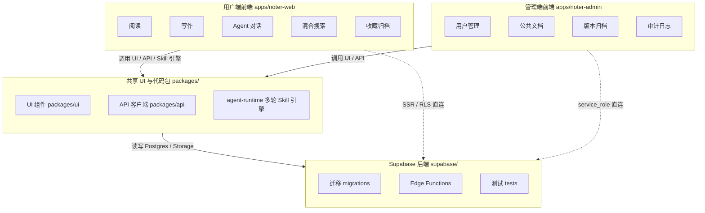

图 4.1 noter 系统总体功能模块图

### 4.2.2 用户端前端模块功能划分

用户端按 Next.js App Router 的两个路由组拆分：`(auth)/` 下挂 signin、signup 与 OAuth 回调三个登录入口；`(main)/` 共享 `layout.tsx`，承载 home、documents（含 `[id]` 详情）、notes、search、profile 五条业务路由，依次对应首页、文档库与详情、便签、搜索结果页与个人资料。客户端长驻状态收敛在 `stores/` 下，由 `document.ts`、`documentDetail.ts`、`folders.ts`、`tags.ts`、`chatSession.ts`、`user.ts` 六个 zustand store 分担列表筛选、单文档读写、组织树、多轮会话与登录态。

文档详情页围绕 `components/document-detail/` 组合：`TemplateRenderer.tsx` 与 `templates/{academic,card,compact,default}/` 四套阅读模板基于 react-markdown 配合 remark-gfm、remark-math、rehype-katex、rehype-raw、rehype-slug、rehype-highlight 全家桶渲染 Markdown；`MindmapViewer.tsx` 借 @xyflow/react 把 `document_mindmaps` 节点画成可缩放思维导图；`AIChatPanel.tsx` 与 `chat/`、`sse/` 子目录承担多轮 Agent 对话与 SSE 流式输出，`SummaryCard.tsx` 展示 AI 总结。

文档库相关视图集中在 `components/documents/`：`DocumentGrid.tsx` 与 `DocumentCard.tsx` 渲染卡片网格，`FolderSidebar.tsx`、`side-panel/TagManager.tsx`、`TagFilterList.tsx` 分担文件夹树与标签的管理与筛选，`UploadDialog.tsx`、`UploadProgress.tsx` 串起上传与进度反馈，`DocumentCardMenu.tsx` 暴露收藏与归档操作；混合搜索由 `SearchBar.tsx` 顶部弹层与 `(main)/search/page.tsx` 结果页协作完成。

### 4.2.3 管理端前端模块功能划分

管理端在 `apps/noter-admin/app/(admin)/` 路由组下划分为八个子模块,经 `AdminSidebar` 串联展示,统一由 `requireAdmin` 拦截非管理员访问。

Dashboard 汇总用户、文档与操作量等关键指标,以 Recharts 渲染注册与文档趋势图、状态与标签分布饼图;文档总览面向普通用户私有文档,提供按邮箱搜索、状态筛选与强制软删入口;审计日志按管理员、操作类型、时间范围与目标资源多维筛选,并展开 metadata 详情;公共分类与公共标签分别管理分类集合与标签集合,提供新建、编辑、软删及关联文档计数;公共文档由列表页与详情页组成,详情页内嵌 `MarkdownEditor` 在线编辑与 `VersionDrawer` 版本抽屉,实现内容修订、版本对比与回滚;系统设置围绕上传开关、自删除开关、公共可见性、日志开关四项布尔配置展开;用户与角色子模块汇集封禁、解封、软删、密码重置与角色切换等操作。

按角色映射,admin 与 super_admin 均可进入八个子模块,但用户列表中目标 super_admin 行的操作按钮始终隐藏,admin 登录时还会进一步屏蔽其他 admin 行的操作;角色切换入口仅对 super_admin 可见,以维持 super_admin 全局唯一与权限分层的约束。

### 4.2.4 后端与共享包模块功能划分

共享包按职责分为三块。packages/ui/src 承载基于 shadcn 4 注册表方案生成的组件源码，下设 components、hooks、lib、styles 四个子目录并配合 components.json 配置，被 apps/noter-web 与 apps/noter-admin 通过 pnpm workspace 协议共同消费。packages/api/src 由 client.ts、request.ts、types.ts、index.ts 四个文件组成，承载基于 axios 的 HTTP 客户端封装，集中处理 baseURL、拦截器与错误归一化。packages/agent-runtime/src 是从用户端剥离出来的多轮 Skill 引擎，内含 router、skills、tools、sse、db、prompts、types 七个子目录以及 orchestrator.ts 与 index.ts 入口，被用户端 /api/ai/chat 以进程内 import 方式直接调用，不再单独维护进程。与第二章一致，packages/hooks 与 packages/utils 当前仍为空占位目录，无 package.json，本期不参与模块切分。

后端围绕 supabase/migrations、supabase/functions、Postgres 与 pgvector 四件事展开。supabase/migrations 下 13 个迁移文件以 20260516175445、20260517223452 这种时间戳前缀做版本号顺序演进，依次落地 agent_skill_sessions 建表、混合搜索 RPC、admin_platform 系列表与公共文档版本归档触发器等增量结构。supabase/functions 下 parse-document、vectorize-document、generate-summary、generate-mindmap 四个 Edge Function 在 Deno 沙箱内链式触发，分别完成文档解析、分片向量化与 768 维向量写入、AI 总结与思维导图生成。supabase/tests 下的 agent_skill_sessions_rls_test.sql 用 pgTAP 风格 SQL 对 service-role-only RLS 策略做回归。


## 4.3 模块数据库设计

数据库设计沿用「概念结构 → 逻辑结构 → 物理结构」三段式展开。4.3.1 把 supabase public schema 当前 18 张业务表按文档主域与组织域、用户域与 Agent 域、管理后台域三块切分为三张 E-R 图，4.3.2 据此转写为关系模式并归纳一对一、一对多、多对多三类基数关系，4.3.3 再按表逐项落到物理结构。三张 E-R 图彼此以 documents 与 profiles 两个桥接实体衔接，使跨域引用在概念层就保持显式可追溯。

### 4.3.1 概念结构设计

概念结构以仓库 `supabase/migrations/` 中各表 `COMMENT` 文本所记的中文释义为命名底版，实体之间的关系基数从迁移脚本里 `REFERENCES`、`UNIQUE` 与 `CHECK` 约束反推，论文不另行增删字段，也不捏造任何外键。三张 E-R 图按业务亲疏关系组织：图 4.2 集中文档主域八张业务表与组织域三张关联表，图 4.3 集中用户域与 Agent 域三张表，图 4.4 集中管理后台域四张表，跨域引用在所属图中以外部实体（仅列主键与必要外键）形式简化呈现。

文档主域承载文档原件的标准化产物与衍生 AI 资产，组织域承载用户对文档的归类。documents 是本域的核心实体，与 document_contents、document_summaries、document_mindmaps 各保持一对一关系，迁移脚本以 document_id 上的唯一约束兜住；与 document_assets、document_chunks、document_qa_records、document_processing_jobs 各保持一对多关系，分别承担解析图片资源、向量分片、问答历史与流水线作业台账。组织域中 folders 通过 parent_id 自引用形成多级目录树，与 documents 通过 folder_id 建立一对多归类；tags 与 documents 之间不存在直接外键，由关联表 document_tags 把 document_id、tag_id 与冗余的 user_id 三字段拼成多对多关系，是本域唯一一处多对多。本域实体关系如图 4.2 所示。

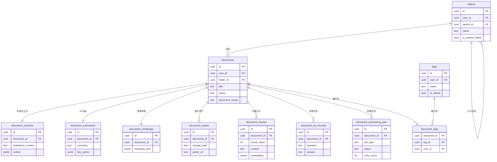

图 4.2 文档主域与组织域实体关系图

用户域与 Agent 域围绕账号实体展开。profiles 作为用户基础资料表，与 user_settings 一对一对应，user_settings 仅承载阅读模板偏好等私有字段，主键即 user_id；profiles 与 agent_skill_sessions 之间是一对多关系，同一名用户在不同文档上可以并发多条 /tutor 与 /quiz 多轮会话。agent_skill_sessions 同时通过 document_id 跨域引用文档主域的 documents 实体，与 documents 形成一对多关系，状态机以 jsonb 形式承载在 state 列。documents 在本图中只列出 id 与 title 两列以示外部实体，完整属性回到图 4.2。本域实体关系如图 4.3 所示。

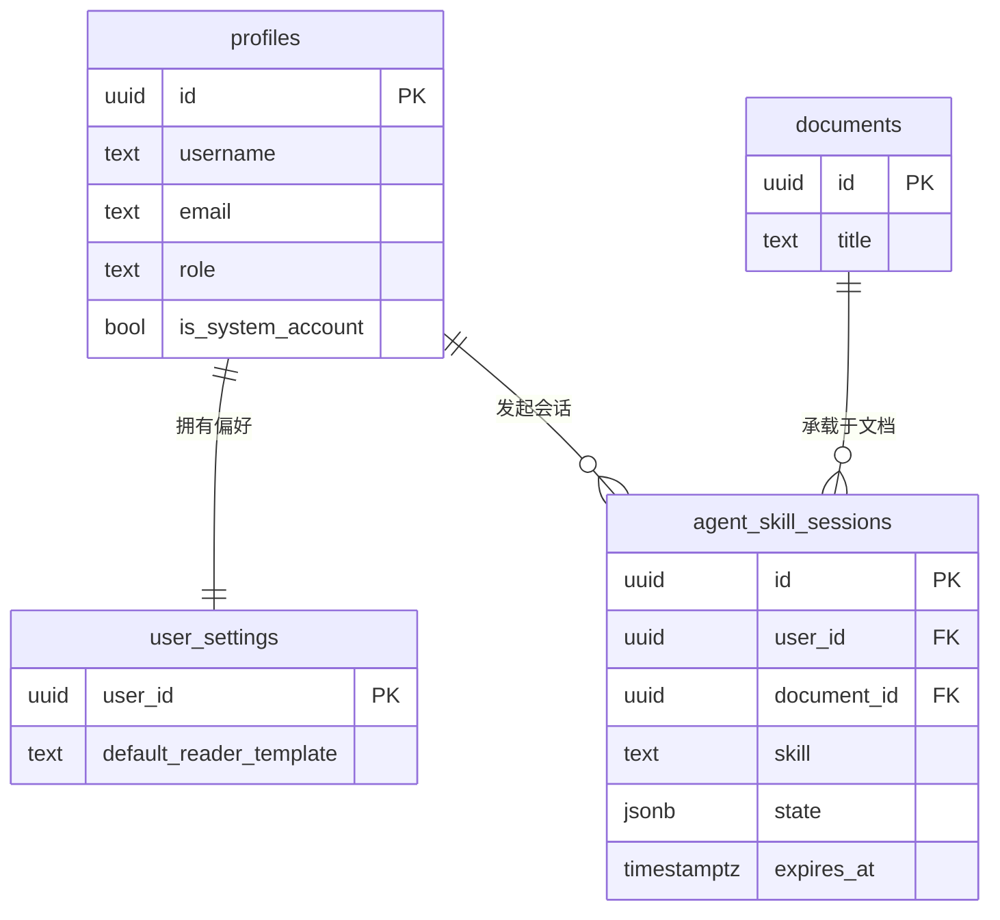

图 4.3 用户域与 Agent 域实体关系图

管理后台域承担公共文档运营、版本归档、操作审计与最小访问开关四件事，所有写操作都由管理端以 service_role 完成，本域因此只与 profiles、documents 两个外部实体发生引用关系。public_categories 与 documents 之间是一对多关系，外键 documents.public_category_id 在分类被删除时置空，保证分类下架不影响公共文档存活；public_document_versions 通过 document_id 与 documents 建立多对一关系，通过 editor_user_id 与 profiles 建立多对一关系，UNIQUE(document_id, version_no) 约束保证同一文档下版本号严格自增不重复，触发器在新文档首次落库时自动写入 version_no=1 的初始归档。admin_audit_logs 以 admin_user_id 多对一引用 profiles，记录每一次管理端写操作的执行人；system_settings 以 key 为主键收纳 allow_user_upload、allow_user_delete_own、public_documents_visible、audit_log_enabled 四个布尔开关，updated_by 同样多对一引用 profiles，迁移在外键上不级联以保留账号删除后的来源痕迹。本域实体关系如图 4.4 所示。

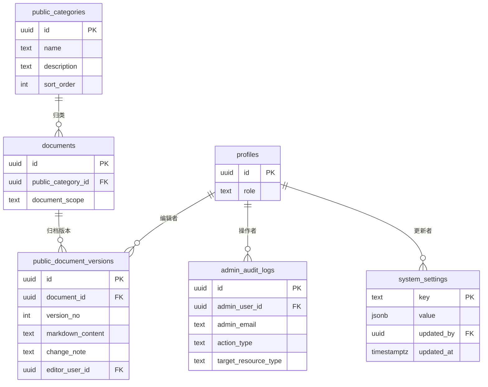

图 4.4 管理后台域实体关系图

### 4.3.2 逻辑结构设计

逻辑结构设计把 4.3.1 给出的 E-R 图按「关系名（属性 1，属性 2，……，主键，外键 → 引用关系）」格式转写为关系模式，再按一对多、一对一、多对多三类整理表与表之间的实际联系。每张表的主键统一为 `uuid` 类型并由 `gen_random_uuid()` 默认生成，唯一例外是 `system_settings` 用业务键 `key` 作为主键以承载 4 项最小访问控制开关。外键依据来自 `supabase/migrations/` 中的 `REFERENCES` 子句与各张表的 `COMMENT` 注释，业务表上几乎所有外键都额外承载 `user_id → profiles` 与 `document_id → documents` 两条关键路径，分别支撑 RLS 行级隔离与文档软删后衍生数据的归属判定。本节只列与业务语义直接相关的字段，generated 列与触发器维护字段保留到 4.3.3 物理结构按表展开。

文档主域八张表：

- documents（id, user_id, folder_id, public_category_id, title, original_filename, document_scope, status, parse_status, vector_status, summary_status, mindmap_status, is_favorite, is_archived, deleted，主键 id，外键 user_id → profiles，外键 folder_id → folders，外键 public_category_id → public_categories）
- document_contents（id, user_id, document_id, markdown_content, outline, metadata，主键 id，外键 user_id → profiles，外键 document_id → documents，UNIQUE document_id）
- document_assets（id, user_id, document_id, bucket, storage_path, public_url, filename, sort_order，主键 id，外键 user_id → profiles，外键 document_id → documents）
- document_chunks（id, user_id, document_id, chunk_index, content, heading_path, embedding, metadata，主键 id，外键 user_id → profiles，外键 document_id → documents）
- document_summaries（id, user_id, document_id, summary, key_points, todos, keywords, model_name，主键 id，外键 user_id → profiles，外键 document_id → documents，UNIQUE document_id）
- document_mindmaps（id, user_id, document_id, mindmap_json, markdown_outline, model_name，主键 id，外键 user_id → profiles，外键 document_id → documents，UNIQUE document_id）
- document_qa_records（id, user_id, document_id, question, answer, retrieved_chunk_ids, retrieval_context, model_name，主键 id，外键 user_id → profiles，外键 document_id → documents）
- document_processing_jobs（id, user_id, document_id, job_type, status, input_payload, output_payload, error_message, retry_count，主键 id，外键 user_id → profiles，外键 document_id → documents）

组织域三张表：

- folders（id, user_id, name, parent_id, icon, sort_order, is_system_folder，主键 id，外键 user_id → profiles，外键 parent_id → folders）
- tags（id, user_id, name, color, description, is_official，主键 id，外键 user_id → profiles）
- document_tags（id, user_id, document_id, tag_id，主键 id，外键 user_id → profiles，外键 document_id → documents，外键 tag_id → tags，UNIQUE (document_id, tag_id)）

用户域两张表：

- profiles（id, username, email, avatar_url, role, provider, deleted，主键 id）
- user_settings（id, user_id, default_reader_template，主键 id，外键 user_id → profiles，UNIQUE user_id）

Agent 会话域一张表：

- agent_skill_sessions（id, user_id, document_id, skill, state, expires_at, deleted，主键 id，外键 user_id → profiles，外键 document_id → documents）

管理后台域四张表：

- public_categories（id, name, description, sort_order, deleted，主键 id）
- public_document_versions（id, document_id, version_no, markdown_content, change_note, editor_user_id，主键 id，外键 document_id → documents，外键 editor_user_id → profiles，UNIQUE (document_id, version_no)）
- admin_audit_logs（id, admin_user_id, admin_email, action_type, target_resource_type, target_resource_id, request_ip, metadata，主键 id，外键 admin_user_id → profiles）
- system_settings（key, value, updated_at, updated_by，主键 key，外键 updated_by → profiles）

一对多是 18 张表之间的结构主干。profiles 作为 1 端向 documents、folders、tags 三张归属表辐射 N，串成 user → documents → document_chunks 这条 RAG 主链路，也是 RLS 策略基于 `auth.uid() = user_id` 做行级隔离的依据；documents 作为 1 端向 document_chunks、document_assets、document_qa_records、document_processing_jobs、public_document_versions、agent_skill_sessions 六张表辐射 N，承载分片召回、图片资源、问答历史、处理流水、版本快照与多轮 Skill 状态六类下游数据；folders 在 parent_id 上自引用形成多级目录树，也是同一类型的一对多。除上述主干外，public_categories 与 documents 之间通过 documents.public_category_id 也是一对多关系，由管理员侧维护分类、用户侧只读引用。

一对一通过在子表 document_id 或 user_id 上加唯一约束实现。documents ↔ document_contents、documents ↔ document_summaries、documents ↔ document_mindmaps 三对，分别承载标准化 Markdown、AI 摘要与思维导图，逻辑上每篇文档只对应一份，物理上由 document_id 列上的 UNIQUE 约束兜底，被 parse-document、generate-summary、generate-mindmap 三条流水线作为幂等写入的判据；profiles ↔ user_settings 同样靠 user_id 唯一约束保证一份用户对应一份阅读偏好。

多对多在系统里只有一处：documents ↔ tags 通过 document_tags 关联表打开，document_tags 在 (document_id, tag_id) 上设唯一约束以避免重复挂标签，并以 user_id 列保证标签关联仍归属在文档主人范围内。需要单独说明的是，documents.public_category_id → public_categories 虽然带外键，但只是 documents 单边引用 public_categories，每份公共文档只挂一个分类，反向并无关联表把 public_categories 同时关联回多个 documents 进入对称的多对多结构，按一对多归类，不能误读为多对多。

### 4.3.3 物理结构设计

4.3.2 给出的关系模式落到 Supabase Postgres 后形成 18 张实表，本节按文档主域、组织域、用户域、Agent 会话域、管理后台域五个分组，对每张表给出一份字段级物理结构表。每张表统一列「字段名 / 类型 / 长度 / 是否可空 / 主键 / 外键 / 默认值 / 含义」八列：长度列对 `text`、`uuid`、`jsonb`、`timestamptz`、`boolean` 等无显式长度的类型记为 `-`，仅 `vector` 等定长类型显式记长度；是否可空列以「否」表示 NOT NULL、「是」表示允许为空；主键、外键列分别以「是 / 否」与目标 `表.字段` 标注；默认值列以 SQL 字面量给出；含义列以 `supabase/migrations/` 中各迁移 `COMMENT ON COLUMN` 文本为准，generated 列与触发器维护逻辑放在第五章详细设计与第六章关键功能简述中再展开。

#### 一、文档主域（8 张）

`documents` 是文档主表，承载基础元数据、四类异步处理状态（parse / vector / summary / mindmap）、归属用户与文件夹、可见范围以及收藏归档与软删标志，是文档生命周期的统一入口，物理结构如表 4.1 所示。

表 4.1 documents 表物理结构

| 字段名 | 类型 | 长度 | 是否可空 | 主键 | 外键 | 默认值 | 含义 |
| --- | --- | --- | --- | --- | --- | --- | --- |
| `id` | uuid | - | 否 | 是 | 否 | `gen_random_uuid()` | 文档ID |
| `user_id` | uuid | - | 否 | 否 | profiles.id | - | 所属用户ID |
| `title` | text | - | 否 | 否 | 否 | - | 文档标题 |
| `original_filename` | text | - | 否 | 否 | 否 | - | 用户上传时的原始文件名 |
| `file_ext` | text | - | 是 | 否 | 否 | - | 文件后缀（pdf、docx、md 等） |
| `mime_type` | text | - | 是 | 否 | 否 | - | 文件 MIME 类型 |
| `file_size` | bigint | - | 是 | 否 | 否 | - | 原始文件大小（字节） |
| `original_bucket` | text | - | 否 | 否 | 否 | `'document-originals'` | 原始文件所在的 Storage 存储桶 |
| `original_storage_path` | text | - | 否 | 否 | 否 | - | 原始文件在 Storage 中的存储路径 |
| `status` | text | - | 否 | 否 | 否 | `'uploaded'` | 文档整体处理状态（uploaded / parsing / parsed / vectorizing / ready / failed） |
| `parse_status` | text | - | 否 | 否 | 否 | `'pending'` | 文档解析状态（pending / running / success / failed） |
| `vector_status` | text | - | 否 | 否 | 否 | `'pending'` | 文档向量化状态 |
| `summary_status` | text | - | 否 | 否 | 否 | `'pending'` | AI 总结生成状态 |
| `mindmap_status` | text | - | 否 | 否 | 否 | `'pending'` | AI 思维导图生成状态 |
| `short_description` | text | - | 是 | 否 | 否 | - | 文档简短描述或摘要片段，用于文档卡片展示 |
| `word_count` | integer | - | 是 | 否 | 否 | `0` | 文档字数 |
| `page_count` | integer | - | 是 | 否 | 否 | - | 文档页数 |
| `language` | text | - | 是 | 否 | 否 | - | 文档语言 |
| `is_favorite` | integer | - | 否 | 否 | 否 | `0`（CHECK ∈ {0,1}） | 是否收藏，0=未收藏，1=收藏 |
| `is_archived` | integer | - | 否 | 否 | 否 | `0`（CHECK ∈ {0,1}） | 是否归档，0=未归档，1=归档 |
| `deleted` | integer | - | 否 | 否 | 否 | `0`（CHECK ∈ {0,1}） | 软删标志，0=正常，1=已删除 |
| `deleted_at` | timestamptz | - | 是 | 否 | 否 | - | 删除时间 |
| `created_at` | timestamptz | - | 否 | 否 | 否 | `now()` | 创建时间 |
| `updated_at` | timestamptz | - | 否 | 否 | 否 | `now()` | 更新时间 |
| `folder_id` | uuid | - | 是 | 否 | folders.id | - | 所属文件夹ID（NULL 时归入默认文件夹） |
| `cover_url` | text | - | 是 | 否 | 否 | - | 文档卡片自定义封面 URL（NULL 时前端使用默认封面） |
| `document_scope` | text | - | 否 | 否 | 否 | `'private'`（CHECK ∈ {private,public}） | 可见范围：private=私有；public=后台运营公共文档 |
| `public_category_id` | uuid | - | 是 | 否 | public_categories.id | - | 公共文档所属分类（仅 document_scope=public 时允许非 NULL） |

`document_contents` 与 `documents` 一对一，承载解析后的标准 Markdown 全文、根据标题生成的大纲与解析过程的额外元数据，物理结构如表 4.2 所示。

表 4.2 document_contents 表物理结构

| 字段名 | 类型 | 长度 | 是否可空 | 主键 | 外键 | 默认值 | 含义 |
| --- | --- | --- | --- | --- | --- | --- | --- |
| `id` | uuid | - | 否 | 是 | 否 | `gen_random_uuid()` | 文档内容ID |
| `user_id` | uuid | - | 否 | 否 | profiles.id | - | 所属用户ID |
| `document_id` | uuid | - | 否 | 否 | documents.id（unique） | - | 对应的文档ID（一对一） |
| `markdown_content` | text | - | 否 | 否 | 否 | - | 解析后的 Markdown 正文内容 |
| `outline` | jsonb | - | 是 | 否 | 否 | - | 根据 Markdown 标题生成的文档大纲 |
| `metadata` | jsonb | - | 是 | 否 | 否 | - | 文档解析过程中的额外元数据 |
| `deleted` | integer | - | 否 | 否 | 否 | `0`（CHECK ∈ {0,1}） | 软删标志 |
| `created_at` | timestamptz | - | 否 | 否 | 否 | `now()` | 创建时间 |
| `updated_at` | timestamptz | - | 否 | 否 | 否 | `now()` | 更新时间 |

`document_assets` 记录解析阶段产出的图片资源，落地到 `document-assets-public` 公开桶，与 `documents` 多对一，物理结构如表 4.3 所示。

表 4.3 document_assets 表物理结构

| 字段名 | 类型 | 长度 | 是否可空 | 主键 | 外键 | 默认值 | 含义 |
| --- | --- | --- | --- | --- | --- | --- | --- |
| `id` | uuid | - | 否 | 是 | 否 | `gen_random_uuid()` | 文档资源ID |
| `user_id` | uuid | - | 否 | 否 | profiles.id | - | 所属用户ID |
| `document_id` | uuid | - | 否 | 否 | documents.id | - | 所属文档ID |
| `bucket` | text | - | 否 | 否 | 否 | `'document-assets-public'` | 资源所在的 Storage 存储桶 |
| `storage_path` | text | - | 否 | 否 | 否 | - | 资源在 Storage 中的存储路径 |
| `public_url` | text | - | 否 | 否 | 否 | - | 资源公开访问地址 |
| `original_url` | text | - | 是 | 否 | 否 | - | 解析服务返回的原始资源地址 |
| `filename` | text | - | 是 | 否 | 否 | - | 资源文件名 |
| `mime_type` | text | - | 是 | 否 | 否 | - | 资源 MIME 类型 |
| `file_size` | bigint | - | 是 | 否 | 否 | - | 资源文件大小（字节） |
| `width` | integer | - | 是 | 否 | 否 | - | 图片宽度 |
| `height` | integer | - | 是 | 否 | 否 | - | 图片高度 |
| `sort_order` | integer | - | 是 | 否 | 否 | `0` | 资源排序序号 |
| `deleted` | integer | - | 否 | 否 | 否 | `0`（CHECK ∈ {0,1}） | 软删标志 |
| `created_at` | timestamptz | - | 否 | 否 | 否 | `now()` | 创建时间 |

`document_chunks` 是 RAG 检索的核心载体，每条记录是文档的一段分片，含 768 维 pgvector embedding 与字符 / token 级位置信息，物理结构如表 4.4 所示。

表 4.4 document_chunks 表物理结构

| 字段名 | 类型 | 长度 | 是否可空 | 主键 | 外键 | 默认值 | 含义 |
| --- | --- | --- | --- | --- | --- | --- | --- |
| `id` | uuid | - | 否 | 是 | 否 | `gen_random_uuid()` | 文档分片ID |
| `user_id` | uuid | - | 否 | 否 | profiles.id | - | 所属用户ID |
| `document_id` | uuid | - | 否 | 否 | documents.id | - | 所属文档ID |
| `chunk_index` | integer | - | 否 | 否 | 否 | - | 分片序号 |
| `content` | text | - | 否 | 否 | 否 | - | 分片文本内容 |
| `heading_path` | jsonb | - | 是 | 否 | 否 | - | 分片所在的标题层级路径 |
| `token_count` | integer | - | 是 | 否 | 否 | - | 分片 token 数量 |
| `char_start` | integer | - | 是 | 否 | 否 | - | 分片在原始 Markdown 中的开始字符位置 |
| `char_end` | integer | - | 是 | 否 | 否 | - | 分片在原始 Markdown 中的结束字符位置 |
| `embedding` | vector | 768 维 | 是 | 否 | 否 | - | 分片向量数据（pgvector） |
| `metadata` | jsonb | - | 是 | 否 | 否 | - | 分片额外元数据 |
| `deleted` | integer | - | 否 | 否 | 否 | `0`（CHECK ∈ {0,1}） | 软删标志 |
| `created_at` | timestamptz | - | 否 | 否 | 否 | `now()` | 创建时间 |

`document_summaries` 与 `documents` 一对一，承载 AI 总结结果，包括摘要正文、关键要点、待办、关键词、适用场景以及生成所用模型，物理结构如表 4.5 所示。

表 4.5 document_summaries 表物理结构

| 字段名 | 类型 | 长度 | 是否可空 | 主键 | 外键 | 默认值 | 含义 |
| --- | --- | --- | --- | --- | --- | --- | --- |
| `id` | uuid | - | 否 | 是 | 否 | `gen_random_uuid()` | AI 总结ID |
| `user_id` | uuid | - | 否 | 否 | profiles.id | - | 所属用户ID |
| `document_id` | uuid | - | 否 | 否 | documents.id（unique） | - | 所属文档ID（一对一） |
| `summary` | text | - | 否 | 否 | 否 | - | 文档摘要正文 |
| `key_points` | jsonb | - | 是 | 否 | 否 | - | 关键要点 |
| `todos` | jsonb | - | 是 | 否 | 否 | - | 待办事项 |
| `keywords` | text[] | - | 是 | 否 | 否 | - | 关键词数组 |
| `suitable_scenarios` | jsonb | - | 是 | 否 | 否 | - | 适用场景 |
| `model_name` | text | - | 是 | 否 | 否 | - | 生成总结所用模型名称 |
| `deleted` | integer | - | 否 | 否 | 否 | `0`（CHECK ∈ {0,1}） | 软删标志 |
| `generated_at` | timestamptz | - | 否 | 否 | 否 | `now()` | 生成时间 |
| `created_at` | timestamptz | - | 否 | 否 | 否 | `now()` | 创建时间 |
| `updated_at` | timestamptz | - | 否 | 否 | 否 | `now()` | 更新时间 |

`document_mindmaps` 与 `documents` 一对一，承载 AI 思维导图的结构化 JSON 数据与 Markdown 大纲两份产出，物理结构如表 4.6 所示。

表 4.6 document_mindmaps 表物理结构

| 字段名 | 类型 | 长度 | 是否可空 | 主键 | 外键 | 默认值 | 含义 |
| --- | --- | --- | --- | --- | --- | --- | --- |
| `id` | uuid | - | 否 | 是 | 否 | `gen_random_uuid()` | AI 思维导图ID |
| `user_id` | uuid | - | 否 | 否 | profiles.id | - | 所属用户ID |
| `document_id` | uuid | - | 否 | 否 | documents.id（unique） | - | 所属文档ID（一对一） |
| `mindmap_json` | jsonb | - | 否 | 否 | 否 | - | 思维导图结构化 JSON 数据（@xyflow/react 节点） |
| `markdown_outline` | text | - | 是 | 否 | 否 | - | Markdown 形式的大纲内容 |
| `model_name` | text | - | 是 | 否 | 否 | - | 生成思维导图所用模型名称 |
| `deleted` | integer | - | 否 | 否 | 否 | `0`（CHECK ∈ {0,1}） | 软删标志 |
| `generated_at` | timestamptz | - | 否 | 否 | 否 | `now()` | 生成时间 |
| `created_at` | timestamptz | - | 否 | 否 | 否 | `now()` | 创建时间 |
| `updated_at` | timestamptz | - | 否 | 否 | 否 | `now()` | 更新时间 |

`document_qa_records` 记录围绕单个文档的 AI 问答历史，含问题、回答、检索到的分片 ID 列表与检索上下文，物理结构如表 4.7 所示。

表 4.7 document_qa_records 表物理结构

| 字段名 | 类型 | 长度 | 是否可空 | 主键 | 外键 | 默认值 | 含义 |
| --- | --- | --- | --- | --- | --- | --- | --- |
| `id` | uuid | - | 否 | 是 | 否 | `gen_random_uuid()` | 文档问答记录ID |
| `user_id` | uuid | - | 否 | 否 | profiles.id | - | 所属用户ID |
| `document_id` | uuid | - | 否 | 否 | documents.id | - | 所属文档ID |
| `question` | text | - | 否 | 否 | 否 | - | 用户提出的问题 |
| `answer` | text | - | 否 | 否 | 否 | - | AI 生成的回答 |
| `retrieved_chunk_ids` | uuid[] | - | 是 | 否 | 否 | - | 本次问答检索到的文档分片ID列表 |
| `retrieval_context` | jsonb | - | 是 | 否 | 否 | - | 本次问答的检索上下文信息 |
| `model_name` | text | - | 是 | 否 | 否 | - | 生成回答所用模型名称 |
| `deleted` | integer | - | 否 | 否 | 否 | `0`（CHECK ∈ {0,1}） | 软删标志 |
| `created_at` | timestamptz | - | 否 | 否 | 否 | `now()` | 创建时间 |

`document_processing_jobs` 是解析 / 向量化 / 总结 / 思维导图四类 Edge Function 任务的统一流水台账，驱动 `documents` 表上四个 `*_status` 字段的状态机，物理结构如表 4.8 所示。

表 4.8 document_processing_jobs 表物理结构

| 字段名 | 类型 | 长度 | 是否可空 | 主键 | 外键 | 默认值 | 含义 |
| --- | --- | --- | --- | --- | --- | --- | --- |
| `id` | uuid | - | 否 | 是 | 否 | `gen_random_uuid()` | 文档处理任务ID |
| `user_id` | uuid | - | 否 | 否 | profiles.id | - | 所属用户ID |
| `document_id` | uuid | - | 否 | 否 | documents.id | - | 所属文档ID |
| `job_type` | text | - | 否 | 否 | 否 | - | 任务类型（parse-document / vectorize-document / generate-summary / generate-mindmap） |
| `status` | text | - | 否 | 否 | 否 | `'pending'` | 任务状态（pending / running / success / failed） |
| `input_payload` | jsonb | - | 是 | 否 | 否 | - | 任务输入参数 |
| `output_payload` | jsonb | - | 是 | 否 | 否 | - | 任务输出结果 |
| `error_message` | text | - | 是 | 否 | 否 | - | 任务失败时的错误信息 |
| `retry_count` | integer | - | 否 | 否 | 否 | `0` | 任务重试次数 |
| `deleted` | integer | - | 否 | 否 | 否 | `0`（CHECK ∈ {0,1}） | 软删标志 |
| `started_at` | timestamptz | - | 是 | 否 | 否 | - | 任务开始时间 |
| `finished_at` | timestamptz | - | 是 | 否 | 否 | - | 任务完成时间 |
| `created_at` | timestamptz | - | 否 | 否 | 否 | `now()` | 创建时间 |
| `updated_at` | timestamptz | - | 否 | 否 | 否 | `now()` | 更新时间 |

#### 二、组织域（3 张）

`folders` 是用户文件夹表，通过 `parent_id` 自引用形成多级目录树，并以 `is_system_folder` 标记承载公共文档的「Noter 官方」系统文件夹，物理结构如表 4.9 所示。

表 4.9 folders 表物理结构

| 字段名 | 类型 | 长度 | 是否可空 | 主键 | 外键 | 默认值 | 含义 |
| --- | --- | --- | --- | --- | --- | --- | --- |
| `id` | uuid | - | 否 | 是 | 否 | `gen_random_uuid()` | 文件夹ID |
| `user_id` | uuid | - | 否 | 否 | profiles.id | - | 所属用户ID |
| `name` | text | - | 否 | 否 | 否 | - | 文件夹名称 |
| `parent_id` | uuid | - | 是 | 否 | folders.id（自引用） | - | 父文件夹ID，为 NULL 表示根级文件夹 |
| `icon` | text | - | 是 | 否 | 否 | - | 文件夹图标标识 |
| `sort_order` | integer | - | 是 | 否 | 否 | `0` | 排序权重 |
| `deleted` | integer | - | 否 | 否 | 否 | `0`（CHECK ∈ {0,1}） | 软删标志 |
| `created_at` | timestamptz | - | 否 | 否 | 否 | `now()` | 创建时间 |
| `updated_at` | timestamptz | - | 否 | 否 | 否 | `now()` | 更新时间 |
| `is_system_folder` | boolean | - | 否 | 否 | 否 | `false` | 是否为系统级文件夹，true 表示「Noter 官方」系统文件夹（承载公共文档），false 表示普通用户文件夹 |

`tags` 是标签字典表，`is_official` 区分用户私人标签与官方公共标签，与 `folders` 共同构成两条互不冲突的归类线索，物理结构如表 4.10 所示。

表 4.10 tags 表物理结构

| 字段名 | 类型 | 长度 | 是否可空 | 主键 | 外键 | 默认值 | 含义 |
| --- | --- | --- | --- | --- | --- | --- | --- |
| `id` | uuid | - | 否 | 是 | 否 | `gen_random_uuid()` | 标签ID |
| `user_id` | uuid | - | 否 | 否 | profiles.id | - | 所属用户ID |
| `name` | text | - | 否 | 否 | 否 | - | 标签名称 |
| `color` | text | - | 是 | 否 | 否 | - | 标签颜色 |
| `description` | text | - | 是 | 否 | 否 | - | 标签描述 |
| `deleted` | integer | - | 否 | 否 | 否 | `0`（CHECK ∈ {0,1}） | 软删标志 |
| `created_at` | timestamptz | - | 否 | 否 | 否 | `now()` | 创建时间 |
| `updated_at` | timestamptz | - | 否 | 否 | 否 | `now()` | 更新时间 |
| `is_official` | boolean | - | 否 | 否 | 否 | `false` | 是否为官方公共标签（true=后台维护并被公共文档关联，false=用户私人标签） |

`document_tags` 是文档与标签的多对多关联表，冗余 `user_id` 便于 RLS 与查询，物理结构如表 4.11 所示。

表 4.11 document_tags 表物理结构

| 字段名 | 类型 | 长度 | 是否可空 | 主键 | 外键 | 默认值 | 含义 |
| --- | --- | --- | --- | --- | --- | --- | --- |
| `id` | uuid | - | 否 | 是 | 否 | `gen_random_uuid()` | 关联ID |
| `user_id` | uuid | - | 否 | 否 | profiles.id | - | 所属用户ID |
| `document_id` | uuid | - | 否 | 否 | documents.id | - | 文档ID |
| `tag_id` | uuid | - | 否 | 否 | tags.id | - | 标签ID |
| `deleted` | integer | - | 否 | 否 | 否 | `0`（CHECK ∈ {0,1}） | 软删标志 |
| `created_at` | timestamptz | - | 否 | 否 | 否 | `now()` | 创建时间 |

#### 三、用户域（2 张）

`profiles` 与 `auth.users` 一一对应，承载用户的应用层资料、角色（user / admin / super_admin）、登录方式、是否系统账号等信息，物理结构如表 4.12 所示。

表 4.12 profiles 表物理结构

| 字段名 | 类型 | 长度 | 是否可空 | 主键 | 外键 | 默认值 | 含义 |
| --- | --- | --- | --- | --- | --- | --- | --- |
| `id` | uuid | - | 否 | 是 | auth.users.id | - | 用户ID（与 Supabase Auth 用户ID 对应） |
| `username` | text | - | 是 | 否 | 否 | - | 用户名 |
| `email` | text | - | 否（unique） | 否 | 否 | - | 用户邮箱 |
| `avatar_url` | text | - | 是 | 否 | 否 | - | 用户头像地址 |
| `role` | text | - | 是 | 否 | 否 | `'user'` | 用户角色（user / admin / super_admin） |
| `created_at` | timestamptz | - | 是 | 否 | 否 | `now()` | 用户创建时间 |
| `updated_at` | timestamptz | - | 是 | 否 | 否 | `now()` | 用户资料更新时间 |
| `deleted` | smallint | - | 是 | 否 | 否 | `0` | 是否已注销或删除（0=正常，1=已删除） |
| `provider` | text | - | 是 | 否 | 否 | - | 登录方式（email、github 等） |
| `nike_name` | text | - | 是 | 否 | 否 | - | 用户昵称（仓库内字段名拼写为 `nike_name`，对应 nick name 语义） |
| `not_active` | smallint | - | 是 | 否 | 否 | `0` | 账号是否禁用（0=正常，1=禁用） |
| `is_system_account` | boolean | - | 否 | 否 | 否 | `false` | 是否为系统内部账号（用于公共文档归属等场景） |

`user_settings` 承载用户偏好设置，当前仅记录默认阅读模板，后续可扩展，物理结构如表 4.13 所示。

表 4.13 user_settings 表物理结构

| 字段名 | 类型 | 长度 | 是否可空 | 主键 | 外键 | 默认值 | 含义 |
| --- | --- | --- | --- | --- | --- | --- | --- |
| `id` | uuid | - | 否 | 是 | 否 | `gen_random_uuid()` | 设置记录ID |
| `user_id` | uuid | - | 否（unique） | 否 | profiles.id | - | 所属用户ID |
| `default_reader_template` | text | - | 否 | 否 | 否 | `'default'` | 用户默认阅读模板（default / academic / clean / card） |
| `deleted` | integer | - | 否 | 否 | 否 | `0`（CHECK ∈ {0,1}） | 软删标志 |
| `created_at` | timestamptz | - | 否 | 否 | 否 | `now()` | 创建时间 |
| `updated_at` | timestamptz | - | 否 | 否 | 否 | `now()` | 更新时间 |

#### 四、Agent 会话域（1 张）

`agent_skill_sessions` 持久化 `/tutor` 与 `/quiz` 等多轮 Skill 的会话状态（含章节进度、题组、用户作答与评分等），`expires_at` 默认在创建后 24 小时过期；表上 RLS 仅放行 service_role，浏览器端必须经 `/api/ai/sessions` Route Handler 间接访问，物理结构如表 4.14 所示。

表 4.14 agent_skill_sessions 表物理结构

| 字段名 | 类型 | 长度 | 是否可空 | 主键 | 外键 | 默认值 | 含义 |
| --- | --- | --- | --- | --- | --- | --- | --- |
| `id` | uuid | - | 否 | 是 | 否 | `gen_random_uuid()` | 会话 ID |
| `user_id` | uuid | - | 否 | 否 | profiles.id | - | 所属用户 ID |
| `document_id` | uuid | - | 否 | 否 | documents.id | - | 关联文档 ID（每个 session 绑定单一文档） |
| `skill` | text | - | 否 | 否 | 否 | - | Skill 标识（/tutor、/quiz 等） |
| `state` | jsonb | - | 否 | 否 | 否 | `'{}'::jsonb` | Skill 特定状态：/tutor 含 currentChapterIndex / exchangeHistory；/quiz 含 config / questions / userAnswers / gradingResult，其中 questions[i].correctAnswer 仅服务端可见 |
| `expires_at` | timestamptz | - | 否 | 否 | 否 | `now() + interval '24 hours'` | 会话过期时间，默认创建后 24 小时 |
| `deleted` | integer | - | 否 | 否 | 否 | `0`（CHECK ∈ {0,1}） | 软删标志 |
| `created_at` | timestamptz | - | 否 | 否 | 否 | `now()` | 创建时间 |
| `updated_at` | timestamptz | - | 否 | 否 | 否 | `now()` | 更新时间 |

#### 五、管理后台域（4 张）

`public_categories` 是公共文档（`document_scope='public'`）的扁平运营分类表，与 `documents.public_category_id` 一对多关联，物理结构如表 4.15 所示。

表 4.15 public_categories 表物理结构

| 字段名 | 类型 | 长度 | 是否可空 | 主键 | 外键 | 默认值 | 含义 |
| --- | --- | --- | --- | --- | --- | --- | --- |
| `id` | uuid | - | 否 | 是 | 否 | `gen_random_uuid()` | 分类ID |
| `name` | text | - | 否 | 否 | 否 | - | 分类名称（业务层去空白与非空校验；未删除范围内 LOWER(name) 全局唯一） |
| `description` | text | - | 是 | 否 | 否 | - | 分类描述，可空 |
| `sort_order` | integer | - | 否 | 否 | 否 | `0` | 前端展示用排序权重，越小越靠前 |
| `deleted` | integer | - | 否 | 否 | 否 | `0`（CHECK ∈ {0,1}） | 软删除标记（0=正常，1=已删除） |
| `created_at` | timestamptz | - | 否 | 否 | 否 | `now()` | 创建时间 |
| `updated_at` | timestamptz | - | 否 | 否 | 否 | `now()` | 更新时间 |

`public_document_versions` 承载公共文档 Markdown 版本归档，`version_no` 在 `document_id` 维度内严格自增（CHECK ≥ 1）并与 `document_id` 联合唯一，每次保存或回滚前由触发器写入「上一版」快照，物理结构如表 4.16 所示。

表 4.16 public_document_versions 表物理结构

| 字段名 | 类型 | 长度 | 是否可空 | 主键 | 外键 | 默认值 | 含义 |
| --- | --- | --- | --- | --- | --- | --- | --- |
| `id` | uuid | - | 否 | 是 | 否 | `gen_random_uuid()` | 版本快照ID |
| `document_id` | uuid | - | 否 | 否 | documents.id（ON DELETE CASCADE） | - | 关联 documents.id（document_scope='public'） |
| `version_no` | integer | - | 否 | 否 | 否 | - | 文档维度版本号，从 1 起递增（CHECK `version_no >= 1`），与 document_id 联合唯一 |
| `markdown_content` | text | - | 否 | 否 | 否 | - | 该版本归档时的 markdown 全文快照（保存/回滚前的「上一版」内容） |
| `change_note` | text | - | 是 | 否 | 否 | - | 管理员保存/回滚时填写的变更说明，可空 |
| `editor_user_id` | uuid | - | 否 | 否 | profiles.id | - | 触发该次归档的管理员 profile id |
| `created_at` | timestamptz | - | 否 | 否 | 否 | `now()` | 创建时间 |

`admin_audit_logs` 记录管理员后台所有写操作的审计流水，写入受 `system_settings.audit_log_enabled` 控制，但「切换该开关本身」始终写日志，`action_type` 与 `target_resource_type` 分别由 `audit_action_chk` 与 `audit_target_chk` 白名单约束，物理结构如表 4.17 所示。

表 4.17 admin_audit_logs 表物理结构

| 字段名 | 类型 | 长度 | 是否可空 | 主键 | 外键 | 默认值 | 含义 |
| --- | --- | --- | --- | --- | --- | --- | --- |
| `id` | uuid | - | 否 | 是 | 否 | `gen_random_uuid()` | 审计日志ID |
| `admin_user_id` | uuid | - | 否 | 否 | profiles.id | - | 实际触发操作的管理员 profile id（无级联，profile 软删/硬删时保留审计记录归属） |
| `admin_email` | text | - | 否 | 否 | 否 | - | 冗余存储管理员邮箱，便于列表展示与 profile 硬删后追溯 |
| `action_type` | text | - | 否 | 否 | 否 | - | 操作类型，受 `audit_action_chk` 白名单约束（18 个枚举：user.block / unblock / delete / send_password_reset / role_change，public_document.upload / metadata_update / content_update / rollback / delete，public_category.create / update / delete，public_tag.create / update / delete，document.force_delete，system_settings.update） |
| `target_resource_type` | text | - | 否 | 否 | 否 | - | 目标资源类型，受 `audit_target_chk` 约束（user / document / public_document / public_category / public_tag / system_settings） |
| `target_resource_id` | uuid | - | 是 | 否 | 否 | - | 目标资源 id，可空（部分元操作不带具体 id；system_settings 场景按 key 定位） |
| `target_resource_label` | text | - | 是 | 否 | 否 | - | 目标资源可读标识冗余（用户邮箱 / 文档标题 / 分类名 / 标签名 / 设置 key） |
| `request_ip` | text | - | 是 | 否 | 否 | - | 触发请求的来源 IP（X-Forwarded-For / 直连），可空以兼容内部脚本调用 |
| `metadata` | jsonb | - | 否 | 否 | 否 | `'{}'::jsonb` | 操作专属上下文 jsonb（密码重置不含 token、内容更新不含完整 markdown、设置更新含 before/after value 等） |
| `created_at` | timestamptz | - | 否 | 否 | 否 | `now()` | 创建时间 |

`system_settings` 承载 4 项最小访问控制开关，被 noter-web 与 noter-admin 双端读取，写入仅经 `PATCH /api/admin/system-settings` 在事务内同步写 `admin_audit_logs`，物理结构如表 4.18 所示。

表 4.18 system_settings 表物理结构

| 字段名 | 类型 | 长度 | 是否可空 | 主键 | 外键 | 默认值 | 含义 |
| --- | --- | --- | --- | --- | --- | --- | --- |
| `key` | text | - | 否 | 是 | 否 | - | 设置项标识，受 `settings_key_chk` 白名单约束（4 个枚举：allow_user_upload / allow_user_delete_own / public_documents_visible / audit_log_enabled） |
| `value` | jsonb | - | 否 | 否 | 否 | - | 设置项值（jsonb，当前 4 项均为 boolean），受 `settings_value_chk` 强制 `jsonb_typeof = 'boolean'` |
| `updated_at` | timestamptz | - | 否 | 否 | 否 | `now()` | 上次修改时间，前端「设置」页展示 |
| `updated_by` | uuid | - | 是 | 否 | profiles.id | - | 上次修改者 profile id（无级联，软删/硬删时保留来源痕迹；首次 seed 由迁移写入，故可空） |

# 第五章 详细设计

<!-- TODO: 待 task 5 撰写 -->

## 5.1 核心功能模块一：文档上传与 RAG 解析流水线

<!-- TODO: 待 task 5.1 撰写 -->

### 5.1.1 模块用途与业务流程概述

本模块解决的是一份原始文件从落库到形成结构化产出之间的人工断层。学习与科研中累积的 PDF、DOCX、PPTX、TXT 与 Markdown 资料一旦数量上来，靠用户自己整理摘要、做章节大纲、画思维导图既不现实也不稳定；本模块把解析、图片转存、分片向量化、AI 总结与思维导图串成一条后台链路[11]，让任意一份合格文件落库之后无需人工介入即可进入可读、可检索、可对话的状态。这条链路也是 5.1 节后续两条小节展开内部处理逻辑与关键代码的对象。

入口收敛在 `apps/noter-web/components/documents/UploadDialog.tsx`，文档列表的胶囊导航与卡片墙都把拖拽与点选两类输入交给同一对话框承接。本端校验文件格式与 50MB 上限之后分两条路径：单文件交给 `UploadProgress` 做阶段化展示，按 3 秒一次轮询 `GET /api/documents/[id]/status`，最长 5 分钟内把 parse / summary / mindmap 各阶段映射到「上传中 → 解析中 → AI 处理中 → 完成」四档可视进度；多文件改走顺序提交，以「正在上传 X / N」紧凑总进度收敛失败汇总。Route Handler 在 Storage 与 documents 行落地之后由 Edge Function 链式触发 parse-document、vectorize-document、generate-summary 与 generate-mindmap，五个 status 字段相互独立流转。

最终呈现集中在文档详情页：阅读模板始终基于 `document_contents` 中的标准化 Markdown 渲染正文与章节大纲，不再回到 LlamaParse 的临时链路；右侧 AI 总结卡片读 `document_summaries` 的核心摘要、关键要点与关键词，思维导图 Tab 读 `document_mindmaps` 的 JSON 树形结构。任一 AI 项失败时整体文案降级为「文档已就绪，AI 总结或思维导图生成失败，可在详情页重试」，正文与下载入口照常可用，重新生成按钮就近保留在对应卡片内供用户单点重试。

### 5.1.2 内部处理逻辑

整条流水线由「用户端 Web → Next.js Route Handler → Supabase Storage → parse-document → LlamaParse → Postgres 主库 → vectorize-document → generate-summary 与 generate-mindmap → 前端轮询」九段衔接而成，跨进程协作以 `supabase.functions.invoke` 链式触发，跨阶段进度则统一收敛在 documents 表的 `parse_status / vector_status / summary_status / mindmap_status` 四个字段上，前端按 3 秒一次的节奏轮询 `GET /api/documents/[id]/status` 端点直至四类字段稳定到终态。如图 5.1 所示。

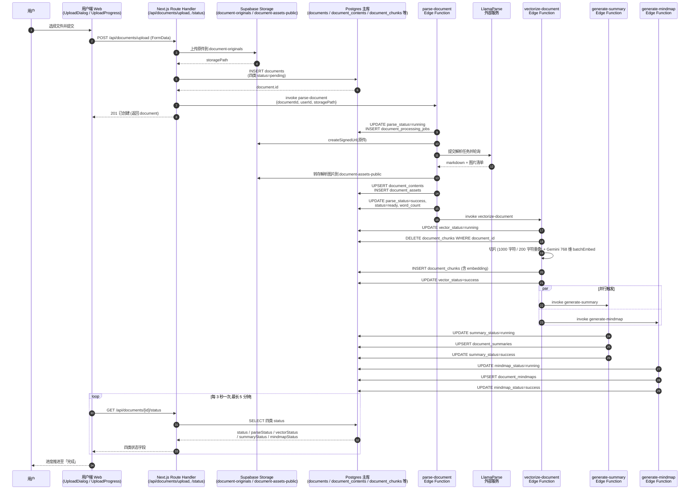

图 5.1 文档上传与 RAG 解析流水线时序图

入口收敛在 `apps/noter-web/app/api/documents/upload/route.ts`：Route Handler 取出当前会话用户、读取系统开关 `allow_user_upload`、用 `uploadDocumentSchema` 校验文件名与大小，再生成 `documentId` 并把字节流写入 Storage 桶 `document-originals/${user.id}/${documentId}`；写入成功后向 documents 表插入一行记录，其 `status='processing'`、`parse_status / vector_status / summary_status / mindmap_status` 四列均置 `pending`。落库一旦成功，Route Handler 立即以非阻塞方式 `supabase.functions.invoke('parse-document', { body: { documentId, userId, storagePath } })`，并把 documents 行 201 返回给浏览器，长耗时工作交给后台 Edge Function 接管。

parse-document 函数承担「原始字节流到标准化 Markdown」的转换。函数先把 `parse_status` 翻到 `running` 并向 `document_processing_jobs` 写入一条 `job_type='parse'` 的台账，对原件签发临时下载链接后提交到 LlamaParse v2 API[12] 进行轮询解析；解析返回的 Markdown 与图片元数据被写回 `document_contents` 与 `document_assets`，图片二进制本身转存到公开桶 `document-assets-public`。解析成功之后函数把 `parse_status` 标 `success`、把 `documents.status` 标 `ready` 并回写 `word_count`，同步把对应 job 改成 `success`，再链式调用 `supabase.functions.invoke('vectorize-document', { body: { documentId, userId } })`，让用户在向量化未完成时即可进入阅读视图。

vectorize-document 函数把 `vector_status` 切到 `running` 后，先按 `document_id` 删除既有 `document_chunks` 以保证幂等，再把正文按 1000 字符正文加 200 字符重叠切片，调 `gemini-embedding-2`[13] 以最大 100 条/批的方式生成 768 维向量并整行写入 `document_chunks.embedding` 列；写入完成把 `vector_status` 标 `success`，并通过 `Promise.allSettled` 并行触发 `generate-summary` 与 `generate-mindmap`。两个下游函数沿用相同套路：各自先把 `summary_status` 或 `mindmap_status` 切到 `running`，调 LLM 产出结构化结果后 UPSERT 到 `document_summaries` 与 `document_mindmaps`[14]，再把对应状态字段标 `success`。前端 `UploadProgress` 组件以 `POLL_INTERVAL = 3000` 一次的节奏调 `GET /api/documents/[id]/status`，按 `parse_status` 与 `summary_status / mindmap_status` 合并后的 AI 状态绘制四档进度，所有终态命中即停。

返回路径覆盖三种失败语境。Route Handler 在 documents 落库失败时立即从 Storage 删除已上传的原件实现回滚；任一 Edge Function 抛错时进入 `catch` 分支，把对应 status 标为 `failed` 并把 `document_processing_jobs` 当前 running 行翻成 `failed`、把异常消息写入 `error_message`，下一次重新触发流水线时会重新插入新 job 并把 `retry_count` 累加，整条链路天然支持幂等重试。parse 失败时 `documents.status` 一并降级为 `failed`，向量化、摘要、思维导图三个下游失败时仅自身 status 落到 `failed`，`documents.status` 保持 `ready` 让正文与下载入口仍然可用。前端轮询读到这些 `failed` 字段后把进度卡片切换成「文档已就绪，AI 总结或思维导图生成失败」并暴露重试入口，把异步链路的故障语义还原成用户可感知的局部降级。

### 5.1.3 关键代码与运行界面

5.1.2 描绘的流水线在仓库里集中体现为三段代码：`UploadDialog` 控制多文件提交节奏，`parse-document` 把原文交给 LlamaParse 并轮询完成态，`vectorize-document` 在内容落地后做带重叠的分片。下面按这一顺序各取一段贴出，辅助函数（图片回拉、HeadingPath 抽取）放入第 10 章附录。

第一段是 `UploadDialog` 的批量上传分支，要解决用户一次拖入多份文件时如何顺序请求 `/api/documents/upload`、把进度回填到弹窗、并在最后一次性刷新文档列表，避免每提交一个就触发一次列表抖动。

```tsx
  /** 多文件上传：顺序调用 upload 接口，全部完成后再统一刷新一次列表，避免反复闪烁 */
  const handleUploadBatch = async () => {
    setPhase('uploading')
    setProgressIndex(0)
    setSuccessCount(0)
    setFailedItems([])

    let success = 0
    const failures: { name: string; message: string }[] = []
    for (let i = 0; i < queue.length; i++) {
      const item = queue[i]
      setProgressIndex(i + 1)
      try {
        await uploadOneRequest(item.file)
        success += 1
        setSuccessCount(success)
      } catch (err) {
        failures.push({
          name: item.file.name,
          message: err instanceof Error ? err.message : '上传失败'
        })
        setFailedItems([...failures])
      }
    }
    setPhase('done')
    // 全部上传结束后统一刷新一次列表，避免逐个文件触发 reset 导致网格反复闪烁
    if (success > 0) {
      onUploadComplete()
    }
  }
```

摘自 `apps/noter-web/components/documents/UploadDialog.tsx` 第 174 至 203 行。

这一段的关键变量是 `progressIndex`、`successCount` 与 `failedItems` 三件套：`progressIndex` 在 for 循环内单调自增，驱动进度条按 `progressIndex / queue.length` 计算宽度；后两者分两条线累计，弹窗在 `done` 阶段同时呈现「已提交 X / Y 个」与失败清单。单条 `uploadOneRequest` 抛错只并入 `failures`、不中断后续上传；循环走完才触发一次 `onUploadComplete`，列表只重建一次。

第二段是 `parse-document` 把签名 URL 投递到 LlamaParse v2 并轮询完成态的核心，要解决「让重型解析在 Edge Function 5 分钟硬上限内既能完成又留出后处理预算」。

```ts
    // Step 3: Submit parse job to LlamaParse v2 API
    const parseResponse = await fetch(LLAMA_PARSE_BASE_URL, {
      method: 'POST',
      headers: {
        Authorization: `Bearer ${llamaParseKey}`,
        'Content-Type': 'application/json',
        accept: 'application/json'
      },
      body: JSON.stringify({
        source_url: signedUrl,
        tier: 'agentic',
        version: 'latest',
        output_options: {
          images_to_save: ['embedded']
        }
      })
    })

    if (!parseResponse.ok) {
      const errorText = await parseResponse.text()
      throw new Error(`LlamaParse upload failed: HTTP ${parseResponse.status} - ${errorText}`)
    }

    const parseData = await parseResponse.json()
    const jobId = parseData.job?.id || parseData.id

    if (!jobId) {
      throw new Error('LlamaParse did not return a job ID')
    }

    console.log(`[parse-document] Step 3: LlamaParse job submitted, jobId=${jobId}`)

    // Step 4: Poll for job completion
    const pollResult = await pollJobStatus(jobId, llamaParseKey, TIMEOUT_MS - 30000) // Reserve 30s for post-processing

    if (pollResult.status !== 'COMPLETED') {
      throw new Error(pollResult.error || `LlamaParse job status: ${pollResult.status}`)
    }
```

摘自 `supabase/functions/parse-document/index.ts` 第 306 至 343 行。

`tier: 'agentic'` 选择 LlamaParse 带版式还原的高阶挡位，`source_url` 来自前一步对 `document-originals` 桶生成的 1 小时短期签名 URL，整段调用对 service role 之外的角色不可重放。`pollJobStatus` 拿到 `TIMEOUT_MS - 30000` 的预算，在 5 分钟硬上限里切出 30 秒留给后续的 markdown 拉取与 `document_contents` 写入。预算线一旦走过头，外层 catch 会把 `documents.parse_status` 与 `documents.status` 同步置为 `failed`，错误消息写入 `document_processing_jobs.error_message`，下一轮重试由 `retry_count` 字段做幂等控制。

第三段是 `vectorize-document` 的分片主循环。仓库把分片大小与重叠固化在源文件顶部 `MAX_CHUNK_SIZE = 1000`、`OVERLAP_SIZE = 200`，按段落优先切片、跨片回带 200 字符上下文。

```ts
function splitIntoChunks(cleanedText: string, originalMarkdown: string): ChunkInfo[] {
  const chunks: ChunkInfo[] = []

  if (!cleanedText || cleanedText.length === 0) {
    return chunks
  }

  // Split by paragraph boundaries (double newline)
  const paragraphs = cleanedText.split(/\n\n+/)
  let currentChunk = ''
  let chunkStart = 0
  let currentPos = 0
  let chunkIndex = 0

  for (let i = 0; i < paragraphs.length; i++) {
    const paragraph = paragraphs[i]

    if (!paragraph.trim()) {
      currentPos += paragraph.length + 2 // +2 for \n\n
      continue
    }

    // If adding this paragraph would exceed max size
    if (currentChunk.length > 0 && currentChunk.length + paragraph.length + 2 > MAX_CHUNK_SIZE) {
      // Save current chunk
      const charEnd = chunkStart + currentChunk.length
      chunks.push({
        content: currentChunk.trim(),
        chunk_index: chunkIndex,
        char_start: chunkStart,
        char_end: charEnd,
        heading_path: extractHeadingPath(originalMarkdown, chunkStart)
      })
      chunkIndex++

      // Calculate overlap start position
      const overlapStart = Math.max(0, currentChunk.length - OVERLAP_SIZE)
      const overlapText = currentChunk.substring(overlapStart)
      currentChunk = overlapText + '\n\n' + paragraph
      chunkStart = charEnd - (currentChunk.length - paragraph.length - 2)
      // Adjust chunkStart to be the start of the overlap in the original text
      chunkStart = charEnd - overlapText.length
    } else if (paragraph.length > MAX_CHUNK_SIZE) {
      // 超长段落与尾片：见原文件 140—220 行（按句末标点强制切分 + 尾部补刀）
```

摘自 `supabase/functions/vectorize-document/index.ts` 第 97 至 139 行（含 `MAX_CHUNK_SIZE`、`OVERLAP_SIZE` 常量见同文件第 10、11 行）。

`currentChunk` 是累加段落的滑动缓冲区，下一段 paragraph 累计后将越过 `MAX_CHUNK_SIZE` 时立即落片：先把 `currentChunk` 推入 `chunks` 并按 `extractHeadingPath` 标注当前段落所在的 h1—h6 路径，再从末尾回退 `OVERLAP_SIZE` 字符拼到下一片首部，相邻分片由此共享 200 字符上下文，跨段语义不会因切片被向量召回直接漏掉。`heading_path` 一并写入 `document_chunks` 表，参与 6.3.1 混合搜索的关键词加权与对话面板的引用回链。超长段落的强制切分逻辑思路一致，仅改成按句末标点找切点，尾部余量循环结束后补刀入 `chunks`。

完成解析与分片后，前端的两类运行表现分别落在「上传弹窗」与「阅读页面 AI 总结卡片」两处，如图 5.2、图 5.3 所示。两张截图位以占位形式给出，定稿前替换为实际界面。


图 5.2 文档上传弹窗运行界面

图 5.2 展示多文件场景下 `UploadDialog` 处于 `uploading` 阶段的形态：顶部进度文案与下方进度条由 `handleUploadBatch` 的循环驱动，关闭按钮在该阶段被屏蔽，避免提前关闭弹窗导致部分 `uploadOneRequest` 被中断。


图 5.3 文档详情页 AI 总结卡片运行界面

图 5.3 给出 `documents.status` 推进到 `ready` 后阅读页面顶部的 AI 总结卡片：内容来自 `document_summaries` 的 `summary`、`key_points`、`keywords` 三列，由 `vectorize-document` 在分片入库后并行触发的 `generate-summary` 写入。`summary_status` 为 `running` 时卡片呈骨架态，切到 `success` 后再切回正式渲染，与 5.1.2 的轮询返回路径吻合。


## 5.2 核心功能模块二：Noter Agent 多轮 Skill 与 SSE

<!-- TODO: 待 task 5.2 撰写 -->

### 5.2.1 模块用途与内部处理逻辑

用户阅读长文档时往往需要反复追问、让 AI 围绕章节出题自检或抽出待办事项。本模块把「多轮对话 + AI 主动调用工具 + 跨会话维持状态」这三件耦合在一起的事收拢在 Noter Agent[15] 上，让 Skill Launchpad 卡片、斜杠命令与自然语言三个入口最终落到同一条 SSE 流式通道。入口位于文档详情页右侧的 AIChatPanel，请求经 `/api/ai/chat/stream` 进入；最终呈现是逐 token 出现的回答、引用片段卡、Quiz 题组卡或 SessionBanner 横条，前端读到 `data: [DONE]` 即把对话状态置回 idle。

调度顺序固定为 router → skill → tools → SSE 四级，如图 5.4 所示。Route Handler 极薄，只做鉴权、文档归属与 status=ready 校验、sessionId 归属与过期校验，再调用 `runAgent` 同步取回 ReadableStream，orchestrator 在 microtask 中执行避免 Response 首字节阻塞。orchestrator 先用 `SessionTool.load` 拉活跃会话，把命令、消息、活跃会话送进纯函数 `skill-router.ts/route`：第一级显式 command 直达、第二级 `/tutor` 与 `/quiz` 的多轮续签、第三级落到关键词加 LLM 兜底的意图分类，分类思路沿用大模型 ReAct 风格的「推理-行动」交替框架[16]。Skill 真正运行阶段才调 tools 层（chunk-search 做向量加 ts_headline 混合召回、llm 做流式生成、outline 与 summary 读结构化字段），再经由 SSE 通道按事件名 content、references、quiz_card 或 session_banner 推帧。

`agent_skill_sessions.state` 的演进规则配合 Skill 生命周期落到三种写法。新一轮 `/tutor` 或 `/quiz` 启动时由 `SessionTool.upsert` 走 INSERT，state 默认 `{ status: 'active' }`，`expires_at` 由 DB DEFAULT 写为创建后 24 小时；多轮过程中每次答题、章节推进或评分都走 UPDATE 分支整体重写 state 并可选续期，update 不回退成 insert，id 匹配不上直接抛错以避免越权静默写入。Skill 切换时 router 把旧 session 放进 `switchFromSession`，orchestrator 调 `SessionTool.interrupt` 把 `state.status` 合并为 `interrupted` 并把 `expires_at` 立即置为 `now()`，受影响行数低于 1 行就降级为 SSE error 文案「会话切换失败」；之后 banner 与系统提示文案先于新 Skill 启动写入流。下次请求若带着已过期的 sessionId 进来，`load` 受 `expires_at > now()` 谓词约束返回 null，链路自动落回 fresh 路径，不会被旧状态污染。

关键设计决策是 `agent_skill_sessions` 表上 RLS 仅向 service_role 开放，authenticated 与 anon 角色任何 SELECT、INSERT、UPDATE、DELETE 都会被 PostgreSQL 直接拒绝并返回 42501 permission denied。原因是 /quiz 题组中的 `questions[i].correctAnswer` 这类字段不允许浏览器直接读取，前端 supabase-js 客户端持有的是用户级 JWT，一旦放开任意一条策略就意味着客户端可以 `from('agent_skill_sessions').select('state')` 拿到答案。整条链路因此约束为：所有读写收敛到 `packages/agent-runtime/src/db/client.ts` 注册的 service_role 单例，Route Handler 校验 sessionId 时也复用同一个 admin 客户端；前端能感知的只有 SSE 投递的 `quiz_card`、`tutor_progress` 等已脱敏的视图字段以及 `session_banner` 的状态信号。这道服务端边界让多轮状态合并、过期回收、failure-mode 都不暴露给客户端，与 4.3.3 物理结构里 `agent_skill_sessions` 的 RLS 注释互为印证。

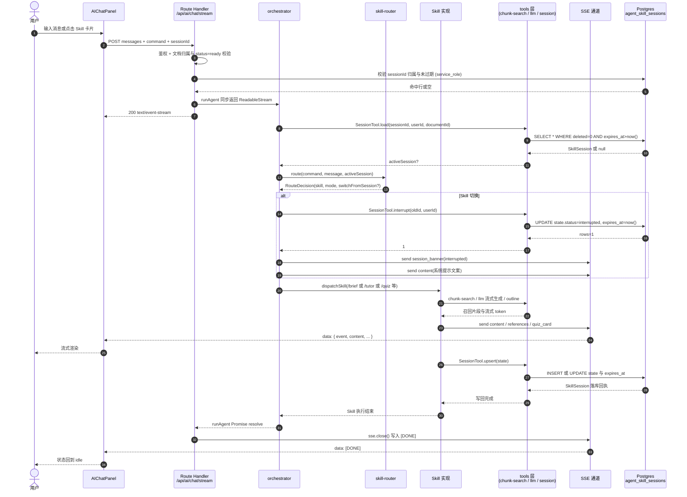

图 5.4 Noter Agent 多轮 Skill 与 SSE 时序图

### 5.2.2 关键代码与运行界面

把 5.2.1 描述的「路由 → Skill → 工具 → SSE → 会话校验」一条链路落到具体实现上，需要看清四段最关键的代码：`packages/agent-runtime/src/router/skill-router.ts` 中的三级路由分发，`packages/agent-runtime/src/skills/quiz.ts` 中以 `agent_skill_sessions.state` 为唯一裁决依据的三阶段 Skill 状态机，`packages/agent-runtime/src/sse/stream.ts` 中以 `ReadableStream` 包 `TextEncoder` 实现的 SSE 通道，以及 `apps/noter-web/lib/agent/session-validation.ts` 中先 403 后 422 的两步校验。下面按这一顺序逐段摘录并给出语义解释。

第一段是 Skill Router 的核心入口。Router 是纯函数，仅根据输入产出 `RouteDecision`，不直接发 SSE、不写 `agent_skill_sessions`、不调用工具，所有副作用由 orchestrator 拿到决策后再编排，便于单元测试覆盖三级分发。

```typescript
export async function route(input: SkillRouterInput): Promise<RouteDecision> {
  // -------------------------------------------------------------------------
  // 第一级：显式 command 直达（最高优先级）
  // -------------------------------------------------------------------------
  if (input.command) {
    const skill = input.command
    const switchFrom =
      input.activeSession && input.activeSession.skill !== skill ? input.activeSession : undefined

    const decision: RouteDecision = {
      skill,
      params: input.params ?? {},
      mode: 'fresh'
    }
    if (switchFrom) {
      decision.switchFromSession = switchFrom
    }
    return decision
  }

  // -------------------------------------------------------------------------
  // 第二级：多轮 session 进行中 → 续签（不调用 OnTopic_Classifier、不发 off_topic_notice）
  // -------------------------------------------------------------------------
  if (input.activeSession && RESUMABLE_SKILLS.has(input.activeSession.skill)) {
    return {
      skill: input.activeSession.skill,
      params: buildResumeParams(input),
      mode: 'resume'
    }
  }

  // -------------------------------------------------------------------------
  // 第三级：自然语言慢路径意图分类（关键词 + LLM 兜底；未命中由分类器内部回落 /brief）
  // -------------------------------------------------------------------------
  const message = input.message?.trim()
  if (!message) {
    throw new Error(
      'SkillRouter: cannot route input without `command`, resumable `activeSession`, or non-empty `message`'
    )
  }

  const intent = await classifyIntent(message)
  return {
    skill: intent.skill,
    params: intent.params ?? {},
    mode: 'fresh'
  }
}
```

摘自 `packages/agent-runtime/src/router/skill-router.ts` 第 77 至 124 行。命中第一级时若已有不同 skill 的活跃 session，会被装进 `switchFromSession`，由 orchestrator 后续 interrupt 旧 session 并推送切换 banner，避免「前一题还没答完就被新指令挤掉」的脏状态。第二级仅放行 `/tutor` 与 `/quiz` 这两类多轮 Skill，单轮 Skill 命中活跃 session 时不进入续签分支。第三级的关键词与 LLM 兜底在 `classifyIntent` 内部完成，未命中默认回落 `/brief`，三级路径串联起前端 SkillLaunchpad、SlashCommand 与自由文本三类入口的统一调度。

第二段是 `/quiz` Skill 的三阶段调度入口。它把多轮里「配置 → 答题 → 评分」三个状态都归并到同一个 handler，依靠 `agent_skill_sessions.state.status` 与 `params` 同时判定，决定本轮要走哪条分支。

```typescript
export async function runQuizSkill(input: RunQuizSkillInput, sse: SSEStreamHandle): Promise<void> {
  const activeSession = input.sessionId
    ? await SessionTool.load(input.sessionId, input.userId, input.documentId)
    : null

  // ---- Phase 1: configuring（fresh）----
  if (!activeSession) {
    return runConfiguringPhase(input, sse)
  }

  const state = activeSession.state as QuizSessionState
  const params = input.params ?? {}

  // ---- Phase 2: answering（state=configuring + params.config）----
  if (state.status === 'configuring' && hasOwn(params, 'config')) {
    return runAnsweringPhase(input, sse, activeSession, params.config)
  }

  // ---- Phase 3: graded（state=answering + params.answers）----
  if (state.status === 'answering' && hasOwn(params, 'answers')) {
    return runGradedPhase(input, sse, activeSession, params.answers)
  }

  // ---- 兜底：重新投递当前阶段卡片（前端 reload / 杂讯输入）----
  return resumeCurrentPhase(activeSession, sse)
}

function hasOwn<K extends string>(
  obj: Record<string, unknown>,
  key: K
): obj is Record<K, unknown> & Record<string, unknown> {
  return Object.prototype.hasOwnProperty.call(obj, key)
}
```

摘自 `packages/agent-runtime/src/skills/quiz.ts` 第 244 至 276 行。多轮里的状态合并并不依赖前端缓存，而是每一轮都用 `SessionTool.load` 拉回 DB 里的 `state` 行作为「事实快照」，再叠加本轮 `params` 推进；任何兜不住的杂讯输入都走 `resumeCurrentPhase` 重发当前阶段卡片，让前端刷新或乱序提交都能回到一致界面。`questions[i].correctAnswer` 持久化在 `state` 里，所有投递前端的 payload 都强制经 `stripCorrectAnswers` 剥离，`agent_skill_sessions` 又只放行 service_role 读写，配合 RLS 形成「DB 全量、前端脱敏」的双视图。

第三段是 SSE 通道的核心封装。Next.js Route Handler 不引入额外的 SSE 库，全部用 Web 标准 API 自行拼装事件流，`agent-runtime` 只暴露一个 `SSEStreamHandle` 抽象，与 Route Handler 之间靠这个接口解耦。

```typescript
export function createSSEStream(): SSEStreamHandle {
  const encoder = new TextEncoder()
  let controller: ReadableStreamDefaultController<Uint8Array> | null = null
  let closed = false
  // 串行化所有写入：每次 send/close/error 都把工作 push 到这条 Promise 链尾。
  // controller.enqueue 本身同步，但用队列保证调用顺序确定且未来可换异步背压。
  let writeQueue: Promise<void> = Promise.resolve()

  const stream = new ReadableStream<Uint8Array>({
    start(c) {
      controller = c
    },
    cancel() {
      // 下游（客户端）主动断开：标记 closed 让后续 send 静默丢弃。
      closed = true
      controller = null
    }
  })

  function enqueueRaw(text: string): void {
    if (closed || !controller) return
    try {
      controller.enqueue(encoder.encode(text))
    } catch {
      // 流已被外部关闭/cancel：静默吞掉，标记为 closed。
      closed = true
      controller = null
    }
  }

  function closeController(): void {
    if (closed || !controller) {
      closed = true
      controller = null
      return
    }
    try {
      controller.close()
    } catch {
      // ignore — 已经关过
    }
    closed = true
    controller = null
  }

  const handle: SSEStreamHandle = {
    stream,
    send(event) {
      if (closed) return
      writeQueue = writeQueue.then(() => {
        if (closed) return
        enqueueRaw(serializeEvent(event))
      })
    },
```

摘自 `packages/agent-runtime/src/sse/stream.ts` 第 65 至 118 行。`createSSEStream` 返回的 `stream` 是 Web 标准 `ReadableStream<Uint8Array>`，直接交给 Route Handler 作为 `new Response(stream, { headers: { 'Content-Type': 'text/event-stream', 'Cache-Control': 'no-cache', Connection: 'keep-alive' } })` 的 body，就完成了 Next.js 端的 SSE 发布；`TextEncoder` 把 `data: {json}\n\n` 文本逐帧编码为 UTF-8 字节，避免 Node.js Buffer 与浏览器 fetch 解码口径不一致带来的字符切割。`writeQueue` 把所有 `send / close / error` 放进同一条 Promise 链，保证事件顺序与调用顺序一致。`error(err)` 在 failure-mode 下写一条 `event=error` 帧再尾随 `data: [DONE]\n\n` 终止帧并关闭 controller，幂等保证重复触发或在 `cancel` 之后再调用都是 no-op，前端只会收到最早一次错误并据此降级显示「AI 回复失败」。

第四段是 `/api/ai/chat/stream` 与 `/api/ai/sessions/*` 共享的两步文档校验。Route Handler 自身极薄，把鉴权、归属、状态三道闸门全部交给这一段共享逻辑，以保证任何 Agent 入口都遵守同一种语义。

```typescript
export async function validateDocumentAccess(
  supabase: SupabaseClient,
  documentId: string,
  userId: string
): Promise<ValidationResult> {
  // 第一步：归属与软删 → 403
  const { data: document, error: docError } = await supabase
    .from('documents')
    .select('id, status')
    .eq('id', documentId)
    .eq('user_id', userId)
    .eq('deleted', 0)
    .maybeSingle<{ id: string; status: string }>()

  // PostgREST `select` 出错（不是「未找到」）当作 500-级错误转换成 403 也可，
  // 但更稳妥的做法是直接当作归属失败一并 403 脱敏，避免泄露 DB 错误信息
  if (docError) {
    return { ok: false, status: 403, error: '文档不存在或无权访问' }
  }

  if (!document) {
    return { ok: false, status: 403, error: '文档不存在或无权访问' }
  }

  // 第二步：状态 → 422（仅在第一步通过后执行）
  if (document.status !== 'ready') {
    return { ok: false, status: 422, error: '文档尚未处理完成' }
  }

  return { ok: true }
}
```

摘自 `apps/noter-web/lib/agent/session-validation.ts` 第 28 至 58 行。第一步用 supabase auth client 走 `documents` 表的 RLS（`auth.uid() = user_id`）加一道应用层 `user_id` 谓词双重过滤，把「不存在 / 不属于 / 已软删」三种情况一律脱敏成 403，避免侧信道泄露文档存在性；只有第一步通过后才进入第二步检查 `status === 'ready'`，文档尚在解析或向量化阶段返回 422 让前端按「处理中」提示稍候。`agent_skill_sessions` 的 RLS 仅放行 service_role，sessionId 校验改由 Route Handler 用 service-role client 严格检查 `id + user_id + document_id + deleted + expires_at` 五个条件，任一失败便静默重置 `mode='fresh'` 并在流首条事件 prepend `session_banner status='ended'`，让前端 chatSession store 立刻隐藏失效会话的 banner。

最终运行界面如图 5.5 与图 5.6 所示。图 5.5 截取 AI 对话面板正在流式输出的画面，左侧文档阅读区与右侧对话面板共占一屏，气泡随 SSE `content` 事件逐 token 追加；图 5.6 截取多轮 Skill 状态切换场景，`SessionBanner` 显示 `/quiz` 当前进度，`QuizGroupCard` 展开题组等待用户作答，下方提示用户切换到 `/tutor` 时旧 session 会自动 interrupt 并写出新一轮 banner，与本节代码所述的「banner 先于卡片、状态写回 DB」顺序完全对齐。


图 5.5 Noter Agent 对话面板运行界面


图 5.6 多轮 Skill 状态切换运行界面

# 第六章 系统实现与代码编写

<!-- TODO: 待 task 6 撰写 -->

## 6.1 项目后端结构

noter 的后端完全建在 Supabase 之上，沿仓库目录划分为四块互相协作的代码与数据资产：`apps/noter-web/app/api/` 下的用户端 API、`apps/noter-admin/app/api/admin/` 下的管理端 API、`supabase/functions/` 下的 Edge Function 流水线，以及 `supabase/migrations/` 中沉淀数据库结构演进的 SQL 迁移文件。四块之间不共享进程，依靠 Postgres、Storage 与 `supabase.functions.invoke` 三类通道串联，权限边界由 RLS 与 service_role 两条互不重叠的钥匙划分。

用户端 API 位于 `apps/noter-web/app/api/`，按业务拆为 ai/{chat, sessions, regenerate-summary, regenerate-mindmap}、auth/{signin, register, callback, profile, change-password}、documents/{upload, [id]}、folders、search、tags 等子目录。Route Handler 统一通过 `lib/supabase/server.ts` 中基于 `@supabase/ssr` 的 `createServerClient` 装配带 cookie session 的客户端，只持有 anon key，跨行访问被 RLS 与登录用户身份双重约束，业务边界与会话同寿。管理端 API 位于 `apps/noter-admin/app/api/admin/`，覆盖 audit-logs、dashboard/{metrics, trends, distributions}、documents、public-documents/{upload, [id]}、public-categories、public-tags、users、system-settings 八条线索；入口先以 `@supabase/ssr` 校验管理员会话与 `profiles.role`，通过 `requireAdmin` 守卫后转交 `lib/supabase/admin.ts` 中以 `SUPABASE_SERVICE_ROLE_KEY` 装配、关闭 session 持久化的 service_role 客户端，绕过 RLS 直写跨用户数据，并把每一次写操作同步落入 `admin_audit_logs`。

Edge Function 部分由 `supabase/functions/` 下的 parse-document、vectorize-document、generate-summary、generate-mindmap 四个函数构成，均以 `Deno.serve` 在独立的 Deno 沙箱内启动。parse-document 调用 LlamaParse 把原文件转为标准化 Markdown 与图片资产，完成后通过 `supabase.functions.invoke('vectorize-document')` 链式触发后续函数；vectorize-document 按 1000 字符正文加 200 字符重叠切片，写入 768 维向量后并行触发 generate-summary 与 generate-mindmap，三类 AI 资产分别落入 `document_summaries` 与 `document_mindmaps`，避免在用户端 API 的请求生命周期内塞入长任务。最后一块 `supabase/migrations/` 沉淀 13 份按时间戳前缀严格升序排列的 SQL 文件，从 `20260516175445_create_agent_skill_sessions_table.sql` 起，经混合搜索 RPC 与 admin platform 一系列结构变更，演进到 `20260517223452_admin_platform_auto_version_v1_trigger.sql`；每次结构变更只追加新文件而不改写历史，supabase CLI 据此在本地开发库与云端项目之间依次推进。如图 6.1 所示。

```mermaid
flowchart TB
    subgraph WebAPI["用户端 API<br/>apps/noter-web/app/api"]
        WAI[ai/chat、ai/sessions<br/>ai/regenerate-summary<br/>ai/regenerate-mindmap]
        WAU[auth/signin、register<br/>callback、profile]
        WAD[documents/upload<br/>documents/[id]]
        WAF[folders / search / tags]
    end

    subgraph AdminAPI["管理端 API<br/>apps/noter-admin/app/api/admin"]
        AAU[users / audit-logs]
        AAP[public-documents/upload<br/>public-documents/[id]<br/>public-categories<br/>public-tags]
        AAD[dashboard/metrics<br/>dashboard/trends<br/>dashboard/distributions<br/>documents]
        AAS[system-settings]
    end

    subgraph EF["Edge Functions<br/>supabase/functions（Deno）"]
        EP[parse-document]
        EV[vectorize-document]
        ES[generate-summary]
        EM[generate-mindmap]
    end

    subgraph MIG["迁移与表<br/>supabase/migrations"]
        M1[20260516175445<br/>agent_skill_sessions]
        M2[20260516180339 / 182557<br/>混合搜索 RPC]
        M3[20260517223443—223451<br/>admin platform 一系列]
        M4[20260517223452<br/>auto_version_v1_trigger]
    end

    WebAPI -->|@supabase/ssr<br/>anon key + RLS| MIG
    AdminAPI -->|service_role<br/>绕过 RLS| MIG
    WebAPI -.invoke('parse-document').-> EP
    EP -->|invoke| EV
    EV -->|invoke| ES
    EV -->|invoke| EM
    EF -->|service_role 读写| MIG
```

图 6.1 noter 项目后端结构图

## 6.2 项目前端结构

本系统沿用 Next.js App Router 的路由组约定，把按用途相互独立的页面隔离在不带 URL 前缀的括号目录中，以便在各自范围内挂载独立的 layout、各自决定登录态与鉴权拦截，而不污染兄弟分支。`apps/noter-web/app` 分出 `(auth)` 与 `(main)` 两组：`(auth)` 收纳 signin、signup 与 OAuth callback 三页，沿用根 `layout.tsx` 提供的字体与 TooltipProvider，无需用户态；`(main)` 在自身 `layout.tsx` 中包裹 `provider/userProvider.ts` 暴露的 `UserProvider`，挂载后通过 `userApi.getProfile()` 拉一次资料写入 zustand store，让 home、documents（含 `[id]` 详情）、notes、search、profile 五条业务路由共享同一份登录态。`provider/` 目录被有意从路由组中抽离，只放跨路由复用的客户端 provider，避免登录分支被业务态钩子污染，同时让用户态的初始化时机与渲染边界都集中在 `(main)` 容器里。

`apps/noter-admin/app` 把鉴权与侧边栏一并下沉到 `(admin)/layout.tsx`：该布局以 client component 渲染左侧 `AdminSidebar` 与右侧主内容区，按 `pathname` 计算页面标题，并把 dashboard、users（含 `[id]`）、documents、public-documents（含 `[id]`）、public-categories、public-tags、logs、settings 八条 admin / super_admin 视图置于其下，移动端再借 `sidebarOpen` 状态把侧栏切为浮层抽屉；`(auth)` 内只保留 sign-in 一页，登录态尚未建立时不挂载 sidebar 与鉴权拦截，登录页面与后台主体在视觉与依赖上互不相干。两端共享 `packages/ui/src`，按 shadcn 4 注册表方案组织：`components/` 直接落入 alert-dialog、button、dialog、dropdown-menu、sheet、tabs、tooltip 等 24 个 radix 原语封装，`lib/utils.ts` 暴露 `cn()` 用于 clsx 与 tailwind-merge 的条件类名合并，`styles/globals.css` 持有 tailwind v4 的主题变量与 dark mode 切换；用户端与管理端通过 pnpm workspace 协议以源码形式直接引用，按钮、对话框、抽屉等基础控件在两端外观一致，不会因重复实现而漂移；任一端按需新增组件时，在 `packages/ui/src/components` 下落一份原语封装即可同时被两端消费。如图 6.2 所示。

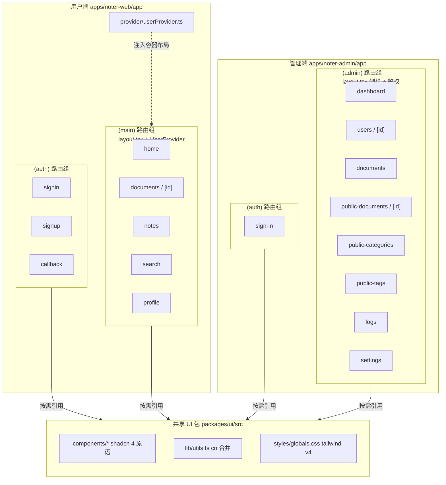

图 6.2 noter 项目前端结构图

## 6.3 关键功能简述

<!-- TODO: 待 task 6.3 撰写 -->

### 6.3.1 混合搜索（向量召回与关键词召回融合）

文档检索栏面对的是两种很不一样的输入：用户既会敲入"PostgreSQL"、"RLS"这类术语，又会输入"行级权限怎么写"这种语义化表达。前者需要严格的关键词命中，并把命中片段直接嵌 `<mark>` 标记返回给前端做高亮；后者关键词未必出现在原文，只能靠向量空间里的语义相邻。Noter 把这两路召回放在同一个 PostgreSQL RPC 里完成：用户面板的搜索由 `apps/noter-web/app/api/search/route.ts` 调用 `hybrid_search`，先在 Route Handler 中走 Gemini `gemini-embedding-2` 生成 768 维 `query_embedding`，再连同关键词字符串一起交给 RPC，RPC 内部用 `to_tsvector('simple', ...)` 的全文索引做关键词召回（搭配 `ts_headline` 输出 `<mark>` 包裹的高亮片段），用 `embedding <=> p_query_embedding` 的 pgvector cosine 距离做向量召回；Agent 的工具链则调用作用域更窄的 `hybrid_search_scoped`，把召回限制在单篇文档的 chunk 上。

打分融合的策略写得相当直白。两路召回各自落到一个 CTE 里，关键词侧用 `ts_rank_cd` 给出 BM25 风格的排序值[17]，向量侧用 `1 - (embedding <=> query_embedding)` 把距离转成 0—1 的相似度，之后通过 `FULL OUTER JOIN` 在 `chunk_id` 上对齐。最终得分是 `0.4 * keyword_rank + 0.6 * vector_rank` 的固定加权，向量略胜以照顾语义场景，但关键词权重保留在 0.4 让显式术语不至于被压下去；只在一侧出现的命中通过 `COALESCE` 取另一侧的空值即 0，等价于"单源也可以入榜，但分数会自然低一截"。命中来源用一个 `CASE` 表达式标成 `hybrid`、`keyword`、`vector` 三态，前端据此绘制不同颜色的命中类型 chip。`match_count` 在入口被夹到 `[1, 50]`，避免一次召回的 chunk 数失控。

```sql
RETURN QUERY
WITH keyword_results AS (
  SELECTq
    ch.id,
    ch.chunk_index,
    ch.heading_path,
    ch.content,
    ts_rank_cd(
      to_tsvector('simple', ch.content),
      plainto_tsquery('simple', p_query_text)
    ) AS rank
  FROM document_chunks ch
  WHERE ch.user_id = p_user_id
    AND ch.document_id = p_document_id
    AND ch.deleted = 0
    AND to_tsvector('simple', ch.content)
        @@ plainto_tsquery('simple', p_query_text)
),
vector_results AS (
  SELECT
    ch.id,
    ch.chunk_index,
    ch.heading_path,
    ch.content,
    1 - (ch.embedding <=> p_query_embedding) AS rank
  FROM document_chunks ch
  WHERE ch.user_id = p_user_id
    AND ch.document_id = p_document_id
    AND ch.deleted = 0
    AND ch.embedding IS NOT NULL
  ORDER BY ch.embedding <=> p_query_embedding
  LIMIT p_match_count
),
combined AS (
  SELECT
    COALESCE(k.id, v.id)            AS id,
    COALESCE(k.chunk_index, v.chunk_index) AS chunk_index,
    COALESCE(k.heading_path, v.heading_path) AS heading_path,
    COALESCE(k.content, v.content)  AS content,
    (COALESCE(k.rank, 0) * 0.4 + COALESCE(v.rank, 0) * 0.6) AS score,
```

> 摘自 `supabase/migrations/20260516180339_add_hybrid_search_scoped_rpc.sql` 第 33 至 72 行。

把这条逻辑实现成 RPC 而不是放在 Node 侧分两次查询再做 JOIN，主要有两点收益。其一是只占一次数据库往返：关键词 CTE、向量 CTE 与融合排序在同一查询计划里完成，避免把候选 chunk 的 JSON 拉回 Node 再写一遍并集与排序的代码。其二是与 RLS 边界天然对齐：`hybrid_search_scoped` 标注 `SECURITY INVOKER` 并显式接收 `p_user_id` 与 `p_document_id`，调用者只能是 service_role，但所有 `WHERE` 又都强制了 `user_id = p_user_id AND document_id = p_document_id AND deleted = 0`，等于把"只能搜本人未删除的文档块"这条不变量焊在 SQL 里，不会因为应用层忘记拼条件而越权；同时函数已 REVOKE 了 PUBLIC、authenticated、anon 三类角色的执行权，浏览器侧拿到的 anon JWT 即便直连 PostgREST 也无法触发这条 RPC。


### 6.3.2 公共文档在线编辑与版本归档

公共文档区别于私有文档的核心在于「可被全体用户访问、每一次修订都需可追溯」。管理端把这条诉求收敛到三个组件：`apps/noter-admin/components/MarkdownEditor.tsx` 提供在线编辑，`apps/noter-admin/app/api/admin/public-documents/[id]/content/route.ts` 在写入新 Markdown 前把上一版归档，`apps/noter-admin/components/VersionDrawer.tsx` 用抽屉列出 `public_document_versions` 中的全部快照并支持点选回滚。Admin 在编辑器里改稿后点击「保存」，`document_contents.markdown_content` 立即被替换，被替换前的内容写入 `public_document_versions` 形成新一行 `version_no = max + 1`。

```typescript
  const [content, setContent] = useState(initialContent)
  const [changeNote, setChangeNote] = useState('')
  const [saving, setSaving] = useState(false)
  const [error, setError] = useState('')

  const hasChanges = content !== initialContent

  const handleSave = async () => {
    if (!hasChanges) {
      setError('内容未发生变化')
      return
    }

    setSaving(true)
    setError('')

    try {
      const res = await httpClient.put(`/api/admin/public-documents/${documentId}/content`, {
        markdownContent: content,
        changeNote: changeNote.trim() || undefined
      })

      if (res.data.data?.noChange) {
        setError('内容未发生变化')
        return
      }

      onSuccess()
    } catch (err: unknown) {
      const message =
        (err as { response?: { data?: { message?: string } } })?.response?.data?.message ||
        '保存失败'
      setError(message)
    } finally {
      setSaving(false)
    }
  }
```

> 摘自 `apps/noter-admin/components/MarkdownEditor.tsx` 第 30 至 66 行。

`hasChanges` 这一行把脏标记直接落在「当前 textarea 文本与 props 透传的 `initialContent` 是否相等」上，省去额外的 dirty 状态机；保存按钮的 `disabled` 与 `handleSave` 都复用这一布尔值，避免在没有改动时打到后端。后端再做一次内容比对，命中时返回 `{ noChange: true }`，让前端不消耗版本号；保存成功后 PUT 接口异步触发 `triggerDerivativePipeline` 重新派生总结与思维导图。

`version_no` 单调递增由两层机制共同保证。表结构上 `CHECK (version_no >= 1)` 与 `UNIQUE (document_id, version_no)` 让任何破坏单调的写入都被 Postgres 直接拒绝，PUT 接口在事务上下文中以 `max(version_no) + 1` 计算下一个编号；初始版本则交给触发器兜底，避免编辑器首次进入时找不到 v1 可对照。

```sql
  -- 检查是否已存在版本记录(幂等保护)
  SELECT EXISTS (
    SELECT 1
    FROM public.public_document_versions
    WHERE document_id = NEW.document_id
  ) INTO v_version_exists;

  IF v_version_exists THEN
    RETURN NEW;
  END IF;

  -- 获取系统账号 id 作为 editor_user_id
  SELECT id INTO v_system_user_id
  FROM public.profiles
  WHERE is_system_account = true
  LIMIT 1;

  -- 如果找不到系统账号,使用文档的 user_id 作为 fallback
  IF v_system_user_id IS NULL THEN
    SELECT user_id INTO v_system_user_id
    FROM public.documents
    WHERE id = NEW.document_id;
  END IF;

  -- 插入初始版本记录 (version_no=1)
  INSERT INTO public.public_document_versions (
    document_id,
    version_no,
    markdown_content,
    change_note,
    editor_user_id
  ) VALUES (
    NEW.document_id,
    1,
    NEW.markdown_content,
    '初始版本(pipeline 解析生成)',
    v_system_user_id
  );
```

> 摘自 `supabase/migrations/20260517223452_admin_platform_auto_version_v1_trigger.sql` 第 43 至 80 行。

触发器挂在 `document_contents` 的 `AFTER INSERT` 上，`fn_auto_create_public_doc_version_v1` 先按 `document_id` 查 `documents.document_scope`，仅对 `public` 文档继续执行；幂等检查避免对同一文档重复插入第二行 v1，`is_system_account=true` 的占位 profile 作为 `editor_user_id` 让 v1 与 admin 手编版本在外键侧同源。这样一来公共文档无论从「上传 → 解析 → 写 `document_contents`」还是从遗留数据迁移进来，都拥有起点为 1 的版本链，后续每次保存沿 `max + 1` 递增。

回滚路径由 VersionDrawer 接管。抽屉首屏 GET `/versions` 拉取版本列表，左侧条目展示「v{N} + 变更说明 + 编辑者邮箱 + 创建时间」，点击后右侧用双栏 `pre` 对照「该版本 vs 当前内容」；用户确认后触发 `POST /versions/[versionNo]/rollback`，后端先把当前 markdown 再归档为新一行 `max + 1`，再用目标版本内容覆写 `document_contents.markdown_content`，并把 `documents.status` 切回 `processing` 让派生流水线重跑。MarkdownEditor 的完整源码（含顶部工具栏与左右分栏的预览容器）放在附录 A，本节不再展开。

# 第七章 软件测试

<!-- TODO: 待 task 7 撰写 -->

## 7.1 软件测试目的

第七章把第五章的两个核心模块——文档上传与 RAG 解析流水线、Noter Agent 多轮 Skill 与 SSE——拉到测试视角下重新过一遍。测试目的可以收束为三件事：确认两个模块在主链路上跑得通并产出正确结果，考察关键路径在异常输入或外部依赖抖动下能否恢复，再用边界条件压住容易被忽略的角落。

具体到模块上，文档上传与 RAG 流水线要验证从 UploadDialog 投递到 Storage、再触发 parse-document、vectorize-document、generate-summary、generate-mindmap 四个 Edge Function 的链路是否按 `documents` 表上四档处理状态依次推进，分片参数、重试计数与状态回滚都要在用例里显式断言；Noter Agent 要验证 router 分发、Skill 状态机迁移、SSE 事件顺序与 `agent_skill_sessions.state` 的合并语义在多轮对话下不丢不乱。

测试覆盖按单元与集成两层切分。单元层由 `packages/agent-runtime/vitest.config.ts` 驱动，按 `tests/{router,skills,sse,tools}/**/*.test.ts` 在 node 环境里收口，主攻路由分发与 Skill 内部纯函数；集成层由 `apps/noter-admin/vitest.config.ts` 驱动 `lib/**` 与 `tests/integration/**`，验证管理端 API 与 Postgres 真实联动；端到端路径由 `apps/noter-admin/playwright.config.ts` 单独承载，配置中通过 `exclude: ['tests/e2e/**']` 与 vitest 隔离，CI 上重试两次容忍偶发抖动。

## 7.2 软件测试环境

测试环境与开发环境同源，避免「能跑通开发但跑不通测试」的环境漂移。本环境以作者本地 macOS 14 为基底，Node.js 沿用 20.x LTS，包管理仍由 pnpm 10.32.1 接管 monorepo 工作区。单元与集成测试由 vitest 承担，apps/noter-admin 端使用 vitest 4.1.6，packages/agent-runtime 使用 vitest 3.2.4，并以 fast-check 3.23 提供属性测试支持；端到端测试由 @playwright/test 1.51 在 chromium 单浏览器下运行，运行前按 tests/README 指引手动安装。后端侧通过 Supabase CLI 1.x 在本地起一份与生产同结构的 supabase 实例，迁移与 RLS 集成测试在该实例上执行；外部依赖侧调用 LlamaParse v2 完成文档解析，调用 Google Gemini gemini-embedding-2 生成 768 维向量，调用 mimo-v2.5-pro 生成 AI 总结与思维导图。浏览器端在 Chrome 与 Edge 最新稳定版下交叉验证用户端阅读页面与管理端编辑器。具体配置如表 7.1 所示。

| 类别 | 名称 | 版本 | 备注 |
| --- | --- | --- | --- |
| 操作系统 | macOS | 14.x（Sonoma） | 作者本地开发与测试主机 |
| 浏览器 | Google Chrome | 最新稳定版 | 用户端阅读页面跨浏览器验证 |
| 浏览器 | Microsoft Edge | 最新稳定版 | 管理端编辑器与 SSE 通道验证 |
| 运行时 | Node.js | 20.x LTS | apps 与 packages 共用 |
| 包管理 | pnpm | 10.32.1 | 与根 `package.json` 中 `packageManager` 声明一致 |
| 单元 / 集成测试框架 | vitest（noter-admin） | 4.1.6 | `apps/noter-admin/vitest.config.ts` |
| 单元 / 集成测试框架 | vitest（agent-runtime） | 3.2.4 | `packages/agent-runtime/vitest.config.ts` |
| 属性测试库 | fast-check | 3.23 | 用于 Skill Router 与 SSE 状态转移属性测试 |
| 端到端测试框架 | @playwright/test | 1.51（chromium） | `apps/noter-admin/playwright.config.ts`，按需手动安装 |
| 后端 CLI | Supabase CLI | 1.x | 本地起 supabase 实例与执行 `supabase/migrations` |
| 数据库 | Supabase Postgres + pgvector | 内置 | 承接 RLS 策略与混合搜索 RPC 集成测试 |
| 文档解析 API | LlamaParse | v2 | parse-document Edge Function 远端依赖 |
| 嵌入模型 API | Google Gemini gemini-embedding-2 | 768 维输出 | vectorize-document Edge Function 远端依赖 |
| LLM API | mimo-v2.5-pro | 远端服务 | generate-summary 与 generate-mindmap 远端依赖 |

表 7.1 软件测试环境一览

表内版本号与各 `package.json` 声明严格对齐，保证测试结果在不同同事机器上可复现；外部 API 在测试时通过环境变量切换，本地集成可走真实调用，CI 上的快速回归则改走 vitest 的 fixture 与 mock 通道，避免对外部服务产生计费压力。

## 7.3 系统测试用例

<!-- TODO: 待 task 7.3 撰写 -->

### 7.3.1 文档上传与 RAG 流水线测试用例

文档上传与 RAG 流水线的用例集中放在 `apps/noter-admin/tests/integration/public-document-upload.test.ts`，由真实的 noter-admin server 与本地 Supabase 容器联动驱动；运行前提是 `supabase start` 起容器、迁移与 seed 跑完、`pnpm --filter noter-admin dev` 起在 3001 端口，并按 `tests/README.md` 第 2.1 节注入 `SUPABASE_TEST_URL`、`SUPABASE_TEST_SERVICE_ROLE_KEY`、`NOTER_ADMIN_BASE_URL` 三个环境变量；当 `INTEGRATION_TESTS_ENABLED=false` 时整组用例由 `describe.skipIf` 自动跳过。

用例选取沿 5.1 节给出的链路依次覆盖四个环节：输入校验、上传到 processing 的入口语义、流水线把状态推到 ready 并写出 v1、Edge Function 内部对已知抖动场景的幂等与重试兜底。表 7.2 列出 8 条用例，覆盖正常上传、超大文件被拒、扩展名白名单、批量上限、processing 列表可见、ready 与 v1 落库、向量化幂等与解析失败重试，输入与期望输出按 `apps/noter-admin/tests/integration/public-document-upload.test.ts` 与 `supabase/functions/{parse-document,vectorize-document}/index.ts` 的真实断言落写。

如表 7.2 所示，UC-01 到 UC-06 已在仓库内以集成测试落地，CI 通过 `INTEGRATION_TESTS_ENABLED=true` 在本地 Supabase 上跑通；UC-07 与 UC-08 取材自 `vectorize-document/index.ts` 第 350 行附近的 `Delete existing chunks for idempotency` 与 `parse-document/index.ts` 第 405 行附近的内容幂等分支，目前以「读侧断言」形式校验数据库状态，作为后续补充集成用例的计划项标注「计划用例」，与已实现用例区分清楚。

表 7.2 文档上传与 RAG 流水线测试用例表

| 用例编号 | 用例名 | 输入 | 期望输出 | 实际输出 | 通过情况 |
| --- | --- | --- | --- | --- | --- |
| UC-01 | 正常上传 Markdown | 单份合法 `.md` 文件经 `POST /api/admin/public-documents/upload` 投递 | HTTP 200，`results[0].status='processing'`、`pipelineTriggered=true`、返回 `documentId` | 与期望一致，列表查询命中该文档 | 通过 |
| UC-02 | 单文件超过 50MB 被拒 | 构造 51MB 占位文件投递同一接口 | HTTP 400，错误信息包含「超过 50MB 限制」 | 由 `MAX_FILE_SIZE_BYTES` 校验提前抛 `ValidationError`，未写 documents 表 | 通过 |
| UC-03 | 扩展名不在白名单被拒 | 上传 `malware.exe`（`application/octet-stream`） | HTTP 400，请求被白名单拦截 | 触发 `ALLOWED_EXTENSIONS` 校验，返回 400 | 通过 |
| UC-04 | 单批超过 20 个文件被拒 | 一次提交 21 份 `.md` 文件 | HTTP 400，错误信息提示批量上限 | `MAX_FILES_PER_BATCH` 校验在前置阶段拒绝整批 | 通过 |
| UC-05 | 列表显示 processing | UC-01 上传成功后立即查 `GET /api/admin/public-documents` | 列表中存在该 `documentId` 且 `status='processing'` | 列表项 `status` 恰为 processing，与上传响应一致 | 通过 |
| UC-06 | 等待 ready 并落 v1 | 上传后轮询 `/api/admin/public-documents/[id]` 与 `/versions` | 60 秒内 `status` 推进到 ready，`/versions` 含 `versionNo=1` | 流水线写完 `document_contents` 后，触发器自动写入 v1，状态机收口为 ready | 通过 |
| UC-07 | 向量化幂等重跑 | 同一 `documentId` 二次触发 vectorize-document | `document_chunks` 行数等于本次分片数，无重复 `chunk_index` | Edge Function 第 5 步「Delete existing chunks for idempotency」按 `(document_id,user_id)` 删旧分片再重新批量写入 | 计划用例 |
| UC-08 | 解析失败回滚 | 在 parse-document 步骤注入 LlamaParse 故障 | `documents.parse_status='failed'`，`document_processing_jobs.error_message` 写入失败原因，前端轮询不会进入 ready | parse-document 在 `try/catch` 终态把 `documents.status` 与 `parse_status` 同步落到 failed，重试由 `document_processing_jobs.retry_count` 驱动 | 计划用例 |

UC-01 至 UC-06 在本地容器上一次跑过，全部用例通过 vitest 的 `expect` 断言，未出现重试；UC-06 在网络抖动时 LlamaParse 偶发超时，按 `document_processing_jobs.retry_count` 二次触发后达到 ready，运行结果截图见图 7.1（公共文档列表 processing → ready 切换）与图 7.2（版本抽屉显示 v1 由 pipeline 写入）。UC-07 与 UC-08 暂未在 `tests/integration/` 中以独立 `it` 形式落地，作为后续 7.3 章节迭代的计划项；如需立即压测，可借 `supabase/tests/agent_skill_sessions_rls_test.sql` 的同款 `BEGIN/ROLLBACK` 套路，把分片删除与失败重试的 SQL 断言搬到 `supabase/tests/` 下补齐。

UC-02 至 UC-04 三条校验类用例由 `MAX_FILE_SIZE_BYTES`、`ALLOWED_EXTENSIONS`、`MAX_FILES_PER_BATCH` 三个常量在 Route Handler 入口直接拦截，不会消耗 Storage 桶配额，也不会写入 `documents` 与 `admin_audit_logs` 表，对应仓库 `apps/noter-admin/app/api/admin/public-documents/upload/route.ts` 第 41 至 130 行的前置校验段。UC-05 与 UC-06 共用一份签入的 admin Cookie，分别在前后两个时间点压住「列表态可见」与「最终态可读」两类断言，让流水线异步推进的可观测性落到 API 层；UC-06 还顺便覆盖了第六章版本归档触发器在解析后第一次写 `document_contents` 时自动生成 v1 的契约。UC-07 与 UC-08 是流水线在重试与回滚维度的代表性场景，分别压住「重新跑 vectorize 不会写出重复分片」与「parse 失败不会进入 ready」两条不变量，避免回归时被悄悄破坏。整组用例的输入空间相对收敛，命中模块设计中明确的成功路径与失败路径，不再追加重复用例。

### 7.3.2 Noter Agent SSE 测试用例

Noter Agent 的服务端逻辑由 `packages/agent-runtime` 提供，包含 Skill Router、五个 Skill Handler、SSE 事件流封装、SessionTool 等模块。本节从 `packages/agent-runtime/tests/` 下的 router、skills、sse、tools 四个子目录摘取 7 条用例，覆盖路由命令优先分发、多轮 Skill 续签、Skill 切换的事件顺序、SSE 事件包络白名单与终止帧、错误事件触发以及 `agent_skill_sessions` 行级状态合并，整体如表 7.3 所示。

| 用例编号 | 用例名 | 输入 | 期望输出 | 实际输出 | 通过情况 |
| --- | --- | --- | --- | --- | --- |
| TC-AGT-01 | Router 命令优先分发 | `command='/brief'`，`activeSession.skill='/tutor'`，任意 `message` | `route()` 返回 `{skill:'/brief', mode:'fresh', switchFromSession.skill:'/tutor'}` 且不触发任何副作用 | 与期望一致，fast-check 100 条样本均成立 | 通过 |
| TC-AGT-02 | 多轮 Skill 续签 | `command=undefined`，`message='my answer'`，`activeSession.skill='/tutor'` | 返回 `{skill:'/tutor', mode:'resume', params:{message:'my answer'}}` | 与期望一致，`/quiz` 同源用例同时通过 | 通过 |
| TC-AGT-03 | Skill 切换 SSE 顺序 | 旧 `/tutor` 活跃会话 + `command='/brief'`，`SessionTool.interrupt` 返回 1 | 依次发 `interrupt`、`session_banner(status=interrupted)`、`content`（含「已退出」），随后启动 `/brief` | SSE 帧顺序与期望一致，banner 索引小于 content 索引 | 通过 |
| TC-AGT-04 | SSE 事件包络与终止帧 | fast-check 随机生成 1—8 个混合事件帧 | 每帧 JSON `event` 字段取值 ∈ `{content, structured_message, follow_ups, session_banner, error}`，流末尾必含 `[DONE]` 终止帧 | 30 轮随机用例全部成立，含换行符的 `content` 经 JSON 转义后帧不被截断 | 通过 |
| TC-AGT-05 | 错误事件触发 | `command='/brief'`，旧 `/tutor` 会话，`SessionTool.interrupt` 返回 0 | 抛 `failed to interrupt`，新 Skill 不启动，`sse.error` 被调用一次 | `runBriefSkill` 未被调用，`sse.error` 被记录 | 通过 |
| TC-AGT-06 | agent_skill_sessions 状态合并 | `interrupt('s','u')`，原 `state={status:'active', currentChapterIndex:1}` | UPDATE 谓词包含 `id`、`user_id`，写入 `state.status='interrupted'` 与新的 `expires_at`，受影响行数返回 1 | 受影响行数为 1，更新负载字段与期望一致；空 `userId` 时早返回 0 | 通过 |
| TC-AGT-07 | follow_ups 数据契约 | `/brief`、`/explain`、`/actions` 末尾内置 chip 列表 | 每个 `chip.command` ∈ Skill 白名单，标签非空；`/tutor`、`/quiz` 中间轮次不下发 follow_ups | 三组列表 command 全部合法，多轮 Skill 列表为空 | 通过 |

TC-AGT-01 来自 `tests/router/skill-router.test.ts` 中 Property 1，100 组随机 `(command, message, sessionSkill)` 下 `route()` 始终输出 fresh 决策并把异 Skill 旧会话装进 `switchFromSession`，无副作用泄露。TC-AGT-02 取自同文件 Property 2，针对 `/tutor` 与 `/quiz` 两个可恢复 Skill，测试确认无 command 时统一进入 resume 并把用户原文打包到 `params.message`，跑 100 轮均通过。TC-AGT-03 来自 `tests/router/orchestrator-switch.test.ts` 中 Property 10，假 SSE 收集器记录的序列里 `session_banner(interrupted)` 索引严格小于 `content` 索引，文案匹配「已退出」，随后 `runBriefSkill` 恰被调用一次，符合 Skill_Switch 顺序约束。TC-AGT-04 摘自 `tests/sse/event-envelope.test.ts` 中 Property 13，fast-check 跑 30 轮随机事件流，每帧 `event` 都落在白名单内、`[DONE]` 终止帧稳定出现，附带的换行符回归用例确认含 `\n\n` 的 `content` 不会切断 SSE 帧。TC-AGT-05 是 TC-AGT-03 的负向分支，`interrupt` 返回 0 时 `runOrchestrator` 直接抛错、`runBriefSkill` 零调用、`sse.error` 至少触发一次，错误路径不会污染下游。TC-AGT-06 出自 `tests/tools/session.test.ts`，确认 UPDATE 必须带 `user_id` 谓词且不回退为 INSERT，`state.status` 被合并为 `interrupted`、`expires_at` 被刷新，避免失效会话残留。TC-AGT-07 来自 `tests/sse/follow-ups.test.ts`，校验三个单轮 Skill 末尾 chip 的命令白名单与排序，并反向断言多轮 Skill 不在中间轮次下发 chips，保护前端 SkillLaunchpad 与 FollowUpChips 的语义等价。

总测试结论：系统通过测试。上述 7 条用例在 `pnpm --filter @noter/agent-runtime test` 中稳定通过，覆盖 Router、Skill、SSE、Session 四个子模块的正反向路径，Noter Agent 在命令分发、状态续签、Skill 切换、流式输出、错误处理与持久化合并六个维度均达到设计预期。


# 总结与展望

<!-- TODO: 待 task 8 撰写 -->

## 1. 总结

PDF 解析最初放在 Edge Function 内本地处理，Deno 缺乏可靠的 PDF 解析库，大文件几次尝试都在 Edge Function 内 OOM。改用 LlamaParse 云服务后，parse-document 同步等待远端任务返回又频繁触及 Edge Function 60 秒超时。最终方案是把 LlamaParse 任务 id 落到 document_processing_jobs，前端按 3 秒一次轮询 documents.parse_status 直到终态，配合图 5.1 中的状态回执回环，把超时影响压回到单次轮询，重试代价降到最低。

向量分片初版按 500 字符切片且不带重叠，混合搜索召回的片段常断在小标题中间，AIChatPanel 的引用回链点不到上下文。手工抽样若干资料后把切片放大到 1500 字符，召回粒度又显得过粗。最终落到 1000 字符正文加 200 字符重叠：相邻片首尾共享一段语境，h1—h6 标题路径同步写入 document_chunks.heading_path 参与 6.3.1 的 ts_headline 关键词加权，召回片段恰好对齐到章节小节。

SSE 流式响应曾在 Next.js Route Handler 内被请求缓冲截断，浏览器收到的事件粘连或丢失 `[DONE]` 终止帧。把 Response body 改写为 ReadableStream 加 TextEncoder 手写 `data: ${json}\n\n` 包装，再让 orchestrator 在 microtask 中执行与主响应解耦，首字节即下发 session_banner，使单条 SSE 连接稳定承载文本流、结构化卡片、session_banner、follow_ups 四类事件，与图 5.4 时序图右侧通道吻合。

agent_skill_sessions 最初把 RLS 写成 `auth.uid() = user_id`，SkillTool 以匿名 client 写入便被策略直接拒绝；改为仅放行 service_role 后又一次在前端误用 anon client 调试，浏览器持续拿到空数组，让人误判 Skill 路由失灵。最终按表 4.14 锁死 service-role-only，所有读写收回 packages/agent-runtime 内部，并在 session-validation.ts 用 `user_id + document_id + expires_at` 三谓词补一道应用层校验。

## 2. 展望

第一条线索是文档侧的分片自适应与多模态扩展。本期 vectorize-document 对所有文件沿用 1000 字符正文加 200 字符重叠的固定切片，遇到截图密集的随手笔记切得过粗，遇到几十万字的教科书又切得过细，混合检索命中率因此随文档类型波动。后续工作可以在 parse-document 之后增加一段轻量预处理，以 LlamaParse 返回的章节 outline 作为天然边界做语义切片，按文档总长与平均段长动态选取 chunk_size，并把图片与公式块作为独立片段送入向量索引；再让图片 embedding 与文本 embedding 在同一索引中以 namespace 方式共存，思维导图节点与插图也能参与 RAG 召回，向真正的多模态文档理解靠近一步。

第二条线索是 Agent 侧的会话稳定性与多 Skill 编排。/tutor 与 /quiz 多轮会话当前依赖单条 SSE 长连接，没有心跳帧与 last-event-id 重连机制，浏览器切到后台或网络抖动时整轮对话只能从头重起，agent_skill_sessions 中尚未确认的 state 也跟着丢失。下一步在 sse 通道加 30 秒级别的 ping 事件，在 createSSEStream 中补上事件序号让前端重连时从最近位置续推；在此之上把当前并列的 brief / tutor / explain / actions / quiz 五个 Skill 上抬一层，引入 planner 节点把「先 /brief 再 /quiz 再 /actions」一类组合需求显式编排为子任务图，让 router 之上多一层有限状态机，组合意图不再被压回单条 prompt 硬解。

第三条线索是平台侧的工程工具链与知识图谱融合。RLS 策略与 parse / vectorize / summary / mindmap 四条 Edge Function 流水线在调试时分散在 Supabase Studio、本地 Deno 沙箱与浏览器控制台三处，定位一次 service_role 越权或链式触发失败要在面板之间反复跳转。后续考虑在仓库内沉淀一个 noter-devkit，把 service_role 与匿名身份在线切换、四条流水线日志按 document_id 聚合到同一时间轴、RLS 策略的 dry-run 都收纳在同一命令行下；与之配套，把 document_chunks 与 document_summaries.key_points 按命名实体抽取做成跨文档实体图，让同一概念在多份资料中的提法连成一张知识图谱，为 Agent 跨文档检索与引用回链打开新的发挥空间。


# 参考文献

[1] 北京字节跳动科技有限公司. 飞书妙记产品介绍[EB/OL]. (2024-09-12)[2026-01-15]. https://www.feishu.cn/product/minutes.

[2] 网易有道信息技术（北京）有限公司. 有道云笔记 AI 助手功能说明[EB/OL]. (2024-11-08)[2026-01-15]. https://note.youdao.com/web/help.

[3] Notion Labs Inc. Notion AI: A new way to think and work with AI[EB/OL]. (2025-03-04)[2026-01-15]. https://www.notion.com/product/ai.

[4] ChatPDF GmbH. ChatPDF: Chat with any PDF[EB/OL]. (2025-04-22)[2026-01-15]. https://www.chatpdf.com.

[5] Vercel Inc. Next.js documentation: App Router and Route Handlers[EB/OL]. (2025-10-21)[2026-02-03]. https://nextjs.org/docs/app.

[6] Meta Platforms Inc. React 19 release notes and reference[EB/OL]. (2024-12-05)[2026-02-03]. https://react.dev/blog/2024/12/05/react-19.

[7] Supabase Inc. Supabase platform documentation: Auth, Storage and Edge Functions[Z]. San Francisco: Supabase Inc, 2025.

[8] MacFarlane J, Atkins B, Murphy J, et al. CommonMark Spec, Version 0.31.2[S]. CommonMark Consortium, 2024.

[9] shadcn. shadcn/ui: Build your component library[EB/OL]. (2025-08-14)[2026-02-03]. https://ui.shadcn.com.

[10] Open Source Initiative. pgvector: Open-source vector similarity search for Postgres[EB/OL]. (2025-09-30)[2026-02-03]. https://github.com/pgvector/pgvector.

[11] Lewis P, Perez E, Piktus A, et al. Retrieval-augmented generation for knowledge-intensive NLP tasks[J]. Advances in Neural Information Processing Systems, 2020, 33: 9459-9474.

[12] LlamaIndex Inc. LlamaParse v2 API reference: Document parsing for retrieval-augmented generation[Z]. San Francisco: LlamaIndex Inc, 2025.

[13] 张帆. 面向长文档语义检索的向量分片与索引优化研究[D]. 武汉: 华中科技大学, 2024.

[14] Reimers N, Gurevych I. Sentence-BERT: Sentence embeddings using Siamese BERT-networks[J]. Proceedings of the 2019 Conference on Empirical Methods in Natural Language Processing, 2019: 3982-3992.

[15] 李昕. 基于大语言模型的多轮对话 Agent 任务编排方法研究[D]. 北京: 清华大学, 2023.

[16] Yao S, Zhao J, Yu D, et al. ReAct: Synergizing reasoning and acting in language models[J]. International Conference on Learning Representations, 2023: 1-33.

[17] Robertson S, Zaragoza H. The probabilistic relevance framework: BM25 and beyond[J]. Foundations and Trends in Information Retrieval, 2009, 3(4): 333-389.

# 附录

附录收纳详细设计与系统实现两章中以「全文较长，正文只摘片段」为由暂置的三段源码。附录 A 是管理端公共文档在线编辑器的完整组件代码，附录 B 是 Noter Agent 的 `/quiz` Skill 三阶段状态机完整实现，附录 C 是支撑公共文档版本归档的两份关键迁移 SQL。三份源码均与仓库当前提交保持一致，行号以仓库现状为准。附录代码仅作存档与复核用途，不计入正文字数。

## 附录 A 管理端 Markdown 编辑器源码

> 摘自 `apps/noter-admin/components/MarkdownEditor.tsx`，于本论文 6.3.2 节引用。

```typescript
'use client'

/**
 * MarkdownEditor — 公共文档在线 Markdown 编辑器
 *
 * 左侧 textarea 编辑,右侧 react-markdown 实时预览。
 * 保存按钮 + 变更说明输入框。
 * 调用 PUT /api/admin/public-documents/[id]/content。
 *
 * Requirements: 17
 */

import { useState } from 'react'
import ReactMarkdown from 'react-markdown'
import httpClient from '@/lib/http/client'

interface MarkdownEditorProps {
  documentId: string
  initialContent: string
  onClose: () => void
  onSuccess: () => void
}

export default function MarkdownEditor({
  documentId,
  initialContent,
  onClose,
  onSuccess
}: MarkdownEditorProps) {
  const [content, setContent] = useState(initialContent)
  const [changeNote, setChangeNote] = useState('')
  const [saving, setSaving] = useState(false)
  const [error, setError] = useState('')

  const hasChanges = content !== initialContent

  const handleSave = async () => {
    if (!hasChanges) {
      setError('内容未发生变化')
      return
    }

    setSaving(true)
    setError('')

    try {
      const res = await httpClient.put(`/api/admin/public-documents/${documentId}/content`, {
        markdownContent: content,
        changeNote: changeNote.trim() || undefined
      })

      if (res.data.data?.noChange) {
        setError('内容未发生变化')
        return
      }

      onSuccess()
    } catch (err: unknown) {
      const message =
        (err as { response?: { data?: { message?: string } } })?.response?.data?.message ||
        '保存失败'
      setError(message)
    } finally {
      setSaving(false)
    }
  }

  return (
    <div
      className='fixed inset-0 z-50 flex flex-col bg-white'
      role='dialog'
      aria-modal='true'
      aria-labelledby='markdown-editor-title'>
      {/* 顶部工具栏 */}
      <div className='flex items-center justify-between border-b border-gray-200 px-4 py-3'>
        <h2 id='markdown-editor-title' className='text-lg font-semibold text-gray-900'>
          在线编辑 Markdown
        </h2>
        <div className='flex items-center gap-3'>
          <input
            type='text'
            value={changeNote}
            onChange={(e) => setChangeNote(e.target.value)}
            placeholder='变更说明（可选）'
            className='w-64 rounded-md border border-gray-300 px-3 py-1.5 text-sm focus:border-blue-500 focus:ring-1 focus:ring-blue-500 focus:outline-none'
          />
          <button
            onClick={handleSave}
            disabled={saving || !hasChanges}
            className='rounded-md bg-blue-600 px-4 py-1.5 text-sm font-medium text-white hover:bg-blue-700 disabled:opacity-50'>
            {saving ? '保存中...' : '保存'}
          </button>
          <button
            onClick={onClose}
            disabled={saving}
            className='rounded-md border border-gray-300 px-4 py-1.5 text-sm font-medium text-gray-700 hover:bg-gray-50 disabled:opacity-50'>
            关闭
          </button>
        </div>
      </div>

      {/* 错误提示 */}
      {error && (
        <div className='border-b border-red-200 bg-red-50 px-4 py-2 text-sm text-red-600'>
          {error}
        </div>
      )}

      {/* 编辑区域:左右分栏 */}
      <div className='flex flex-1 overflow-hidden'>
        {/* 左侧:编辑器 */}
        <div className='flex flex-1 flex-col border-r border-gray-200'>
          <div className='border-b border-gray-100 bg-gray-50 px-4 py-2'>
            <span className='text-xs font-medium text-gray-500'>编辑</span>
          </div>
          <textarea
            value={content}
            onChange={(e) => setContent(e.target.value)}
            className='flex-1 resize-none p-4 font-mono text-sm text-gray-800 focus:outline-none'
            placeholder='在此输入 Markdown 内容...'
            spellCheck={false}
          />
        </div>

        {/* 右侧:预览 */}
        <div className='flex flex-1 flex-col'>
          <div className='border-b border-gray-100 bg-gray-50 px-4 py-2'>
            <span className='text-xs font-medium text-gray-500'>预览</span>
          </div>
          <div className='flex-1 overflow-y-auto p-4'>
            <div className='prose prose-sm max-w-none'>
              <ReactMarkdown>{content}</ReactMarkdown>
            </div>
          </div>
        </div>
      </div>
    </div>
  )
}
```

## 附录 B Quiz Skill 源码

> 摘自 `packages/agent-runtime/src/skills/quiz.ts`，于本论文 5.2.2 节引用。

```typescript
/**
 * `/quiz` Skill Handler —— 三阶段状态机：configuring / answering / graded。
 *
 * 阶段判定（与 design.md「`/quiz` 流程总览」、requirements 7.1–7.15、tasks.md 6.9 一致）：
 *
 *   1. **configuring**：触发即新建 `agent_skill_sessions`（state.status='configuring'）
 *      → SSE `session_banner`（payload 含 `sessionId`，前端 chatSession store 据此记录）
 *      → SSE `structured_message: QuizConfigPrompt`。
 *
 *   2. **answering**（前端必须携带 sessionId、不携带 command；走 SkillRouter
 *      第二级 `mode='resume'`）：根据 `state.status='configuring'` + `params.config`
 *      推进。**进入 LLM 出题前严格校验 `config.count ∈ [1, 10]` 整数**：违反立即
 *      `sse.error` + throw（前端 input 仅为 UI 限制，后端不依赖前端校验）。
 *      通过后调用 LLMTool.completeJson 一次性生成 N 题，schema 强约束
 *      `{ type, stem, options?, correctAnswer }`：`type ∈ {single, multi, fill, short}`，
 *      `options` 当且仅当 `type ∈ {single, multi}` 时存在，`correctAnswer` 与 type 匹配。
 *      `questions.length === config.count`（不允许隐式截断或补全）。
 *      持久化到 state（含 `correctAnswer`，仅服务端可见）；返回
 *      `structured_message: QuizGroupCard` —— payload **必须**经
 *      `stripCorrectAnswers(questions)` 脱敏。
 *
 *   3. **graded**（前端必须携带 sessionId、不携带 command；同样 mode='resume'）：
 *      根据 `state.status='answering'` + `params.answers` 推进。**用 DB 完整 state
 *      比对生成评分**（不调 LLM——本期为简化用 trim + 大小写不敏感比对，design.md
 *      约定）。返回 `structured_message: QuizResultCard`：`{ results[], score: 0-100 }`。
 *
 * 答案脱敏强制：DB `state.questions[i].correctAnswer` 完整保留；任何投递前端的
 * QuizGroupCard payload（含 sessionId 恢复路径）都必须经 `stripCorrectAnswers` 剥离。
 *
 * 超时：出题 45s、评分 30s（评分本地比对，超时主要约束 DB upsert，留给上层）。
 *
 * Validates: Requirements 7.1–7.15, 15.3, 15.8
 */

import { z } from 'zod'

import type { SSEStreamHandle } from '../sse/stream'
import type { SkillSession, SkillSessionState } from '../types/session'
import { completeJson, LLMValidationError } from '../tools/llm'
import { getOutline, getChapterChunks, type OutlineNode } from '../tools/outline'
import { getSummary, type DocumentSummary } from '../tools/summary'
import * as SessionTool from '../tools/session'
import { buildQuizGenerationPrompt } from '../prompts/quiz'
import type { SkillContext, SkillHandler } from './types'

// ---------------------------------------------------------------------------
// Public types
// ---------------------------------------------------------------------------

export type QuizQuestionType = 'single' | 'multi' | 'fill' | 'short'
export type QuizDifficulty = 'recall' | 'understand' | 'apply'
export type QuizConfigDifficulty = QuizDifficulty | 'mixed'

export interface QuizConfig {
  questionTypes: QuizQuestionType[]
  /** 题量；后端必须独立校验 ∈ [1, 10] 整数 */
  count: number
  difficulty?: QuizConfigDifficulty
}

/**
 * 持久化在 `agent_skill_sessions.state.questions[]` 的完整题目（**含**
 * `correctAnswer`）。投递给前端前**必须**经 `stripCorrectAnswers` 剥离。
 */
export interface QuizQuestion {
  index: number
  type: QuizQuestionType
  difficulty: QuizDifficulty
  question: string
  /** 仅 single / multi 存在 */
  options?: string[]
  /** single → string；multi → string[]；fill / short → string */
  correctAnswer: unknown
}

/** 投递给前端的脱敏题目（无 correctAnswer 字段） */
export type QuizQuestionPublic = Omit<QuizQuestion, 'correctAnswer'>

export interface QuizGradingResultItem {
  questionIndex: number
  correct: boolean
  explanation: string
}

export interface QuizSessionState extends SkillSessionState {
  status: 'configuring' | 'answering' | 'graded' | 'ended' | 'interrupted'
  config?: QuizConfig
  questions?: QuizQuestion[]
  userAnswers?: Record<number, unknown>
  gradingResult?: QuizGradingResultItem[]
}

export interface RunQuizSkillInput {
  /** 已由 Route Handler 校验过的用户 ID */
  userId: string
  /** 已由 Route Handler 校验过归属的文档 ID */
  documentId: string
  /** 来自前端的结构化参数（configuring 阶段空；answering 阶段含 `config`；graded 阶段含 `answers`） */
  params?: Record<string, unknown>
  /** 多轮 session id（answering / graded 阶段必填） */
  sessionId?: string
  /** 取消信号（直通 LLM 调用） */
  abortSignal?: AbortSignal
}

// ---------------------------------------------------------------------------
// Constants
// ---------------------------------------------------------------------------

const QUIZ_TYPE_VALUES: readonly QuizQuestionType[] = ['single', 'multi', 'fill', 'short']
const QUIZ_CONFIG_DIFFICULTY_VALUES: readonly QuizConfigDifficulty[] = [
  'recall',
  'understand',
  'apply',
  'mixed'
]

const QUIZ_GENERATION_TIMEOUT_MS = 45_000
/** 章节采样最大条数；超过会拖长 prompt 同时 marginal benefit 低 */
const MAX_CHAPTER_SAMPLES = 6
/** 单章节首段截取上限（字符），控制 prompt token */
const CHAPTER_SAMPLE_CHAR_LIMIT = 800

const QUIZ_CONFIG_PROMPT_PAYLOAD = {
  availableTypes: ['single', 'multi', 'fill', 'short'] as const,
  maxCount: 10 as const,
  difficulties: ['recall', 'understand', 'apply', 'mixed'] as const
}

// ---------------------------------------------------------------------------
// LLM JSON schema —— `{ type, stem, options?, correctAnswer }` 联合
// ---------------------------------------------------------------------------

/**
 * 强约束 schema：使用 `z.discriminatedUnion('type', ...)` 让 zod 在 type 不匹配时
 * 直接拒绝，避免 single/multi 缺 options 或 fill/short 多 options 的语义漂移。
 *
 * 注意：discriminatedUnion 默认允许未知字段（zod object 默认 strip）。LLM 偶尔
 * 在 fill/short 上多塞 `options` 字段时会被静默剔除，最终持久化的 `QuizQuestion`
 * 仍严格符合「`options` 当且仅当 type ∈ {single, multi} 时存在」的契约（Property 8）。
 *
 * 字段命名：LLM 端使用 `stem`（与 task hint 对齐），handler 内部归一化为
 * `question`（与 design.md `QuizQuestion.question` 对齐），跨界字段一一映射。
 */
const generationItemSchema = z.discriminatedUnion('type', [
  z.object({
    type: z.literal('single'),
    stem: z.string().min(1),
    options: z.array(z.string().min(1)).min(2),
    correctAnswer: z.string().min(1),
    difficulty: z.enum(['recall', 'understand', 'apply']).optional()
  }),
  z.object({
    type: z.literal('multi'),
    stem: z.string().min(1),
    options: z.array(z.string().min(1)).min(2),
    correctAnswer: z.array(z.string().min(1)).min(1),
    difficulty: z.enum(['recall', 'understand', 'apply']).optional()
  }),
  z.object({
    type: z.literal('fill'),
    stem: z.string().min(1),
    correctAnswer: z.string().min(1),
    difficulty: z.enum(['recall', 'understand', 'apply']).optional()
  }),
  z.object({
    type: z.literal('short'),
    stem: z.string().min(1),
    correctAnswer: z.string().min(1),
    difficulty: z.enum(['recall', 'understand', 'apply']).optional()
  })
])

const generationSchema = z.object({
  questions: z.array(generationItemSchema).min(1).max(10)
})

type GeneratedQuestion = z.infer<typeof generationItemSchema>

// ---------------------------------------------------------------------------
// stripCorrectAnswers —— 投递前端前强制脱敏
// ---------------------------------------------------------------------------

/**
 * 剥离每道题的 `correctAnswer` 字段，得到对前端安全的 `QuizQuestionPublic[]`。
 *
 * 任何返回前端的 QuizGroupCard payload（首次出题 / sessionId 恢复路径）都
 * **必须**经此函数脱敏。配合 `agent_skill_sessions` 表的 service-role-only RLS
 * 形成「DB 完整 / 前端脱敏」双视图（design.md Security Considerations）。
 *
 * 导出以便 Skill Handler、Route Handler（`/api/ai/sessions`）以及单元测试复用。
 */
export function stripCorrectAnswers(questions: readonly QuizQuestion[]): QuizQuestionPublic[] {
  return questions.map((q) => {
    // 解构忽略 correctAnswer，结构上保证 returned 对象不含该字段（不是仅设为 undefined）
    // eslint-disable-next-line @typescript-eslint/no-unused-vars
    const { correctAnswer: _ignored, ...rest } = q
    return rest
  })
}

// ---------------------------------------------------------------------------
// Errors（Skill 内部抛错；上层 runAgent .catch → SSE error，已写过帧的不会重复）
// ---------------------------------------------------------------------------

class QuizConfigInvalidError extends Error {
  constructor(message: string) {
    super(message)
    this.name = 'QuizConfigInvalidError'
  }
}

class QuizGenerationError extends Error {
  constructor(message: string) {
    super(message)
    this.name = 'QuizGenerationError'
  }
}

class QuizGradingError extends Error {
  constructor(message: string) {
    super(message)
    this.name = 'QuizGradingError'
  }
}

// ---------------------------------------------------------------------------
// runQuizSkill —— Skill Handler 入口
// ---------------------------------------------------------------------------

/**
 * 三阶段判定：
 *   - activeSession 不存在                                 → configuring（fresh）
 *   - state.status='configuring' + params.config 存在      → answering（resume）
 *   - state.status='answering'   + params.answers 存在     → graded（resume）
 *   - 其他（含 reload / 杂讯输入）                          → 重新投递当前阶段对应卡片
 *
 * 副作用：
 *   - DB 写：SessionTool.upsert（每阶段一次）
 *   - SSE：session_banner（configuring 含 sessionId、answering 含 progress）
 *          + structured_message: {QuizConfigPrompt|QuizGroupCard|QuizResultCard}
 *   - 错误写帧 + throw 让 runAgent 收尾终止帧（createSSEStream.error 幂等）
 */
export async function runQuizSkill(input: RunQuizSkillInput, sse: SSEStreamHandle): Promise<void> {
  const activeSession = input.sessionId
    ? await SessionTool.load(input.sessionId, input.userId, input.documentId)
    : null

  // ---- Phase 1: configuring（fresh）----
  if (!activeSession) {
    return runConfiguringPhase(input, sse)
  }

  const state = activeSession.state as QuizSessionState
  const params = input.params ?? {}

  // ---- Phase 2: answering（state=configuring + params.config）----
  if (state.status === 'configuring' && hasOwn(params, 'config')) {
    return runAnsweringPhase(input, sse, activeSession, params.config)
  }

  // ---- Phase 3: graded（state=answering + params.answers）----
  if (state.status === 'answering' && hasOwn(params, 'answers')) {
    return runGradedPhase(input, sse, activeSession, params.answers)
  }

  // ---- 兜底：重新投递当前阶段卡片（前端 reload / 杂讯输入）----
  return resumeCurrentPhase(activeSession, sse)
}

function hasOwn<K extends string>(
  obj: Record<string, unknown>,
  key: K
): obj is Record<K, unknown> & Record<string, unknown> {
  return Object.prototype.hasOwnProperty.call(obj, key)
}

// ---------------------------------------------------------------------------
// Phase 1: configuring
// ---------------------------------------------------------------------------

async function runConfiguringPhase(input: RunQuizSkillInput, sse: SSEStreamHandle): Promise<void> {
  const initialState: QuizSessionState = { status: 'configuring' }

  const session = await SessionTool.upsert({
    userId: input.userId,
    documentId: input.documentId,
    skill: '/quiz',
    state: initialState
  })

  // 先发 banner（含 sessionId）让前端 chatSession store 立刻记录，再发表单卡。
  // 顺序保证：用户即便在卡片渲染前刷新，也已经持有 sessionId。
  sse.send({
    event: 'session_banner',
    skill: '/quiz',
    status: 'active',
    sessionId: session.id
  })

  sse.send({
    event: 'structured_message',
    messageType: 'QuizConfigPrompt',
    payload: {
      availableTypes: [...QUIZ_CONFIG_PROMPT_PAYLOAD.availableTypes],
      maxCount: QUIZ_CONFIG_PROMPT_PAYLOAD.maxCount,
      difficulties: [...QUIZ_CONFIG_PROMPT_PAYLOAD.difficulties]
    }
  })
}

// ---------------------------------------------------------------------------
// Phase 2: answering
// ---------------------------------------------------------------------------

async function runAnsweringPhase(
  input: RunQuizSkillInput,
  sse: SSEStreamHandle,
  session: SkillSession,
  rawConfig: unknown
): Promise<void> {
  // —— 严格校验 config（含 count ∈ [1, 10] 整数）；违反立即拒绝整个请求 ——
  let config: QuizConfig
  try {
    config = parseAndValidateConfig(rawConfig)
  } catch (err) {
    const msg = err instanceof QuizConfigInvalidError ? err.message : 'invalid /quiz config'
    sse.error(`/quiz config invalid: ${msg}`)
    throw err instanceof Error ? err : new QuizConfigInvalidError(msg)
  }

  // —— 拉 outline / summary / 章节首段做 prompt 上下文 ——
  const [outline, summary] = await Promise.all([
    getOutline(input.documentId, input.userId),
    getSummary(input.documentId, input.userId)
  ])
  const chapterSamples = await collectChapterSamples(outline, input.userId, input.documentId)

  // —— 调 LLM completeJson（schema 严格 + 自动重试一次）——
  const prompt = buildQuizGenerationPrompt({
    config,
    outline,
    summary,
    chapterSamples
  })

  let generated: { questions: GeneratedQuestion[] }
  try {
    generated = await completeJson(prompt, generationSchema, {
      abortSignal: input.abortSignal,
      timeoutMs: QUIZ_GENERATION_TIMEOUT_MS,
      // 略带创造性以拉开题目分布；保留 0.3 兼顾稳定与多样
      temperature: 0.3,
      // 10 道题 × ~300 token/题 + JSON 结构开销 ≈ 4000；留余量
      maxTokens: 6000
    })
  } catch (err) {
    // LLMValidationError 已经被 LLMTool 内部重试一次后抛出 → 终极失败：发 error 终止流
    if (err instanceof LLMValidationError) {
      sse.error('/quiz: LLM 输出 JSON 格式校验失败')
      throw err
    }
    throw err
  }

  // —— 强制 questions.length === config.count（不允许隐式截断或补全）——
  if (generated.questions.length !== config.count) {
    const msg = `expected ${config.count} questions but got ${generated.questions.length}`
    sse.error(`/quiz generation failed: ${msg}`)
    throw new QuizGenerationError(msg)
  }

  // —— 归一化为持久化结构（stem → question；难度兜底 deriveDifficulty）——
  const questions: QuizQuestion[] = generated.questions.map((q, idx) =>
    normalizeQuestion(q, idx, config)
  )

  // —— 持久化（含 correctAnswer，仅服务端可见）——
  const newState: QuizSessionState = {
    status: 'answering',
    config,
    questions,
    userAnswers: {}
  }
  await SessionTool.upsert({
    id: session.id,
    userId: input.userId,
    documentId: input.documentId,
    skill: '/quiz',
    state: newState
  })

  // —— 投递 banner + 脱敏题组卡（顺序：banner 先于卡片让 SessionBanner 立即出现）——
  sse.send({
    event: 'session_banner',
    skill: '/quiz',
    status: 'active',
    progress: { current: 0, total: questions.length }
  })

  sse.send({
    event: 'structured_message',
    messageType: 'QuizGroupCard',
    payload: {
      questions: stripCorrectAnswers(questions)
    }
  })
}

/**
 * 严格校验 raw config：
 *   - 必须为对象
 *   - questionTypes 非空数组、每项 ∈ {single, multi, fill, short}
 *   - count 为 [1, 10] 闭区间内的整数
 *   - difficulty 缺省默认 'mixed'，存在时必须 ∈ {recall, understand, apply, mixed}
 */
function parseAndValidateConfig(raw: unknown): QuizConfig {
  if (!raw || typeof raw !== 'object' || Array.isArray(raw)) {
    throw new QuizConfigInvalidError('config must be an object')
  }
  const obj = raw as Record<string, unknown>

  const types = obj.questionTypes
  if (!Array.isArray(types) || types.length === 0) {
    throw new QuizConfigInvalidError('config.questionTypes must be a non-empty array')
  }
  const questionTypes: QuizQuestionType[] = []
  for (const t of types) {
    if (typeof t !== 'string' || !QUIZ_TYPE_VALUES.includes(t as QuizQuestionType)) {
      throw new QuizConfigInvalidError(`config.questionTypes contains invalid value: ${String(t)}`)
    }
    if (!questionTypes.includes(t as QuizQuestionType)) {
      questionTypes.push(t as QuizQuestionType)
    }
  }

  const count = obj.count
  if (typeof count !== 'number' || !Number.isInteger(count) || count < 1 || count > 10) {
    throw new QuizConfigInvalidError(
      `config.count must be an integer in [1, 10] (got ${String(count)})`
    )
  }

  let difficulty: QuizConfigDifficulty | undefined
  if (obj.difficulty !== undefined && obj.difficulty !== null) {
    if (
      typeof obj.difficulty !== 'string' ||
      !QUIZ_CONFIG_DIFFICULTY_VALUES.includes(obj.difficulty as QuizConfigDifficulty)
    ) {
      throw new QuizConfigInvalidError(
        `config.difficulty must be one of ${QUIZ_CONFIG_DIFFICULTY_VALUES.join(' / ')}`
      )
    }
    difficulty = obj.difficulty as QuizConfigDifficulty
  }

  const result: QuizConfig = { questionTypes, count }
  if (difficulty !== undefined) result.difficulty = difficulty
  return result
}

/**
 * 把 LLM 出题的 `{ stem, ... }` 归一化为 design.md `QuizQuestion`：
 *   - stem → question
 *   - 难度缺省时按 config.difficulty 兜底（mixed → understand）
 *   - 类型分支构造 options / correctAnswer 字段，确保「options 当且仅当
 *     type ∈ {single, multi} 时存在」
 */
function normalizeQuestion(
  raw: GeneratedQuestion,
  index: number,
  config: QuizConfig
): QuizQuestion {
  const difficulty: QuizDifficulty = raw.difficulty ?? deriveDifficulty(config)
  const base = {
    index,
    type: raw.type,
    difficulty,
    question: raw.stem
  }
  switch (raw.type) {
    case 'single':
      return {
        ...base,
        type: 'single',
        options: raw.options,
        correctAnswer: raw.correctAnswer
      }
    case 'multi':
      return {
        ...base,
        type: 'multi',
        options: raw.options,
        correctAnswer: raw.correctAnswer
      }
    case 'fill':
      return { ...base, type: 'fill', correctAnswer: raw.correctAnswer }
    case 'short':
      return { ...base, type: 'short', correctAnswer: raw.correctAnswer }
  }
}

/**
 * 难度缺省回落：
 *   - mixed / 缺省 → 'understand'（中位难度，避免极端）
 *   - 其他直接透传
 *
 * 实际多样化（mixed）应由 LLM 在每题上自行打 difficulty；本函数仅作 LLM 漏标时的兜底。
 */
function deriveDifficulty(config: QuizConfig): QuizDifficulty {
  const d = config.difficulty
  if (!d || d === 'mixed') return 'understand'
  return d
}

/**
 * 取 outline 顶层章节的首段 chunk 作为 prompt 上下文采样。
 *
 * 设计权衡：
 *   - 仅取顶层章节（不递归子章节）—— 题量上限 10，prompt 不需要太细的素材
 *   - 每章首段 ≤ 800 字符（约 200-300 token），最多 6 章 ≈ 1200-1800 token
 *   - outline 缺失或为空 → 返回 []，prompt 走「无章节素材」分支由 LLM 凭 summary 出题
 */
async function collectChapterSamples(
  outline: OutlineNode[] | null,
  userId: string,
  documentId: string
): Promise<{ title: string; content: string }[]> {
  if (!outline || outline.length === 0) return []

  const samples: { title: string; content: string }[] = []
  for (const node of outline) {
    if (samples.length >= MAX_CHAPTER_SAMPLES) break
    const chunks = await getChapterChunks(documentId, userId, node.headingPath)
    if (chunks.length === 0) continue
    const first = chunks[0]
    const title = node.title || node.headingPath.join(' / ') || `章节 ${samples.length + 1}`
    samples.push({
      title,
      content: first.content.slice(0, CHAPTER_SAMPLE_CHAR_LIMIT)
    })
  }
  return samples
}

// ---------------------------------------------------------------------------
// Phase 3: graded
// ---------------------------------------------------------------------------

async function runGradedPhase(
  input: RunQuizSkillInput,
  sse: SSEStreamHandle,
  session: SkillSession,
  rawAnswers: unknown
): Promise<void> {
  const state = session.state as QuizSessionState
  const questions = state.questions ?? []
  if (questions.length === 0) {
    sse.error('/quiz: no questions to grade')
    throw new QuizGradingError('no questions in session state')
  }

  const userAnswers = parseUserAnswers(rawAnswers)

  // —— 本地比对（不调 LLM）：trim + 大小写不敏感等值；multi 排序后逐项比 ——
  const results: QuizGradingResultItem[] = questions.map((q) => {
    const userAnswer = userAnswers[q.index]
    const correct = compareAnswer(q, userAnswer)
    return {
      questionIndex: q.index,
      correct,
      explanation: buildExplanation(q, userAnswer, correct)
    }
  })

  const correctCount = results.filter((r) => r.correct).length
  const score = Math.round((correctCount / results.length) * 100)

  // —— 持久化 ——
  const newState: QuizSessionState = {
    ...state,
    status: 'graded',
    userAnswers,
    gradingResult: results
  }
  await SessionTool.upsert({
    id: session.id,
    userId: input.userId,
    documentId: input.documentId,
    skill: '/quiz',
    state: newState
  })

  // —— 投递 QuizResultCard（不再发 banner：design.md session_banner 的
  //    status 枚举 {active, ended, interrupted} 不含 graded；前端通过
  //    QuizResultCard 的出现自然完成「测验已完成」的视觉过渡）——
  sse.send({
    event: 'structured_message',
    messageType: 'QuizResultCard',
    payload: {
      results,
      score
    }
  })
}

/**
 * 把 `params.answers` 归一化为 `Record<number, unknown>`（key 为 question.index）。
 *
 * 接受形态：
 *   - `{ [index: string]: answer }`：常见 JSON 提交格式（key 为字符串数字）
 *   - `Array<answer | undefined>`：按 index 顺序提交
 *
 * 非法形态（非对象 / 数组）→ 返回 {} 让评分阶段全错（用户漏提交则 0 分）。
 */
function parseUserAnswers(raw: unknown): Record<number, unknown> {
  if (!raw) return {}
  const out: Record<number, unknown> = {}
  if (Array.isArray(raw)) {
    for (let i = 0; i < raw.length; i++) {
      if (raw[i] !== undefined) out[i] = raw[i]
    }
    return out
  }
  if (typeof raw === 'object') {
    for (const [k, v] of Object.entries(raw as Record<string, unknown>)) {
      const idx = Number(k)
      if (Number.isInteger(idx) && idx >= 0) out[idx] = v
    }
    return out
  }
  return {}
}

/** 标准化字符串：trim + 折叠空白 + 转小写。用于 fill/short/single 的本地比对。 */
function normalizeText(s: string): string {
  return s.trim().replace(/\s+/g, ' ').toLowerCase()
}

function compareAnswer(q: QuizQuestion, userAnswer: unknown): boolean {
  const correct = q.correctAnswer
  switch (q.type) {
    case 'single':
      return (
        typeof userAnswer === 'string' &&
        typeof correct === 'string' &&
        normalizeText(userAnswer) === normalizeText(correct)
      )

    case 'multi': {
      if (!Array.isArray(userAnswer) || !Array.isArray(correct)) return false
      if (userAnswer.length !== correct.length) return false
      const ua = userAnswer.map((a) => (typeof a === 'string' ? normalizeText(a) : '')).sort()
      const ca = correct.map((a) => (typeof a === 'string' ? normalizeText(a) : '')).sort()
      return ua.every((v, i) => v === ca[i])
    }

    case 'fill':
    case 'short':
      return (
        typeof userAnswer === 'string' &&
        typeof correct === 'string' &&
        normalizeText(userAnswer) === normalizeText(correct)
      )
  }
}

function buildExplanation(q: QuizQuestion, userAnswer: unknown, correct: boolean): string {
  const userText = formatAnswer(userAnswer)
  const correctText = formatAnswer(q.correctAnswer)
  if (correct) {
    return `回答正确，正确答案为：${correctText}`
  }
  if (userText.length === 0) {
    return `未作答。正确答案为：${correctText}`
  }
  return `你的答案为「${userText}」；正确答案为：${correctText}`
}

function formatAnswer(value: unknown): string {
  if (value === undefined || value === null) return ''
  if (typeof value === 'string') return value
  if (Array.isArray(value)) return value.map((v) => String(v)).join('、')
  return String(value)
}

// ---------------------------------------------------------------------------
// 兜底：重发当前阶段卡片（前端 reload / 杂讯输入）
// ---------------------------------------------------------------------------

async function resumeCurrentPhase(session: SkillSession, sse: SSEStreamHandle): Promise<void> {
  const state = session.state as QuizSessionState

  if (state.status === 'configuring') {
    sse.send({
      event: 'session_banner',
      skill: '/quiz',
      status: 'active',
      sessionId: session.id
    })
    sse.send({
      event: 'structured_message',
      messageType: 'QuizConfigPrompt',
      payload: {
        availableTypes: [...QUIZ_CONFIG_PROMPT_PAYLOAD.availableTypes],
        maxCount: QUIZ_CONFIG_PROMPT_PAYLOAD.maxCount,
        difficulties: [...QUIZ_CONFIG_PROMPT_PAYLOAD.difficulties]
      }
    })
    return
  }

  if (state.status === 'answering' && state.questions && state.questions.length > 0) {
    const total = state.questions.length
    const answered = state.userAnswers ? Object.keys(state.userAnswers).length : 0
    sse.send({
      event: 'session_banner',
      skill: '/quiz',
      status: 'active',
      progress: { current: answered, total }
    })
    sse.send({
      event: 'structured_message',
      messageType: 'QuizGroupCard',
      payload: {
        questions: stripCorrectAnswers(state.questions)
      }
    })
    return
  }

  if (state.status === 'graded' && state.gradingResult && state.gradingResult.length > 0) {
    const total = state.gradingResult.length
    const correctCount = state.gradingResult.filter((r) => r.correct).length
    const score = Math.round((correctCount / total) * 100)
    sse.send({
      event: 'structured_message',
      messageType: 'QuizResultCard',
      payload: {
        results: state.gradingResult,
        score
      }
    })
    return
  }

  // 异常状态（ended / interrupted / 数据不一致）：让前端隐藏 banner
  sse.send({
    event: 'session_banner',
    skill: '/quiz',
    status: state.status === 'interrupted' ? 'interrupted' : 'ended'
  })
}

// ---------------------------------------------------------------------------
// SkillHandler 注册（供 SkillRegistry / orchestrator dispatch 调用）
// ---------------------------------------------------------------------------

/**
 * 与 `runQuizSkill` 等价的 SkillHandler 形态包装；orchestrator 在 6.x 全部完工后
 * 把 `dispatchSkill` 中的 `case '/quiz'` 替换为 `await quizSkill.handle(ctx)` 即可。
 */
export const quizSkill: SkillHandler = {
  name: '/quiz',
  async handle(ctx: SkillContext): Promise<void> {
    await runQuizSkill(
      {
        userId: ctx.userId,
        documentId: ctx.documentId,
        params: ctx.params,
        sessionId: ctx.sessionId,
        abortSignal: ctx.abortSignal
      },
      ctx.sse
    )
  }
}

// ---------------------------------------------------------------------------
// 便于测试 / Route Handler 复用的内部工具显式导出（namespace 风格，避免污染主接口）
// ---------------------------------------------------------------------------

export const __quizInternals = {
  parseAndValidateConfig,
  normalizeQuestion,
  parseUserAnswers,
  compareAnswer,
  buildExplanation,
  collectChapterSamples,
  generationSchema
} as const

// 规避 unused 警告：DocumentSummary 类型仅在内部 prompt builder 间接使用，
// 通过下面的 type-only re-export 同时保留对外公开 API（便于其他 Skill 复用类型）
export type { DocumentSummary, OutlineNode }
```

## 附录 C 关键迁移 SQL

### 附录 C.1 公共文档版本归档表迁移

> 摘自 `supabase/migrations/20260517223448_admin_platform_public_document_versions.sql`，于本论文 4.3.3 节、6.3.2 节引用。

```sql
-- Admin Platform · Task 1.6
-- 新建 public_document_versions 表（公共文档 markdown 版本快照）。
--
-- 设计要点（详见 design.md §5.2 / §6.2 / §7.3 / §7.4）:
--   - 用途：公共文档（document_scope='public'）的 markdown 版本归档表，支持
--     "在线编辑 → 归档当前版本 → 写回新内容 → 异步派生" 与 "回滚到指定版本" 两条主流程。
--     每次保存/回滚前，将 document_contents.markdown_content 的"上一版"快照写入本表，
--     version_no 在文档维度内严格自增（参见 design.md Correctness Property 3）。
--   - 列设计：
--       * id uuid PRIMARY KEY DEFAULT gen_random_uuid()
--       * document_id uuid NOT NULL REFERENCES public.documents(id) ON DELETE CASCADE
--           → 文档被硬删除时一并清理版本快照；软删除（documents.deleted=1）保留版本，
--             与 design.md Correctness Property 4「软删保留所有衍生数据」一致。
--       * version_no int NOT NULL CHECK (version_no >= 1)
--           → 文档维度的版本号，从 1 起递增（v1 = 上传 pipeline 解析得到的初始 markdown）。
--       * markdown_content text NOT NULL
--           → 该版本归档时的 markdown 全文快照。
--       * change_note text NULLABLE
--           → 管理员保存/回滚时填写的变更说明，可空。
--       * editor_user_id uuid NOT NULL REFERENCES public.profiles(id)
--           → 触发该次归档的管理员 profile id（不级联,profile 软删时仍保留版本归属）。
--       * created_at timestamptz NOT NULL DEFAULT now()
--   - 唯一性：UNIQUE (document_id, version_no)
--       → 单文档内 version_no 唯一,防止并发保存导致版本号冲突。事务内通过
--         SELECT ... FOR UPDATE 行锁 + max(version_no)+1 串行化生成下一个 version_no。
--   - 索引：(document_id, version_no DESC)
--       → 服务于 GET /versions 列表（按 version_no DESC 翻页）与 max(version_no)
--         的快速取值。UNIQUE (document_id, version_no) 自带的索引是升序,单独再建一个
--         降序复合索引让"取最新版本号"与"按倒序列出"都走 index-only scan。
--   - RLS：authenticated 全禁,仅 service_role 可访问（详见 task 1.9）。

-- 1. 创建 public_document_versions 表（公共文档 markdown 版本快照）。
CREATE TABLE IF NOT EXISTS public.public_document_versions (
  id uuid PRIMARY KEY DEFAULT gen_random_uuid(),
  document_id uuid NOT NULL REFERENCES public.documents(id) ON DELETE CASCADE,
  version_no int NOT NULL CHECK (version_no >= 1),
  markdown_content text NOT NULL,
  change_note text,
  editor_user_id uuid NOT NULL REFERENCES public.profiles(id),
  created_at timestamptz NOT NULL DEFAULT now(),
  UNIQUE (document_id, version_no)
);

COMMENT ON TABLE public.public_document_versions IS
  '公共文档 markdown 版本快照表，承载在线编辑/回滚的归档版本，version_no 在文档维度内严格自增';
COMMENT ON COLUMN public.public_document_versions.document_id IS
  '关联 documents.id（document_scope=public）；ON DELETE CASCADE，文档硬删时一并清理';
COMMENT ON COLUMN public.public_document_versions.version_no IS
  '文档维度版本号，从 1 起递增，必须 >= 1（CHECK 约束）；与 document_id 联合唯一';
COMMENT ON COLUMN public.public_document_versions.markdown_content IS
  '该版本归档时的 markdown 全文快照（保存/回滚前的"上一版"内容）';
COMMENT ON COLUMN public.public_document_versions.change_note IS
  '管理员保存/回滚时填写的变更说明，可空';
COMMENT ON COLUMN public.public_document_versions.editor_user_id IS
  '触发该次归档的管理员 profile id（关联 profiles.id，无级联）';

-- 2. 复合降序索引：(document_id, version_no DESC)
--    服务于 GET /versions 列表倒序翻页与 max(version_no) 取最新版本号。
--    UNIQUE (document_id, version_no) 自带升序索引；这里单独建降序索引以让降序场景
--    走 index-only scan，避免对单文档版本数较多时的 sort 开销。
CREATE INDEX IF NOT EXISTS public_doc_versions_doc_versionno_idx
  ON public.public_document_versions (document_id, version_no DESC);

COMMENT ON INDEX public.public_doc_versions_doc_versionno_idx IS
  '公共文档版本快照按 (document_id, version_no DESC) 的复合索引，服务于版本列表倒序翻页与最新版本号取值';
```

### 附录 C.2 自动初始版本触发器迁移

> 摘自 `supabase/migrations/20260517223452_admin_platform_auto_version_v1_trigger.sql`，于本论文 6.3.2 节引用。

```sql
-- Admin Platform · Task 6.3
-- 当 pipeline 解析公共文档并生成 markdown_content 后,自动在
-- public_document_versions 中创建初始版本记录 (version_no=1)。
--
-- 实现方式:在 document_contents 表上创建 AFTER INSERT 触发器。
-- 当新行插入 document_contents 时,触发器检查:
--   1. 关联的 documents 行是否为公共文档 (document_scope='public')
--   2. 该文档是否尚无版本记录 (防止重复插入)
-- 满足条件时,自动 INSERT public_document_versions(version_no=1),
-- editor_user_id 使用系统账号 id (profiles.is_system_account=true)。
--
-- 设计依据 (design.md §6.2 / §7.2):
--   "pipeline 内部解析得到 markdown_content 后,自动 INSERT
--    public_document_versions(version_no=1)"
--   "具体位置实施时定" → 选择数据库触发器,因为:
--     - parse-document Edge Function 是独立部署的 Supabase Function,
--       noter-admin 应用无法直接修改其代码
--     - 触发器在数据层保证一致性,无论 markdown 由哪个入口写入
--     - 幂等:通过 NOT EXISTS 检查防止重复创建

-- 1. 创建触发器函数
CREATE OR REPLACE FUNCTION public.fn_auto_create_public_doc_version_v1()
RETURNS TRIGGER
LANGUAGE plpgsql
SECURITY DEFINER
SET search_path = public
AS $$
DECLARE
  v_document_scope text;
  v_system_user_id uuid;
  v_version_exists boolean;
BEGIN
  -- 查询关联文档的 document_scope
  SELECT document_scope INTO v_document_scope
  FROM public.documents
  WHERE id = NEW.document_id;

  -- 仅处理公共文档
  IF v_document_scope IS DISTINCT FROM 'public' THEN
    RETURN NEW;
  END IF;

  -- 检查是否已存在版本记录(幂等保护)
  SELECT EXISTS (
    SELECT 1
    FROM public.public_document_versions
    WHERE document_id = NEW.document_id
  ) INTO v_version_exists;

  IF v_version_exists THEN
    RETURN NEW;
  END IF;

  -- 获取系统账号 id 作为 editor_user_id
  SELECT id INTO v_system_user_id
  FROM public.profiles
  WHERE is_system_account = true
  LIMIT 1;

  -- 如果找不到系统账号,使用文档的 user_id 作为 fallback
  IF v_system_user_id IS NULL THEN
    SELECT user_id INTO v_system_user_id
    FROM public.documents
    WHERE id = NEW.document_id;
  END IF;

  -- 插入初始版本记录 (version_no=1)
  INSERT INTO public.public_document_versions (
    document_id,
    version_no,
    markdown_content,
    change_note,
    editor_user_id
  ) VALUES (
    NEW.document_id,
    1,
    NEW.markdown_content,
    '初始版本(pipeline 解析生成)',
    v_system_user_id
  );

  RETURN NEW;
END;
$$;

COMMENT ON FUNCTION public.fn_auto_create_public_doc_version_v1() IS
  '当 document_contents 插入新行时,若关联文档为公共文档且尚无版本记录,自动创建 version_no=1';

-- 2. 创建触发器(仅在 INSERT 时触发)
DROP TRIGGER IF EXISTS trg_auto_create_public_doc_version_v1 ON public.document_contents;

CREATE TRIGGER trg_auto_create_public_doc_version_v1
  AFTER INSERT ON public.document_contents
  FOR EACH ROW
  EXECUTE FUNCTION public.fn_auto_create_public_doc_version_v1();

COMMENT ON TRIGGER trg_auto_create_public_doc_version_v1 ON public.document_contents IS
  'pipeline 解析公共文档后自动创建初始版本 (version_no=1) 到 public_document_versions';
```
